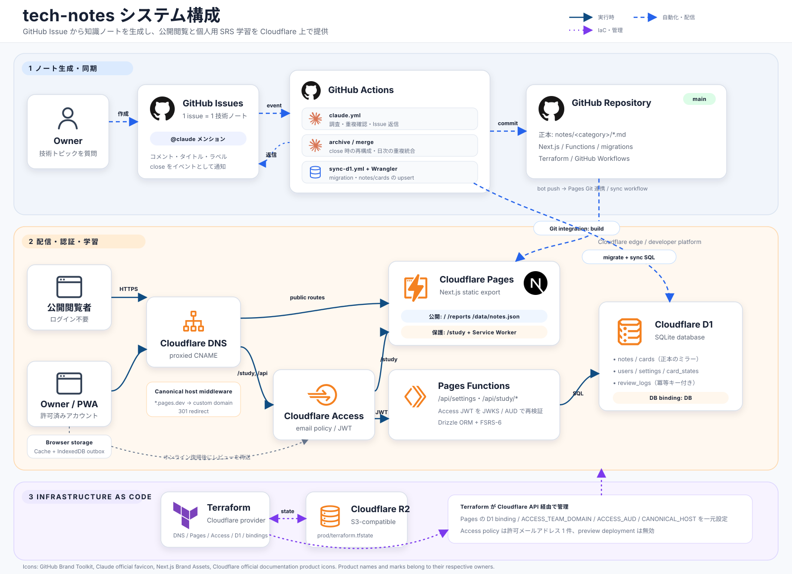

# tech-notes

技術ノートのまとめ場所。issue が 1 トピックのノートに対応し、`@claude` メンションで Claude が調査・整理したコメントを残してくれる。

| | URL | 公開範囲 |
|---|---|---|
| ノートを読む | <https://notes.hiramekun.dev/> | 誰でも |
| 暗記モード | <https://notes.hiramekun.dev/study/> | 自分のみ（Cloudflare Access） |

## システム構成

[](docs/system-architecture.md)

図の詳細とテキストによる説明は [システム構成ドキュメント](docs/system-architecture.md) を参照。

## 使い方

1. 知りたい技術トピックで issue を作成する
2. 本文に `@claude` を含めて質問を書く(例: `React の useEffect のクリーンアップについてまとめて @claude`)
3. Claude が既存のノートから重複・関連トピックを確認する
4. Claude がコメントで解説を残し、ジャンル・種類のラベルを付与する
5. 関連ノートがある場合は、回答末尾と既存 issue 側に相互リンクが追加される
6. 完全な重複候補は自動でクローズせず、既存ノートへのリンクを提示する
7. 追加で聞きたいことがあれば、コメント欄で再度 `@claude` にメンションする

ノートの検索はラベルと issue 検索を使う。

## Knowledge Cards

クローズ済み issue の最終回答を、カード形式でランダムに閲覧できる。
公開ページなのでログインは要らない。

<https://notes.hiramekun.dev/>

- issue をクローズすると、Claude Code Actions が本文と全コメントを読み直して1つの技術ノートへ再構成する
- 後から追加された訂正・補足を反映し、重複した説明や会話形式のやり取りを整理する
- 生成本文と、スクリプトで確定するメタデータを組み合わせて `notes/<ジャンル>/<issue 番号>.md` に保存する
- カードを左右へスワイプするか、左右の矢印キーで次のノートへ進める
- 全カードを一巡するまでは同じカードを再表示せず、一巡後に再シャッフルする

サイトは Cloudflare Pages でホストする。カードの閲覧は誰でもできる公開ページで、
学習機能（`/study` と `/api`）だけを Cloudflare Access で自分ひとりに絞っている。
Pages が自動で振る `*.pages.dev` の URL は、`functions/_middleware.ts` が
上記のホストへ 301 で送り返すので使えない。

ローカルで確認する場合:

```bash
npm install
npm run dev
```

## 暗記モード

<https://notes.hiramekun.dev/study/>

Anki のような間隔反復（SRS）で出題する画面。タイトルだけを見て中身を思い出し、
答え合わせをしてから左右にスワイプする。**登録した Google アカウントでのみ開ける。**

- **右スワイプ = 覚えている**（FSRS の Good）。安定度が伸び、次の出題まで間隔が開く
- **左スワイプ = 覚えていない**（FSRS の Again）。安定度が縮み、当日中にもう一度出る

スケジューラは Anki 23.10 以降の既定アルゴリズムである FSRS-6（`ts-fsrs`）。
学習状態は Cloudflare D1 に保存する。オフラインでもスワイプでき、復帰時にまとめて送られる。

設計の全体は [docs/setup-cloudflare.md](docs/setup-cloudflare.md) と、リポジトリ内の設計メモを参照。

### Cloudflare の初期設定

[docs/setup-cloudflare.md](docs/setup-cloudflare.md) を参照。ダッシュボードでの操作が要るのは
アカウントと Zero Trust の初期設定、API トークンの発行、GitHub App の連携まで。
インフラそのものは `infra/` の Terraform で作る。

サイトのデプロイは Cloudflare Pages の Git 連携が push を見て自動で行う。
`notes/` が変わったときは `.github/workflows/sync-d1.yml` が D1 のマイグレーションと
ノートの同期を行う。issue のクローズ時は `.github/workflows/archive-closed-issue.yml` が
Markdown の保存とコミットまでを行い、その push が上記 2 つを起こす。

## ラベル

- **ジャンル**: `frontend` / `backend` / `infra` / `database` / `language` / `ai-ml` / `security` / `devops` / `architecture` / `cs-fundamentals`
- **種類**: `type:concept` / `type:howto` / `type:troubleshooting` / `type:comparison`

## セットアップ手順(初回のみ)

1. GitHub にリポジトリを作成して push
2. [Claude GitHub App](https://github.com/apps/claude) をこのリポジトリにインストール
3. ローカルで `claude setup-token` を実行し、出力されたトークンをリポジトリの Secret `CLAUDE_CODE_OAUTH_TOKEN` に登録(Pro/Max サブスクリプションの利用枠で動作する)
4. ラベルを作成: `./scripts/setup-labels.sh`

### トークンが失効したら

Claude Code からログアウトした場合などにトークンが無効になることがある。`claude setup-token` で再発行し、Secret を更新する。
