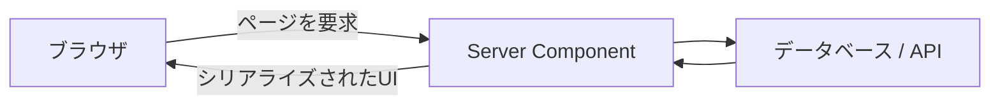

# React Server Components の基本

## 概要

React Server Components（RSC）は、コンポーネントをサーバー側で実行し、その結果をクライアントへ送る仕組みです。データ取得をサーバーへ寄せ、ブラウザへ送るJavaScriptを減らせます。



## 何が嬉しいのか

- データ取得処理をデータソースの近くに配置できる
- APIキーやデータベース接続情報をブラウザへ渡さずに済む
- クライアントへ送るJavaScriptを抑えやすい

## 詳細

Server Componentでは、コンポーネント内から非同期処理を直接呼び出せます。

```tsx
export default async function ArticleList() {
  const articles = await getArticles();

  return (
    <ul>
      {articles.map((article) => (
        <li key={article.id}>{article.title}</li>
      ))}
    </ul>
  );
}
```

クリックや入力状態などのブラウザ操作が必要な部分は、`"use client"`を付けたClient Componentへ分離します。

## 参考リンク

- [React Server Components](https://react.dev/reference/rsc/server-components)
