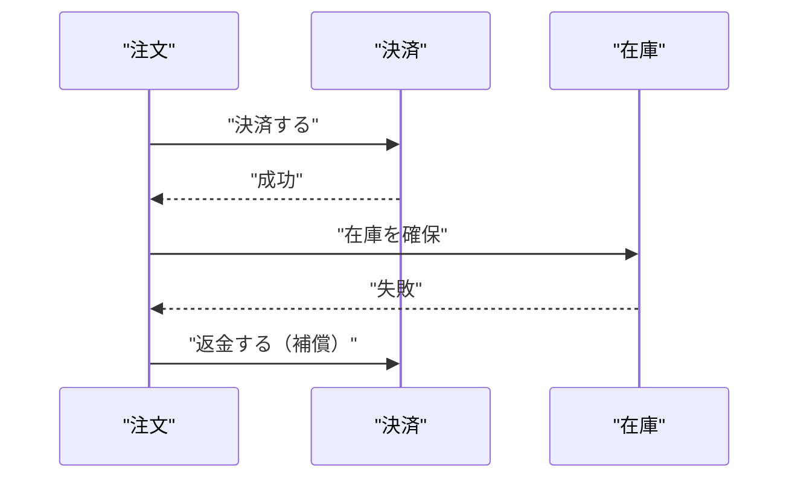

# Saga パターンと補償トランザクション

## 概要

Sagaは、複数サービスにまたがる処理を小さなローカルトランザクションへ分割する設計パターンです。途中で失敗した場合は、完了済みの処理を打ち消す「補償トランザクション」を順番に実行します。

## 何が嬉しいのか

分散システムでは、すべてのサービスを単一のデータベーストランザクションへ含められません。Sagaを使うと、サービスの独立性を保ちながら、業務全体として整合性を回復できます。

## 詳細

| 方式 | 特徴 | 向いているケース |
|---|---|---|
| コレオグラフィ | イベントで次の処理を起動 | 短く単純なフロー |
| オーケストレーション | 調整役が処理順を管理 | 分岐や補償が多いフロー |

実装では、メッセージの重複を想定した**冪等性**、処理状態の永続化、タイムアウト、再試行の設計が重要です。

## 参考リンク

- [AWS Prescriptive Guidance: Saga pattern](https://docs.aws.amazon.com/prescriptive-guidance/latest/cloud-design-patterns/saga.html)
