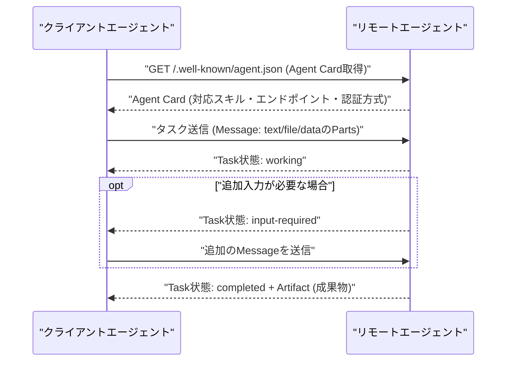

# A2A (Agent2Agent) Protocol とは

## 概要

A2A (Agent2Agent) Protocol は、異なるベンダー・異なるフレームワークで作られた AI エージェント同士が、互いの内部実装(メモリ・ツール・推論過程など)を公開せずに連携できるようにする、オープンな通信プロトコルです。2025年4月に Google が発表し、その後 Linux Foundation に寄贈されてベンダー中立なオープンガバナンスのプロジェクトとして運営されています。

基本的なやり取りの流れは以下のようになります。



## 何が嬉しいのか

複数の AI エージェントを組み合わせたマルチエージェントシステムを作ろうとすると、各エージェントが別々のベンダー・フレームワーク(例: あるエージェントは LangGraph 製、別のエージェントは社内の独自実装)で作られていることが多く、そのままでは連携できません。A2A がない世界では、エージェントごとに個別の連携用 API やアダプタをその都度実装する必要があり、組み合わせが増えるほど統合コストが指数的に膨らみます。

A2A は「タスクを依頼する／結果を受け取る」という共通のプロトコルを提供することで、この統合コストを大きく下げます。具体例としては、

- 旅行代理店エージェントが、航空券予約エージェントとホテル予約エージェントに、それぞれの内部実装を意識せずタスクを委任する
- カスタマーサポートのオーケストレーターエージェントが、専門分野ごとに用意された複数のサブエージェント(返品処理、請求関連など)に問い合わせを振り分ける

といったケースで、エージェント側は「相手が何のフレームワークで作られているか」を気にせず、Agent Card に書かれた仕様に従って呼び出すだけで連携できます。

## 詳細

### Agent Card

エージェントの自己紹介書にあたる JSON メタデータで、通常 `/.well-known/agent.json` のような well-known URI で公開されます。エージェント名、対応スキル(capabilities)、入出力の対応モダリティ、認証方式、エンドポイント URL などが記述されており、クライアントエージェントはこれを取得することで「このエージェントに何を頼めるか」を discovery できます。

```json
{
  "name": "hotel-booking-agent",
  "description": "ホテルの検索・予約を行うエージェント",
  "url": "https://example.com/a2a/v1",
  "capabilities": { "streaming": true, "pushNotifications": true },
  "skills": [
    { "id": "search-hotel", "description": "条件に合うホテルを検索する" }
  ],
  "authentication": { "schemes": ["oauth2"] }
}
```

### Task / Message / Artifact

- **Task**: A2A における作業の基本単位。`submitted` → `working` → (`input-required`) → `completed` / `failed` / `canceled` というライフサイクルを持ち、一意な ID で管理されます。
- **Message**: クライアントとリモートエージェント間でやり取りされる内容で、テキスト・ファイル・構造化データ (JSON) などの「Part」を組み合わせて表現します(マルチモーダル対応)。
- **Artifact**: タスク完了時にリモートエージェントが生成する成果物。

### トランスポートと運用面

- 標準の HTTP 上で JSON-RPC 2.0 を使ってメッセージをやり取りするのが基本で、長時間かかるタスクに対しては Server-Sent Events (SSE) によるストリーミング更新や、Webhook によるプッシュ通知もサポートしています。
- 認証・認可は独自方式を発明せず、OAuth2 や API キーなど既存の Web 標準の仕組みを Agent Card 上で宣言する形を取っています(エンタープライズでの利用を意識した設計)。
- エージェントは処理途中で「追加情報が必要」(`input-required`) という状態を返せるため、人間参加型 (human-in-the-loop) のワークフローや、対話を挟みながら段階的にタスクを進める設計がしやすくなっています。

### MCP (Model Context Protocol) との違い

よく比較される Anthropic の MCP とは目的のレイヤーが異なります。

- **MCP**: 1つのエージェント(LLM)が、ツールやデータソース(DB、API など)に接続するための「垂直方向」の統合プロトコル。
- **A2A**: 複数の自律的なエージェント同士が、お互いを不透明な (opaque) 存在として扱いながら連携するための「水平方向」の統合プロトコル。

実際には、各エージェントが内部ではツール呼び出しに MCP を使い、エージェント間の連携には A2A を使う、という組み合わせ方が想定されています。

> ⚠️ A2A の仕様は現在も活発に更新されており、JSON-RPC のメソッド名など細部は調査時点の理解に基づくため、最新仕様は公式ドキュメントで確認することをおすすめします。

### 利用事例

A2A はまだ「枯れた」プロトコルではなく、2025年4月の発表以降に急速にエコシステムが広がっている段階です。個別企業の詳細な導入事例(定量的な効果を伴うケーススタディ)はまだ多くありませんが、以下のような「採用・統合の実績」が確認できます。

**1. 発表時のローンチパートナー(2025年4月)**

Google が A2A を発表した際、Atlassian、Box、Cohere、Intuit、LangChain、MongoDB、PayPal、Salesforce、SAP、ServiceNow、UKG、Workday など50社以上の技術パートナーと、Accenture、Deloitte、KPMG、McKinsey、PwC などのシステムインテグレーター/コンサルティングパートナーが名を連ねました。これらの企業が自社のエージェント基盤に A2A 対応を組み込むことを表明しています。

**2. 主要ベンダー製品への統合**

- **Salesforce Agentforce**: 他社のエージェントと A2A 経由で連携できるようにする方針を発表
- **ServiceNow**: AI Agent Orchestrator が A2A に対応し、社外エージェントとの相互運用をサポート
- **Microsoft**: Azure AI Foundry / Copilot Studio 上のエージェントが A2A で通信できるよう対応を発表

**3. Linux Foundation への寄贈と運営体制(2025年6月)**

A2A は Google 単独のプロジェクトから Linux Foundation 配下のオープンガバナンスプロジェクトになり、Google、Microsoft、Salesforce、SAP、ServiceNow、Atlassian、Cisco など100社超が運営に関わる体制になりました。これは「単一ベンダーロックインではない、業界横断の標準を目指す」という位置づけを裏付けるものです。

**4. 公式リポジトリのサンプル実装**

具体的な「事例」としては、A2A の GitHub リポジトリに含まれるサンプルが分かりやすいです。例えば、

- LangGraph 製の「通貨換算エージェント」
- CrewAI 製の「画像生成エージェント」
- Google ADK (Agent Development Kit) 製の「経費精算エージェント」

といった、**異なるフレームワークで作られた複数のエージェント**を、A2A 経由でオーケストレーター役のホストエージェントがまとめて呼び出すデモが公開されています。フレームワークを横断してエージェントを組み合わせられることを示す、実装レベルでの具体例と言えます。

**5. 発表時に紹介されたユースケース例**

Google のアナウンス記事では、採用(リクルーティング)業務を例にした説明がされていました。候補者を探すエージェント、経歴確認を行うエージェント、面接調整を行うエージェントなど、それぞれ別ベンダー・別実装のエージェントが、人事担当者からの1つの依頼(「この職種に合う候補者を探して選考を進めて」)を起点に A2A 経由で連携して処理を進める、というシナリオです。

まとめると、現時点では「A2A を使ってこういう成果が出た」という定量的な事例よりも、「主要な SaaS ベンダー・コンサルティングファームが対応を表明し、Linux Foundation の下でエコシステムが育っている」という**エコシステム形成の段階の事例**が中心です。

> ⚠️ 上記の利用事例は、Web 検索・Web 取得ツールを使わずに学習済みの知識(2026年1月頃までの情報が基準)のみに基づいて整理したものです。それ以降の新規採用事例や、定量的な効果測定を伴う詳細なケーススタディについては、公式サイトや各社の発表で確認してください。

## 参考リンク

- [A2A Protocol 公式サイト (Linux Foundation)](https://a2a-protocol.org/)
- [A2A Project GitHub リポジトリ (サンプル実装含む)](https://github.com/a2aproject/A2A)
- [Google Developers Blog: Announcing the Agent2Agent Protocol (A2A)](https://developers.googleblog.com/en/a2a-a-new-era-of-agent-interoperability/)
