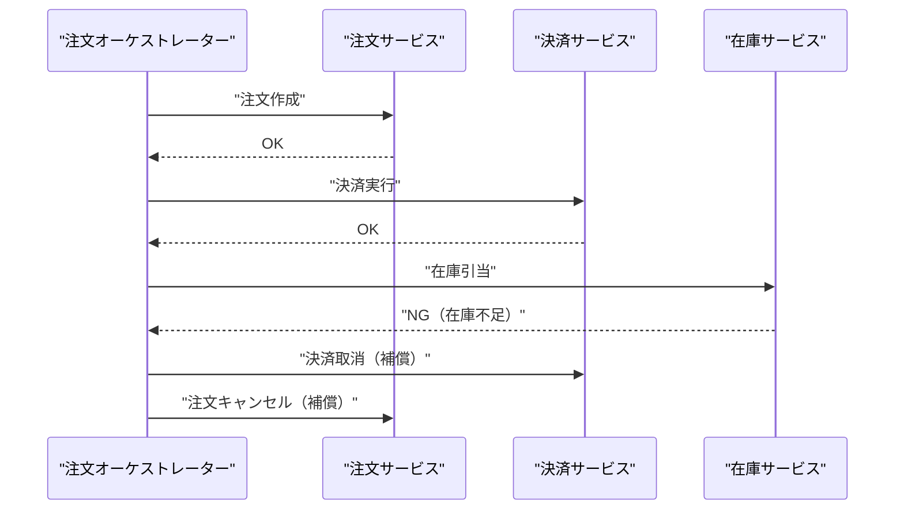
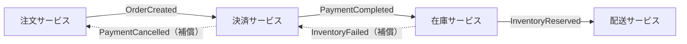
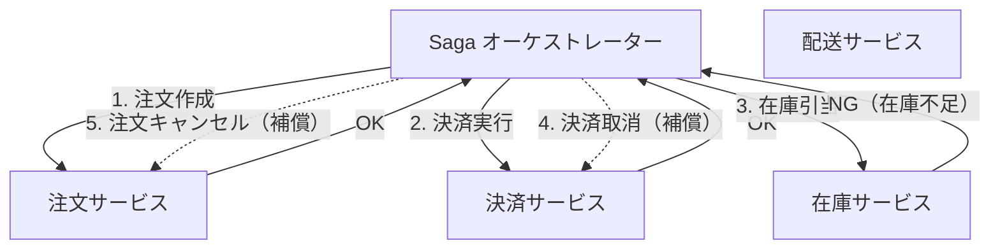
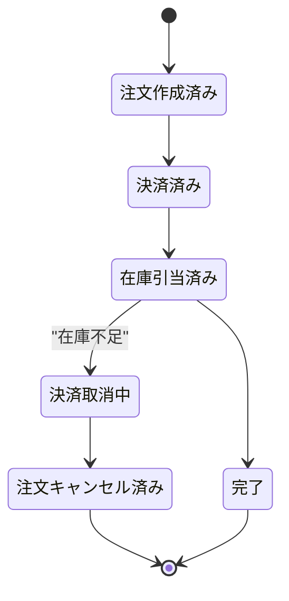

# マイクロサービス間のトランザクション整合性を担保するデザインパターン（Saga パターン）

## 概要

マイクロサービス間で1つの分散トランザクションを"それらしく"完了させるための代表的なデザインパターンが **Saga パターン** です。各サービスはローカルなDBトランザクションのみを行い、失敗時には後続の処理を打ち消す「補償トランザクション」を実行することで、システム全体として整合性を取ります（＝結果整合性 / eventual consistency）。実装方式には「コレオグラフィ（イベント駆動で各サービスが自律的に連鎖）」と「オーケストレーション（中央の調整役が指揮）」の2種類があります。

オーケストレーション方式のイメージ：

## 何が嬉しいのか

マイクロサービスでは各サービスが個別のDBを持つ（Database per Service）ため、複数サービスにまたがる更新をRDBの `BEGIN`〜`COMMIT` のような単一トランザクションでロールバックすることができません。ここで代表的な選択肢が2つあります。

- **2相コミット（2PC）**: 全参加者をロックしてから一括コミットする方式。強い一貫性は得られますが、調整役（コーディネーター）が単一障害点になりやすく、ロック中は他のリクエストをブロックするためスループットが大きく落ちます。マイクロサービス、特に可用性やスケーラビリティを重視する構成とは相性が悪いとされています。
- **Saga パターン**: ロックを長時間保持せず、各ローカルトランザクションをすぐにコミットしてしまい、失敗したら補償で辻褄を合わせる方式。可用性・スケーラビリティを犠牲にせず、サービスごとの独立デプロイ・独立DBという疎結合の恩恵を保ったまま、擬似的な「全部成功 or 全部失敗」を実現できます。

具体例としては、ECサイトの注文フローで「注文作成 → 決済 → 在庫引当 → 配送手配」のように複数サービスをまたぐ処理があり、途中の「在庫引当」で失敗した場合に、すでに完了した「決済」を取り消す（返金する）補償処理を自動的に走らせる、といったケースが典型です。

## 詳細

### 1. Saga パターンの2つの実装方式

**コレオグラフィ（Choreography）**
中央の管理者を置かず、各サービスがイベント（例: `OrderCreated`, `PaymentCompleted`）をPub/Subでやり取りし、自分が関心のあるイベントを受け取ったら自律的に次の処理を行う方式です。

- メリット: サービス間が疎結合。単純なフローなら実装がシンプル。
- デメリット: サービス数が増えるとイベントの連鎖が追いにくくなり、全体のフローを把握しづらい（"どこで誰が何を購読しているか"が分散する）。循環依存にも注意が必要。

**オーケストレーション（Orchestration）**
「Saga オーケストレーター」と呼ばれる調整役サービスが、各サービスに対して明示的にコマンドを発行し、失敗時の補償コマンドの発行も一括管理します。コレオグラフィとは対照的に、フロー制御のロジックがオーケストレーターに集約されるのが特徴です。

各サービスはオーケストレーターとのみやり取りし、他のサービスの存在を知る必要がありません（コレオグラフィのようにサービス同士が直接イベントを購読し合う構造にはなりません）。失敗時の補償コマンドの発行順序（どのサービスから取り消すか）もオーケストレーターが一元的に決定します。

- メリット: フロー全体が1箇所（オーケストレーター）にコードとして集約されるため見通しが良い。テストもしやすい。
- デメリット: オーケストレーター自体が新たなコンポーネントとして増え、ロジックが集中しすぎると事実上のミニ・モノリスになりがち。

### 2. 補償トランザクション設計時の注意点

- 各ステップの操作は**冪等**にしておく（メッセージの再送やリトライで二重実行されても安全なように）。
- 補償操作は「元に戻す」というより「打ち消す」処理として設計する（例: 決済の補償は元のトランザクションを消すのではなく「返金」という新しい操作を積む）。
- Saga の途中経過は他サービスから一時的に「まだ整合していない状態」として観測され得る（結果整合性）。UIやAPIの設計上、ユーザーに処理中であることを伝える工夫が必要になることが多いです。
- 状態遷移を明示的に管理したい場合は、Saga の進行状況をステートマシンとしてモデル化すると実装・デバッグがしやすくなります。

> 補足: `stateDiagram-v2` では、状態名に日本語（スペースや記号を含む文字列）を使う場合、`flowchart` や `sequenceDiagram` のように遷移の中で直接 `"..."` を書くことができません。状態は必ず `ID`（英数字などの識別子）で表現し、表示用のラベルは `state "表示名" as ID` という別記法で後付けする必要があります。

### 3. 関連パターン

- **Outbox パターン**: ローカルDBの更新とイベント発行をアトミックに行うための補助パターン。サービスのDB更新と同一トランザクション内で「送信予定イベント」を Outbox テーブルに書き込み、別プロセス（CDCなど）がそれを読んでメッセージブローカーに発行することで、「DB更新は成功したのにイベント発行だけ失敗する」問題を防ぎます。Saga をコレオグラフィで実装する際によく併用されます。
- **TCC（Try-Confirm/Cancel）**: 各サービスが「Try（仮予約）→ Confirm（確定）/ Cancel（取消）」の3フェーズAPIを提供する方式。Saga よりも各ステップで「予約」という中間状態を明示的に持てるため、在庫確保のようなユースケースと相性が良いですが、各サービス側の実装コストは増えます。

### 4. 不確かな点

具体的にどのパターンが最適かはユースケース（一貫性要件の強さ、サービス数、チームのスキルセットなど）に強く依存するため、一般論として上記を紹介しています。実プロジェクトへの適用可否は個別に検討が必要です。

## 参考リンク

- [Pattern: Saga - microservices.io](https://microservices.io/patterns/data/saga.html)
- [Pattern: Transactional outbox - microservices.io](https://microservices.io/patterns/data/transactional-outbox.html)
- [Pattern: Two Phase Commit - microservices.io](https://microservices.io/patterns/data/two-phase-commit.html)
- [Managing distributed transactions with sagas - AWS Prescriptive Guidance](https://docs.aws.amazon.com/prescriptive-guidance/latest/cloud-design-patterns/saga-pattern.html)
