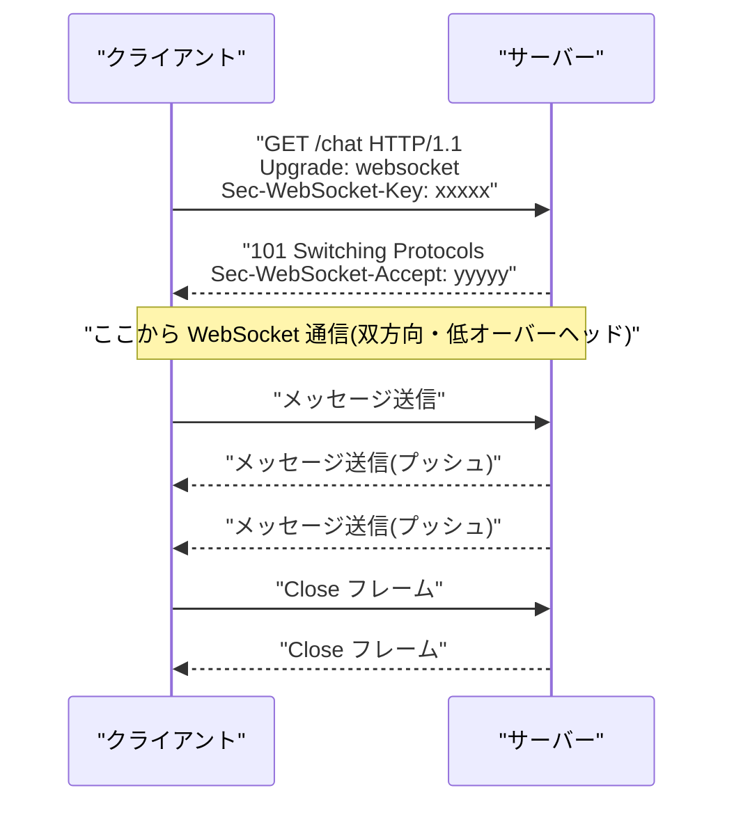

# WebSocket の基本知識

## 概要

WebSocket は、1 本の TCP コネクション上でクライアントとサーバーが双方向にリアルタイム通信できるプロトコルです([RFC 6455](https://datatracker.ietf.org/doc/html/rfc6455))。最初は HTTP のハンドシェイクとして接続を開始し、成功すると「プロトコルのアップグレード」が行われて WebSocket 専用の通信に切り替わります。以後はサーバー・クライアントのどちらからでも自由にデータを送信できます。



## 何が嬉しいのか

通常の HTTP はクライアントからのリクエストが起点となる「1 回のリクエスト・1 回のレスポンス」のモデルのため、サーバー側から能動的にデータを送ることができません。これをリアルタイム性が必要なアプリで実現しようとすると、以下のような方法が使われてきました。

- **ポーリング**: 一定間隔でクライアントがリクエストを送り続ける → 更新がなくても無駄なリクエストが大量に発生し、サーバー負荷とレイテンシが増える
- **ロングポーリング**: サーバーがレスポンスを保留し、更新があったら返す → 接続維持のオーバーヘッドが大きく、レスポンス後にすぐ再接続が必要

WebSocket を使うと、最初のハンドシェイクだけで接続を確立し、その後は HTTP ヘッダのような大きなオーバーヘッドなしに小さなフレーム単位でデータをやり取りできます。サーバーからのプッシュも自然に行えるため、次のようなユースケースに向いています。

- チャットアプリ・通知機能
- 株価・スポーツスコアなどのリアルタイム更新
- オンラインゲームの状態同期
- 共同編集ツール(Google Docs 的なもの)のカーソル・変更通知

## 詳細

**ハンドシェイク**

WebSocket は `ws://`(平文)または `wss://`(TLS、HTTPS の WebSocket 版)という URL スキームを使います。接続開始時に通常の HTTP リクエストとして `Upgrade: websocket` ヘッダと `Sec-WebSocket-Key`(ランダムな値)を送り、サーバーはそれを元にハッシュ化した値を `Sec-WebSocket-Accept` として返し、ステータスコード `101 Switching Protocols` で応答します。これにより「HTTP からのっとって開始し、途中でプロトコルを切り替える」という設計になっているため、既存の HTTP インフラ(ポート 80/443、プロキシなど)をそのまま流用できます。

**フレームとメッセージ**

接続後のデータはテキストまたはバイナリの「フレーム」という単位でやり取りされます。生存確認のために `Ping`/`Pong` フレームがあり、一定間隔で送り合うことで接続が生きているかを確認します(無通信のままだと中間の NAT やロードバランサーがコネクションを切ってしまうことがあるため)。

**ブラウザでの使い方**

```javascript
const socket = new WebSocket("wss://example.com/chat");

socket.addEventListener("open", () => {
  socket.send("Hello Server!");
});

socket.addEventListener("message", (event) => {
  console.log("Received:", event.data);
});

socket.addEventListener("close", () => {
  console.log("Connection closed");
});
```

**注意点**

- **ステートフルな接続**: HTTP と違いコネクションを維持し続けるため、サーバー側でその分のリソース(メモリ・ファイルディスクリプタ)を消費します。大量接続を扱う場合はスケーリング設計(水平スケール時のコネクション分散、Pub/Sub での配信など)が必要です
- **ロードバランサー**: L7 ロードバランサーが WebSocket の Upgrade をサポートしているか確認が必要です。スケールアウトする場合、同じクライアントが同じサーバーに接続し続けるとは限らないため、複数サーバー間でメッセージを配信する仕組み(Redis Pub/Sub など)がよく使われます
- **再接続処理**: ネットワーク切断時に自動では再接続してくれないため、アプリ側で再接続・再送のロジックを実装する必要があります
- **認証**: 通常の Cookie や URL クエリパラメータ、接続後の最初のメッセージでトークンを送る、など HTTP とは異なる工夫が必要になることが多いです
- **Server-Sent Events (SSE) との違い**: SSE はサーバー→クライアントの一方向のみで、シンプルな通知用途であれば WebSocket より軽量な選択肢になります。双方向通信が必要かどうかで使い分けます
- **Socket.IO 等のライブラリ**: 生の WebSocket API は再接続やフォールバック(WebSocket が使えない環境での代替手段)を提供しないため、実運用では Socket.IO のようなライブラリで補うことも多いです(ただし Socket.IO 独自のプロトコルであり、素の WebSocket とは相互運用できない点に注意)

## 参考リンク

- [RFC 6455: The WebSocket Protocol](https://datatracker.ietf.org/doc/html/rfc6455)
- [MDN: WebSockets API](https://developer.mozilla.org/ja/docs/Web/API/WebSockets_API)
- [MDN: WebSocket プロトコルの記述](https://developer.mozilla.org/ja/docs/Web/API/WebSockets_API/Writing_WebSocket_servers)
