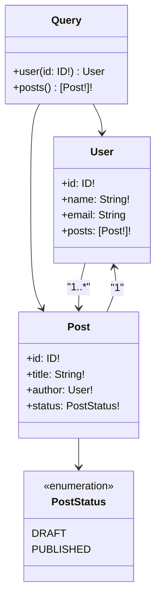
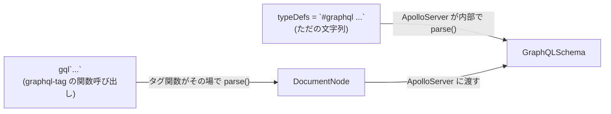

# GraphQL スキーマ定義言語(SDL)の文法

## 概要

GraphQL の **SDL (Schema Definition Language)** は、API が公開するデータの形(型)とその操作(クエリ・ミューテーション・サブスクリプション)を宣言的に記述するための専用構文です。REST のように複数のエンドポイントで暗黙的にレスポンス形状が決まるのではなく、1 つのスキーマファイルが API 全体の「契約(コントラクト)」になります。

型同士の関係はおおよそ以下のようなイメージです。



JavaScript / TypeScript の実装では、この SDL 文字列を `typeDefs` として ApolloServer などのライブラリに渡します。渡し方には大きく 2 通りあり、どちらも最終的には同じ `GraphQLSchema` に変換されます。



## 何が嬉しいのか

- **型安全な契約**: クライアントとサーバーの間でやり取りされるデータ形状がスキーマとして明文化されるため、フィールド名の typo やレスポンス構造の食い違いをビルド時・コード生成時に検出できる。
- **自己文書化 (self-documenting)**: スキーマ自体がドキュメントになり、GraphiQL や Apollo Sandbox などのツールでブラウズ・補完が効く。REST のように別途 OpenAPI 定義を手動でメンテする必要がない。
- **コード生成**: `graphql-code-generator` などでスキーマから TypeScript の型やクライアント SDK を自動生成でき、フロントエンド・バックエンド双方の型のズレを防げる。
- **Over-fetching / Under-fetching の抑制**: クライアントが必要なフィールドだけを選択できるのは GraphQL 全体の特徴だが、これを可能にしているのはスキーマが型ごとにフィールドを厳密に定義しているから。

具体例として、REST で `GET /users/1` と `GET /users/1/posts` のように複数エンドポイントを叩いていたケースを、GraphQL では 1 回のクエリで `user(id: 1) { name posts { title } }` のように取得でき、かつその形が常にスキーマで保証される、というのが典型的なユースケースです。

`#graphql` マジックコメントや `gql` タグを使う書き方についても、追加のパッケージ(`graphql-tag`)をインポートせずに SDL をそのまま文字列として書けるという利点があり、エディタの拡張機能によるシンタックスハイライトや構文エラー検知の恩恵を受けられます。

## 詳細

### 基本のスカラー型

`Int` / `Float` / `String` / `Boolean` / `ID` が組み込みスカラーです。独自スカラー(例: `Date`)も `scalar Date` のように定義できますが、シリアライズ・パースのロジックは実装側(resolver)で用意する必要があります。

### オブジェクト型 (`type`)

```graphql
"""
ユーザーを表す型
"""
type User {
  id: ID!
  name: String!
  email: String
  posts: [Post!]!
}
```

- `"""..."""` は description で、GraphiQL 上にドキュメントとして表示されます(`#` は通常のコメント)。
- フィールドはコロンの後に型を書きます。引数を取るフィールドは `posts(limit: Int): [Post!]!` のように書けます。

### Non-Null (`!`) と List (`[]`)

Nullability はフィールドの意味に直結するため重要です。

| 記法 | 意味 |
|---|---|
| `String` | null を返してよい単一の文字列 |
| `String!` | null を返さない単一の文字列 |
| `[String]` | null でもよいリスト。中の要素も null 可 |
| `[String!]` | null でもよいリストだが、中の要素は null 不可 |
| `[String!]!` | リスト自体も要素も null 不可 |

### ルート型 (`Query` / `Mutation` / `Subscription`)

スキーマのエントリーポイントとなる特別な型です。

```graphql
type Query {
  user(id: ID!): User
  posts(status: PostStatus): [Post!]!
}

type Mutation {
  createPost(input: CreatePostInput!): Post!
}

type Subscription {
  postCreated: Post!
}
```

### Enum

```graphql
enum PostStatus {
  DRAFT
  PUBLISHED
}
```

### Interface / Union

複数の型に共通するフィールドをまとめたい場合は `interface`、複数の異なる型のいずれかを返したい場合は `union` を使います。

```graphql
interface Node {
  id: ID!
}

union SearchResult = User | Post
```

クエリ側では `... on User { name }` のようなインラインフラグメントで型ごとのフィールドを分岐して取得します。

### Input 型

`Mutation` の引数など、複数フィールドをまとめて渡したい場合に使う専用の型です。通常の `type` とは異なり、フィールドに引数を持てず、`Query`/`Mutation` の戻り値にはできません。

```graphql
input CreatePostInput {
  title: String!
  authorId: ID!
}
```

### ディレクティブ

`@` から始まる注釈で、スキーマやクエリの振る舞いを変更します。標準で `@deprecated(reason: "...")`、`@include(if: Boolean)`、`@skip(if: Boolean)` が用意されており、独自のカスタムディレクティブも定義可能です。

```graphql
type User {
  oldField: String @deprecated(reason: "use newField instead")
  newField: String
}
```

### schema-first と code-first

ここまでの SDL を素直にファイルとして書いていくアプローチを **schema-first** と呼びます。一方で TypeScript/Java などのコードから型を定義しスキーマを自動生成する **code-first**(例: Nexus, Pothos, NestJS の `@ObjectType()` など)というアプローチもあり、どちらもいずれ同じ SDL 相当の内部表現に落ち着きます。SDL 自体は「型定義」のみで、実際のデータ取得ロジック(resolver)は別途実装が必要な点に注意してください。

### JS/TS での typeDefs の書き方: `#graphql` コメント方式 と `gql` タグ方式

Apollo Server などで SDL を渡す際、次の 2 通りの書き方が使われます。

```js
// パターン1: プレーン文字列 + #graphql マジックコメント
export const typeDefs = `#graphql

# "Book"型の定義
type Book {
  id: ID
  title: String
  author: String
  price: Int
}

# クエリの定義
type Query {
  book(id: ID): Book
  books: [Book]
}
`
```

```js
// パターン2: gql タグ関数
import { gql } from 'graphql-tag'; // or 'apollo-server'

export const typeDefs = gql`
  type Book {
    id: ID
    title: String
    author: String
    price: Int
  }

  type Query {
    book(id: ID): Book
    books: [Book]
  }
`;
```

- `#graphql` は「タグ付きテンプレートリテラル」ではなく、**先頭に `#graphql` というコメントを書いた、ただの JS のテンプレートリテラル(文字列)** です。実行時には何も意味を持たず、VS Code の GraphQL 拡張機能などのエディタツールに対して「この文字列は GraphQL の SDL ですよ」と伝えるための **マジックコメント** です。`#` は SDL 内でも通常のコメント記号として扱われるため、パース時には単なるコメント行として無視されます。付けなくても動作は変わりませんが、エディタの補完・ハイライトが効かなくなります。
- `gql` はタグ関数で、テンプレートリテラルをその場で `DocumentNode`(AST)にパースします。一方 `#graphql` コメント方式は文字列のまま渡し、`ApolloServer` 側(内部で `@apollo/server` が `graphql` パッケージの `parse` を呼ぶ)でパースされます。
- 依存パッケージの観点では、`gql` タグを使うには `graphql-tag`(または Apollo Server が re-export しているもの)をインポートする必要がありますが、`#graphql` コメント方式は追加のインポートなしで書けます。Apollo Server v4 以降の公式ドキュメントでも、この「プレーン文字列 + `#graphql` コメント」スタイルが標準的な書き方として紹介されています。
- 実用上はどちらの書き方でも最終的に `ApolloServer` が受け取る `typeDefs` は SDL の文字列(または AST)であり、内部で `parse()` されて `GraphQLSchema` が作られる点は変わりません。

### 補足: ID フィールドの型と nullability

`id` フィールドを `Int` で定義することも文法上は可能ですが、GraphQL の慣習では ID として扱うフィールドには `ID` 型を使うことが多いです(`ID` はシリアライズ時に文字列として扱われる特殊なスカラー)。また、フィールドに `!` を付けなければ nullable(必須ではない値)として定義されることになるため、必須にしたい場合は `id: ID!` のように明示する必要があります。

## 参考リンク

- [GraphQL 公式ドキュメント: Schemas and Types](https://graphql.org/learn/schema/)
- [GraphQL 公式言語仕様 (Type System)](https://spec.graphql.org/October2021/#sec-Type-System)
- [graphql-code-generator](https://the-guild.dev/graphql/codegen)
- [Apollo Server 公式ドキュメント: Schema basics](https://www.apollographql.com/docs/apollo-server/schema/schema)
- [Apollo Server 公式ドキュメント: Getting started](https://www.apollographql.com/docs/apollo-server/getting-started)
- [graphql-tag (gql タグの実装)](https://github.com/apollographql/graphql-tag)
