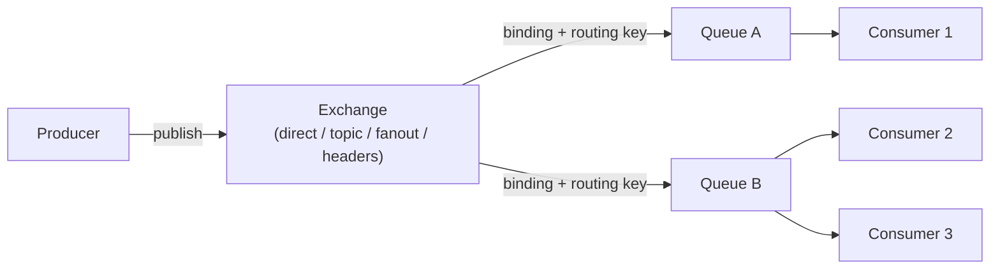

# RabbitMQ の基本概念と仕組み(Exchange・Queue・ルーティング)

## 概要

RabbitMQ は、AMQP (Advanced Message Queuing Protocol) を中心にサポートするオープンソースのメッセージブローカーです。Erlang で実装されており、Producer(送信側)が直接 Consumer(受信側)にメッセージを送るのではなく、間に RabbitMQ を挟むことでシステム間を非同期・疎結合に連携させます。最大の特徴は「Exchange」というルーティング層を持つことで、単純なキューイングだけでなく柔軟なメッセージ振り分けが可能な点です。



Producer はメッセージを直接キューに送るのではなく、必ず Exchange に送信します。Exchange は「バインディング(binding)」で結びついたキューへ、ルーティングルールに従ってメッセージを配送します。

## 何が嬉しいのか

- **サービス間の疎結合化**: Producer と Consumer がお互いの存在・アドレスを知らなくてよくなります。REST API 等で同期的に呼び出すと、呼び出し先の障害や遅延がそのまま呼び出し元に伝播しますが、RabbitMQ を挟むことで一方が落ちていても他方の処理を継続できます。
- **負荷の平準化(load leveling)**: 大量のリクエストが一時的に来ても、いったんキューに積んでおいて Consumer が自分のペースで処理できます。例えば「画像アップロード時にサムネイル生成ジョブをキューに積み、複数の Worker が空いた分だけ処理する」といったワークキューパターンに向いています。
- **柔軟なルーティング**: Exchange の種類(direct / topic / fanout / headers)を使い分けることで、「特定の条件のメッセージだけ特定のキューに送る」「1つのメッセージを複数のキューに複製配信する」といった柔軟な配信パターンをアプリケーションコードなしで実現できます。
- **配信保証と信頼性**: メッセージの永続化、Consumer 側の ACK(確認応答)、Publisher Confirm など、メッセージをロストしないための仕組みが豊富に用意されています。

## 詳細

### 主要な構成要素

- **Broker**: RabbitMQ サーバー本体。1台または複数台でクラスタを構成します。
- **Connection / Channel**: クライアントは TCP コネクション(Connection)を張り、その中に軽量な仮想コネクションである Channel を複数開いて実際のやり取りを行います。TCP コネクションを使い回せるため効率的です。
- **Exchange**: Producer から送られたメッセージを、ルーティングルールに従ってキューに振り分けるコンポーネント。主な種類は以下の4つです。
  - `direct`: ルーティングキーが完全一致するキューにのみ配送(例: ログレベル `error` のみを特定キューへ)。
  - `topic`: `order.created` や `order.*` のようなワイルドカードパターンでマッチさせる。柔軟な条件配信に使う。
  - `fanout`: ルーティングキーを無視して、バインドされている全キューにブロードキャスト配信。
  - `headers`: ルーティングキーではなくメッセージヘッダーの値でマッチングする(あまり一般的ではない)。
- **Queue**: メッセージが実際に溜められる場所。Consumer はキューから取り出してメッセージを処理します。
- **Binding**: Exchange とキューを結びつける設定。ルーティングキーやパターンを指定します。
- **Routing Key**: Producer がメッセージ送信時に指定する文字列で、Exchange がこれを見てどのキューに配送するか判断します。

### 信頼性に関わる仕組み

- **Acknowledgment (ACK)**: Consumer がメッセージ処理を完了したら ACK を送り、RabbitMQ はそのメッセージをキューから削除します。ACK を送る前に Consumer がクラッシュした場合、メッセージは別の Consumer に再配信されます(自動 ACK モードにすると処理失敗時にメッセージをロストするリスクがあるため、通常は手動 ACK を推奨)。
- **Publisher Confirm**: Producer 側が「Exchange にメッセージが確実に届いたか」を確認できる仕組みです。
- **Durable Queue / Persistent Message**: キュー自体を durable(永続)に設定し、メッセージも persistent フラグを付けて送ることで、RabbitMQ 再起動時もメッセージが失われないようにできます。
- **Dead Letter Exchange (DLX)**: 処理に失敗し続けたメッセージや TTL(有効期限)切れのメッセージを別の Exchange に転送する仕組みで、エラーメッセージの調査や再処理に使えます。
- **Prefetch (QoS)**: Consumer が一度に受け取る未 ACK メッセージ数の上限を設定でき、特定の Worker にメッセージが偏るのを防ぎつつ処理能力に応じた分散ができます。
- **クラスタリングと高可用性**: 複数ノードでクラスタを組み、キューを「Quorum Queue(推奨)」または従来の「Classic Mirrored Queue」としてノード間に複製することで、1ノード障害時もメッセージを失わずに継続できます。

### シンプルな利用イメージ(Python + pika)

```python
import pika

connection = pika.BlockingConnection(pika.ConnectionParameters("localhost"))
channel = connection.channel()

channel.exchange_declare(exchange="orders", exchange_type="topic")
channel.queue_declare(queue="order_created_queue", durable=True)
channel.queue_bind(exchange="orders", queue="order_created_queue", routing_key="order.created")

# Producer
channel.basic_publish(
    exchange="orders",
    routing_key="order.created",
    body="order_id=123",
    properties=pika.BasicProperties(delivery_mode=2),  # persistent
)

# Consumer
def callback(ch, method, properties, body):
    print(f"received: {body}")
    ch.basic_ack(delivery_tag=method.delivery_tag)

channel.basic_consume(queue="order_created_queue", on_message_callback=callback)
channel.start_consuming()
```

### 注意点・使い所

- RabbitMQ は基本的に「メッセージは Consumer に配信されたら(ACK後)キューから消える」設計のキューであり、Kafka のように「ログとして保持し、何度もリプレイする」用途には向いていません。過去データの再処理が要件の中心なら Kafka のようなログ指向のシステムのほうが適しています。
- 逆に、「特定のルーティング条件でメッセージを振り分けたい」「1メッセージ1回だけ確実に処理させたい(タスクキュー的な使い方)」「秒間数百万件規模ではなく、中規模のスループットで柔軟なルーティングが欲しい」といった要件では RabbitMQ のほうがシンプルに実現できることが多いです。
- AMQP 以外にも MQTT・STOMP など複数プロトコルをプラグインでサポートしており、IoT デバイスとの連携などにも使われます。
- 具体的な性能上限やマネージドサービスの提供状況(CloudAMQP 等)は変化しうるため、採用検討時は公式ドキュメントや各クラウドベンダーの最新情報を確認してください(この点は情報が古くなっている可能性があります)。

なお、同じメッセージブローカーというジャンルでは Apache Kafka がありますが、Kafka は「ログ永続化・リプレイ」に強い分散ストリーミング基盤であるのに対し、RabbitMQ は「柔軟なルーティングを持つ伝統的なメッセージキュー」という設計思想の違いがあります(このリポジトリの Kafka に関するノートも参照してください)。

## 参考リンク

- [RabbitMQ 公式ドキュメント](https://www.rabbitmq.com/docs)
- [RabbitMQ Tutorials](https://www.rabbitmq.com/tutorials)
- [AMQP 0-9-1 Model Explained](https://www.rabbitmq.com/tutorials/amqp-concepts)
