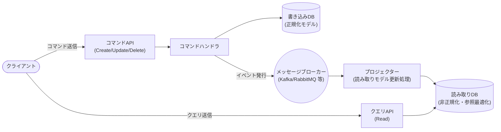
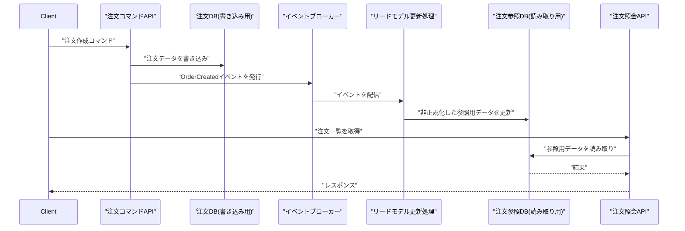

# CQRS(コマンドクエリ責務分離)の仕組みとマイクロサービスでの構成例

## 概要

CQRS（Command Query Responsibility Segregation、コマンドクエリ責務分離）は、データの**更新系（Command）**と**参照系（Query）**の処理経路（モデル・API・場合によってはデータストア自体）を分離するアーキテクチャパターンです。マイクロサービスでは、更新用の「書き込みモデル」で正規化されたデータを保持しつつ、参照用に最適化された「読み取りモデル」を別途用意し、両者をイベントで非同期に同期するという構成がよく使われます。

## 何が嬉しいのか

マイクロサービスでは「注文サービス」「顧客サービス」「在庫サービス」のように Database per Service でデータが分散しているため、画面表示に必要な情報を1つのクエリで取得できず、複数サービスへの問い合わせを都度組み立てる **API composition** が必要になりがちです。これは参照系のパフォーマンス・実装コストの両面でボトルネックになりやすい問題です。

CQRS を導入すると、次のような恩恵があります。

- 参照側にあらかじめ「画面が必要とする形」に非正規化・結合済みのデータを持たせられるため、複数サービスをまたぐ JOIN 相当の処理をリクエスト時に行わずに済む
- 更新系と参照系を独立してスケールできる（読み取りが圧倒的に多いシステムでは参照側だけレプリカやキャッシュ層を増強できる）
- 更新系は整合性・トランザクション性を重視したスキーマ、参照系は検索性能を重視したスキーマ（Elasticsearch など）というように、要件の異なるデータストアをそれぞれ選べる

例えば EC サイトで「注文サービス」が注文の作成・変更（Command）を担当し、注文一覧画面用に最適化された参照専用ストアを別途持つことで、一覧画面の表示のたびに顧客サービスや商品サービスへ都度問い合わせる必要がなくなります。

CQRS を使わない場合、参照系の要求が増えるたびに書き込みモデルのスキーマに無理に列や複雑な JOIN を追加することになり、更新系のシンプルさとパフォーマンスを両方とも損ないやすくなります。

## 詳細

### 1. 基本構成要素

- **Command 側**: 状態を変更するリクエストを受け付け、ビジネスルールを検証し、書き込み用データストアを更新する。戻り値は基本的に成功/失敗のみで、データそのものは返さない設計が推奨される（Query との責務を混ぜないため）。
- **Query 側**: 読み取り専用。書き込み用データストアには直接アクセスせず、参照用に最適化されたデータストア（マテリアライズドビュー）から読み取る。
- **同期の仕組み**: Command 側での更新をきっかけにイベント（例: `OrderCreated`, `OrderShipped`）を発行し、Projector（読み取りモデル更新処理）がそれを購読して参照用データストアを更新する。これにより参照側は最終的に整合する（結果整合性 / eventual consistency）。

### 2. マイクロサービスでの構成例（注文サービスの例）

サービス分割の粒度としては、以下のようなバリエーションがあります。

- **同一サービス内でモデルのみ分離**: 1つのサービス内で Command 用と Query 用のクラス・DBスキーマ（あるいはリードレプリカ）だけを分ける、比較的軽量な構成。
- **サービス自体を分離**: 「注文コマンドサービス」と「注文照会サービス」を別々にデプロイ・スケールする構成。参照負荷が非常に高い場合や、参照用にまったく異なるデータストア（検索エンジンなど）を使いたい場合に有効。

### 3. Event Sourcing との組み合わせ

CQRS はしばしば **Event Sourcing**（状態そのものではなく、状態変化を表すイベント列を正とするデータ保存方式）とセットで語られますが、両者は独立したパターンです。Event Sourcing なしでも、通常の正規化された RDB を書き込みモデルとして CQRS を実装できます。Event Sourcing を併用すると、イベントストア自体が Command 側の唯一の情報源（Source of Truth）になり、Projector はそのイベントストアを再生することで読み取りモデルをいつでも作り直せるという利点があります。

### 4. 注意点

- 参照側は結果整合性になるため、「更新した直後に参照すると古いデータが見える」タイムラグが発生し得ます。UI/UX 上、更新直後の一貫性が必須な画面では注意が必要です（例: 更新直後だけ Command 側の戻り値をそのまま表示する、など）。
- Command 側と Query 側、およびそれらをつなぐイベント基盤（Kafka や RabbitMQ など）を含めると構成要素が増えるため、参照系の要求がシンプルなうちは通常の CRUD 構成のままの方がトータルで安価なことが多いです。CQRS は「参照要件が複雑」「読み書きの負荷特性が大きく異なる」といった課題が実際に顕在化してから導入を検討するのが定石とされています。
- Projector の処理がイベントの重複配信やリトライで複数回実行されても結果が変わらないよう、**冪等**に実装する必要があります。

## 参考リンク

- [CQRS - Martin Fowler](https://martinfowler.com/bliki/CQRS.html)
- [Pattern: Command Query Responsibility Segregation (CQRS) - microservices.io](https://microservices.io/patterns/data/cqrs.html)
- [CQRS pattern - Azure Architecture Center](https://learn.microsoft.com/en-us/azure/architecture/patterns/cqrs)
