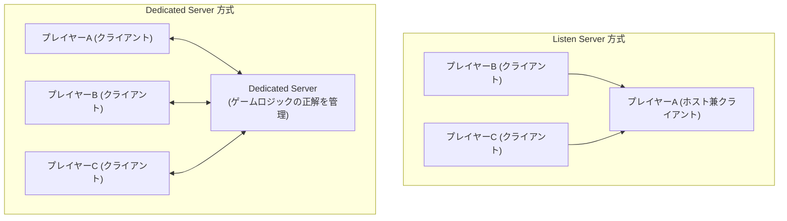
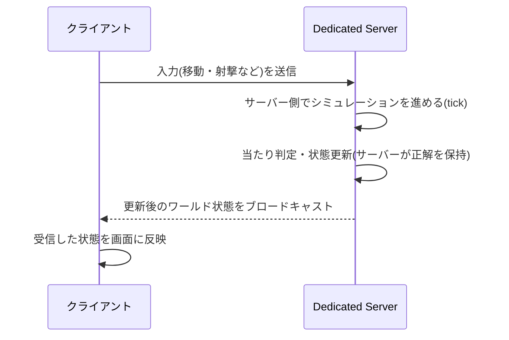

# ゲームサーバー開発における Dedicated Server とは

## 概要

Dedicated Server(専用サーバー)とは、ゲームのプレイヤーが直接操作する PC やコンソールとは別に、ゲームのシミュレーション(状態管理)だけを行うために独立して稼働するサーバープロセスのことです。プレイヤーはクライアントとしてこのサーバーに接続し、入力を送るだけで、実際のゲーム世界の「正解」(誰がどこにいて、誰が何にヒットしたか等)はすべて Dedicated Server 側が計算・保持します。

これは、プレイヤーの 1 人の PC がホスト役も兼ねる「Listen Server(リッスンサーバー)」方式と対比されることが多い概念です。

## 何が嬉しいのか

Dedicated Server がサポートする主な機能・解決する課題は次の通りです。

- **チート対策(サーバー権威)**: クライアントが「自分は当たった/移動した」と主張しても、サーバー側で独立に判定するため、メモリ改ざんなどのクライアントチートによる不正が難しくなります。これを「サーバーオーソリティ(server-authoritative)」なアーキテクチャと呼びます。
- **公平性の担保**: Listen Server 方式ではホストのプレイヤーが処理タイミング的に有利(ホストアドバンテージ)になりがちですが、Dedicated Server では全員が対等なクライアントとして同じサーバーと通信するため、この不公平さがなくなります。
- **ホスト離脱問題の解消**: Listen Server 方式ではホスト役のプレイヤーが落ちる/回線を切ると試合自体が継続不能になります(ホストマイグレーションで救済する実装もありますが複雑です)。Dedicated Server はプレイヤーの入退室に依存せず稼働し続けられます。
- **性能・可用性の均一化**: サーバー性能がホストのスペックや回線に左右されず、クラウドなどの安定したインフラ上で稼働させられるため、大人数対戦やレイテンシ要件が厳しい FPS などでも安定した処理が可能です。
- **スケーラビリティと運用**: マッチメイキングに応じてサーバーインスタンスを動的に起動・破棄でき(後述の Agones など)、負荷に応じたスケールアウトが可能です。

具体的なユースケースとしては、対戦 FPS(例: Valorant、CS2)でのチート対策、バトルロイヤルゲームでの大規模同時接続処理、MMO でのワールド状態の一元管理などが挙げられます。

## 詳細

**基本的な仕組み**

Dedicated Server は GUI 描画を行わない、ゲームロジックのみのビルド(例: Unreal Engine の `-server` ビルド、Source エンジンの `srcds`)として動作することが多く、クライアントとは別のバイナリ、あるいは同一バイナリのサーバーモードとして提供されます。

典型的なゲームループでは、サーバーは一定の「tick rate」(例: 64Hz)でシミュレーションを進め、各クライアントの入力を受け取り、結果をクライアントにブロードキャストします。

**レイテンシへの対応**

サーバーが権威を持つ分、クライアント⇔サーバー間の通信には往復のレイテンシが発生します。そのため実際の実装では以下のような技術が組み合わされます。

- **クライアント予測(Client-side Prediction)**: 自分の入力についてはサーバーの応答を待たずに即座に画面へ反映し、体感の遅延を減らす
- **サーバー再調整(Server Reconciliation)**: サーバーからの権威的な状態が届いたら、クライアントの予測とズレていれば補正する
- **ラグ補償(Lag Compensation)**: 射撃判定などで、サーバー側が「発射時点でその相手クライアントがどう見えていたか」を過去の状態にロールバックして判定する

**ホスティングの形態**

- 自前のデータセンター/ベアメタルサーバーで常時稼働(古典的な FPS など)
- マッチが始まるたびにクラウド上でコンテナ/VM を動的に起動し、終了後に破棄する方式(例: Kubernetes 上で [Agones](https://agones.dev/) を使ってゲームサーバー用の Pod をオーケストレーションする)
- サードパーティのゲームサーバーホスティングサービス(例: PlayFab Multiplayer Servers、i3D.net など)を利用する

**Listen Server との使い分け**

小規模な協力プレイゲームやカジュアルなパーティゲームでは、インフラコストをかけずに済む Listen Server(または P2P)方式が採用されることもあります。一方、競技性が高いゲームや不正対策が重要なゲームでは Dedicated Server が標準的です。

## 参考リンク

- [Unreal Engine: Dedicated Servers](https://dev.epicgames.com/documentation/en-us/unreal-engine/dedicated-servers-in-unreal-engine)
- [Valve Developer Community: Source Multiplayer Networking](https://developer.valvesoftware.com/wiki/Source_Multiplayer_Networking)
- [Agones (Kubernetes 向けゲームサーバーホスティング/スケーリング基盤)](https://agones.dev/)
- [Gabriel Gambetta: Fast-Paced Multiplayer (Client-Side Prediction, Server Reconciliation, Lag Compensation の解説シリーズ)](https://www.gabrielgambetta.com/client-server-game-architecture.html)
