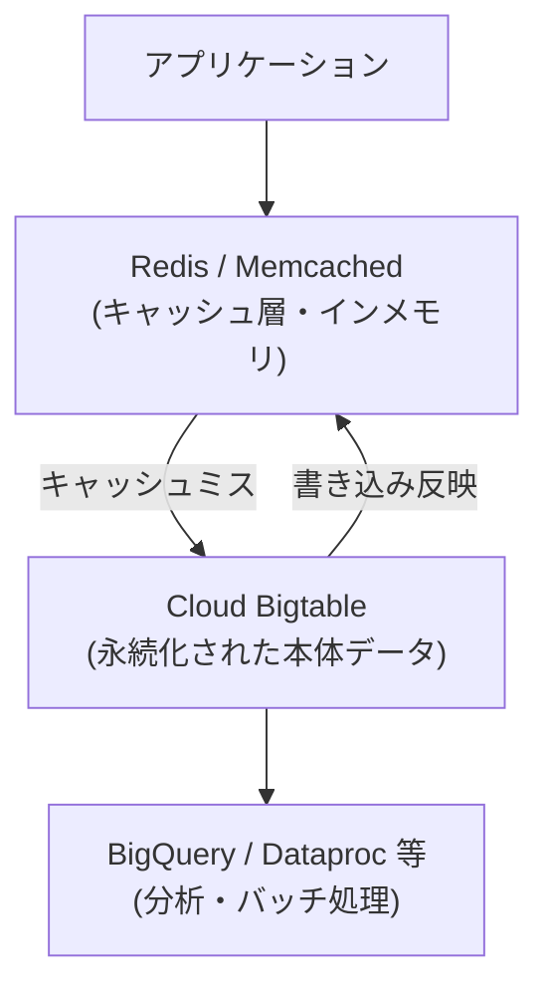
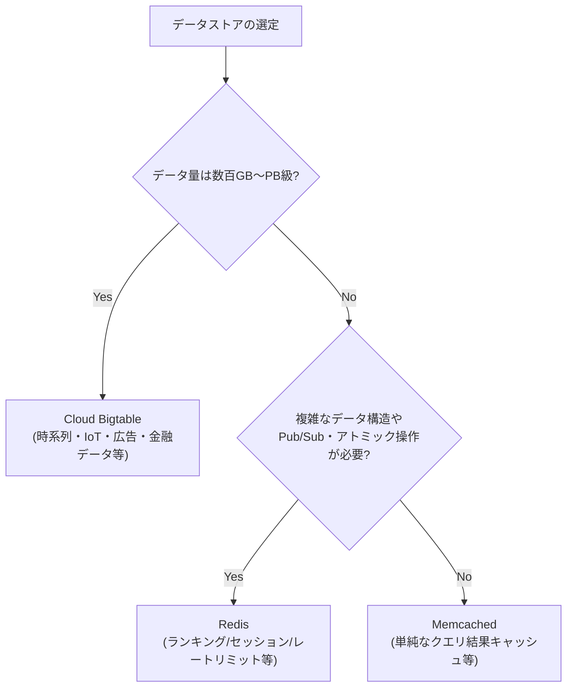

# Cloud Bigtable の使い所と Redis/Memcached とのユースケースの違い

## 概要

Cloud Bigtable は Google Cloud のフルマネージドな**ワイドカラム型 NoSQL データベース**で、数百 GB〜PB(ペタバイト)級のデータに対して高スループット・低レイテンシ(概ね一桁 ms)でアクセスできるように設計されている。Google 社内で Search・Analytics・Maps・Gmail などを支えてきた Bigtable 論文の実装であり、OSS の HBase と同じデータモデルを踏襲している。

一方 Redis / Memcached は**インメモリのキャッシュ/データストア**で、Bigtable よりさらに低いレイテンシ(サブミリ秒)を実現するが、容量はメモリサイズに制約されコストも高くなりがちである。両者は「速いキーバリューアクセスを提供する」という点では似て見えるが、**位置づけが根本的に異なる**。Bigtable は「永続化された本体データストア(source of truth)」、Redis/Memcached は多くの場合「本体データストアの前段に置くキャッシュ層、または短命なデータの高速置き場」である。

## 何が嬉しいのか

- **Bigtable が解決する課題**: RDB や単純な KVS では、書き込みが秒間数百万件規模になったり、データ量が TB〜PB 級になると、スケールアウトやレイテンシの維持が困難になる。Bigtable は行キーの範囲でクラスタ全体にデータを自動分散(シャーディング)し、ノードを増減するだけで線形にスループットをスケールできるため、こうした大規模データを「捨てずに全部持ったまま」低レイテンシで扱える。ユースケース例: IoT センサーのタイムシリーズデータ、広告配信のユーザープロファイル、金融の時系列マーケットデータ、モニタリング/メトリクスの生データ保存など。
- **Redis が解決する課題**: RDB や Bigtable への毎回のアクセスはネットワーク/ディスク I/O のオーバーヘッドがあり、リクエストごとに同じ結果を問い合わせるのは無駄である。Redis はインメモリでサブミリ秒の応答を返しつつ、Sorted Set・List・Hash など豊富なデータ構造をアトミックに操作できるため、キャッシュだけでなくランキング(リーダーボード)、レートリミット、セッションストア、Pub/Sub メッセージングなど「リアルタイム性が求められる小〜中規模の状態管理」に強みがある。
- **Memcached が解決する課題**: Redis よりさらにシンプルな、文字列/バイト列の KVS に特化したキャッシュである。マルチスレッドで動作しシンプルな分だけオーバーヘッドが小さく、「複雑なデータ構造も永続化も不要、とにかく計算済み結果やクエリ結果を高速に使い回したい」という用途にフィットする(例: DB クエリ結果や HTML フラグメントのキャッシュ)。

つまり、Bigtable を使わず全データを Redis に載せようとすると、メモリコストが急騰し、かつ Redis のシングルスレッド性(クラスタ構成でも設計が複雑)がボトルネックになりやすい。逆に Redis/Memcached を使わず全アクセスを Bigtable に流すと、サブミリ秒が必要なホットパス(セッション確認、レートリミット等)でレイテンシ要件を満たせない、または頻繁な同一クエリでコストが無駄にかかる、という問題が起きる。

## 詳細

### データモデルと永続性

| | Cloud Bigtable | Redis | Memcached |
|---|---|---|---|
| 種別 | ワイドカラム型 NoSQL(永続化・ディスク基盤) | インメモリ KVS(永続化オプションあり) | インメモリ KVS(永続化なし) |
| データ構造 | 行キー + カラムファミリー + タイムスタンプのソート済みマップ | String, List, Set, Hash, Sorted Set, Stream 等 | String/バイト列のみ |
| スケール | 数百 GB〜PB 級、ノード追加で線形にスケール | メモリ容量に依存(GB〜数十 GB が現実的) | メモリ容量に依存 |
| レイテンシ | 概ね一桁 ms(適切な行キー設計時) | サブミリ秒 | サブミリ秒 |
| 永続性・可用性 | ディスクベースで永続化、レプリケーション構成可能 | RDB/AOF で永続化可能だが基本は揮発性データ想定 | 永続化なし(再起動で消える) |
| トランザクション | 単一行ではアトミック、複数行トランザクション/セカンダリインデックスなし | 単一コマンド/Lua スクリプトでアトミック | なし |
| クエリパターン | 行キーの完全一致・範囲スキャンが基本、JOIN 不可 | キーごとのデータ構造操作、Pub/Sub 等 | Get/Set/Delete のみ |

### Bigtable 特有の設計ポイント

- スキーマは事前に厳密に決めず、カラムファミリー単位で疎(スパース)なデータを持てる。
- パフォーマンスは**行キー設計**にほぼ全て依存する。ホットスポット(特定の行キー範囲にアクセスが集中する)を避けるため、タイムスタンプを先頭に置かない、ハッシュ化・リバースするなどの工夫が定石。
- セカンダリインデックスがないため、行キー以外の条件で検索したい場合は別途インデックス用テーブルを持つか、BigQuery 連携などで対応する必要がある。
- GCP の Memorystore(Redis/Memcached 互換のマネージドサービス)と組み合わせて、Bigtable を本体データ、Memorystore をキャッシュ層とする構成がよく使われる。

### 使い分けの指針(概念図)

なお、実運用では二者択一ではなく、**Bigtable(本体データ)+ Redis/Memcached(キャッシュ層)** のように併用するケースが多い点に注意する。

> 補足: 上記のレイテンシ数値やスループット特性は一般的な傾向であり、実際の値はワークロード・行キー設計・インスタンス構成によって大きく変動する(不確実な情報)。正確な数値は公式ドキュメントのベンチマークや自身の検証で確認することが望ましい。

## 参考リンク

- [Cloud Bigtable の概要 (Google Cloud 公式)](https://cloud.google.com/bigtable/docs/overview)
- [Bigtable スキーマ設計のベストプラクティス](https://cloud.google.com/bigtable/docs/schema-design)
- [Memorystore for Redis 概要](https://cloud.google.com/memorystore/docs/redis/redis-overview)
- [Memorystore for Memcached 概要](https://cloud.google.com/memorystore/docs/memcached/memcached-overview)
- [Bigtable の性能に関するドキュメント](https://cloud.google.com/bigtable/docs/performance)
