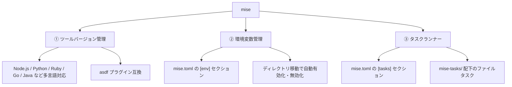

# mise でできること(ツールバージョン管理・環境変数管理・タスクランナー)

## 概要

**mise**(ミーズ、旧称 `rtx`)は Rust 製の開発ツールで、従来は別々のツールが担っていた以下の3つの役割を1つに統合しているのが特徴です。

1. 開発言語・ツールのバージョン管理(`asdf` 相当)
2. プロジェクトごとの環境変数管理(`direnv` 相当)
3. タスクランナー(`make` / npm scripts 相当)



## 何が嬉しいのか

従来は言語ごとに別々のバージョン管理ツール(`nvm`、`pyenv`、`rbenv` など)を使い、さらに環境変数管理には `direnv`、タスク実行には `make` や npm scripts……と複数ツールを組み合わせる必要がありました。それぞれ設定ファイルの書式もコマンド体系も異なり、学習コストや保守の手間がかさみます。

mise を使うと以下のメリットがあります。

- **1つの設定ファイルで完結**: `mise.toml` 1つに、使用する言語バージョン・環境変数・タスクをまとめて記述できる
- **高速**: Rust 製で、シェルスクリプトベースの `asdf` などに比べて動作が高速
- **asdf 資産の流用が可能**: `asdf` のプラグインエコシステムや `.tool-versions` ファイルと互換性があり、移行しやすい
- **オンボーディングの簡略化**: 新しいメンバーが参加した際、`mise install` を実行するだけで、リポジトリに定義された言語バージョン・環境変数一式がセットアップされる(「node は nvm、python は pyenv を入れて…」という手順書が不要になる)
- **ローカルと CI の統一**: 同じ `mise.toml` をローカル開発と CI で共有でき、バージョンのズレによる "動かない" 問題を防げる

## 詳細

### ① ツールバージョン管理

```toml
# mise.toml
[tools]
node = "20.11.0"
python = "3.12"
ruby = "3.3.0"
```

- `mise install` : `mise.toml` に記載されたバージョンを一括インストール
- `mise use node@20` : プロジェクトの `mise.toml` にバージョンを追記しつつ切り替え
- `mise ls` / `mise ls-remote node` : インストール済み・インストール可能なバージョンの一覧表示
- ディレクトリに `cd` すると、シェルフック(`mise activate`)により自動的にそのプロジェクトのバージョンへ切り替わる
- 言語ごとにビルトインの高速インストーラ(core backend)を持つほか、`asdf:`、`cargo:`、`npm:`、`pipx:`、`go:`、`ubi:`(GitHub Releases のバイナリを直接取得)など多様なバックエンドに対応

### ② 環境変数管理

```toml
[env]
NODE_ENV = "development"
DATABASE_URL = "postgres://localhost/myapp"
_.file = ".env"   # .env ファイルの読み込みも可能
```

`direnv` と同様、そのディレクトリに入ると環境変数が自動的に有効化され、出ると無効化されます。

### ③ タスクランナー

```toml
[tasks.build]
run = "npm run build"

[tasks.test]
run = "npm test"
depends = ["build"]
```

あるいは `mise-tasks/build` のような実行可能ファイルを配置するファイルベースのタスク定義も可能です。

- `mise run build` : タスクの実行
- `mise tasks` : タスク一覧表示
- タスク間の依存関係(`depends`)や並列実行にも対応

### その他の機能

- `mise doctor` : 設定や環境の問題を診断
- グローバル設定(`~/.config/mise/config.toml`)とプロジェクト設定(`mise.toml`)のレイヤー構造
- ロックファイル(`mise.lock`)によるバージョン固定機能(比較的新しい機能のため、詳細はバージョンによって異なる可能性があります。最新の挙動は公式ドキュメントで確認してください)

> **不確かな情報について**: 本ノートはモデルの学習知識をもとに作成されており、Web 検索による最新情報の裏取りは行っていません。サブコマンドの細かいオプションやロックファイル機能の挙動など、最新仕様は公式ドキュメントで確認することを推奨します。

## 参考リンク

- 公式ドキュメント: https://mise.jdx.dev/
- GitHub リポジトリ: https://github.com/jdx/mise
