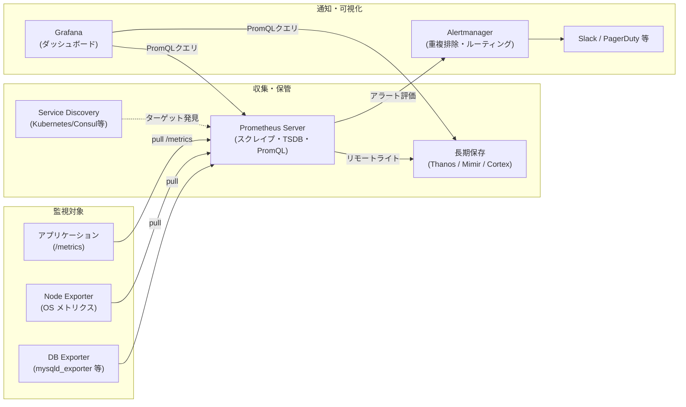

# Grafana + Prometheus による監視基盤の一般的なアーキテクチャ

## 概要

Prometheus + Grafana の監視基盤は、「**Prometheus が各種ターゲットからメトリクスを pull(収集)し、Grafana がそれを可視化する**」という役割分担が基本形です。実運用ではここに、アラート通知用の Alertmanager、メトリクス収集を仲介する各種 Exporter、長期保存・水平スケール用のリモートストレージ(Thanos / Mimir / Cortex など)を組み合わせるのが一般的な構成です。



## 何が嬉しいのか

- **プル型でシンプルに始められる**: アプリ側は `/metrics` エンドポイントを HTTP で公開するだけでよく、Prometheus 側の設定変更だけで監視対象を追加・削除できる。push 型(監視対象からサーバーへ能動送信)に比べ、監視対象が増減する動的環境(Kubernetes 等)との相性が良い(Service Discovery で自動追従できる)
- **PromQL による柔軟な集計**: 「直近5分のエラー率」「p99 レイテンシ」のような計算をクエリ言語で表現でき、ダッシュボードとアラートの両方に同じロジックを再利用できる
- **役割分担が明確でスケールしやすい**: Prometheus は収集・評価に専念し、可視化は Grafana、通知は Alertmanager に分離されているため、それぞれを独立にスケール・置換できる(例: 可視化だけ他ツールに差し替える、ストレージだけ Thanos に載せ替える、など)
- **エコシステムが巨大**: Node Exporter、mysqld_exporter、blackbox_exporter など既存の Exporter が非常に多く、自前で計装しなくても主要ミドルウェアのメトリクスを収集できる

これらがないと、各サービスごとに独自の監視スクリプトやログ集計を作り込むことになり、閾値管理・通知・ダッシュボードがバラバラになって運用コストが跳ね上がります。

## 詳細

### 主要コンポーネント

| コンポーネント | 役割 |
|---|---|
| **Prometheus Server** | 対象への定期スクレイプ(pull)、時系列データベース(TSDB)への保存、PromQL によるクエリ・アラートルール評価 |
| **Exporter** | メトリクスを持たないミドルウェア/OS 向けに `/metrics` を代理公開するアダプタ(node_exporter, mysqld_exporter, blackbox_exporter 等) |
| **Service Discovery** | Kubernetes・Consul・EC2 タグなどと連携し、スクレイプ対象を動的に発見(`kubernetes_sd_configs` 等) |
| **Alertmanager** | Prometheus からのアラートを受け取り、重複排除・グルーピング・抑制(inhibition)を行った上で Slack/PagerDuty/Email などへ通知をルーティング |
| **Grafana** | Prometheus(や他のデータソース)にクエリを投げてダッシュボードを描画。アラートルールを Grafana 側で持つことも可能(Grafana Alerting) |
| **長期保存 / HA レイヤ** | Prometheus 単体はローカルディスクに保存するため保持期間とスケールに限界がある。**Thanos**、**Grafana Mimir**、**Cortex** などを使い、複数 Prometheus からのデータをオブジェクトストレージ(S3等)に集約して長期保持・水平スケール・グローバルクエリを実現する |

### 典型的なデータフロー

1. アプリケーションや Exporter が `/metrics` にメトリクスを text 形式(または OpenMetrics)で公開する
2. Prometheus が `scrape_configs` に従って一定間隔(例: 15秒)でこれらを pull し、TSDB に時系列として保存する
3. `rules` に定義された recording rule / alerting rule が定期評価され、条件を満たすと Alertmanager にアラートが送られる
4. Alertmanager がアラートをグルーピング・重複排除し、通知先に振り分ける
5. Grafana が PromQL でデータを取得し、ダッシュボードとして可視化する

### コード例(最小構成の `prometheus.yml`)

```yaml
global:
  scrape_interval: 15s

scrape_configs:
  - job_name: "node"
    static_configs:
      - targets: ["node-exporter:9100"]

  - job_name: "myapp"
    static_configs:
      - targets: ["myapp:8080"]

rule_files:
  - "alert_rules.yml"

alerting:
  alertmanagers:
    - static_configs:
        - targets: ["alertmanager:9093"]
```

### 注意点

- **単一障害点になりやすい**: Prometheus はデフォルトで単体プロセス。可用性を上げるには「同一設定の Prometheus を2台並べる」単純な冗長化か、Thanos/Mimir のような分散構成が必要
- **カーディナリティ(ラベルの組み合わせ数)の爆発に注意**: ユーザーIDやリクエストパスなど、値の種類が非常に多いラベルを付けると TSDB のメモリ・ディスク使用量が急増する
- **保持期間の設計**: ローカルディスクだけで長期間(数ヶ月〜)保持するのはコスト・性能面で非現実的なことが多く、早い段階でリモートストレージの要否を検討するとよい
- **pull 型の制約**: 短命なバッチジョブなど Prometheus からスクレイプしづらい対象には **Pushgateway** を使う(ただし常用は非推奨とされている)
- 小規模〜中規模で「まず動かしてみる」段階では Prometheus + Grafana + Alertmanager の3点構成で十分なことが多く、Thanos 等の導入はマルチクラスタ化や長期保持の必要が出てから検討すれば十分です

## 参考リンク

- [Prometheus 公式ドキュメント: Overview](https://prometheus.io/docs/introduction/overview/)
- [Prometheus 公式ドキュメント: Alerting overview](https://prometheus.io/docs/alerting/latest/overview/)
- [Grafana 公式ドキュメント](https://grafana.com/docs/grafana/latest/)
- [Thanos 公式ドキュメント](https://thanos.io/tip/thanos/quick-tutorial.md/)
- [Grafana Mimir 公式ドキュメント](https://grafana.com/docs/mimir/latest/)
