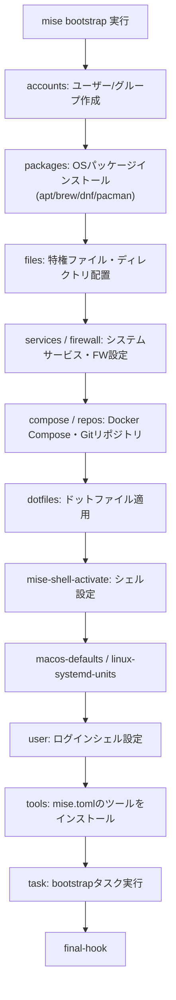

# mise bootstrap の仕組みと使い方(宣言的マシンセットアップ)

## 概要

mise には名前が紛らわしい2つの「bootstrap」機能がある。

1. **`mise bootstrap`** — 宣言的にマシン全体をセットアップする機能(2026年6月にリリースされた比較的新しい機能)。OS パッケージのインストール、ユーザー/グループ管理、dotfiles の適用、システムサービスの登録、ツールのインストールまでを `mise.toml` の設定に基づいて一括実行する
2. **`mise generate bootstrap`** — mise 自体をインストールするスクリプトを生成する機能(`curl https://mise.run | sh` の代替)

以下では主に①の `mise bootstrap` について解説する。



## 何が嬉しいのか

- 新しいマシン(あるいはCIコンテナ)をセットアップする際、READMEに書かれた手順書(「Homebrewでpostgresqlを入れて、.zshrcを編集して…」)を人力で追う必要がなくなる
- `mise bootstrap --dry-run` で実際に変更する前に何が起きるか確認できる
- 冪等性があるため、何度実行しても既に適用済みの設定はスキップされる(`task` ステップを除く)。導入後の定期的な「ドリフト検知」にも使える
- `--only` / `--skip` オプションで部分実行ができるので、既存の provisioning ツール(Ansible等)と役割分担しながら段階導入できる
- Homebrew(mac)/apt, dnf, pacman(linux)など複数パッケージマネージャを共通のtomlインターフェースで扱えるので、チームのOSがバラバラでも同じ設定ファイルで済む

具体例: 新メンバーのオンボーディングで `git clone` → `mise bootstrap --yes` の2コマンドだけで、パッケージ・dotfiles・ツールバージョン・シェル設定まで一式が揃う。

## 詳細

設定は `mise.toml` の `[bootstrap.*]` セクションに書く。

```toml
[bootstrap.packages]
"apt:build-essential" = "latest"
"brew:postgresql@17" = "latest"

[bootstrap.files."/etc/config.conf"]
content = 'token={{ secret(name="service_token") }}'
template = true
owner = "root"
mode = "0644"

[bootstrap.user]
login_shell = "/bin/zsh"

[tasks.bootstrap]
run = "gh auth status || gh auth login"
```

主なコマンド:

- `mise bootstrap --yes` : 確認プロンプトなしで全ステップ実行
- `mise bootstrap --dry-run` : 実行せず変更内容をプレビュー
- `mise bootstrap plan --json` : 実行計画を構造化データで出力(CI連携などに便利)
- `mise bootstrap status --missing` : 未適用の項目を確認
- `mise bootstrap --only dotfiles,tools` / `--skip packages,services` : 部分実行(対象パーツは accounts, plugins, packages, files, services, firewall, compose, repos, dotfiles, mise-shell-activate, macos-defaults, macos-launchd-agents, linux-systemd-units, user, tools, task, final-hook)
- `mise bootstrap --detailed-exitcode` : 変更有無を終了コードで判定(0=変更なし、2=変更あり)。CIで「差分があれば失敗させる」用途に使える

注意点:

- パッケージインストールやシステムサービス登録、ファイアウォール変更などroot権限が必要な操作を含むため、実行前に `--dry-run` で影響範囲を確認するのが安全
- 秘密情報(`secret()`)が不足している場合は処理が停止する
- **2026年6月リリースの比較的新しい機能**のため、サブコマンドやオプションが今後変わる可能性がある。最新の挙動は公式ドキュメントで確認すること(不確実な情報)

### 紛らわしい別機能: `mise generate bootstrap`

名前は似ているが別物である。こちらは「miseがまだインストールされていない環境向けに、mise自身をダウンロード・インストールするスクリプトを生成する」コマンド。

```bash
mise generate bootstrap --localize --write bin/mise
```

- `--localize` : プロジェクト内の `.mise` ディレクトリにmiseの内部データ(`MISE_DATA_DIR` など)をサンドボックス化し、グローバルにインストールされたmiseと衝突しないようにする
- `--write` : 標準出力ではなくファイルに書き込み、実行権限を付与
- `--version` : ダウンロードするmiseのバージョンを指定

生成されるスクリプトにはchecksumが含まれるため、`curl https://mise.run | sh` を都度実行するより安全にリポジトリへコミットできる。`mise generate task-stubs` と組み合わせると、mise未インストールの貢献者でも `./bin/mise run test` のようにタスクを実行できるようになる。

## 参考リンク

- [Bootstrap | mise-en-place](https://mise.jdx.dev/bootstrap.html)
- [mise bootstrap (CLI) | mise-en-place](https://mise.jdx.dev/cli/bootstrap.html)
- [Bootstrap Packages | mise-en-place](https://mise.jdx.dev/bootstrap/packages/)
- [mise generate bootstrap | mise-en-place](https://mise.jdx.dev/cli/generate/bootstrap.html)
- [Release v2026.6.6: Declarative machine bootstrap](https://github.com/jdx/mise/releases/tag/v2026.6.6)
- [Release v2026.6.14: Bootstrap, end-to-end](https://github.com/jdx/mise/releases/tag/v2026.6.14)
