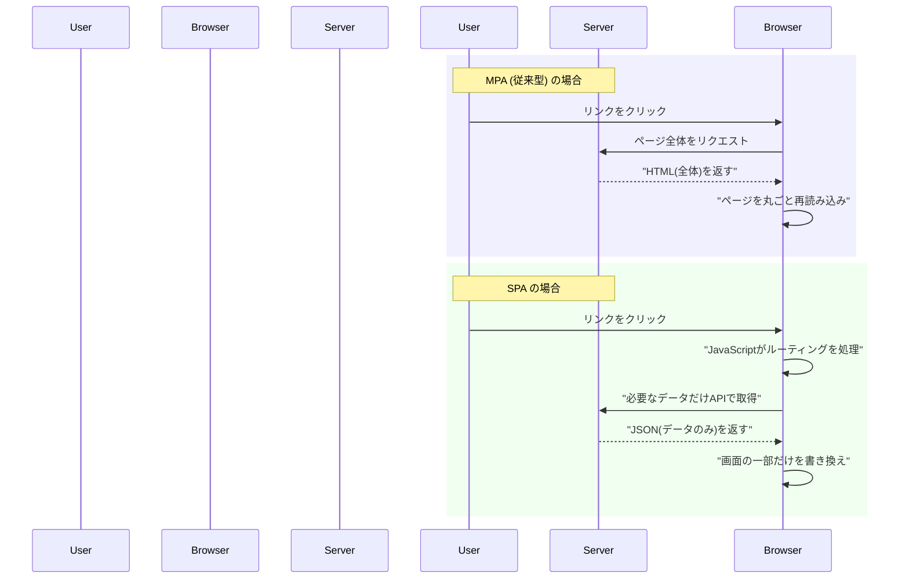
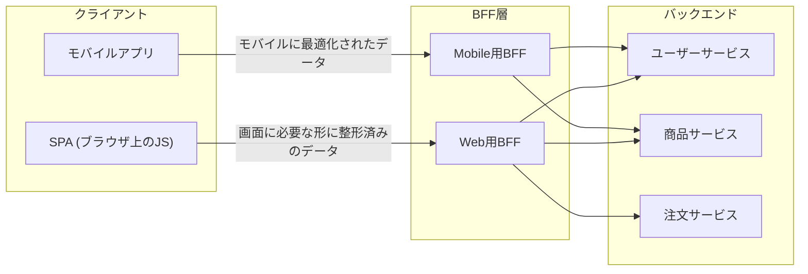
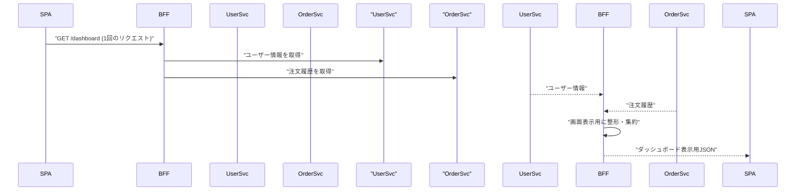

# シングルページアプリケーション(SPA)のメリットと動作原理

## 概要

SPA (Single Page Application) とは、最初に 1 枚の HTML を読み込んだ後は、ページ遷移のたびにサーバーへ HTML 全体を取りに行くのではなく、JavaScript が画面の一部だけを書き換えて画面遷移を実現する Web アプリケーションの構成方式です。従来型の Web アプリ (MPA: Multi Page Application) と比較すると、通信の仕方が大きく異なります。



SPA はバックエンドがマイクロサービス化されるにつれて「1 画面のために複数 API を叩く必要がある」という課題を抱えやすくなります。これを解決するためによく組み合わせられるのが BFF (Backend for Frontend) です。BFF は**特定のフロントエンド (クライアント) 専用に最適化されたバックエンドを用意するアーキテクチャパターン**で、SPA が「フロントエンドをどう作るか」の話であるのに対し、BFF は「そのフロントエンドが叩くバックエンドをどう構成するか」の話であり、レイヤーは異なりますが SPA の弱点を補うためによく併用されます。



## 何が嬉しいのか

**SPA のメリット**

- **画面遷移が速い・滑らか**: ページ遷移のたびに HTML/CSS/JS を丸ごと再取得・再構築する必要がなく、変更が必要な部分だけを DOM 更新するため、ネイティブアプリのようなサクサクした操作感になります。
- **サーバー負荷・通信量の削減**: サーバーは HTML のレンダリングをせず、必要なデータ (JSON) だけを返せばよいため、レスポンスサイズが小さく、サーバー側の処理も軽くなります。
- **フロントエンドとバックエンドの分離**: SPA はサーバーを「API を提供するだけの存在」として扱えるため、Web フロント・iOS アプリ・Android アプリなどが同じ API を共有しやすくなり、チーム開発でも役割分担しやすくなります。
- **リッチな UI 表現がしやすい**: ドラッグ&ドロップ、リアルタイム更新、アニメーションを伴う画面遷移など、状態をブラウザ側で持ち続けられるからこそ実現しやすい UX が作れます。

具体例として、Gmail や Google マップ、Trello のようなアプリを思い浮かべると分かりやすいです。メールを開いても画面全体が白くなって読み込み直す、ということがなく、必要な部分だけがスッと切り替わります。

**BFF のメリット (SPA と組み合わせた場合)**

バックエンドが複数のマイクロサービスに分かれている場合、SPA には次のような課題が出てきます。BFF はこれらを解決します。

- **1画面のために複数APIを叩く必要がある**: 例えば「ダッシュボード画面」を表示するのに、ユーザーサービス・注文サービス・通知サービスなど複数の API を SPA 側からそれぞれ `fetch` すると、リクエスト数が増え、レイテンシが悪化します。BFF がこれらを裏側で集約 (aggregate) して、SPA には 1 回のリクエストで必要なデータをまとめて返せます。
- **画面ごとに必要なデータ形式が違う**: 汎用的なバックエンド API はモバイルアプリや他システムとも共有されるため、SPA にとって不要なフィールドまで含んだレスポンスになりがちです。BFF が SPA 専用に「この画面が必要とする形」だけに整形して返すことで、SPA 側のロジックがシンプルになります。
- **秘密情報をブラウザに渡さずに済む**: SPA はブラウザ上で動くコードなので、API キーやサービス間通信用のシークレットをクライアントに持たせるのは危険です。BFF をサーバーサイドに置くことで、機密情報の扱いや認証トークンの管理 (例: `httpOnly` cookie でのセッション管理) をサーバー側に隠蔽できます。
- **CORS 問題の回避**: 複数のバックエンドサービスに SPA から直接アクセスすると、ドメインが異なるたびに CORS 設定が必要になります。BFF を単一の窓口にすることで、SPA から見るとアクセス先が 1 つになり、CORS の管理が楽になります。
- **フロントエンドとバックエンドの改修サイクルを分離できる**: BFF はフロントエンドチームが所有・実装することが多く、「画面の都合で API レスポンスを少し変えたい」といった変更を、共通バックエンドのマイクロサービスに手を入れずに BFF 層だけで完結させられます。

## 詳細

### SPA の動作の流れ

1. ブラウザが最初にアクセスした時、サーバーは中身がほぼ空の HTML (`<div id="root"></div>` など) と、アプリ本体である JavaScript バンドルを返します。
2. ブラウザが JavaScript を実行し、React・Vue・Angular などのフレームワークが DOM を組み立てて画面を描画します (これを Client Side Rendering、CSR と呼びます)。
3. ユーザーがリンクをクリックすると、`<a>` タグの本来の遷移をフレームワークの「ルーター」が横取り (`preventDefault`) し、サーバーへは飛ばずに JavaScript の中で「今何のページを表示すべきか」を判断します。
4. 画面の描画に必要なデータだけを `fetch` などで API から JSON として取得し、取得したデータを使って DOM の該当箇所だけを更新します。
5. URL 自体は `History API` (`pushState` / `replaceState`) を使って書き換えることで、ページ全体をリロードせずに URL バーの表示やブラウザの「戻る/進む」ボタンとの整合性を保ちます。

**技術的なポイント**

- **クライアントサイドルーティング**: React Router や Vue Router のようなライブラリが、URL とコンポーネントの対応関係を管理します。
- **仮想 DOM (Virtual DOM) や差分検出**: React などのフレームワークは、状態が変わった際に実際の DOM 全体を書き換えるのではなく、変更が必要な最小限の箇所だけを特定して更新することでパフォーマンスを保っています (仮想 DOM を使わない Svelte のような方式もあります)。
- **状態管理**: ページ遷移してもアプリ全体としては同じ JavaScript の実行環境が生き続けるため、Redux や Vuex、あるいは単純な React の Context のような「状態管理」の仕組みが必要になります。

**注意点・デメリット**

- **SEO への配慮が必要**: 検索エンジンのクローラーが JavaScript 実行後の内容までうまく読み取れない場合があるため、SSR (Server Side Rendering) や SSG (Static Site Generation)、あるいは Next.js のようなフレームワークとの組み合わせが検討されます。
- **初回読み込みが重くなりがち**: 最初に JavaScript バンドルをまとめてダウンロードする必要があるため、初回表示 (First Contentful Paint) が遅くなりやすく、コード分割 (code splitting) や遅延読み込み (lazy loading) で対策します。
- **ブラウザの「戻る」ボタンの挙動を自前で作り込む必要がある**: History API を正しく扱わないと、戻るボタンを押しても画面が更新されない、といった不具合が起こりえます。
- **JavaScript が無効な環境では動かない**: アクセシビリティやクローラー対応の観点で無視できないケースもあります。

**簡単なイメージコード**

```js
// SPAのルーティングの雰囲気(簡略化した例)
window.addEventListener("popstate", () => {
  render(location.pathname);
});

document.addEventListener("click", (e) => {
  if (e.target.matches("a[data-link]")) {
    e.preventDefault();
    const path = e.target.getAttribute("href");
    history.pushState({}, "", path); // URLだけ書き換え、ページ遷移はしない
    render(path); // 画面の該当部分だけ描画し直す
  }
});
```

### BFF (Backend for Frontend) の詳細

**なぜ「クライアントごと」の BFF が必要になるのか**

BFF パターンは、SoundCloud のエンジニアが提唱し、Sam Newman が広めたことで知られています。背景にあるのは「Web の SPA」「iOS アプリ」「Android アプリ」のように、同じサービスでも**クライアントごとに最適なデータの形や粒度が異なる**という問題です。

- Web の SPA: 比較的大きな画面に多くの情報を一度に表示したい
- モバイルアプリ: 画面が小さく通信も不安定なことがあるため、必要最小限のデータを軽量に返したい

これを 1 つの汎用 API で無理に共通化しようとすると、API がどのクライアントにとっても中途半端な形になり、条件分岐やオプショナルパラメータが増えて複雑化します。そこで**クライアントの種類ごとに専用の BFF を立てる**ことで、それぞれのフロントエンドに最適化したインターフェースを提供します。



**SPA と BFF の役割分担**

| レイヤー | 役割 |
|---|---|
| SPA | 画面の描画、ユーザー操作のハンドリング、クライアントサイドルーティング |
| BFF | 画面単位でのデータ集約・整形、認証情報の仲介、バックエンドサービスの詳細を隠蔽 |
| バックエンド (マイクロサービス群) | ドメインロジック、データ永続化 |

**注意点**

- BFF は「銀の弾丸」ではなく、**BFF 自体を運用・デプロイする手間が増える**というコストがあります。特にクライアントの種類が少ない、あるいはバックエンドが単一のモノリスである場合は、BFF を導入せずシンプルな API 直結構成の方が適切なこともあります。
- BFF を複数用意する場合 (Web用・iOS用・Android用など)、それぞれでロジックが重複しやすいので、共通処理をライブラリ化するなどの工夫が必要になることがあります。
- BFF はフロントエンドチームが所有するケースが多いため、「誰が BFF を保守するか」というチーム体制上の意思決定も重要です。
- SPA でなくても (例えば SSR のアプリでも) BFF は組み合わせられます。BFF は「クライアント専用バックエンド」という汎用的な概念であり、SPA 特有の技術ではない点には注意してください。ただし、ブラウザで直接複数のバックエンドを叩かざるを得ない SPA は、特に BFF 導入の恩恵を受けやすい構成だと言えます。

## 参考リンク

- [MDN: シングルページアプリケーション (SPA)](https://developer.mozilla.org/ja/docs/Glossary/SPA)
- [MDN: History API](https://developer.mozilla.org/ja/docs/Web/API/History_API)
- [React Router 公式ドキュメント](https://reactrouter.com/)
- [web.dev: Rendering on the Web (CSR/SSR/SSGの比較)](https://web.dev/articles/rendering-on-the-web)
- [Sam Newman: Pattern: Backends For Frontends](https://samnewman.io/patterns/architectural/bff/)
- [ThoughtWorks Technology Radar: Backend For Frontend](https://www.thoughtworks.com/radar/techniques/backends-for-frontends)
- [Netflix Tech Blog: Optimizing the Netflix API](https://netflixtechblog.com/optimizing-the-netflix-api-5c9ac715cf19) (BFF 的な発想の実例)
