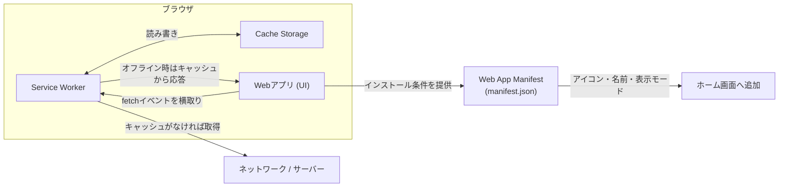

# PWA (Progressive Web App) の概要と仕組み

## 概要

PWA (Progressive Web App) は、Web 技術(HTML/CSS/JavaScript)で作られたアプリケーションを、ネイティブアプリのような UX(オフライン動作、ホーム画面への追加、プッシュ通知など)で提供するための一連の技術・設計手法の総称です。中核となるのは **Service Worker**(ブラウザとネットワークの間で動くバックグラウンドスクリプト)、**Web App Manifest**(アプリ名・アイコン・起動設定を定義する JSON)、そして **HTTPS 配信** の 3 要素です。



## 何が嬉しいのか

従来の Web サイトは「オンライン前提」「ブラウザタブの中でしか動かない」「毎回サーバーから全リソースを取得する」という制約がありました。PWA を使うと以下が改善されます。

- **オフライン/不安定な回線でも動作**: Service Worker がリクエストをインターセプトしてキャッシュから応答できるため、地下鉄やネットワーク不良時でもアプリの UI が表示できる(ニュースアプリの既読記事表示など)
- **インストール可能**: マニフェストの設定により、ホーム画面にアイコンを追加でき、ネイティブアプリのようにスタンドアロン起動できる(ブラウザの URL バーなしで表示)
- **再訪問時の高速化**: 静的アセットをキャッシュすることで、2 回目以降の読み込みが大幅に速くなる
- **プッシュ通知**: Service Worker と Push API を組み合わせることで、アプリを開いていなくても通知を送れる
- **開発・配布コストの削減**: ネイティブアプリのように App Store / Google Play の審査を経ずに、1 つのコードベース(Web)で複数プラットフォームに配布できる

具体例として、Twitter (現 X) の PWA 版である Twitter Lite や、Starbucks の PWA は、低速回線環境でもネイティブアプリに近い体験を実現し、ダウンロードサイズを大幅に削減した事例として知られています。

## 詳細

PWA として成立するための代表的な要件は以下の通りです。

1. **HTTPS 配信**
   Service Worker は HTTPS(または localhost)でのみ登録可能です。中間者攻撃による悪意あるスクリプト注入を防ぐためのセキュリティ要件です。

2. **Web App Manifest**
   `manifest.json` にアプリの名前・アイコン・テーマカラー・表示モード(`standalone` など)を定義します。

   ```json
   {
     "name": "My PWA App",
     "short_name": "MyApp",
     "start_url": "/",
     "display": "standalone",
     "background_color": "#ffffff",
     "theme_color": "#000000",
     "icons": [
       { "src": "/icon-192.png", "sizes": "192x192", "type": "image/png" },
       { "src": "/icon-512.png", "sizes": "512x512", "type": "image/png" }
     ]
   }
   ```

   HTML 側では `<link rel="manifest" href="/manifest.json">` で読み込みます。

3. **Service Worker の登録とキャッシュ戦略**

   ```javascript
   // 登録(メインスレッド側)
   if ("serviceWorker" in navigator) {
     navigator.serviceWorker.register("/sw.js");
   }
   ```

   ```javascript
   // sw.js: fetch イベントをインターセプトしてキャッシュ優先で応答
   const CACHE_NAME = "v1";

   self.addEventListener("install", (event) => {
     event.waitUntil(
       caches.open(CACHE_NAME).then((cache) => cache.addAll(["/", "/index.html", "/style.css"]))
     );
   });

   self.addEventListener("fetch", (event) => {
     event.respondWith(
       caches.match(event.request).then((cached) => cached || fetch(event.request))
     );
   });
   ```

   キャッシュ戦略には主に以下のパターンがあり、リソースの性質によって使い分けます。
   - **Cache First**: キャッシュ優先、なければネットワーク(静的アセット向け)
   - **Network First**: ネットワーク優先、失敗時にキャッシュ(常に最新にしたい API レスポンス向け)
   - **Stale-While-Revalidate**: キャッシュを即座に返しつつ裏でキャッシュを更新する

4. **インストール可能性 (Installability)**
   `beforeinstallprompt` イベントを利用して、ブラウザ標準のインストールバナーの代わりに独自の UI でインストールを促すことができます。

**注意点**
- Service Worker のライフサイクル(`install` → `waiting` → `activate`)はやや複雑で、キャッシュの更新タイミングを誤ると「新しいコードをデプロイしたのに古い画面が表示され続ける」という問題が起きやすいです。バージョン管理されたキャッシュ名を使い、`activate` イベントで古いキャッシュを削除する実装が定石です。
- iOS Safari は PWA サポートが Android/Chrome に比べて長らく制限的でした(プッシュ通知のサポートは iOS 16.4 以降など)。この点は執筆時点の一般的な傾向であり、不確かな情報のため最新のサポート状況は公式ドキュメントで要確認です。
- Service Worker はドメイン単位でスコープを持つため、複数アプリが同一オリジンに存在する場合は登録パスの `scope` オプションに注意が必要です。

## 参考リンク

- [MDN: Progressive web apps (PWAs)](https://developer.mozilla.org/en-US/docs/Web/Progressive_web_apps)
- [MDN: Service Worker API](https://developer.mozilla.org/en-US/docs/Web/API/Service_Worker_API)
- [web.dev: Learn PWA](https://web.dev/learn/pwa/)
- [W3C: Web App Manifest](https://www.w3.org/TR/appmanifest/)
