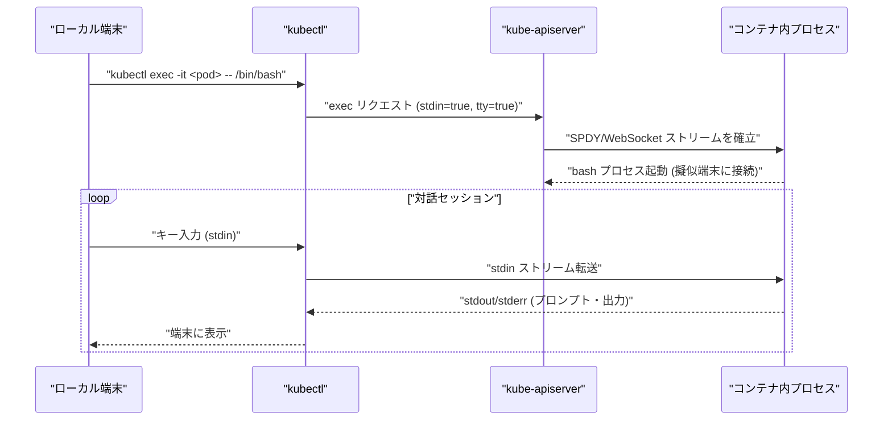
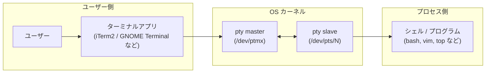

# kubectl の -it オプション(--stdin --tty)の意味

## 概要

`kubectl` の `-it` は、`-i`(`--stdin`)と `-t`(`--tty`)という2つの独立したオプションを組み合わせた省略記法です。`kubectl exec -it`、`kubectl run -it`、`kubectl attach -it` などで使われ、**コンテナに対してターミナル(シェル)を対話的に操作できるようにする**ためのオプションです。

- `-i` / `--stdin` : ローカルの標準入力(stdin)をコンテナのプロセスに接続する
- `-t` / `--tty` : 疑似端末(pseudo-TTY)を割り当てる

TTY(TeleTYpewriter、テレタイプ端末)は、もともと物理的な文字入出力端末機を指した言葉で、Unix/Linux の世界では「文字の入出力を行う端末デバイス」全般を指す抽象概念です。現在では物理端末はほぼ存在しませんが、OS はターミナルソフトや `kubectl exec -it` のような対話セッションのために「疑似端末(pseudo-TTY, pty)」というソフトウェア的な TTY を作り出し、同じ仕組みで扱っています。`-i` と `-t` はどちらか片方だけでは対話シェルとして正しく動作しないため、通常はセットで使います。





## 何が嬉しいのか

`-it` を付けないと、コマンドは実行できても「対話的なシェル操作」ができません。TTY(疑似端末)がないと、プログラムは「自分がどこから入力を受け取り、どこに出力しているか分からない」状態になり、対話的な操作に必要な機能が使えなくなります。

- **`-i` がないと**: stdin が接続されないため、シェル起動直後にすぐ終了してしまったり、`vim` のようなキー入力を待つコマンドが使えません。
- **`-t` がないと**: TTY が割り当てられないため、シェルプロンプト(`$` や `#`)が正しく表示されなかったり、カーソル移動・色付けなどターミナル依存の機能(bash の補完、`top` の画面描画など)が崩れます。
  - **カーソル制御・画面描画ができる**: `vim` や `top` のような、画面を書き換えながら動くプログラムは、TTY が提供する制御シーケンス(エスケープシーケンス)や端末サイズの情報(`$COLUMNS` / `$LINES`)を前提にしています。TTY がないとこれらの再描画・画面編集が壊れます。
  - **プロンプト・行編集・シグナルが機能する**: `Ctrl-C` で SIGINT を送る、`Ctrl-D` で EOF、上下キーでコマンド履歴を辿る、といった端末ならではの機能は TTY のライン制御(line discipline)によって実現されています。パイプ(`|`)経由の入出力にはこれがありません。

具体的なユースケース:

- デバッグのためにコンテナ内で `bash` や `sh` を起動して調査したいとき: `kubectl exec -it my-pod -- /bin/sh`
- 一時的なデバッグ用 Pod を作ってその場でシェルに入りたいとき: `kubectl run tmp-shell --rm -it --image=busybox -- sh`
- 逆にログ出力だけを取りたい・パイプで出力を流すだけ(`kubectl exec my-pod -- ls | grep foo`)なら `-it` は不要です。むしろ CI などで `-it` を付けると TTY がない環境でエラーになることがあります。

## 詳細

### `-it` オプションについて

- `-i`, `-t` はそれぞれ単独でも指定できますが、対話シェルを使う場合はほぼ常に両方必要です。
- ロングオプションは `--stdin` と `--tty` で、`-it` はこれらをまとめて書けるショートオプションの合成形です(`-i -t` と同義)。
- 内部的には、`kubectl` は kube-apiserver 経由でコンテナランタイムに接続し、`stdin: true`, `tty: true` を指定した exec/attach リクエストを送ります。これにより、コンテナのプロセスに疑似端末(pty)が割り当てられ、ローカル端末との間で双方向にストリームが張られます。
- CI/CD パイプラインなど TTY が存在しない環境で `-it` を使うと、`the input device is not a TTY` のようなエラーになることがあります。その場合は `-i` のみ、または両方を外して実行します。
- `kubectl exec` だけでなく `kubectl run`、`kubectl attach`、`kubectl debug`(エフェメラルコンテナのデバッグ)などでも同様に使えます。

```bash
# コンテナ内で bash を起動して対話操作する例
kubectl exec -it my-pod -- /bin/bash

# 一時的な Pod を作って終了時に自動削除する例
kubectl run tmp-shell --rm -it --image=busybox --restart=Never -- sh
```

### TTY(疑似端末)について

- **歴史的背景**: 元々は本物のタイプライター型端末(テレタイプ)がコンピュータに接続されていたことに由来する名前です。現在も Linux の慣習としてデバイスファイル名に `tty` という接頭辞が残っています(例: `/dev/tty1` は物理/仮想コンソール)。
- **物理 TTY と疑似 TTY(pty)**:
  - 物理 TTY: シリアル接続された実端末(現在はほぼ使われません)。
  - pty(pseudo-tty): ソフトウェアで作られた仮想端末。`ssh` でログインしたときや、`kubectl exec -it` でコンテナに入ったときはこちらが使われます。pty には「master 側」(ターミナルアプリや `kubectl` が持つ側)と「slave 側」(シェルなどのプログラムが `/dev/pts/N` として見る側)のペアがあります。
- **確認方法**:
  - `tty` コマンドで現在のシェルがどの端末デバイスに接続されているか確認できます(例: `/dev/pts/3`)。
  - `[ -t 0 ]`(stdin が TTY かどうか)は、シェルスクリプトなどでよく「対話的に実行されているか」を判定するのに使われます。
  - `kubectl exec` に `-t` を付けずに実行し、パイプでない対話コマンドを流すと `input is not from a terminal` のようなエラーや、プロンプトが崩れる挙動を確認できます。
- **`-i`(stdin)との違い**: `-t`(TTY)は「端末としての性質(制御シーケンス・行編集・画面サイズ通知など)」を提供するもので、`-i`(stdin)は単に「標準入力を接続するかどうか」です。両者は独立した機能なので、`-it` を組み合わせて初めてローカルのターミナルとほぼ同じ体験でコンテナ内のシェルを操作できます。

## 参考リンク

- [kubectl exec – Kubernetes 公式ドキュメント](https://kubernetes.io/docs/reference/generated/kubectl/kubectl-commands#exec)
- [kubectl Cheat Sheet – Kubernetes 公式ドキュメント](https://kubernetes.io/docs/reference/kubectl/cheatsheet/)
- [Get a Shell to a Running Container – Kubernetes 公式チュートリアル](https://kubernetes.io/docs/tasks/debug/debug-application/get-shell-running-container/)
- [tty(4) — Linux manual page](https://man7.org/linux/man-pages/man4/tty.4.html)
- [pty(7) — Linux manual page](https://man7.org/linux/man-pages/man7/pty.7.html)
- [The TTY demystified (Linus Åkesson)](https://www.linusakesson.net/programming/tty/) — TTY/pty の仕組みを図解した有名な解説記事(公式ドキュメントではありませんが技術的に信頼できる内容です)
