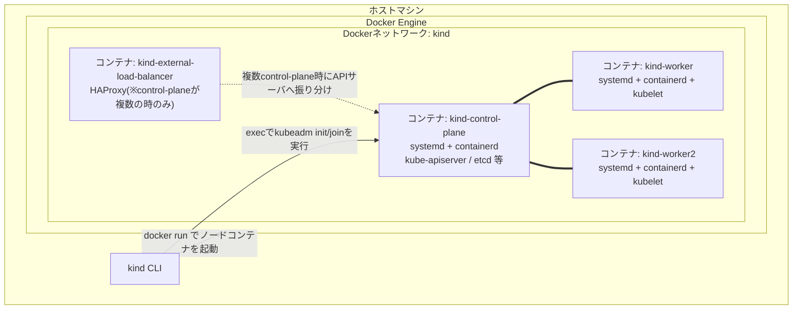
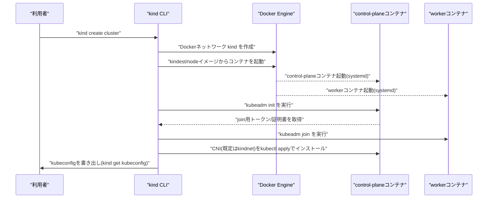

# kind (Kubernetes IN Docker) がローカルにクラスタを構築する仕組み

## 概要

[kind](https://kind.sigs.k8s.io/)(Kubernetes IN Docker)は、**VM を使わず「Docker コンテナ 1 つ = Kubernetes ノード 1 つ」として扱う**ことでローカルに Kubernetes クラスタを構築するツールです。各ノードコンテナの中で `systemd` を PID 1 として動かし、その上で `containerd`・`kubelet`・(control-plane ノードなら)`kube-apiserver` などを本物の Kubernetes と同じように動作させます。クラスタの初期化自体は内部的に `kubeadm` を使って行われます。



## 何が嬉しいのか

- **起動が速く軽量**: minikube の VM ドライバのように仮想マシンを起動する必要がなく、Docker コンテナを立ち上げるだけなので、数十秒〜1分程度でクラスタが立ち上がります。
- **マルチノード・マルチ control-plane 構成を手軽に再現できる**: コンテナを増やすだけなので、本番に近い「control-plane 3台 + worker 複数台」のような HA 構成もノートPC 上で簡単に試せます。
- **CI との相性が良い**: Docker さえ動けば良いので、GitHub Actions などの CI 環境でも容易にフル機能の Kubernetes クラスタを用意でき、Kubernetes 本体の E2E テストにも実際に使われています。
- **CNI・Ingress・CRD など Kubernetes の挙動そのものを検証できる**: 単純なモック環境ではなく `kubeadm` で組み立てた本物のクラスタなので、Ingress Controller や CNI プラグイン、Admission Webhook などの動作検証にも使えます。
- 使わない場合(例えばマニフェストの静的チェックだけで済ませる場合)と比べて、実際にリソースが Reconcile される挙動やネットワーキングまで含めて確認できるのが大きな違いです。

## 詳細

### ノード = コンテナという仕組み

kind は `kindest/node` という専用のベースイメージ(k8s のバージョンに対応したタグ、例: `kindest/node:v1.31.0`)を使います。このイメージには次のものがあらかじめ入っています。

- `kubeadm` / `kubelet` / `kubectl` などの Kubernetes バイナリ
- `containerd`(ノード内で動くコンテナランタイム)
- CNI バイナリ
- `coredns` や `pause` など主要コンポーネントのコンテナイメージ(事前にキャッシュ済みなので、クラスタ作成時にインターネットから pull しなくても動く)

ノードコンテナは `--privileged` に近い権限で起動され、cgroup をマウントした上で `systemd` を PID 1 として起動する専用のエントリポイントを使います。これにより、コンテナの中でさらに `containerd` や `kubelet` が systemd サービスとして動く、いわゆる「コンテナ内コンテナ(nested containers)」構成が実現されています。なお、Docker のオーバレイファイルシステムの上にさらにオーバレイを重ねる(overlay-on-overlay)問題があるため、ノード内の `containerd` は環境に応じてスナップショッタの選択などで対処しています(この部分の実装詳細はバージョンによって変わりうるため、正確な最新挙動は公式リポジトリのコードを参照するのが確実です)。

### クラスタ作成の流れ



1. `kind create cluster` で設定(デフォルト設定 or `--config` で渡した YAML)をパース
2. `kind` という名前の Docker ネットワーク(bridge)を作成し、全ノードコンテナをそこに接続
3. 設定で指定されたノード(`control-plane` / `worker`)の数だけ `docker run` でコンテナを起動
4. 最初の control-plane コンテナに対して `kubeadm init` を実行してクラスタを初期化
5. 追加の control-plane / worker コンテナには `kubeadm join` を実行(control-plane を複数台にする場合は証明書もコピー)
6. control-plane が複数ある場合、`kind-external-load-balancer` という HAProxy コンテナを別途起動し、APIサーバへのアクセスを振り分ける
7. デフォルト CNI である **kindnet**(kube-router ベースの軽量 CNI)を `kubectl apply` でインストール(`disableDefaultCNI: true` にすれば Calico や Cilium などに差し替え可能)
8. 生成した kubeconfig をホスト側(`~/.kube/config` など)に書き出して完了

### マルチノード構成の例

```yaml
kind: Cluster
apiVersion: kind.x-k8s.io/v1alpha4
nodes:
  - role: control-plane
  - role: control-plane
  - role: control-plane
  - role: worker
  - role: worker
```

このように `nodes` を複数書くだけで、3台の control-plane(自動的に HAProxy によるロードバランシングが構成される)+2台の worker、というクラスタをローカルに再現できます。

### その他の特徴

- `extraPortMappings` を使うとノードコンテナのポートをホストに公開でき、`NodePort` サービスなどにホストから直接アクセスできます。
- `extraMounts` でホストのディレクトリをノードコンテナにマウントできます(ローカルイメージの共有などに便利)。
- `kind load docker-image` コマンドで、ローカルでビルドした Docker イメージを(レジストリを経由せず)直接ノードコンテナの `containerd` に読み込ませることができます。
- あくまで Docker コンテナなのでホストカーネルを共有しており、VM のような強い分離はありません。ローカル開発・CI 用途を想定したツールで、本番相当のセキュリティ分離が必要な用途には向きません。

## 参考リンク

- [kind 公式ドキュメント](https://kind.sigs.k8s.io/)
- [kind Quick Start](https://kind.sigs.k8s.io/docs/user/quick-start/)
- [kind Design Principles](https://kind.sigs.k8s.io/docs/design/initial/)
- [kind Configuration(マルチノード等の設定)](https://kind.sigs.k8s.io/docs/user/configuration/)
- [kind GitHub リポジトリ](https://github.com/kubernetes-sigs/kind)
