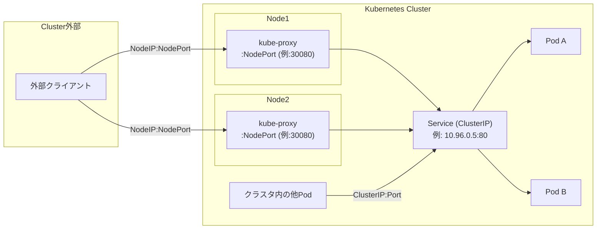

# Kubernetes Service の ClusterIP と NodePort の使い分け

## 概要

`ClusterIP` と `NodePort` はどちらも Kubernetes の `Service` リソースの `type` の一種で、Pod 群への安定したアクセス経路を提供する点は共通していますが、**どこからアクセスできるか**が異なります。`ClusterIP` はクラスタ内部からのみ到達可能な仮想 IP を割り当て、`NodePort` はそれに加えて全ノードの特定ポートを経由してクラスタ外部からもアクセスできるようにします。`NodePort` は `ClusterIP` の機能を内包する上位互換の型で、`NodePort` を作成すると裏側で `ClusterIP` も自動的に割り当てられます。



## 何が嬉しいのか

Pod は再起動やスケーリングのたびに IP アドレスが変わってしまうため、直接 Pod の IP を指定して通信することはできません。Service は Label Selector で対象の Pod 群をまとめ、変わらないエンドポイント(ClusterIP)を提供することでこの問題を解決します。その上で、

- **ClusterIP**: 「クラスタ内部だけで完結する通信」に最適です。例えばフロントエンド Pod からバックエンド API Pod への呼び出し、アプリケーションから内部の DB/キャッシュ Service への接続など、外部に公開する必要がない通信に使います。外部に一切露出しないため、余計な攻撃対象領域(Attack Surface)を増やさずに済みます。
- **NodePort**: 「Ingress や LoadBalancer をまだ用意していないが、とりあえずクラスタ外からアクセスしたい」場合に使います。クラウドの LoadBalancer が使えないオンプレ/ベアメタル環境や、`minikube`/`kind` などのローカル開発環境で動作確認したい場合に手軽に使えるのが利点です。

逆に言うと、本番環境でクラスタ外部に恒常的にサービスを公開する場合は、NodePort をそのまま使うのではなく `LoadBalancer` タイプや `Ingress` を経由するのが一般的です(理由は後述)。

## 詳細

### ClusterIP

- デフォルトの Service タイプ(`type` を省略すると ClusterIP になる)。
- クラスタ内部の仮想 IP(VIP)がサービスディスカバリ用の DNS 名(例: `my-svc.my-namespace.svc.cluster.local`)とともに割り当てられる。
- kube-proxy が iptables/IPVS のルールを使い、ClusterIP 宛の通信を配下の Pod へロードバランシングする。
- クラスタ外部からは直接アクセスできない(`kubectl port-forward` や `kubectl proxy` を使えば開発時に一時的にアクセス可能)。

```yaml
apiVersion: v1
kind: Service
metadata:
  name: backend
spec:
  type: ClusterIP # 省略可
  selector:
    app: backend
  ports:
    - port: 80
      targetPort: 8080
```

### NodePort

- 各ノードの `30000-32767`(デフォルト範囲、`--service-node-port-range` で変更可)の中から静的なポートを割り当て、**全ノードの IP** でそのポートを Listen する。
- `<任意のNodeIP>:<NodePort>` にアクセスすると、アクセスしたノードに Pod が存在しなくても kube-proxy がクラスタ内の Service(ClusterIP)経由で適切な Pod まで転送してくれる。
- 前述の通り ClusterIP を内包するため、クラスタ内部からは通常どおり ClusterIP 経由でもアクセス可能。

```yaml
apiVersion: v1
kind: Service
metadata:
  name: backend
spec:
  type: NodePort
  selector:
    app: backend
  ports:
    - port: 80
      targetPort: 8080
      nodePort: 30080 # 省略すると自動割り当て
```

### NodePort を本番の外部公開にそのまま使わない理由

- ポート番号がクラスタ全体で 1 つに固定されるため、複数サービスを公開すると管理が煩雑になり、80/443 のような標準ポートは使えない。
- クライアントはどのノードにアクセスするかを自分で意識する必要があり、単純な DNS ラウンドロビン程度では特定ノード障害時のフェイルオーバーが弱い。
- ノードの IP を直接外部に晒すことになり、ファイアウォール設定などセキュリティ面の考慮が増える。
- TLS 終端やパスベースルーティングなど L7 の機能は持たない。

そのため実運用では、クラウド環境なら NodePort の上にさらに外部ロードバランサーを構成する `type: LoadBalancer`、複数サービスをホスト名/パスで振り分けたいなら `Ingress`(内部的には ClusterIP の Service を束ねる)を使うのが一般的です。NodePort は「学習・検証用」または「LoadBalancer/Ingress が使えない環境での最終手段」と捉えると使い分けの指針になります。

## 参考リンク

- [Service | Kubernetes](https://kubernetes.io/docs/concepts/services-networking/service/)
- [Service - Publishing Services (ServiceTypes)](https://kubernetes.io/docs/concepts/services-networking/service/#publishing-services-service-types)
- [Connecting Applications with Services](https://kubernetes.io/docs/tutorials/services/connect-applications-service/)
