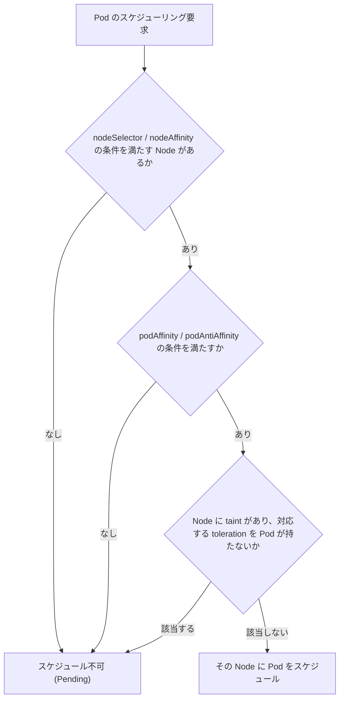

# Kubernetes: nodeSelector・Affinity・Taint/Toleration の使い分け

## 概要

これらはすべて Kubernetes の `kube-scheduler` が Pod をどの Node に配置するかを制御する仕組みですが、「誰が誰を選ぶか」の向きが異なります。

- **nodeSelector / node affinity / pod affinity**: **Pod 側**が「このノードに乗りたい」と希望する仕組み(引力)
- **taint / toleration**: **Node 側**が「このノードには乗せたくない」と拒否する仕組み(反発力。toleration があれば例外的に許容)

スケジューリング時の判定フローとしては、おおよそ以下のようなイメージです。



## 何が嬉しいのか

これらを使わないと、Pod は「リソースの空きがあるノードならどこでも良い」という前提でランダムに近い形でスケジュールされます。実運用では以下のような要件が頻繁に発生するため、それぞれの仕組みが必要になります。

- **要件どおりのハードウェア/ゾーンに配置したい**(nodeSelector / nodeAffinity)
  - 例: GPU が搭載された Node にのみ機械学習の推論 Pod を配置したい
- **関連する Pod 同士を近くに置きたい、または離したい**(pod affinity / anti-affinity)
  - 例: キャッシュ (Redis) とそれを利用するアプリケーション Pod を同じ Node に置いてレイテンシを下げたい
  - 例: 同じ Deployment のレプリカを異なる Node/ゾーンに分散させ、1 台の Node 障害でサービス全体が落ちないようにしたい(高可用性)
- **特定 Node を基本的に空けておき、許可された Pod だけを乗せたい**(taint / toleration)
  - 例: Control Plane Node に一般アプリの Pod が乗らないようにしたい
  - 例: GPU 専用 Node や Spot/Preemptible Node に、それを許容できる Pod だけを配置したい

これらを組み合わせることで、コスト最適化・可用性向上・パフォーマンス改善を Pod 単位で細かく制御できます。

## 詳細

### 1. nodeSelector

もっともシンプルな仕組みで、Node のラベルに完全一致する Node にのみスケジュールします。

```yaml
apiVersion: v1
kind: Pod
metadata:
  name: gpu-pod
spec:
  nodeSelector:
    disktype: ssd
  containers:
    - name: app
      image: my-app:latest
```

`disktype=ssd` ラベルが付いた Node にラベル一致で `AND` 条件のみ指定可能。柔軟な条件(OR、優先度付けなど)は書けません。

### 2. node affinity

nodeSelector の上位互換で、`In`/`NotIn`/`Exists`/`DoesNotExist`/`Gt`/`Lt` などの演算子や、「必須」「できれば」の 2 段階の強さを指定できます。

```yaml
affinity:
  nodeAffinity:
    requiredDuringSchedulingIgnoredDuringExecution: # 必須条件
      nodeSelectorTerms:
        - matchExpressions:
            - key: accelerator
              operator: In
              values: ["nvidia-gpu"]
    preferredDuringSchedulingIgnoredDuringExecution: # 優先条件(soft)
      - weight: 80
        preference:
          matchExpressions:
            - key: topology.kubernetes.io/zone
              operator: In
              values: ["ap-northeast-1a"]
```

- `requiredDuringSchedulingIgnoredDuringExecution`: 満たさなければスケジュールしない(ハード制約)
- `preferredDuringSchedulingIgnoredDuringExecution`: 満たすノードを優先するが、なければ他ノードでも可(ソフト制約)
- `IgnoredDuringExecution` の部分は「実行中に条件が崩れても Pod を追い出さない」という意味。将来的に `RequiredDuringExecution`(実行中も強制)が実装される想定でこの名前になっています。

用途: GPU ノードには必ず載せたい(required)、特定 AZ に載せたいがなくても良い(preferred)、など。

### 3. pod affinity / pod anti-affinity

Node のラベルではなく、**すでに稼働している他の Pod との位置関係**を条件にします。`topologyKey` で「同じ Node」「同じゾーン」など粒度を指定します。

```yaml
affinity:
  podAffinity:
    requiredDuringSchedulingIgnoredDuringExecution:
      - labelSelector:
          matchLabels:
            app: redis-cache
        topologyKey: "kubernetes.io/hostname" # 同じ Node に寄せる
  podAntiAffinity:
    requiredDuringSchedulingIgnoredDuringExecution:
      - labelSelector:
          matchLabels:
            app: my-app
        topologyKey: "topology.kubernetes.io/zone" # 同じゾーンに固めない
```

用途:
- podAffinity: レイテンシを下げたいキャッシュ・サイドカーとの同居
- podAntiAffinity: 同一アプリのレプリカを分散させ、単一障害点を防ぐ(Deployment の Pod をゾーン分散させるなど)

なお pod anti-affinity は Node 数が多い大規模クラスタでは計算コストが高くなりやすい点に注意が必要です(公式ドキュメントでも大規模クラスタでの利用は非推奨とされています)。

### 4. taint と toleration

ここまでの 3 つが「Pod がノードを選ぶ」仕組みなのに対し、taint/toleration は逆に **Node が Pod を拒否する** 仕組みです。

```bash
# Node に taint を付与(GPU 専用ノードとして専有させたい場合など)
kubectl taint nodes gpu-node-1 dedicated=gpu:NoSchedule
```

```yaml
# その taint を許容できる Pod 側の toleration
tolerations:
  - key: "dedicated"
    operator: "Equal"
    value: "gpu"
    effect: "NoSchedule"
```

- `effect` には `NoSchedule`(新規スケジュール禁止)、`PreferNoSchedule`(できれば避ける)、`NoExecute`(既存 Pod も退去させる)があります
- toleration はあくまで「拒否を打ち消す」だけで、その Node に**必ず**配置されるわけではない点が affinity と違うポイントです。「必ずそのノードに寄せたい」場合は node affinity と taint/toleration を併用します

用途:
- Control Plane Node に一般 Pod を載せない(`node-role.kubernetes.io/control-plane:NoSchedule` が標準で付与されている)
- GPU/高性能インスタンスなどコストの高い Node を専用ワークロード以外から守る
- Node に障害の兆候がある場合に自動付与される `NoExecute` taint により、既存 Pod を退避させる(`node.kubernetes.io/not-ready` など)
- Spot/Preemptible Node に taint を付け、中断を許容できるバッチ Pod だけに toleration を持たせる

### まとめ表

| 仕組み | 主体 | 目的 | 強さの指定 |
|---|---|---|---|
| nodeSelector | Pod | Node ラベルによる単純な絞り込み | ハードのみ |
| node affinity | Pod | Node ラベルによる高度な絞り込み | ハード/ソフト両対応 |
| pod affinity/anti-affinity | Pod | 他の Pod との位置関係 | ハード/ソフト両対応 |
| taint/toleration | Node | 特定 Node への配置を原則拒否 | NoSchedule/PreferNoSchedule/NoExecute |

## 参考リンク

- [Assigning Pods to Nodes(公式ドキュメント)](https://kubernetes.io/docs/concepts/scheduling-eviction/assign-pod-node/)
- [Taints and Tolerations(公式ドキュメント)](https://kubernetes.io/docs/concepts/scheduling-eviction/taint-and-toleration/)
- [Scheduling Framework(公式ドキュメント)](https://kubernetes.io/docs/concepts/scheduling-eviction/scheduling-framework/)
