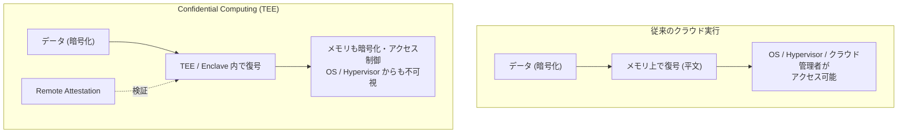

# Confidential Computing とは

## 概要

Confidential Computing(コンフィデンシャル・コンピューティング)は、CPU が提供する **TEE(Trusted Execution Environment、信頼実行環境)** を使って、データを「処理中(in use)」の状態でも暗号化・隔離して保護する技術です。データは従来「保存時(at rest)」と「通信時(in transit)」は暗号化されるのが一般的でしたが、メモリ上で処理されている間は平文でした。Confidential Computing はこの最後の穴を塞ぎ、OS・ハイパーバイザー・クラウド事業者の運用者ですら中身を見られない状態で計算を行えるようにします。



## 何が嬉しいのか

- **データが「処理中」も守られる**: 従来のディスク暗号化(at rest)や TLS(in transit)では、実際に計算する瞬間はメモリ上に平文で展開されるため、悪意のある管理者・侵入されたホスト OS・ハイパーバイザーの脆弱性などから読み取られるリスクがありました。Confidential Computing はこのギャップを埋めます。
- **「クラウド事業者すら信用しなくてよい」構成が作れる**: 医療データや金融データなど機密性の高い情報を、パブリッククラウド上で処理したいが、クラウド事業者の内部者や管理者にも中身を見せたくない、といったケースで有効です。
- **マルチパーティでの安全なデータ共同利用**: 複数の企業がそれぞれ持つ機密データを、互いに生データを見せずに TEE 内で結合・分析する(例: 複数銀行の不正検知データを共同学習する)といったユースケースが可能になります。
- 使わない場合と比べると、こうした「実行中データの漏洩」対策はアプリケーション側で独自の分散暗号技術(準同型暗号や MPC など)を実装する必要があり、コストも実行速度も大きく劣ります。Confidential Computing はハードウェアが保証を提供するため、既存アプリケーションを比較的小さな変更で移行できます。

## 詳細

**仕組み**

- CPU ベンダーが提供する TEE 機能を利用します。代表的な実装:
  - Intel SGX(Software Guard Extensions): プロセス単位の小さな enclave を作り、その中のメモリを暗号化・隔離
  - Intel TDX(Trust Domain Extensions): VM 単位でメモリを暗号化する、より新しい方式
  - AMD SEV / SEV-SNP(Secure Encrypted Virtualization): VM 全体のメモリを暗号化し、ハイパーバイザーからも保護
  - ARM CCA(Confidential Compute Architecture) / TrustZone: ARM 系での実装
  - AWS Nitro Enclaves: Nitro System をベースにした隔離コンピューティング環境
- **Remote Attestation(リモート認証)**: TEE 内で動いているコードが改ざんされていないこと、正しいハードウェア・ファームウェア上で動作していることを外部から暗号学的に検証できる仕組み。データを TEE に投入する前に、利用者はこの attestation を確認してから機密データを渡す、という流れが一般的です。
- クラウド各社は「Confidential VM」として提供しています:
  - Google Cloud: Confidential VM(SEV / TDX ベース)
  - Microsoft Azure: Azure Confidential Computing(SGX VM, DCsv3 シリーズなど)
  - AWS: Nitro Enclaves

**簡単な利用イメージ(Google Cloud の Confidential VM 起動例)**

```bash
gcloud compute instances create my-confidential-vm \
  --confidential-compute \
  --maintenance-policy=TERMINATE \
  --zone=asia-northeast1-a \
  --machine-type=n2d-standard-2 \
  --image-family=ubuntu-2204-lts \
  --image-project=ubuntu-os-cloud
```

このように、既存の VM とほぼ同じ操作感で、メモリ暗号化された環境を立てられるのが大きな利点です。

**注意点**

- **性能オーバーヘッド**: メモリの暗号化・復号や attestation の分だけ、通常の実行よりオーバーヘッドが発生します(数% 〜 数十%、ワークロードに依存)。
- **サイドチャネル攻撃のリスク**: Spectre / Meltdown 系や、SGX に対する Foreshadow など、TEE 自体の実装を突く攻撃が過去に報告されています。「TEE を使えば絶対安全」ではなく、あくまで脅威モデルの一部(OS/Hypervisor/クラウド管理者からの保護)に対する対策である点に注意が必要です。
- **対応ハードウェア・クラウドリージョンの制約**: 利用できる CPU 世代やクラウドリージョンが限定されることがあります。
- 業界横断の標準化・普及を進める団体として Linux Foundation 傘下の **Confidential Computing Consortium(CCC)** があり、Open Enclave SDK や Confidential Containers (CoCo) などのオープンソースプロジェクトを推進しています。

## 参考リンク

- Confidential Computing Consortium: https://confidentialcomputing.io/
- Intel SGX: https://www.intel.com/content/www/us/en/architecture-and-technology/software-guard-extensions.html
- Intel TDX: https://www.intel.com/content/www/us/en/developer/tools/trust-domain-extensions/overview.html
- AMD SEV: https://www.amd.com/en/developer/sev.html
- AWS Nitro Enclaves: https://docs.aws.amazon.com/enclaves/latest/user/nitro-enclave.html
- Azure Confidential Computing: https://learn.microsoft.com/azure/confidential-computing/overview
- Google Cloud Confidential VM: https://cloud.google.com/confidential-computing/confidential-vm/docs/confidential-vm-overview
