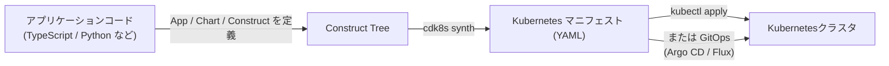
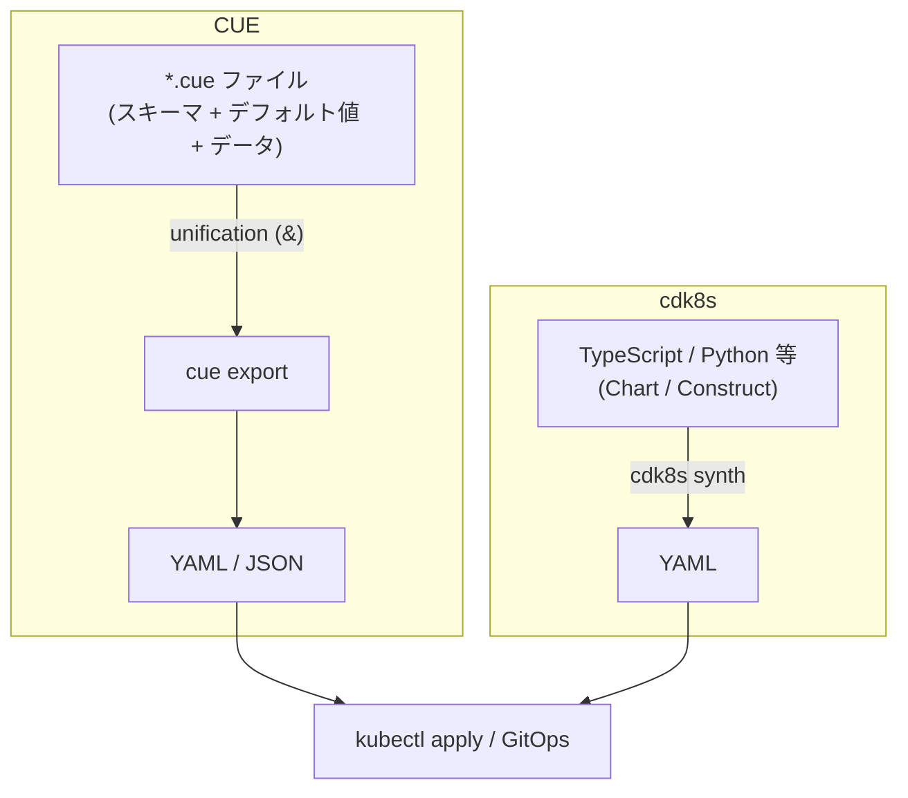

# cdk8s とは何か

## 概要

cdk8s（Cloud Development Kit for Kubernetes）は、TypeScript / Python / Java / Go / C# などの汎用プログラミング言語を使って Kubernetes マニフェスト（YAML）を生成するオープンソースフレームワークです。AWS CDK と同じ「constructs」というオブジェクトモデルを採用していますが、AWS への依存はなく Kubernetes 専用です。コードで書いたリソース定義を `cdk8s synth` コマンドで純粋な YAML に変換し、それを `kubectl apply` や GitOps ツール（Argo CD、Flux など）でクラスタに適用する、という流れになります。



cdk8s としばしば比較される技術に **CUE**（宣言的なデータ制約言語）があります。CUE は「スキーマ・デフォルト値・実データを同じ構文で統合（unification）して YAML/JSON を書き出す」というアプローチであり、cdk8s の「汎用プログラミング言語でマニフェストを組み立てる」アプローチとは根本的に異なります。



## 何が嬉しいのか

生の YAML や Helm のテンプレート（Go template を埋め込んだ YAML）で Kubernetes マニフェストを管理する場合、以下のような課題があります。

- 同じような Deployment / Service の定義をコピペで量産しがちで、DRY にしづらい
- Helm のテンプレート言語は文字列ベースのテンプレートなので、構文エラーや型の誤りが実行時（テンプレート展開時）まで分からない
- ループや条件分岐、関数化などの「プログラム的な抽象化」がやりづらい

cdk8s を使うと、これらを解消できます。

- **型安全性**: `cdk8s import` で Kubernetes API（core API や CRD）から型付きクラスを自動生成できるため、IDE の補完や型チェックの恩恵を受けられる（存在しないフィールド名を書けばコンパイル/型チェックの時点で気づける）
- **プログラム的な抽象化**: 「Deployment + Service + ConfigMap をセットで作る」といった共通パターンを、関数やクラス（高レベル Construct）としてまとめて再利用でき、npm パッケージ等として配布・共有もできる
- **既存のエコシステムをそのまま活用**: Jest や pytest といった通常のテストフレームワークでマニフェストのスナップショットテストやユニットテストが書ける

具体的なユースケースとしては、「同じマイクロサービスのマニフェストを環境（dev/stg/prod）ごとにパラメータだけ変えて大量生成したい」「チーム内で Deployment の命名規則やラベル付けルールを型で強制したい」といった場面で特に効果を発揮します。

一方 CUE は、cdk8s とは異なる課題を解決します。Helm や Kustomize で環境ごとにマニフェストを微妙に上書き・合成していくと、「どの値が最終的に採用されるか」が追いづらくなったり、意図しない上書きに気づけなかったりします。CUE は複数の設定ソースを **unification**（型理論の lattice に基づくマージ）で合成するため、値が衝突すると即座にエラーになります。「矛盾なく合成できる」ことが言語レベルで保証されるのが最大の利点で、スキーマ定義とバリデーションを同じ構文で自然に表現できます。

逆に CUE のような制約言語はチューリング完全ではないため、外部 API 呼び出しや複雑な条件分岐・繰り返し処理には向きません。cdk8s は汎用言語をそのまま使うため、「特定の条件でだけ Sidecar を追加する」「データベースから取得した値でリソース数を決める」といった任意のロジックを書け、Construct をクラス・関数として抽象化し npm/PyPI で配布・共有できる点が強みです。

## 詳細

### 主要な概念

- **App**: cdk8s アプリケーションのルートとなるオブジェクト。`synth()` を呼ぶとツリー全体がマニフェストとして書き出されます。
- **Chart**: 1 つ以上の Kubernetes リソースをまとめる単位で、`synth` すると（デフォルトでは）Chart ごとに 1 つの YAML ファイルが生成されます。Helm の「チャート」に近い概念ですが、Helm のようなリリース管理機能（`helm install/upgrade/rollback` のような state 管理）は cdk8s 自体には無く、あくまで「マニフェストを生成するだけ」のツールです。
- **Construct**: リソースやその組み合わせを表す最小単位のクラス。低レベルの Construct（生成された `KubeDeployment` などの API オブジェクト）を組み合わせて、より高レベルな独自 Construct を作ることができます。
- **cdk8s+ (cdk8s-plus)**: Deployment・Service などのよく使うリソースに対して、意味のあるデフォルト値と使いやすい API を提供する高レベルライブラリです。生成された低レベル API をそのまま使うよりも簡潔に書けます。

### 基本的な使い方（TypeScript の例）

```bash
# プロジェクトの初期化
cdk8s init typescript-app

# 依存する Kubernetes API から型付きクラスを生成（任意）
cdk8s import k8s
```

```typescript
import { App, Chart } from 'cdk8s';
import { Deployment } from 'cdk8s-plus-27';

class MyChart extends Chart {
  constructor(scope: Construct, id: string) {
    super(scope, id);

    new Deployment(this, 'web', {
      containers: [{ image: 'nginx' }],
      replicas: 3,
    });
  }
}

const app = new App();
new MyChart(app, 'my-chart');
app.synth(); // dist/ 配下に YAML が出力される
```

```bash
cdk8s synth
kubectl apply -f dist/
```

### cdk8s の注意点

- cdk8s はあくまで「マニフェスト生成」ツールであり、Helm のようなリリース管理（ロールバックやリビジョン管理）や、Kustomize のようなオーバーレイ/パッチの仕組みは持ちません。生成後の適用（apply）やロールバックは `kubectl` や Argo CD / Flux などの別ツールに任せる設計です。
- Helm チャートを流用したい場合は `cdk8s import` で既存の Helm チャートを Construct として取り込む機能もありますが、これは補助的な位置づけです（詳細な挙動はバージョンによって変わる可能性があるため、公式ドキュメントで最新の仕様を確認することを推奨します）。
- AWS CDK と名前・concepts（App / Chart(≒Stack) / Construct）が似ていますが、cdk8s は AWS 専用ではなく、素の Kubernetes クラスタ（EKS に限らず GKE や自前クラスタなど）で利用できます。

### CUE との比較

**CUE のコード例**

```cue
package k8s

#Deployment: {
	apiVersion: "apps/v1"
	kind:       "Deployment"
	metadata: name: string
	spec: {
		replicas: int | *3          // デフォルト値付きの制約
		selector: matchLabels: app: metadata.name
		template: {
			metadata: labels: app: metadata.name
			spec: containers: [{name: metadata.name, image: string}]
		}
	}
}

web: #Deployment & {                // unification でスキーマとデータを合成
	metadata: name: "web"
	spec: template: spec: containers: [{image: "nginx"}]
}
```

```bash
cue export . -e web --out yaml   # YAML を書き出す
cue vet .                        # スキーマ違反がないか検証のみ行う
```

**比較表**

| 観点 | CUE | cdk8s |
|---|---|---|
| パラダイム | 宣言的・データ制約言語 | 命令的・汎用プログラミング言語(TS/Python/Java/Go/C#) |
| スキーマとデータ | 同じ構文で統合(定義=バリデーション=テンプレート) | 型は `cdk8s import` で生成したクラス、ロジックは別途コードで記述 |
| 抽象化の手段 | 定義(`#Foo`)・comprehension・パッケージ | 関数・クラス・継承などOOP機能をフル活用、npm/PyPI で配布可 |
| 複雑なロジック(外部API呼び出し・条件分岐等) | 不得意(チューリング完全ではない) | 得意(任意のコードを書ける) |
| 決定性・安全性 | 高い(副作用なし、同じ入力なら常に同じ出力) | コード次第(外部呼び出し等をすると非決定的になりうる) |
| 環境差分の合成(dev/stg/prod) | unification が衝突を自動検出しながらマージするため得意 | 自前でマージ・上書きロジックを書く必要がある |
| テスト | `cue vet` / `cue eval` | Jest/pytest 等、使い慣れたテストフレームワークがそのまま使える |
| ランタイム依存 | 単一バイナリ(`cue` CLI)のみで完結 | Node.js/Python 等の言語ランタイム + パッケージマネージャが必要 |
| 学習コスト | unification・lattice など独自の概念が多く高め | 既に使い慣れた言語ならほぼゼロ |
| 主なエコシステム | [Timoni](https://timoni.sh/)(Helm 代替)、Dagger、Istio の一部設定 等 | cdk8s+、AWS CDK 系の Construct エコシステムと親和性が高い |

**どういうときに使うと良いか**

- **CUE が向いているケース**
  - プラットフォーム/SRE チームが「全チームの Deployment に resource limits を必須にする」「命名規則を強制する」など、ポリシーとしての制約を守らせたい場合(policy-as-code)
  - Kustomize のようにベース設定 + 環境ごとのオーバーレイを合成したいが、衝突を検出せず上書きされてしまう問題を避けたい場合
  - CI/CD パイプラインに任意コード実行のリスクを持ち込みたくない場合(CUE は副作用のない純粋なデータ言語なので安全)
  - 単一バイナリで完結させたい、言語ランタイムへの依存を増やしたくない場合

- **cdk8s が向いているケース**
  - アプリ開発チームが既に TypeScript/Python 等に習熟していて、マニフェストも「普段のコードの延長」として書きたい場合
  - 「Deployment + Service + ConfigMap をセットで作る」といった高レベル Construct をクラス/関数として抽象化し、社内ライブラリとして再利用・配布したい場合
  - 外部 API やデータソースを参照して動的にリソース数・設定値を決めるなど、複雑なロジックが必要な場合
  - IDE の補完・リファクタリング支援や、Jest/pytest など使い慣れたテストツールをそのまま活用したい場合

なお両者は排他的ではなく、「cdk8s や Helm でマニフェストを生成し、それを CUE でポリシー検証する(`cue vet`)」というようにハイブリッドで使う構成も実務では見られます。CUE のエコシステムやツールの発展は速いため、最新の使用感やベストプラクティスは公式ドキュメントで確認することを推奨します(この点は不確かです)。

## 参考リンク

- [cdk8s 公式サイト](https://cdk8s.io/)
- [cdk8s ドキュメント](https://cdk8s.io/docs/latest/)
- [cdk8s GitHub リポジトリ](https://github.com/cdk8s-team/cdk8s)
- [cdk8s+ (cdk8s-plus) ドキュメント](https://cdk8s.io/docs/latest/plus/)
- [CUE 公式サイト](https://cuelang.org/)
- [CUE ドキュメント](https://cuelang.org/docs/)
- [CUE GitHub リポジトリ](https://github.com/cue-lang/cue)
- [Timoni(CUE ベースの Kubernetes パッケージマネージャ)](https://timoni.sh/)
