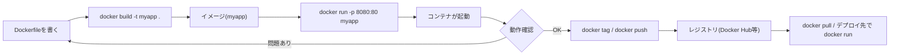

# docker build コマンドの役割とコンテナ開発の基本フロー

## 概要

`docker build` は、`Dockerfile` に書かれた手順を1行ずつ実行して**イメージ(Docker Image)を作成**するコマンドである。イメージは「アプリケーションの実行に必要なファイル・ライブラリ・設定を1つにパッケージした読み取り専用のテンプレート」であり、これをもとに `docker run` で実際に動く**コンテナ**を起動する。

典型的な開発フローは次のようになる。



## 何が嬉しいのか

`docker build` を使わず、都度サーバーに手作業でミドルウェアを入れたり設定したりしていると、次のような問題が起きる。

- 「自分のPCでは動くのに本番では動かない」という**環境差異**が発生しやすい
- 構築手順が個人の頭の中にしかなく、**再現性・引き継ぎが困難**
- デプロイのたびに手作業が発生し、**自動化(CI/CD)しづらい**

`Dockerfile` + `docker build` によってこれらを解決できる。

- 環境構築手順が**コード化**され、Git で差分管理・レビューできる
- `docker build` 一発で、**誰の環境でも・何回でも同じイメージ**が作れる
- 作ったイメージはレジストリに `push` して**そのまま本番にデプロイ**できる(開発環境と本番環境の一致)
- CI で `docker build` → テスト → `docker push` を自動化し、**デプロイパイプラインの一部**にできる

## 詳細

### `docker build` が内部でやっていること

1. 指定したビルドコンテキスト(通常はカレントディレクトリ)から `Dockerfile` を読み込む
2. `Dockerfile` の命令(`FROM`, `RUN`, `COPY` など)を1つずつ実行し、命令ごとに**レイヤー**を作成する
3. 変更がない命令は**キャッシュを再利用**して高速化する
4. すべてのレイヤーを積み重ねて、最終的に1つのイメージを生成する
5. `-t`(タグ)を指定していれば、そのイメージに名前とバージョンを付与する

`Dockerfile` の各命令自体の詳細な文法は本ノートの対象外だが、社内の関連ノート「Dockerfile の基本文法まとめ」(issue #8)にまとめられている。

```bash
# カレントディレクトリの Dockerfile を使って "myapp:latest" という名前でビルド
docker build -t myapp:latest .

# 別名の Dockerfile やビルド用引数を渡す場合
docker build -f Dockerfile.dev --build-arg NODE_ENV=development -t myapp:dev .
```

### `docker build` の後にやること(一連の開発フロー)

1. **イメージができたか確認**

   ```bash
   docker images
   ```

2. **ローカルでコンテナを起動して動作確認**

   ```bash
   docker run -p 8080:80 --name myapp-container myapp:latest
   ```

   - `-p ホスト側:コンテナ側` でポートを公開する
   - `-d` を付けるとバックグラウンド起動、`--rm` で終了時にコンテナを自動削除する
   - `-v ./src:/app/src` のようにホストのディレクトリをマウントすると、ビルドし直さずコード変更を反映できる(開発時によく使われる)

3. **動作確認・デバッグ**

   ```bash
   docker ps                      # 起動中のコンテナ一覧
   docker logs myapp-container    # ログ確認
   docker exec -it myapp-container sh   # コンテナ内に入って調査
   ```

4. **不要になったら停止・削除**

   ```bash
   docker stop myapp-container
   docker rm myapp-container
   ```

5. **他の環境で使う・デプロイする場合はレジストリに登録**

   ```bash
   docker tag myapp:latest yourname/myapp:latest
   docker push yourname/myapp:latest
   # デプロイ先では
   docker pull yourname/myapp:latest
   docker run yourname/myapp:latest
   ```

### 補足

- 複数コンテナ(アプリ + DB など)を組み合わせる場合は、毎回 `docker build` / `docker run` を手打ちする代わりに `docker compose up --build` を使うと、`docker-compose.yml` に書いた構成をまとめてビルド・起動できて便利である。
- コード変更のたびに毎回イメージを作り直すのは開発中は非効率なので、開発時はボリュームマウント(前述の `-v`)でホストのファイルをそのままコンテナに反映し、本番用イメージのビルドはリリース時だけ行う、という使い分けがよくされる。
- CI/CD パイプライン(GitHub Actions など)では、`git push` をトリガーに `docker build` → `docker push`(場合によってはテストやスキャンも挟む)→ 本番環境で `docker pull` & 再起動、という流れを自動化するのが一般的である。

## 参考リンク

- [docker build | Docker Docs](https://docs.docker.com/reference/cli/docker/build/)
- [docker run | Docker Docs](https://docs.docker.com/reference/cli/docker/container/run/)
- [Docker Compose overview | Docker Docs](https://docs.docker.com/compose/)
