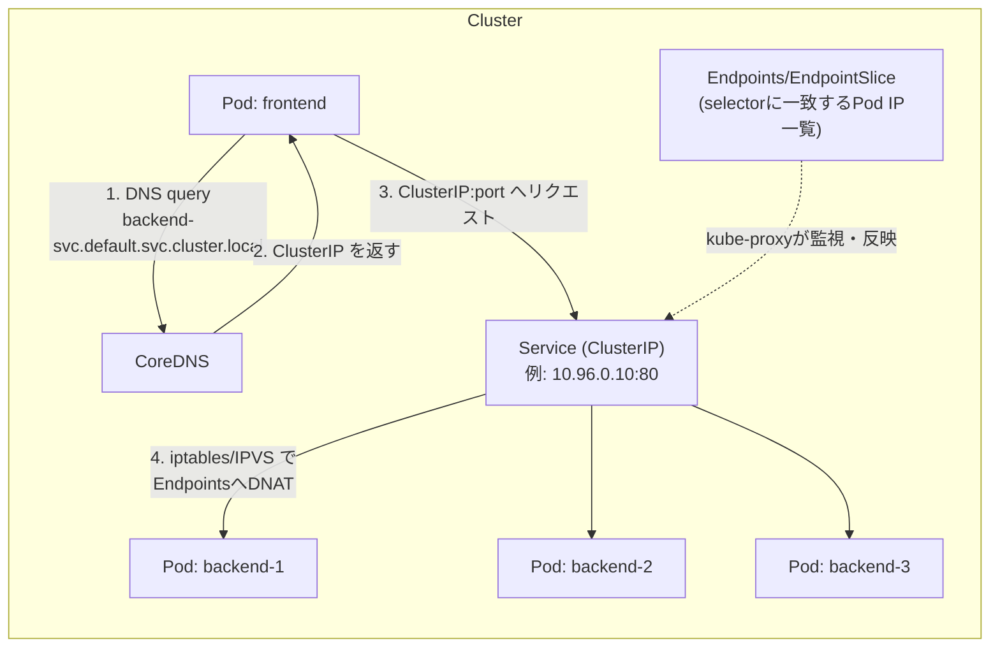
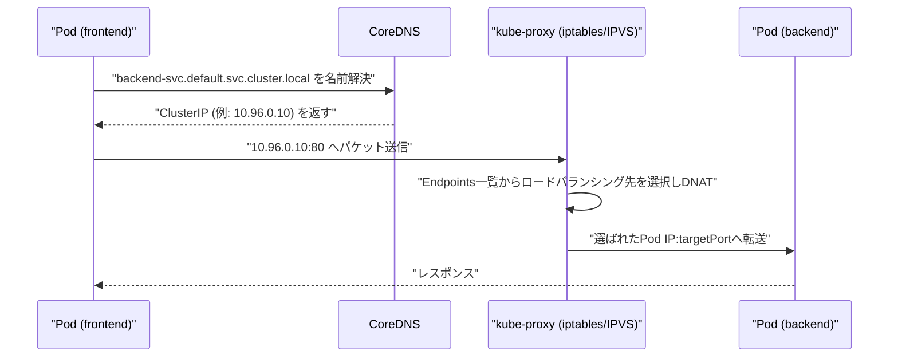

# ClusterIP Service を使ったサービス間通信の設定とその挙動

## 概要

ClusterIP は Kubernetes の Service タイプのデフォルトで、クラスタ内部からのみアクセス可能な**仮想 IP(VIP)**を Service に割り当てる仕組みです。この VIP は Pod の再作成や再スケジューリングで実 IP が変わっても変化しないため、他の Pod は Service 名(または VIP)を宛先にするだけで、背後にいる複数の Pod にロードバランシングされたリクエストを送れます。



## 何が嬉しいのか

Service を使わず Pod の IP を直接指定して通信すると、Pod が再起動・スケールするたびに宛先 IP が変わってしまい、呼び出し側で都度 IP を追跡する仕組みが必要になります。ClusterIP Service を挟むことで以下が解決されます。

- **宛先の安定化**: 呼び出し側は Service 名(DNS)や ClusterIP という不変のアドレスにアクセスすればよく、背後の Pod の生死やスケジューリング先を意識しなくてよい
- **負荷分散**: 複数レプリカの Pod へのリクエストが自動的に分散される(kube-proxy によるラウンドロビン/ランダム分散)
- **サービスディスカバリ**: CoreDNS により `<service名>.<namespace>.svc.cluster.local` という名前解決ができ、環境変数や設定ファイルにIPをハードコードする必要がない

典型的なユースケースは、フロントエンドの Pod がバックエンド API の Pod 群に対して `http://backend-svc/api/...` のようにアクセスするマイクロサービス間通信です。

## 詳細

### Service と Deployment の設定例

```yaml
apiVersion: apps/v1
kind: Deployment
metadata:
  name: backend
spec:
  replicas: 3
  selector:
    matchLabels:
      app: backend
  template:
    metadata:
      labels:
        app: backend   # ← Service の selector と一致させる
    spec:
      containers:
        - name: backend
          image: my-backend:latest
          ports:
            - containerPort: 8080   # targetPort と一致
---
apiVersion: v1
kind: Service
metadata:
  name: backend-svc
spec:
  type: ClusterIP        # 省略時のデフォルト
  selector:
    app: backend         # Deployment の Pod テンプレートの labels と一致させる
  ports:
    - port: 80           # Service自身が待ち受けるポート
      targetPort: 8080   # 転送先の Pod のポート(containerPortと一致させる)
```

### 挙動のポイント

- **selector によるひも付け**: Service は `selector` に一致する label を持つ Pod を自動的に見つけ、その IP:port の一覧を `Endpoints`(新しめの Kubernetes では `EndpointSlice`)というリソースとして保持する。Deployment 側の Pod テンプレートに設定する `labels` と、Service 側の `selector` が一致していないと Endpoints が空になり、通信できない(トラブルシューティングで最も多いミス)
- **port と targetPort**: `port` は Service(ClusterIP)自身が受け付けるポート、`targetPort` は転送先の Pod 側コンテナのポート。異なる値を設定でき、`targetPort` を省略すると `port` と同じ値になる
- **kube-proxy による実現方式**: 各ノードの kube-proxy が Endpoints の変化を監視し、iptables ルール(または IPVS、モードはクラスタ設定による)を書き換えて ClusterIP 宛のパケットを実際の Pod IP へ DNAT(宛先NAT)する。ロードバランシングは L4(TCP/UDP)レベルで行われ、L7(HTTPヘッダやパスベースなど)のルーティングはできない
- **DNS 名前解決**: CoreDNS が `<service名>.<namespace>.svc.cluster.local` という FQDN を ClusterIP に解決する。同一 namespace 内であれば `backend-svc` だけでも解決可能
- **クラスタ外からはアクセス不可**: ClusterIP はクラスタ内部のみで疎通する VIP のため、外部公開が必要な場合は `NodePort` や `LoadBalancer` タイプ、あるいは `Ingress` と組み合わせる
- **Headless Service との違い**: `spec.clusterIP: None` を指定すると VIP を持たない Headless Service になり、DNS 問い合わせに対して Pod の IP を直接複数返す(StatefulSet で個々の Pod に到達したい場合などに利用)
- **セッションアフィニティ**: デフォルトは無設定(リクエストごとに分散)だが、`spec.sessionAffinity: ClientIP` を設定すると同一クライアントIPからのリクエストを同じ Pod に固定できる

### 通信の流れ(シーケンス)



## 参考リンク

- [Service | Kubernetes](https://kubernetes.io/docs/concepts/services-networking/service/)
- [Connecting Applications with Services | Kubernetes](https://kubernetes.io/docs/tutorials/services/connect-applications-service/)
- [DNS for Services and Pods | Kubernetes](https://kubernetes.io/docs/concepts/services-networking/dns-pod-service/)
- [EndpointSlices | Kubernetes](https://kubernetes.io/docs/concepts/services-networking/endpoint-slices/)
