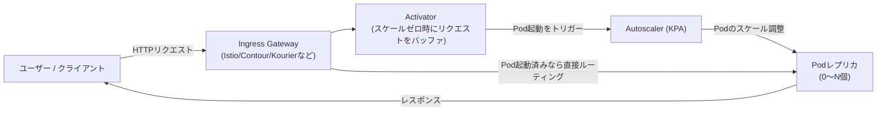

# Knative とは何か(Serving / Eventing の仕組み)

## 概要

Knative は、Kubernetes 上でサーバーレス的なワークロード（コンテナベースのアプリケーション）を動かすためのプラットフォームです。主に **Knative Serving**（リクエストに応じたスケーリング、スケールtoゼロを含むデプロイ管理）と **Knative Eventing**（イベント駆動アーキテクチャの構築）という 2 つの主要コンポーネントから構成されます。

Knative Serving のリクエスト処理の流れは以下のようになります。



リクエストが来ていない間は Pod 数が 0 まで縮小され（スケールtoゼロ）、リクエストが来ると Activator がそれを検知して Pod を起動し、Autoscaler が負荷に応じてレプリカ数を調整します。

## 何が嬉しいのか

素の Kubernetes（Deployment + Service + HPA）だけでこれを実現しようとすると、以下のような課題があります。

- **スケールtoゼロができない**: 標準の HPA は最小レプリカ数 1 以上を前提としており、アイドル時にリソースを完全にゼロにできない（コストがかかり続ける）
- **リクエスト量に応じた自動スケーリングの設定が煩雑**: メトリクス収集・しきい値設計・Pod 起動までの遅延吸収などを自前で構築する必要がある
- **トラフィック分割やカナリアリリースの実装が面倒**: Deployment を複数用意して Service の重み付けを手動で管理する必要がある

Knative を使うと、YAML 1 つで「リクエストがあれば自動でスケールし、なければゼロまで縮小する」アプリケーションを宣言的に定義でき、Google Cloud Run のような PaaS 的な使い勝手を自前の Kubernetes クラスタ上で実現できます。ユースケースとしては、アクセス頻度が低い社内 API や、突発的なトラフィックが来る Webhook 受信エンドポイントなどで、リソースコストを抑えつつスケーラビリティを確保したい場合に有効です。

## 詳細

### Knative Serving

`Service` という CRD を作成するだけで、Revision（デプロイの各バージョン）・Route（トラフィックルーティング）・Configuration（デプロイ設定の履歴管理）が自動的に作られます。

```yaml
apiVersion: serving.knative.dev/v1
kind: Service
metadata:
  name: hello-world
spec:
  template:
    spec:
      containers:
        - image: gcr.io/knative-samples/helloworld-go
          env:
            - name: TARGET
              value: "World"
```

これを `kubectl apply` するだけで、Knative がリビジョン管理・オートスケーリング・ルーティングを面倒見てくれます。トラフィックの一部を新リビジョンに流すカナリアリリースも `spec.traffic` フィールドで簡単に設定できます。

主なオートスケーラーは KPA（Knative Pod Autoscaler）で、同時リクエスト数（concurrency）ベースでスケールします。HPA ベースのオートスケーリングに切り替えることも可能です。

### Knative Eventing

Pub/Sub 型のイベント駆動アーキテクチャを構築するためのコンポーネントで、`Broker` / `Trigger` / `Source` といった CRD を使い、イベントソース（Pub/Sub、Kafka、GitHub Webhook など）からイベントを受け取り、条件に応じて特定のサービスにルーティングできます。

### 注意点

- Knative は Istio・Contour・Kourier などの Ingress/Networking レイヤーに依存するため、導入時にどのネットワークレイヤーを使うか選定が必要
- スケールtoゼロからの初回リクエストにはコールドスタートの遅延が発生する（min-scale を 1 以上に設定することで回避可能だが、その分常時コストがかかる）
- マネージドサービスとしては Google Cloud Run が Knative をベースにしているため、思想を理解しておくと Cloud Run の挙動理解にも役立つ

## 参考リンク

- [Knative 公式サイト](https://knative.dev/)
- [Knative Serving 公式ドキュメント](https://knative.dev/docs/serving/)
- [Knative Eventing 公式ドキュメント](https://knative.dev/docs/eventing/)
- [Knative Autoscaling 公式ドキュメント](https://knative.dev/docs/serving/autoscaling/)
