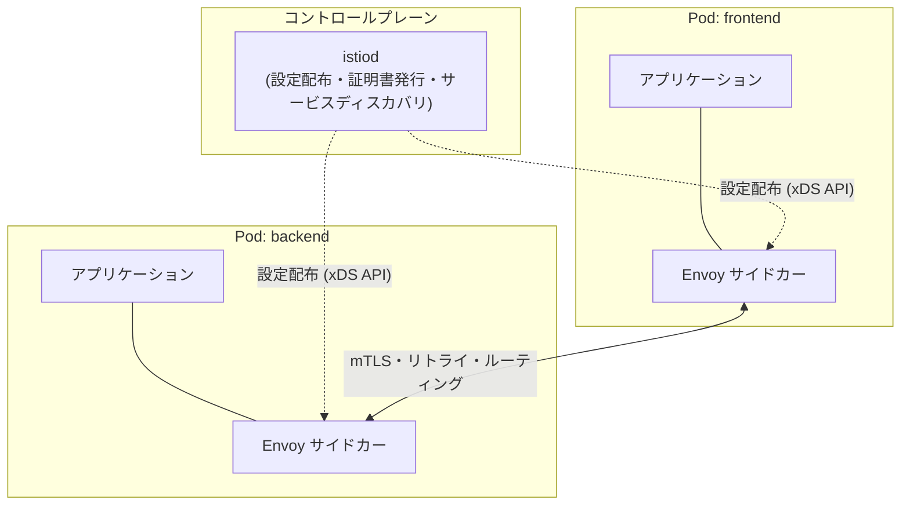
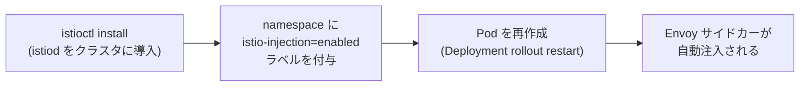
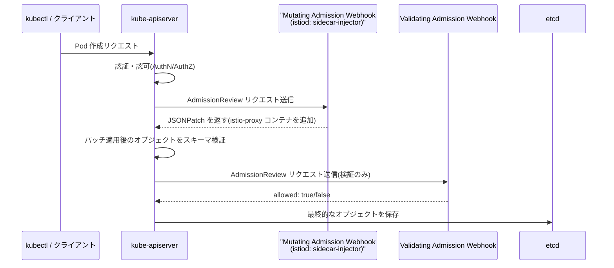
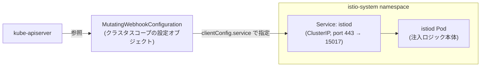
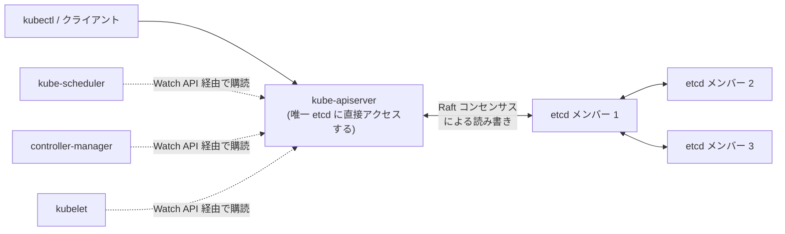
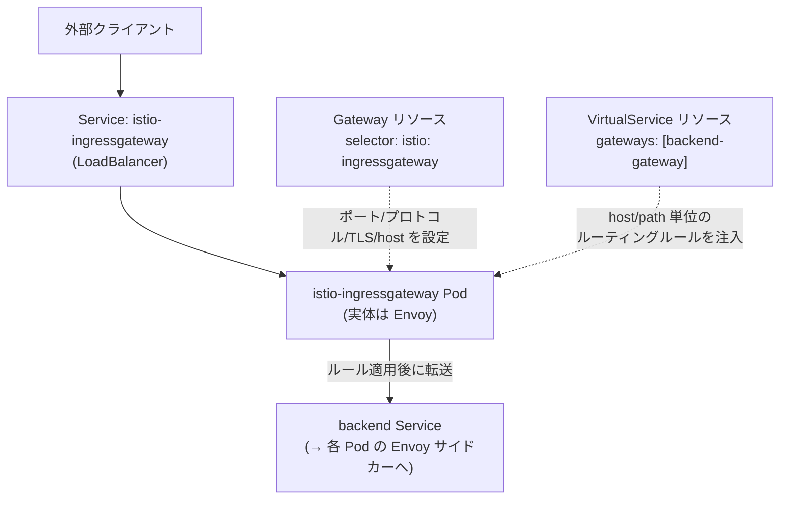

# Istio とは何か(サービスメッシュの仕組みと導入メリット)

## 概要

Istio は Kubernetes などのクラスタ上で動くマイクロサービス群に対して、**サービスメッシュ**(サービス間通信を横断的に制御するインフラ層)を提供するオープンソースプロダクトです。各 Pod にアプリケーションと並走する **Envoy サイドカープロキシ**を自動注入し、そのプロキシ群を **istiod** という単一のコントロールプレーンが一括管理します。アプリケーションコードを変更することなく、通信の可視化・トラフィック制御・セキュリティ(mTLS)をサービスメッシュ全体に対して一貫して適用できるのが特徴です。



実際の通信はすべて各 Pod 内の Envoy サイドカー同士でやり取りされ、アプリケーションはそれを意識せずに通常通り Service 経由で通信するだけで済みます。

## 何が嬉しいのか

Istio がない場合、リトライ・タイムアウト・サーキットブレーカー・mTLS 通信・分散トレーシングといった「サービス間通信に共通する横断的関心事」を、各サービスがそれぞれの言語・フレームワークのライブラリで個別に実装する必要があります。マイクロサービスが多言語・多チームで開発されていると、この実装が揃わずポリシーがバラバラになったり、ライブラリのアップデートをサービスごとに追従する必要が出てきたりします。

Istio を導入すると、これらの機能をアプリケーションコードの外側(インフラ層のサイドカー)に切り出せるため、次のようなことが宣言的な設定だけで実現できます。

- **トラフィック管理**: 特定バージョンへのトラフィックの重み付けルーティング(カナリアリリース、A/B テスト)、自動リトライ・タイムアウト・サーキットブレーカー、障害注入によるカオスエンジニアリング的なテストなど、アプリ側のコード変更なしに実現できる
- **セキュリティ**: サービス間通信を自動的に mTLS 化し、証明書の発行・ローテーションも istiod が肩代わりする。ゼロトラストなネットワークを、各サービスに TLS 実装を組み込まずに実現できる
- **可観測性**: すべてのサービス間通信がサイドカーを経由するため、レイテンシ・トラフィック量・エラー率などのゴールデンメトリクスや分散トレーシングの情報をアプリの計装なしに自動収集できる(Kiali によるサービス依存関係の可視化も可能)

具体的なユースケースとしては、「新バージョンのバックエンドに 5% だけトラフィックを流してカナリアリリースしたい」「Go・Java・Python が混在するマイクロサービス間の通信をすべて mTLS で暗号化したい(ゼロトラスト要件)」「どのサービス間でレイテンシが劣化しているかをサービスごとの計装なしに把握したい」といった場面が挙げられます。

さらに、Istio 自体のサイドカー自動注入は Kubernetes の **Mutating Admission Webhook** という汎用の拡張機構の上に実現されています。この仕組みがあることで、マニフェストを書く側が意識しなくても、クラスタ側で自動的に Pod 定義へサイドカーコンテナを補完できるという利点があります(詳細は後述)。

## 詳細

### アーキテクチャ

Istio は大きく 2 層で構成されます。

- **データプレーン**: 各 Pod に自動注入される Envoy サイドカープロキシ。iptables のルール書き換えにより、Pod 宛・Pod 発のトラフィックはすべて透過的にこのサイドカーを経由する
- **コントロールプレーン(istiod)**: サービスディスカバリ、ルーティング設定の配布(Envoy の xDS API 経由)、証明書の発行・配布(旧 Citadel の機能)を一元的に担う

サイドカー注入は、namespace に `istio-injection=enabled` ラベルを付けておくと、Pod 作成時に Mutating Admission Webhook が自動でコンテナを追加する仕組みです(仕組みの詳細は後述)。

### 主な CRD(設定リソース)

| リソース | 役割 |
|---|---|
| `VirtualService` | リクエストのルーティングルール(パスベース・ヘッダベースのルーティング、トラフィックの重み付け分割など) |
| `DestinationRule` | ルーティング先のサブセット定義、ロードバランシングポリシー、サーキットブレーカー設定 |
| `Gateway` | メッシュ外からのトラフィックを受け付けるエッジプロキシの設定 |
| `PeerAuthentication` | サービス間の mTLS の要求レベル(STRICT / PERMISSIVE など)を設定 |
| `AuthorizationPolicy` | サービス単位・メソッド単位の認可ポリシー(誰がどのサービスにアクセスできるか) |
| `ServiceEntry` | メッシュ外部のサービスをメッシュ内から名前解決・制御可能にする |

カナリアリリースの設定例(`backend` の v1 に 90%、v2 に 10% トラフィックを流す):

```yaml
apiVersion: networking.istio.io/v1
kind: VirtualService
metadata:
  name: backend
spec:
  hosts:
    - backend
  http:
    - route:
        - destination:
            host: backend
            subset: v1
          weight: 90
        - destination:
            host: backend
            subset: v2
          weight: 10
---
apiVersion: networking.istio.io/v1
kind: DestinationRule
metadata:
  name: backend
spec:
  host: backend
  subsets:
    - name: v1
      labels:
        version: v1
    - name: v2
      labels:
        version: v2
```

### Istio を有効化する具体的な手順

有効化は大きく **(1) コントロールプレーンのインストール** と **(2) namespace 単位でのサイドカー自動注入の有効化** の 2 ステップです。



#### 1. istioctl でコントロールプレーンをインストール

[istioctl](https://istio.io/latest/docs/setup/getting-started/#download) を使ってクラスタに istiod をインストールします。プロファイル(用途に応じた設定セット)を指定するのが一般的です。

```bash
# istioctl のダウンロード
curl -L https://istio.io/downloadIstio | sh -
cd istio-*
export PATH=$PWD/bin:$PATH

# demo プロファイルでインストール(学習・検証向け。Ingress/Egress Gateway 込み)
istioctl install --set profile=demo -y

# 本番向けには default や minimal プロファイルを使うことが多い
# istioctl install --set profile=default -y
```

| プロファイル | 用途 |
|---|---|
| `demo` | 学習・検証用。全コンポーネント込みで手軽に試せる |
| `default` | 本番想定の標準構成 |
| `minimal` | istiod のみ。Gateway 等は別途インストール |
| `ambient` | サイドカー不要の Ambient Mesh モード |

インストール後は以下で正しく導入できたか確認できます。

```bash
istioctl verify-install
kubectl get pods -n istio-system
```

#### 2. namespace にサイドカー自動注入を有効化するラベルを付与

Istio 自体をインストールしただけでは、既存の Pod にはサイドカーは注入されません。namespace にラベルを付けることで、そこに作成される Pod に対して Mutating Admission Webhook が自動でサイドカーを注入するようになります。

```bash
kubectl label namespace default istio-injection=enabled
```

すでに動いている Pod にはこのラベルは遡って適用されないため、Deployment を再起動してサイドカー入りの Pod を再作成する必要があります。

```bash
kubectl rollout restart deployment -n default
```

サイドカーが注入されると、Pod のコンテナ数が 1 → 2(アプリ + `istio-proxy`)になります。

```bash
kubectl get pods -n default
# NAME                     READY   STATUS
# backend-6b7f9c9c8-abcde  2/2     Running   ← READY が 2/2 になっていればサイドカー注入済み
```

#### 3. (任意) mTLS を有効化する

namespace 全体のサービス間通信を mTLS 必須にする場合は `PeerAuthentication` を適用します。

```yaml
apiVersion: security.istio.io/v1
kind: PeerAuthentication
metadata:
  name: default
  namespace: default
spec:
  mtls:
    mode: STRICT
```

#### 4. (任意) メッシュ外部からのアクセスを許可する

Ingress Gateway 経由で外部公開する場合は `Gateway` と `VirtualService` を組み合わせます(両者の関係性は後述)。

```yaml
apiVersion: networking.istio.io/v1
kind: Gateway
metadata:
  name: backend-gateway
spec:
  selector:
    istio: ingressgateway
  servers:
    - port:
        number: 80
        name: http
        protocol: HTTP
      hosts:
        - "backend.example.com"
---
apiVersion: networking.istio.io/v1
kind: VirtualService
metadata:
  name: backend
spec:
  hosts:
    - "backend.example.com"
  gateways:
    - backend-gateway
  http:
    - route:
        - destination:
            host: backend
            port:
              number: 80
```

設定ミスは `istioctl analyze -n default` で不整合(存在しない Gateway を参照している、mTLS 設定の矛盾など)を検出できます。

補足として、Helm でのインストール(`istio-base` / `istiod` / `gateway` チャート)も公式にサポートされており GitOps 運用と相性が良い点、サイドカー注入は Pod 単位でも `sidecar.istio.io/inject: "false"` アノテーションで個別に無効化できる点、Ambient Mode を使う場合は namespace に `istio.io/dataplane-mode=ambient` ラベルを付ける形になり上記手順とは異なる点が挙げられます。

### サイドカー注入の仕組み: Mutating Admission Webhook

Kubernetes の API サーバは、リソース(Pod など)が etcd に保存される前に「admission control」という検証・変更フェーズを通します。**Mutating Admission Webhook** はこのフェーズで動く拡張機構の一つで、リクエストされたオブジェクト(例: Pod の定義)を外部の Webhook サーバに問い合わせて書き換える(mutate する)ための仕組みです。Istio のサイドカー自動注入はこの仕組みで実現されています。



Mutating Admission Webhook がないと、「Pod にサイドカーコンテナを追加する」「特定ラベルがない Pod を拒否する」といった横断的な処理を、各チームがマニフェストを書く際に手動で反映する必要があります。Webhook を使えば、マニフェストを書いた人が意識しなくても、クラスタ側で自動的にオブジェクトを補完・変更できます。Istio 以外にも、デフォルトのリソースリミットの注入や特定ラベル・アノテーションの自動付与、Pod のセキュリティコンテキストの強制上書きなどに広く使われる汎用機構です。

Mutating Admission Webhook は `MutatingWebhookConfiguration` という CRD として登録します。

```yaml
apiVersion: admissionregistration.k8s.io/v1
kind: MutatingWebhookConfiguration
metadata:
  name: istio-sidecar-injector
webhooks:
  - name: sidecar-injector.istio.io
    clientConfig:
      service:
        name: istiod
        namespace: istio-system
        path: "/inject"
      caBundle: <Base64 エンコードされた CA 証明書>
    rules:
      - apiGroups: [""]
        apiVersions: ["v1"]
        operations: ["CREATE"]
        resources: ["pods"]
    namespaceSelector:
      matchLabels:
        istio-injection: enabled
    failurePolicy: Fail
    sideEffects: None
    admissionReviewVersions: ["v1"]
```

- `rules`: どの API グループ・リソース・操作(CREATE/UPDATE など)を対象にするか
- `clientConfig`: 実際に呼び出す Webhook サーバの場所(Service 経由、または外部 URL)。TLS 通信のため `caBundle` が必要
- `namespaceSelector` / `objectSelector`: 対象を特定の namespace やラベルを持つオブジェクトに絞り込む(Istio はこれで `istio-injection=enabled` の namespace だけに限定している)
- `failurePolicy`: Webhook がエラーになった場合にリクエストを失敗させるか(`Fail`)、無視して通すか(`Ignore`)

API サーバは Webhook サーバに `AdmissionReview` オブジェクトを POST し、Webhook サーバは以下のようなレスポンスを返します。

```json
{
  "apiVersion": "admission.k8s.io/v1",
  "kind": "AdmissionReview",
  "response": {
    "uid": "<リクエストの UID>",
    "allowed": true,
    "patchType": "JSONPatch",
    "patch": "<Base64 エンコードされた JSON Patch>"
  }
}
```

`patch` フィールドには [JSON Patch](https://datatracker.ietf.org/doc/html/rfc6902) 形式の差分が入っており、これが元のオブジェクトに適用されます。Istio の場合、ここに `istio-proxy` コンテナや `initContainers`、ボリュームマウントなどを追加する patch が入っています。

Validating Admission Webhook との違いは次の通りです。

| | Mutating | Validating |
|---|---|---|
| 役割 | オブジェクトを変更できる | 許可/拒否のみ(変更不可) |
| 実行順序 | 先に実行される | Mutating の後、かつ全ての Mutating 完了後の最終オブジェクトに対して実行 |
| Istio の例 | サイドカー注入(`istiod`) | `PeerAuthentication` などのポリシー検証 |

実行順序が「Mutating → Validating」なのは、変更が全て確定した最終形のオブジェクトに対して検証を行うためです。

**Webhook サーバの実体**は、専用の別プロセスではなく **`istiod` 自身**が兼ねています。`istio-system` namespace で動く `istiod` Pod が、kube-apiserver からの `AdmissionReview` リクエストを受け付ける HTTPS エンドポイントを内部に持っています。`MutatingWebhookConfiguration` 自体は namespace に属さない**クラスタスコープのリソース**で、その中の `clientConfig.service` フィールドが呼び出し先(`istio-system` namespace の `istiod` Service、内部的には 15017 番ポートなど)を指定しています。



```bash
# クラスタスコープの Webhook 設定を確認(namespace 指定不要)
kubectl get mutatingwebhookconfigurations istio-sidecar-injector -o yaml

# 実体である istiod Pod / Service の場所を確認
kubectl get pods -n istio-system -l app=istiod
kubectl get svc istiod -n istio-system
```

`caBundle` は自己署名 CA の証明書で、API サーバが `istiod` に HTTPS で安全に接続するために使われ、この証明書の発行・ローテーションも `istiod` 自身が担っています。つまり「Webhook サーバがダウンする」ことは「`istiod` Pod が落ちる」ことを意味し、`failurePolicy: Fail` の場合は新規 Pod 作成そのものが失敗する点に注意が必要です。

注意点として、複数の Mutating Webhook が登録されている場合、**同じ Webhook 内のルールの評価順は保証されるが、異なる Webhook 間の実行順序は保証されない**ため、互いに干渉する変更を書かないよう注意が必要です。`kubectl get mutatingwebhookconfigurations` で、クラスタに登録されている Mutating Webhook の一覧を確認できます。

### 関連コンポーネント: etcd

**etcd** は Kubernetes がクラスタの状態(Pod・Service・ConfigMap など全リソースの定義や現在の状態)を保存するために使っている、分散 key-value ストアです。Mutating Admission Webhook でパッチが適用された後、最終的なオブジェクトが保存される先がこの etcd にあたり、Kubernetes における「唯一の正データ(single source of truth)」を持つコンポーネントです。



Kubernetes のコントロールプレーン(kube-apiserver、scheduler、controller-manager)は基本的にステートレスに設計されており、状態そのものは持たず、全員が etcd を介して状態を読み書きします。これにより、コントロールプレーンの各コンポーネントを複数台に冗長化しても状態の一貫性が保てる(etcd 自体が Raft によって強整合性を保証する)ほか、「あるべき状態(Desired State)」と「現在の状態」の差分を各コントローラが継続的に監視・調整する宣言的な運用モデル(コントローラは etcd の変更を Watch API で購読し、差分があれば調整処理を行う)が成立します。kube-apiserver 以外のコンポーネントは etcd に直接アクセスしない設計になっており、アクセス制御・スキーマ検証の窓口を一本化できます。

Istio の文脈で言うと、Mutating Admission Webhook が Pod オブジェクトに `istio-proxy` コンテナを注入する patch を返した後、kube-apiserver はその最終形のオブジェクトを etcd に書き込みます。以降 kubelet はその etcd 上の(=API サーバ経由で取得した)Pod 定義を見て、実際にサイドカーコンテナを起動します。つまり etcd は「サイドカーが注入された」という事実が永続化される場所です。

特徴・運用上の注意点:

- Raft コンセンサスアルゴリズムを使った分散合意により、複数ノード(通常 3 台または 5 台の奇数台)で強整合性のあるレプリケーションを実現している
- CoreOS(現 Red Hat)が開発した OSS で、Kubernetes 以外にも汎用の分散 KVS として使われる
- Watch API(特定のキーやプレフィックスへの変更をストリームで購読できる)が、Kubernetes の「変更検知 → 調整ループ(reconciliation loop)」モデルを支えている
- クラスタの心臓部であり、失われるとクラスタの状態が丸ごと失われるため、定期的なスナップショットバックアップ(`etcdctl snapshot save` など)が必須
- ディスク I/O のレイテンシに敏感で、遅いストレージ上で動かすと Raft の合意形成が遅延しクラスタ全体の応答性が悪化する(公式には SSD 推奨)
- 台数は奇数(3, 5 など)が推奨される。過半数のメンバーが生きていればクラスタは機能し続けられるため、偶数台にしても耐障害性のメリットがない
- マネージド Kubernetes(GKE、EKS など)ではクラウド事業者が etcd を管理しており、ユーザーが直接触ることはほとんどない。自前で構築する kubeadm クラスタなどでは運用者が etcd のバックアップ・アップグレードを意識する必要がある

### Gateway / Ingress Gateway / VirtualService の関係性

3 つは役割のレイヤーが異なり、組み合わさって「外部からメッシュ内サービスへのルーティング」を実現します。

- **Ingress Gateway**: メッシュの入口に立つ、実体としての Envoy プロキシ(Pod/Service)。デフォルトインストールでは `istio-system` namespace に `istio-ingressgateway` という Deployment/Service として存在する
- **Gateway (CRD)**: その Ingress Gateway の待受ポート・プロトコル・TLS 設定を宣言する設定リソース(L4〜L6 の設定)
- **VirtualService**: Gateway を通過したトラフィックをどのホスト・パスでどの Service にルーティングするかを決める設定リソース(L7 の設定)



この 3 層に分かれていることで、「どのポートを開けるか」と「どうルーティングするか」を別々の担当・タイミングで管理できます。例えば TLS 証明書やポート開放はインフラ担当が `Gateway` 1 つを管理し、各サービスのパスルーティングはアプリチームがそれぞれ `VirtualService` を追加していく、という分業が可能です。これは Kubernetes 標準の `Ingress` リソースが 1 つのオブジェクトに両方の関心事を詰め込んでいるのと対照的で、Istio では同じ `Gateway` に対して複数チームが別々の `VirtualService` を追加する形で、より柔軟に構成できます。

`istioctl install` すると、`istio-system` namespace に以下のようなリソースが作られます。

```bash
kubectl get deployment,svc -n istio-system -l app=istio-ingressgateway
# istio-ingressgateway という Deployment と Service (type: LoadBalancer)
```

このプロキシは通常のサイドカーとは違い、特定のアプリケーション Pod に紐付かない、メッシュの入口専用の Envoy です。ラベル `istio: ingressgateway` を持っており、`Gateway` リソースはこのラベルを `selector` で指定して「どの Envoy インスタンスに対する設定か」を紐付けます。`Gateway` はポート・プロトコル・待受ホストのみを定義し、受け付けたリクエストをどこに転送するかは `VirtualService` の `spec.gateways` で `Gateway` の名前を指定することで決まります。

補足として、`VirtualService` は `spec.gateways` を省略する(またはデフォルト値 `mesh` を指定する)と、メッシュ内部のサービス間通信(各サイドカー間)にも適用できます。つまり同じ `VirtualService` という仕組みが「外部からの入口(Gateway 経由)」と「サービス間通信(サイドカー間)」の両方のルーティング定義に再利用されています。

まとめの対応表:

| リソース | 何を定義するか | 対応するレイヤー | 実体 |
|---|---|---|---|
| Ingress Gateway | (リソースではなく実体)Envoy プロキシ | データプレーン | `istio-ingressgateway` Pod/Service |
| `Gateway` | ポート・プロトコル・TLS・待受ホスト | L4〜L6 | Ingress Gateway の Envoy に listener 設定として適用される |
| `VirtualService` | ホスト/パス単位のルーティング・リトライ等 | L7 | Gateway 経由 or メッシュ内部両方に適用可能 |

### 注意点

- **リソースオーバーヘッド**: すべての Pod にサイドカーコンテナが追加されるため、CPU/メモリ使用量とレイテンシがわずかに増加する。Pod 数が非常に多いクラスタでは無視できないコストになる
- **運用の複雑さ**: istiod 自体のアップグレード、証明書のローテーション、サイドカーのバージョン管理など、メッシュ自体の運用コストが発生する
- **Ambient Mode**: 上記のサイドカーのオーバーヘッドや運用負荷を軽減するため、比較的新しい **Ambient Mesh**(ノードレベルの `ztunnel` で L4 処理を担い、サイドカーを不要にするモード)も提供されている。用途によってはこちらの検討も有効
- 小規模なシステムや、サービス間通信がシンプルな場合は、Istio 導入によるオーバーヘッドが導入メリットを上回ることもあるため、サービスメッシュが本当に必要かは規模・要件に応じて見極める必要がある

## 参考リンク

- [What is Istio? | Istio公式ドキュメント](https://istio.io/latest/docs/concepts/what-is-istio/)
- [Istio Traffic Management | Istio公式ドキュメント](https://istio.io/latest/docs/concepts/traffic-management/)
- [Istio Security | Istio公式ドキュメント](https://istio.io/latest/docs/concepts/security/)
- [Istio Observability | Istio公式ドキュメント](https://istio.io/latest/docs/concepts/observability/)
- [Istio Ambient Mesh | Istio公式ドキュメント](https://istio.io/latest/docs/ambient/overview/)
- [Istio Install with Istioctl | Istio公式ドキュメント](https://istio.io/latest/docs/setup/install/istioctl/)
- [Installation Configuration Profiles | Istio公式ドキュメント](https://istio.io/latest/docs/setup/additional-setup/config-profiles/)
- [Automatic Sidecar Injection | Istio公式ドキュメント](https://istio.io/latest/docs/setup/additional-setup/sidecar-injection/#automatic-sidecar-injection)
- [Mutual TLS Migration | Istio公式ドキュメント](https://istio.io/latest/docs/tasks/security/authentication/mtls-migration/)
- [Dynamic Admission Control | Kubernetes公式ドキュメント](https://kubernetes.io/docs/reference/access-authn-authz/extensible-admission-controllers/)
- [A Guide to Kubernetes Admission Controllers | Kubernetes Blog](https://kubernetes.io/blog/2019/03/21/a-guide-to-kubernetes-admission-controllers/)
- [Istio Architecture | Istio公式ドキュメント](https://istio.io/latest/docs/ops/deployment/architecture/)
- [etcd 公式サイト](https://etcd.io/)
- [Operating etcd clusters for Kubernetes | Kubernetes公式ドキュメント](https://kubernetes.io/docs/tasks/administer-cluster/configure-upgrade-etcd/)
- [Kubernetes Components | Kubernetes公式ドキュメント](https://kubernetes.io/docs/concepts/overview/components/#etcd)
- [Istio / Gateway | Istio公式ドキュメント](https://istio.io/latest/docs/reference/config/networking/gateway/)
- [Istio / VirtualService | Istio公式ドキュメント](https://istio.io/latest/docs/reference/config/networking/virtual-service/)
- [Configuring Ingress using an Istio Gateway | Istio公式ドキュメント](https://istio.io/latest/docs/tasks/traffic-management/ingress/ingress-control/)
