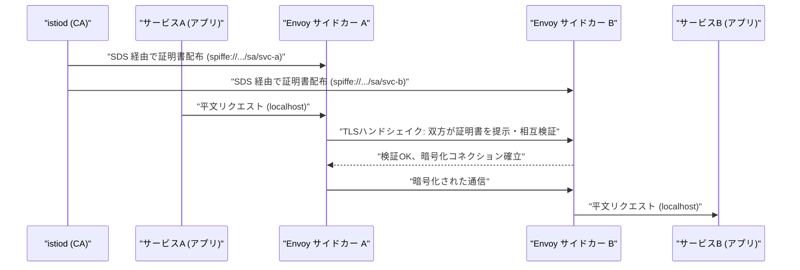
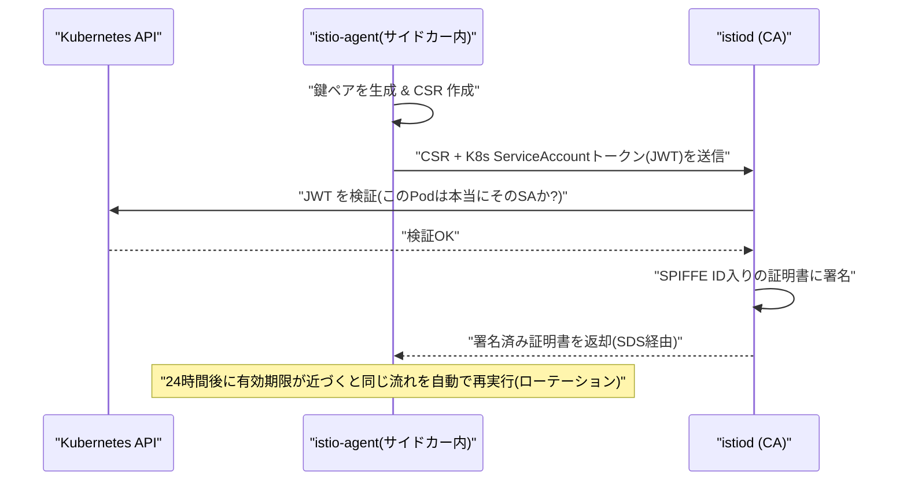
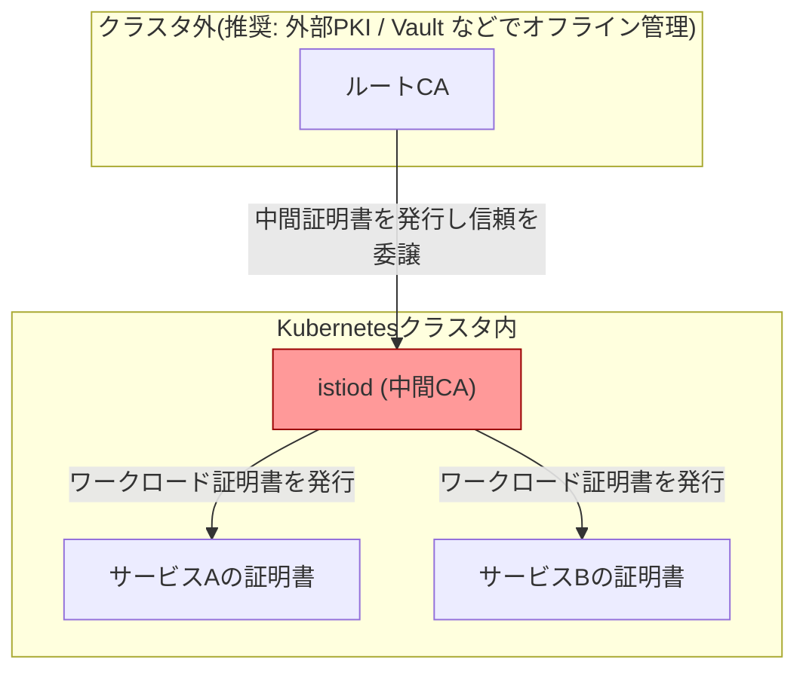

# Istio における相互TLS(mTLS)認証の仕組み

## 概要

**相互TLS認証(mTLS: mutual TLS)** とは、通常の TLS が「クライアントがサーバーの証明書を検証してサーバーだけを認証する」のに対し、**クライアントとサーバーの双方が互いに証明書を提示し合い、双方向で相手の身元を検証する**方式です。Istio はこれを Kubernetes 上のサービス間通信に対して透過的に実現しており、各 Pod に自動注入される Envoy サイドカーが証明書の発行・配布・ローテーションをアプリケーションの代わりに行います。アプリケーションコードは TLS を一切意識せず、サイドカー同士が裏側で mTLS 通信を行います。



## 何が嬉しいのか

通常の(片方向)TLS はサーバーの身元しか保証しないため、マイクロサービス環境で「このリクエストは本当にサービスAから来たのか」を確認できません。ネットワークレベルでは IP アドレスや Pod がなりすまされる可能性もあり、サービス間の通信を暗号化・認証しようとすると、本来は各サービスがそれぞれの言語で証明書管理・TLS実装をしなければなりません。

Istio の mTLS を使うと、次のようなことがアプリケーションコードの変更なしに実現できます。

- **通信の暗号化**: サービス間トラフィックが自動的に暗号化され、盗聴・改ざんを防げる
- **サービスの身元(アイデンティティ)による認証**: IP ではなく Kubernetes ServiceAccount に紐づいた暗号学的な身元(SPIFFE ID)で「誰が話しかけてきたか」を検証できる
- **証明書のライフサイクル管理からの解放**: 証明書の発行・ローテーション(デフォルト24時間)を istiod が自動で行うため、各チームが証明書管理を実装・運用する必要がない
- **段階的移行**: `PERMISSIVE` モードにより、既存の平文通信を止めずに mTLS 対応サービスを混在させながら移行できる

具体的なユースケースとしては、「ゼロトラストネットワークとして、クラスタ内部であってもすべてのサービス間通信を暗号化・認証したい」「PCI-DSS などのコンプライアンス要件で通信の暗号化を証明する必要がある」「Go・Java・Python が混在する環境で、言語ごとに TLS ライブラリを実装せずに済ませたい」といった場面が挙げられます。

## 詳細

### 証明書の発行と配布

- istiod 内の CA(旧 Citadel)がルート/中間 CA として機能し、各ワークロードに **X.509 証明書** を発行します
- 証明書の identity は SPIFFE 形式(`spiffe://<trust-domain>/ns/<namespace>/sa/<service-account>`)で表現され、Pod がどの ServiceAccount で動いているかに基づきます
- 証明書はディスクに保存されず、**SDS(Secret Discovery Service)** という xDS プロトコルの一種で Envoy サイドカーにメモリ上で配布されます
- 有効期限はデフォルト24時間と短く、期限が近づくと istiod が自動的に再発行(ローテーション)します

### 通信の流れ

1. アプリケーションは自分の Pod 内の Envoy サイドカーに対して平文(localhost)でリクエストを送る
2. 送信側 Envoy が宛先の Envoy との間で TLS ハンドシェイクを行い、**双方が証明書を提示し合い相互に検証**する
3. 検証が成功すると暗号化コネクションが確立し、Pod 間の実際の通信はすべて暗号化される
4. 受信側 Envoy が復号し、平文で自分の Pod 内アプリケーションに渡す

### 設定方法

mTLS を強制するかどうかは `PeerAuthentication` リソースで設定します。

```yaml
apiVersion: security.istio.io/v1
kind: PeerAuthentication
metadata:
  name: default
  namespace: istio-system  # メッシュ全体に適用する場合
spec:
  mtls:
    mode: STRICT  # STRICT / PERMISSIVE / DISABLE
```

- `STRICT`: mTLS 通信のみ受け付ける
- `PERMISSIVE`: mTLS・平文の両方を受け付ける(既存サービスからの移行期間向け)
- `DISABLE`: mTLS を無効化する

クライアント側の挙動は `DestinationRule` の `trafficPolicy.tls.mode: ISTIO_MUTUAL` で制御されますが、Istio の自動 mTLS(auto mTLS)機能により、サイドカーが両側に存在する場合は基本的に明示設定なしで自動的に mTLS 化されます。

### 注意点

- サイドカーが注入されていない Pod(例: サイドカーインジェクションを無効化した Pod)は mTLS の対象外になるため、意図せず平文通信が発生する可能性がある
- サイドカー間の mTLS はあくまで**トランスポート層の認証・暗号化**であり、「誰がどのサービスにアクセスしてよいか」という認可(アクセス制御)は別途 `AuthorizationPolicy` で検証済みの identity(SPIFFE ID)をもとに設定する必要がある
- メッシュ外部(Ingress Gateway 経由の外部クライアントなど)との通信は別の TLS 設定(Gateway 側の証明書)が必要で、mTLS の話とは区別して考える必要がある

### 証明書発行はどこまで自動化されているか

証明書の発行(CSR作成・署名・配布・更新)はすべて Istio が自動で行い、人間が手動で申請・更新する作業は基本的に発生しません。

通常の証明書運用(例: Web サーバーに Let's Encrypt や社内 CA の証明書を入れるケース)では、一般的に次の作業が必要です。

1. 秘密鍵を生成する
2. CSR(証明書署名要求)を作成する
3. CA に CSR を提出し、ドメイン所有権などを証明する
4. CA が署名した証明書を受け取り、サーバーに配置する
5. 有効期限が切れる前に、上記を手動またはcron等のジョブで繰り返す(更新)

Istio では、この一連の流れをすべて **istiod(組み込みの CA)と各 Pod の istio-agent(サイドカーの一部)が自動で行います。**



- **身元確認の代わりに Kubernetes ServiceAccount を使う**: 通常の TLS ではドメイン所有権の証明(例: ACME の HTTP-01/DNS-01 チャレンジ)が必要ですが、Istio では Pod にマウントされた ServiceAccount の JWT トークンを istiod に提示するだけで身元確認が完結します。ドメイン検証のような手動ステップは不要です
- **鍵はディスクに出ない**: 秘密鍵は istio-agent がメモリ上で生成し、外部に送信されるのは公開鍵を含む CSR のみです。秘密鍵自体は CA にも渡りません
- **有効期限は短く(デフォルト24時間)、更新は自動**: 期限が近づくと istio-agent が自動的に新しい鍵ペア・CSR を作成し直し、再度上記のフローを実行します
- **istiod 自体のルート証明書もインストール時に自動生成**: デフォルトでは istiod がインストール時に自己署名のルート CA を自動で用意します。ただし、組織の PKI に組み込みたい場合(社内ルート CA の配下に置きたい、cert-manager や HashiCorp Vault と連携したい等)は、既存の中間証明書・ルート証明書を istiod に持ち込んで置き換えることも可能です。この「ルートCAの差し替え」だけは運用者が意図的に設定する部分で、それ以外(個々のワークロード証明書の発行・配布・更新)は完全に自動です

つまり、「アプリケーション/サービスごとの証明書」に関しては発行から更新まで完全に自動化されていて、人間が関与するのは(必要であれば)信頼の起点となるルート CA をどうするか、という設計判断だけです。

### クラスタ内にCAが存在することのセキュリティ上の懸念

istiod がメッシュ全体の「信頼の起点(Root of Trust)」を担うため、istiod 自体や CA 秘密鍵が侵害された場合の被害範囲は、通常のワークロード1つが侵害されるケースとは質的に異なります。

**懸念となる理由**

- istiod の CA 秘密鍵が漏洩すると、攻撃者は**任意の SPIFFE ID(=任意のサービスのアイデンティティ)を騙る証明書を自己発行**できてしまいます。つまり「サービスAになりすましてサービスBと通信する」といった攻撃が、メッシュ内のどのサービスに対しても可能になります。これは1つのワークロードの秘密鍵が漏れる被害とは比べものにならない大きさです
- istiod は Kubernetes API server への読み取りアクセス(ServiceAccount の JWT 検証など)を持つため、istiod 自体・そのアクセス権限も攻撃対象になります
- デフォルト構成では、istiod がインストール時に**自己署名のルートCAをクラスタ内で自動生成・保持**します。つまり「信頼の起点(ルート鍵)」自体もクラスタ内に閉じているのが既定の状態で、一般的なPKI運用(ルートCAはオフラインで厳重に隔離管理する)とは異なります

**Istio が用意している緩和策**

1. **ルート/中間CAの外部化(Plug-in CA)**: istiod に自己署名ルートを使わせず、社内PKIや HashiCorp Vault、cert-manager などで発行した中間証明書を持ち込むことができます。ルート鍵自体をクラスタ外(オフライン管理やHSMなど)に置いておけば、たとえ istiod が侵害されても攻撃者が奪えるのは「中間CA」の権限までに限定でき、外部PKI側でその中間証明書を失効させれば被害を封じ込められます
2. **istiod へのアクセス制御**: `istio-system` namespace や istiod の Pod・Secret へのアクセスは、通常の Kubernetes RBAC / NetworkPolicy で厳格に絞る必要があります。istiod は「他のワークロードPodと同列」ではなく「メッシュ全体の鍵を握るコンポーネント」として特別に保護すべき対象です
3. **証明書の有効期間を短くする(デフォルト24時間)**: これはワークロード証明書の秘密鍵が漏れた場合の被害期間を限定する対策であり、**CA秘密鍵自体の漏洩には効果がない**点に注意が必要です(ローテーションが速くても、CA鍵が漏れていれば攻撃者はいくらでも新しい証明書を発行できるため)
4. **監査・監視**: istiod の証明書発行ログや Kubernetes 監査ログを有効化し、想定外の SPIFFE ID への署名など異常な挙動を検知できるようにします
5. **マルチテナント環境での trust domain 分離**: 1つのクラスタに複数チーム・テナントが同居する場合、CA を共有すると「1つのCA侵害が全テナントに波及する」強い結合が生まれます。テナントごとに trust domain を分ける、あるいはクラスタ自体を分離するという選択肢もあります



istiod が侵害されても、被害を「中間CAの権限範囲」に限定し、外部側で中間証明書を失効(revoke)させて封じ込められるのが、ルートCAを外部化する最大のメリットです。

「k8sクラスタ内にCAが存在する」こと自体は Istio に限らずサービスメッシュ共通の設計思想(各アプリに証明書管理を任せるより、信頼された中央のCAに集約したほうが結果的に安全、という前提)ですが、その中央CAが**単一障害点(信頼の単一障害点)**になるのは事実です。デフォルト構成(自己署名ルートCAをクラスタ内に置く)は開発・検証用途では手軽ですが、本番運用では istiod の CA 鍵をどう保護するか(ルートCAの外部化)、istiod へのアクセスをどう制限するかを明示的に設計することが推奨されます。

## 参考リンク

- [Istio - Security](https://istio.io/latest/docs/concepts/security/)
- [Istio - Mutual TLS Migration](https://istio.io/latest/docs/tasks/security/authentication/mtls-migration/)
- [Istio - PeerAuthentication](https://istio.io/latest/docs/reference/config/security/peer_authentication/)
- [Istio - Security Architecture (Certificate provisioning / PKI)](https://istio.io/latest/docs/concepts/security/#pki)
- [Istio - Plugging in CA Certificates](https://istio.io/latest/docs/tasks/security/cert-management/plugin-ca-cert/)
