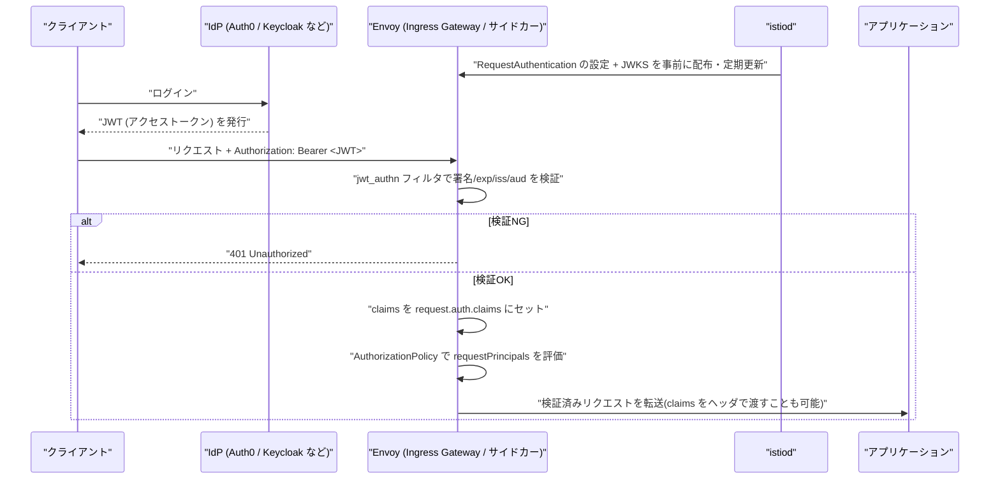
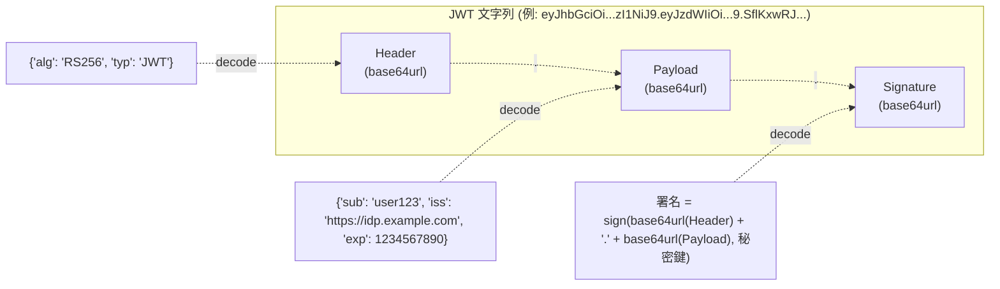

# Istio における JWT 検証(RequestAuthentication)の仕組みと必要になる箇所

## 概要

JWT (JSON Web Token) は、当事者間で安全にクレーム(claim、情報)をやり取りするためのコンパクトなトークン形式を定めた標準(RFC 7519)です。「認証済みユーザーが誰か」「どんな権限を持つか」といった情報を JSON で表現し、電子署名によって改ざんを検知できるようにしています。

Istio のサービスメッシュでは、この JWT の検証を **`RequestAuthentication`** リソースで設定し、実際の検証処理は Envoy サイドカー(または Ingress Gateway)に組み込まれた **`jwt_authn` フィルタ**が行います。リクエストの `Authorization: Bearer <token>` ヘッダなどから JWT を取り出し、発行者(issuer)の JWKS(公開鍵セット)を使って署名・有効期限・issuer・audience を検証します。

なお、mTLS(`PeerAuthentication`)が「どのワークロード(サービス)からの通信か」を証明書で検証するのに対し、JWT 検証(`RequestAuthentication`)は「そのリクエストの背後にいる**エンドユーザーやクライアントが誰か**」をトークンで検証するものであり、両者はレイヤーの異なる別の認証です。



JWT は `.`(ピリオド)区切りの Header・Payload・Signature の 3 パートからなる 1 本の文字列です。



## 何が嬉しいのか

### JWT 自体の利点

従来型のセッション認証(サーバー側でセッション ID を発行し、DB やインメモリストアにセッション情報を保持する方式)と比べて、JWT には以下の利点があります。

- **ステートレス**: トークン自体にクレームが埋め込まれているため、サーバー側でセッションストアを持たなくても検証だけで「誰か」「何の権限か」が分かる。水平スケールしたサーバー群やマイクロサービス間で共有ストアなしに認証情報を扱える
- **自己完結(self-contained)**: トークンを見るだけで issuer・有効期限・ユーザー情報などが分かるため、都度 DB に問い合わせる必要がない
- **ドメイン・システムをまたいだ連携がしやすい**: OAuth2/OIDC のアクセストークンや ID トークンとして広く使われており、IdP(認証サーバー)と複数の API サーバー間でユーザー情報を安全に受け渡せる

一方で「一度発行したトークンをサーバー側の判断だけで即座に無効化する」のはセッション方式より苦手なので、万能というわけではありません(詳細は後述の注意点を参照)。

### Istio に検証を寄せる利点

本来 JWT の検証(署名検証・有効期限チェック・issuer/audience チェック)は各サービスのアプリケーションコードが自前で実装する必要があり、言語やフレームワークごとにライブラリの選定・鍵のローテーション対応・実装ミスによる脆弱性のリスクが発生します。Istio に検証を寄せることで、以下が実現します。

- **アプリケーションコードの認証ロジックからの解放**: サービス側は「認証済みであること」「`request.auth.claims` に入った claims」を前提にビジネスロジックだけ書けばよく、JWT ライブラリの実装・脆弱性修正から解放される
- **メッシュ全体で一貫したポリシー**: 「このパスは特定の issuer の JWT が必須」「特定の claim(role など)を持つリクエストのみ許可」といったルールを、各サービスではなく Istio の設定で一元管理できる
- **JWKS 鍵ローテーションの自動追従**: istiod が `jwksUri` を定期的にフェッチし直すため、IdP 側で署名鍵をローテーションしてもアプリ側の対応が不要
- **多段防御(zero trust)**: mTLS で「サービス間の通信」を保証しつつ、JWT で「その通信の背後にいるユーザー・クライアント」を別途保証できる。片方だけでは「正規のサービス経由だが実は誰でもアクセスできてしまう」「JWT は正しいが経路が信頼できない」といった穴を防げる

具体的なユースケースとしては、「外部公開している API に対して、モバイルアプリ / SPA からの OAuth2 アクセストークンをアプリ側で検証せずゲートウェイで弾きたい」「マイクロサービス間でユーザーコンテキスト(誰の代理でリクエストしているか)を伝搬・検証したい」「マルチテナント SaaS で、テナントごとに異なる IdP / issuer を許可したい」などが挙げられます。

## 詳細

### JWT の中身

- **Header**: 署名アルゴリズム(`alg`)やトークン種別(`typ`)などのメタ情報
- **Payload**: 実際のデータ本体。「クレーム(claim)」と呼ばれる key-value の集合
- **Signature**: Header と Payload を秘密鍵(または公開鍵ペアの秘密鍵側)で署名した値。改ざん検知に使う

RFC で定義されている代表的な registered claims は以下の通りです。

| クレーム | 意味 |
|---|---|
| `iss` (issuer) | 発行者 |
| `sub` (subject) | トークンの主体(通常はユーザー ID) |
| `aud` (audience) | 想定される受信者(API の識別子など) |
| `exp` (expiration time) | 有効期限(UNIX タイムスタンプ) |
| `iat` (issued at) | 発行日時 |
| `nbf` (not before) | この時刻より前は無効 |

これに加えて、アプリ独自の private claims(例: `role`, `email` など)を自由に追加できます。

Header と Payload は base64url でエンコードされているだけで、暗号化はされていません。誰でもデコードして中身を読めるため、パスワードやクレジットカード番号などの機微情報を Payload に入れてはいけません。改ざんされていないことを保証するのは Signature の役割であり、内容を秘匿する役割ではありません(秘匿したい場合は JWE = JSON Web Encryption という別の仕様を使います。通常「JWT」と言った場合は署名のみの JWS = JSON Web Signature 形式を指すことがほとんどです)。

### 署名アルゴリズムと JWKS

- **対称鍵方式(HS256 など)**: 発行者と検証者が同じ秘密鍵を共有し、HMAC で署名・検証する。鍵を知っている全員が署名も検証もできてしまうため、鍵を持つのは信頼できる少数のサーバーに限定する必要がある
- **非対称鍵方式(RS256, ES256 など)**: 発行者が秘密鍵で署名し、検証者は公開鍵で検証する。公開鍵は誰にでも配ってよく、検証側は署名を作れない(≒「なりすまし」ができない)ため、IdP と複数の API サーバーが連携する構成(Istio の `jwksUri` のケース)では非対称鍵方式が主流

**JWKS (JSON Web Key Set)** は、この公開鍵(や鍵のセット)を JSON で配布するための仕様で、鍵のローテーションに対応するため通常 `kid`(key ID)で複数の鍵を識別できるようになっています。

### JWT 検証の流れ

1. Header と Payload を base64url デコードし、Header の `alg` を確認する
2. Header + Payload に対して、指定された鍵で Signature を検証する(改ざんされていないか)
3. `exp`(有効期限切れでないか)、`nbf`、`iss`(想定した発行者か)、`aud`(自分宛てのトークンか)などのクレームを検証する

3 の「クレームの検証」を怠ると、有効期限切れのトークンや、別のサービス向けに発行されたトークンを誤って受け入れてしまう事故につながります。

### JWT 自体の注意点・落とし穴

- **無効化(revoke)が難しい**: JWT は自己完結型で検証にサーバー側の状態を必要としないのが利点である反面、「発行済みトークンを今すぐ失効させたい」(ログアウト、権限剥奪など)という要求と相性が悪い。対策として、有効期限を短く設定して定期的にリフレッシュトークンで再発行する、あるいはブラックリストを別途管理するなどの工夫が必要
- **`alg: none` 攻撃**: 一部の古い実装で、Header の `alg` を `none` に書き換えると署名検証がスキップされてしまう脆弱性が過去に存在した。ライブラリ側で許可するアルゴリズムを明示的に固定することが重要
- **機微情報を Payload に入れない**(前述の通り、暗号化されていないため)

### Istio における RequestAuthentication の設定例

```yaml
apiVersion: security.istio.io/v1
kind: RequestAuthentication
metadata:
  name: jwt-example
  namespace: default
spec:
  selector:
    matchLabels:
      app: my-api
  jwtRules:
    - issuer: "https://my-idp.example.com/"
      jwksUri: "https://my-idp.example.com/.well-known/jwks.json"
      audiences:
        - "my-api"
      forwardOriginalToken: true
```

- `issuer` / `jwksUri`: JWT の `iss` クレームと、署名検証に使う公開鍵セット(JWKS)の取得先
- `audiences`: `aud` クレームの許可リスト
- `forwardOriginalToken`: 検証後も元の JWT をそのままアプリケーションに転送するか

### 重要な注意点: RequestAuthentication だけでは「拒否」しない

`RequestAuthentication` は「JWT が付いていれば検証する」設定であり、**JWT が付いていないリクエストや検証に失敗したリクエストを拒否するのは `AuthorizationPolicy` の役割**です。これを組み合わせないと「不正な JWT は弾けるが、JWT を一切付けないリクエストはそのまま通ってしまう」という事故が起きがちです。

```yaml
apiVersion: security.istio.io/v1
kind: AuthorizationPolicy
metadata:
  name: require-jwt
  namespace: default
spec:
  selector:
    matchLabels:
      app: my-api
  action: ALLOW
  rules:
    - from:
        - source:
            requestPrincipals: ["https://my-idp.example.com/*"]
```

`requestPrincipals` は `<issuer>/<subject>` の形式で、`RequestAuthentication` の検証を通過した JWT にのみ設定される特別なプリンシパルです。

### JWT 検証が必要になる箇所

1. **Ingress Gateway**: 外部クライアント(ブラウザ・モバイルアプリなど)からメッシュに入ってくる最初の入口。ここで OAuth2/OIDC のアクセストークンを検証しておけば、メッシュ内部のサービスは「すでに認証済み」という前提で動ける
2. **各サービスのサイドカー(内部サービス間)**: ゼロトラストの考え方では、Ingress で一度検証しただけでその後は無条件に信頼するのではなく、内部の各ホップでも(転送されてきた)JWT を再度検証したい場合がある。特に「サービスAは信頼するがサービスAの背後にいるユーザーの権限まではサービスAに任せたくない」ケースで有効
3. **マルチテナント / 複数 IdP 環境**: `jwtRules` は配列で複数指定できるため、テナントや API バージョンごとに異なる issuer の JWT を同じサービスで受け付けたい場合に設定する

### Istio 固有の注意点

- JWT 検証はあくまで「トークンの真正性(誰が発行し、改ざんされていないか)」を確認するものであり、**認可(誰が何をしてよいか)は別途 `AuthorizationPolicy` の `when` 条件などで claims を見て判定する必要がある**
- `jwksUri` への到達性(ネットワークポリシーやファイアウォール)が必要。外部 IdP に到達できないクラスタでは JWKS をローカルファイルとして埋め込む(`jwks` フィールド)方式もあるが、鍵ローテーション時に手動更新が必要になる
- mTLS(PeerAuthentication)と JWT 検証(RequestAuthentication)は独立した設定であり、両方を併用するのが一般的なゼロトラスト構成である(mTLS はワークロード間認証、JWT 検証はエンドユーザー/クライアント認証という補完関係)

## 参考リンク

- [Istio - Authentication Overview](https://istio.io/latest/docs/concepts/security/#authentication)
- [Istio - RequestAuthentication](https://istio.io/latest/docs/reference/config/security/request_authentication/)
- [Istio - AuthorizationPolicy](https://istio.io/latest/docs/reference/config/security/authorization-policy/)
- [Istio - JWT authentication task](https://istio.io/latest/docs/tasks/security/authentication/authn-policy/#end-user-authentication)
- [RFC 7519 - JSON Web Token (JWT)](https://datatracker.ietf.org/doc/html/rfc7519)
- [jwt.io - JWT Debugger](https://jwt.io/)
- [Auth0 - JSON Web Tokens 入門](https://auth0.com/docs/secure/tokens/json-web-tokens)
- [MDN - JSON Web Token (JWT)](https://developer.mozilla.org/ja/docs/Glossary/JWT)
