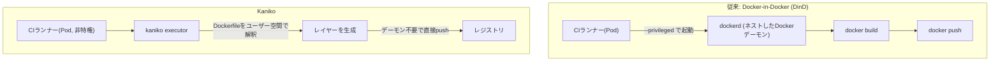
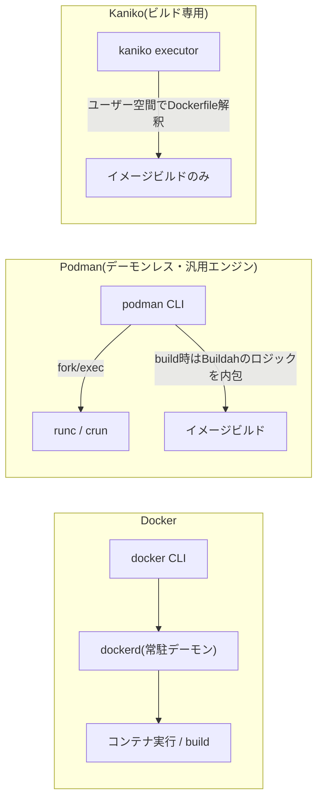
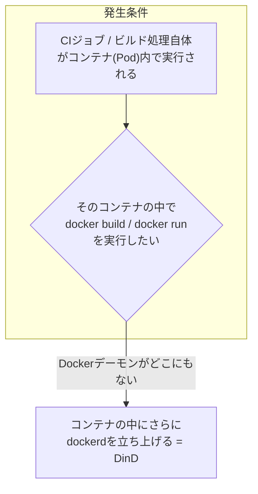

# Kaniko とは何か(Docker デーモン不要のコンテナイメージビルド)

## 概要

Kaniko は Google が OSS として公開しているツールで、**Docker デーモンに依存せずに Dockerfile からコンテナイメージをビルドし、レジストリに push できる**のが最大の特徴です。CI 環境(特に Kubernetes 上の CI/CD)でよく使われます。

通常の `docker build` は Docker デーモン(dockerd)にビルド処理を依頼しますが、Kaniko はそれ自体がコンテナ内で動くバイナリで、Dockerfile の各命令をユーザー空間で解釈・実行し、レイヤーを作ってそのままレジストリに push します。



## 何が嬉しいのか

CI で `docker build` を行う場合、素朴には「CI ランナーのコンテナの中で、さらに Docker デーモンを動かす(Docker-in-Docker, DinD)」という構成が必要になります。これには次のような問題があります。

- DinD を動かすには **`--privileged` フラグ**(特権コンテナ)が必要になることが多く、コンテナエスケープのリスクが高まる
- 特に **Kubernetes 上の CI(GitLab Runner on K8s, Tekton, Argo Workflows など)** では、Pod に特権を与えることはセキュリティポリシー上禁止・制限されているケースが多い
- ネストした Docker デーモンはキャッシュの効きが悪かったり、リソース管理(ストレージドライバの相性など)が複雑になりがち

Kaniko はデーモンを一切使わず、**非特権(unprivileged)のコンテナ・Pod の中だけでビルドが完結する**ため、上記の問題を回避できます。

**具体的なユースケース:**

- Kubernetes 上で動く CI/CD パイプライン(Tekton, Argo Workflows, GitLab Runner の Kubernetes Executor など)で、特権コンテナを許可したくない場合
- マルチテナントな CI 基盤で、ビルドジョブごとに強い分離を保ちたい場合
- Google Cloud Build のカスタムビルドステップなど、GCP のマネージドビルド環境と親和性が高い構成

## 詳細

### 仕組み

1. `gcr.io/kaniko-project/executor` イメージを、ビルド対象の Dockerfile と build context(ソースコードなど)をマウントした状態で起動する
2. kaniko executor が Dockerfile を1命令ずつ読み、ベースイメージを取得してファイルシステムを展開
3. 各命令(`RUN`, `COPY` など)を実行するたびに**ファイルシステムのスナップショットを取り**、変更差分から新しいレイヤーを作成(`docker build` がデーモン内でやっていることをユーザー空間で再現するイメージ)
4. 全レイヤーが揃ったら、Docker デーモンを介さず**直接レジストリの API を呼んで push**

### 使い方の例(Kubernetes Pod として実行)

```yaml
apiVersion: v1
kind: Pod
metadata:
  name: kaniko-build
spec:
  containers:
    - name: kaniko
      image: gcr.io/kaniko-project/executor:latest
      args:
        - "--dockerfile=Dockerfile"
        - "--context=git://github.com/example/repo.git"
        - "--destination=myregistry.example.com/myapp:latest"
      volumeMounts:
        - name: docker-config
          mountPath: /kaniko/.docker/
  restartPolicy: Never
  volumes:
    - name: docker-config
      secret:
        secretName: regcred
        items:
          - key: .dockerconfigjson
            path: config.json
```

- `--context` にはローカルディレクトリ、Git リポジトリ、GCS/S3 のアーカイブなどが指定可能
- レジストリの認証情報は `/kaniko/.docker/config.json` に置く(Kubernetes Secret から渡すのが一般的)
- `securityContext` に `privileged: true` は不要

### 注意点

- **ビルド速度・キャッシュ**: `--cache=true` でレイヤーキャッシュをレジストリ経由で使えるが、BuildKit のような高度なキャッシュマウント(`RUN --mount=type=cache`)の対応は限定的
- **開発状況(不確かな情報)**: 2023 年頃に GoogleContainerTools 側から「メンテナンスモード(新機能追加は行わず重大なバグ・セキュリティ修正のみ)」に移行する旨のアナウンスがあったと記憶しているが、現在の正確なメンテナンス方針は変わっている可能性がある。採用前に [GitHub リポジトリ](https://github.com/GoogleContainerTools/kaniko) の README や Issue で最新状況を確認することを推奨する
- **代替手段**: 同じ「デーモン不要でイメージビルド」を実現する選択肢として `buildah`、rootless モードの `BuildKit`(`docker buildx` の裏側)、Cloud Native Buildpacks などもあり、CI 基盤やチームの要件に応じて比較検討すると良い

### Podman との違い

Podman も「Docker デーモンに依存しない」という同じ方向性の課題を解決するツールだが、**守備範囲と実現方法が Kaniko とは異なる**。



**共通点**

- どちらも中央集権的な root 権限デーモン(dockerd 相当)を持たないアーキテクチャで、Docker が抱える「特権デーモンへの依存」という課題を解決しようとしている点は同じ
- Podman もデフォルトで **rootless(非 root ユーザーでの実行)** をサポートしており、`--privileged` なしでコンテナ操作ができるという点は Kaniko の狙いと重なる

**違い**

- **守備範囲が異なる**: Podman は `docker` コマンドの drop-in 代替を目指す**汎用コンテナエンジン**で、コンテナの実行・管理・イメージビルド(`podman build`、内部的には Buildah のロジックを使用)まで一通りこなす。一方 Kaniko は**イメージビルドと push だけ**に特化したツール
- **アーキテクチャ**: Podman はデーモンを持たず、CLI が直接子プロセスとして `runc`/`crun` を fork/exec する方式。Kaniko はそもそも「コンテナランタイムを操作する」のではなく、Dockerfile の命令をユーザー空間で解釈してファイルシステムのスナップショットを取るという、全く別のアプローチでイメージを作る
- **Kubernetes CI での実用性**: Podman の rootless 実行は user namespace・`fuse-overlayfs`・cgroup v2 まわりの設定が必要で、すでにコンテナ化された CI ランナー(Pod)の中でさらに Podman を動かす(いわば "Podman-in-Podman")構成は、DinD ほどではないものの依然として権限・デバイスマウントの考慮が必要になることが多い。Kaniko は最初から「Pod の中でビルドだけを完結させる」ことに全振りしているため、この用途では設定がよりシンプルになりやすい

**直接の比較対象は Buildah**

Kaniko と目的がほぼ一致するのは、Podman 本体よりも **Buildah**(イメージビルド専用ツールで、`podman build` の内部でも使われている)である。Buildah・Kaniko はともに「ビルド専用・デーモン不要」という位置づけで、Podman は「実行も含めた Docker 代替」という一段広いレイヤーのツール、と整理すると理解しやすい。

### DinD(Docker-in-Docker)がどのような時に発生するか

DinD は、**「Docker コマンドを使いたい処理自体が、すでにコンテナの中で動いている」**という状況で発生する。



**典型的に発生するシーン**

1. **CI/CD のジョブランナー自体がコンテナ・Pod として動いている場合**: GitLab CI の Docker executor、Jenkins の Kubernetes プラグインで動くエージェント Pod、GitHub Actions の self-hosted runner をコンテナ化したもの、Kubernetes 上の CI(Tekton, Argo Workflows)など。これらのジョブの中で「アプリケーションの Dockerfile をビルドして push したい」「`docker-compose up` で依存サービスを起動して統合テストしたい」というニーズが出ると、ジョブを実行しているコンテナの中にはデフォルトでは Docker デーモンが存在しないため、何らかの方法で `docker` コマンドを使えるようにする必要がある。これが DinD が要求される最も典型的なケース(まさに Kaniko が代替しようとしている状況)
2. **統合テストの中で「テスト対象がコンテナを操作する」場合**: Testcontainers のようなライブラリを使い、テストコード自身がテスト用の DB やミドルウェアのコンテナを起動するようなテストスイートを、CI 上のコンテナの中で実行するケース。「テストランナー(コンテナ)」の中から「テスト用コンテナ」を起動したい、という点で構造は CI ビルドと同じ
3. **コンテナ化された開発環境(devcontainer など)の中でさらに Docker を使いたい場合**: VS Code の Dev Containers や GitHub Codespaces のように、開発環境自体をコンテナとして提供している場合に、その中で普段通り `docker build` して動作確認したいケース
4. **Docker/コンテナランタイム自体の開発・CI**: Docker(Moby)本体の CI のように、コンテナ化されたテスト環境の中で「コンテナエンジンそのもの」の動作を検証する必要がある場合

**「真の DinD」と「DooD」の違い**

DinD と呼ばれるものには、実は 2 通りの実装がある。

- **真の DinD**: `docker:dind` イメージなどを使い、外側のコンテナの中に**ネストした Docker デーモン**を新規に起動する方式。ファイルシステムやネットワークが外側と分離されるため、`--privileged` が必要になりやすいのはこちら
- **DooD(Docker outside of Docker)**: ホスト側の `/var/run/docker.sock` を外側のコンテナにマウントして共有する方式。ネストしたデーモンは立てず、ホストの Docker デーモンに直接命令を出す形になるため `--privileged` は不要なことが多い一方、「コンテナの中から作ったコンテナが、実際にはホスト上の兄弟コンテナとして存在する」という分離の弱さがあり、Kubernetes の Pod のようにホストの Docker ソケットへ簡単にアクセスできない環境では使いにくいという制約がある

いずれの方式でも「コンテナの中から Docker を操作したい」という要求そのものは共通していて、Kaniko はこの要求を「Docker を一切使わず、Dockerfile の解釈をユーザー空間で行う」という別アプローチで満たすことで、DinD/DooD が抱えるセキュリティ・分離性の課題を回避している。

## 参考リンク

- [GoogleContainerTools/kaniko (GitHub)](https://github.com/GoogleContainerTools/kaniko)
- [Kaniko README - How does Kaniko work](https://github.com/GoogleContainerTools/kaniko#how-does-kaniko-work)
- [Podman 公式サイト](https://podman.io/)
- [Podman: Rootless Containers](https://podman.io/docs)
- [Buildah 公式リポジトリ](https://github.com/containers/buildah)
- [Docker docs: Use Docker-in-Docker for CI](https://docs.docker.com/engine/security/rootless/)(rootless 関連の背景情報)
- [Jérôme Petazzoni "Using Docker-in-Docker for your CI or testing environments? Think twice."](https://jpetazzo.github.io/2015/09/03/do-not-use-docker-in-docker-for-ci/)(DinD の問題点と DooD との違いを解説した記事)
