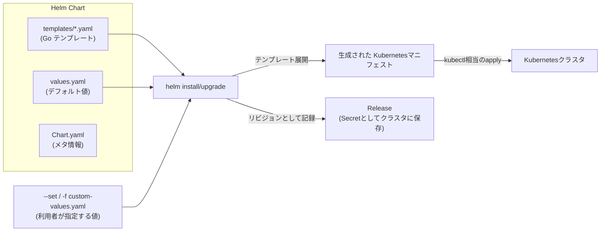
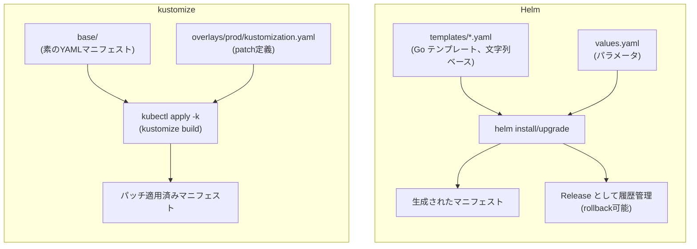

# Helm とは何か(Kubernetes パッケージマネージャの仕組み)

## 概要

Helm は Kubernetes 向けのパッケージマネージャです。複数の Kubernetes マニフェスト(Deployment、Service、ConfigMap など)を「Chart」と呼ばれる 1 つのパッケージにまとめ、`values.yaml` でパラメータ化しておくことで、`helm install` / `helm upgrade` / `helm rollback` といったコマンドで一括してデプロイ・更新・巻き戻しができます。OS でいう apt や yum、Node.js でいう npm の Kubernetes 版とイメージすると分かりやすいです。



似た課題を解決するツールとして kustomize があります。Helm は Go テンプレートによる文字列展開とパッケージ配布(Chart/Release)を行うのに対し、kustomize はテンプレートを使わず、素の YAML に対してパッチ(overlay)を重ねる差分管理ツールです。kustomize は `kubectl` に標準搭載されているため追加インストールも不要です。



## 何が嬉しいのか

生の YAML を `kubectl apply -f` で管理する場合、以下のような課題があります。

- 環境(dev/stg/prod)ごとに微妙に違う設定を持つマニフェストを、コピペやテキスト置換で管理しがちで差分が追いづらい
- 「一連のリソースをまとめてデプロイ/削除する」「前のバージョンに戻す」といった操作を自前でスクリプト化する必要がある
- 他人が作った複雑なアプリケーション(Prometheus、Redis、Nginx Ingress Controller など)を自分で 1 からマニフェスト化するのは大変

Helm を使うとこれらが解消されます。

- **パラメータ化・再利用**: `values.yaml` を環境ごとに差し替えるだけで、同じ Chart から dev/stg/prod 用のマニフェストを生成できる
- **リリース管理**: `helm upgrade` で変更を適用すると自動的にリビジョンが記録され、`helm rollback <release> <revision>` で問題があった場合に即座に前の状態へ戻せる
- **エコシステム**: [Artifact Hub](https://artifacthub.io/) 等の Chart リポジトリから、既に実績のある Chart(nginx-ingress、cert-manager、Prometheus など)を `helm install` 一発で導入できる
- **一括管理**: 関連する複数リソースを 1 つの Release として扱えるため、`helm uninstall` でまとめて削除できる(消し忘れが起きにくい)

具体的なユースケースとしては、「OSS のミドルウェアを自前クラスタに素早く導入したい」「マイクロサービスごとの Deployment/Service/ConfigMap のテンプレートを社内 Chart として共通化し、サービスごとに values だけ変えてデプロイしたい」といった場面でよく使われます。

一方で、自社アプリケーションの環境差分(replicas 数や image tag の違いなど)を薄く上書きしたいだけの場合は、テンプレート構文を学ぶコストが不要な kustomize の方が適していることも多く、両者は排他的ではなく用途に応じて使い分ける・組み合わせる関係にあります。

## 詳細

### 主要な概念

- **Chart**: Helm パッケージの単位。`Chart.yaml`(メタ情報)、`values.yaml`(デフォルト値)、`templates/`(Go テンプレート形式のマニフェスト)から構成されるディレクトリ(または tgz アーカイブ)
- **Release**: Chart を特定の values でクラスタにインストールした「実体」。同じ Chart から複数の Release を作ることも可能(例: `helm install my-app-dev` と `helm install my-app-prod` を同じ Chart から)
- **Repository**: Chart を配布するための HTTP(S) 上のインデックス。`helm repo add` で登録し、`helm search repo` で検索できる
- **values.yaml**: テンプレートに埋め込むパラメータのデフォルト値。`--set key=value` や `-f custom-values.yaml` で上書きできる

### 基本的な使い方

```bash
# Chart リポジトリの追加と検索
helm repo add bitnami https://charts.bitnami.com/bitnami
helm repo update
helm search repo nginx

# インストール(Release 名を指定)
helm install my-nginx bitnami/nginx --set service.type=ClusterIP

# values を書き換えて更新(リビジョンが増える)
helm upgrade my-nginx bitnami/nginx -f custom-values.yaml

# 履歴確認とロールバック
helm history my-nginx
helm rollback my-nginx 1

# 削除
helm uninstall my-nginx
```

テンプレート(`templates/deployment.yaml`)の中では、`values.yaml` の値を Go template 構文で参照します。

```yaml
apiVersion: apps/v1
kind: Deployment
metadata:
  name: {{ .Release.Name }}-app
spec:
  replicas: {{ .Values.replicaCount }}
  template:
    spec:
      containers:
        - name: app
          image: "{{ .Values.image.repository }}:{{ .Values.image.tag }}"
```

### 注意点

- Helm のテンプレートは文字列ベースの Go template なので、インデントミスや型の誤りが `helm template` / `helm install` を実際に実行するまで分かりにくいという弱点があります
- Release の状態はデフォルトではクラスタ内に Secret として保存されるため、`helm` コマンドを実行するには対象クラスタへの kubectl 相当のアクセス権が必要です
- Helm v2 系にはクラスタ内に常駐する Tiller というサーバーコンポーネントがありセキュリティ上の懸念がありましたが、Helm v3 では Tiller が廃止され、クライアントサイドだけで完結する設計になっています。現在配布されている Chart はほぼ Helm v3 を前提としています
- Chart 側にロジック(条件分岐・ループ)を書きすぎると可読性が落ちるため、複雑な生成ロジックが必要な場合は cdk8s や CUE ベースのツールと使い分ける、という考え方もあります

### Helm と kustomize の使い分け

| 観点 | Helm | kustomize |
|---|---|---|
| 仕組み | Go テンプレートで文字列展開 | 素の YAML に strategic merge / JSON patch を適用 |
| 学習コスト | テンプレート構文・関数を覚える必要あり | プレーンな YAML の知識だけで済む |
| 配布・再利用 | Chart として versioning・配布(Artifact Hub 等)が可能 | 標準では配布の仕組みを持たない(base を git submodule 等で共有するのが一般的) |
| リリース管理 | `helm upgrade`/`rollback`/`history` でリビジョン管理 | そのような概念はない(ステートレス。GitOps ツール側の git 履歴で管理するのが一般的) |
| 追加インストール | 必要 | 不要(`kubectl` に統合済み、`kubectl apply -k`) |
| ミスの起きやすさ | テンプレートの文字列展開ミスは実行するまで気づきにくい | 元が妥当な YAML なので構文エラーは起きにくいが、patch の対象特定(name/kind一致)を間違えると効かない |
| 向いている用途 | サードパーティ製品の導入(Prometheus, cert-manager, nginx-ingress 等)、パラメータ化された再利用可能なパッケージの配布 | 自社アプリの環境差分(dev/stg/prod)管理、既存 YAML への薄い上書き |

具体的な使い分けの指針は次のとおりです。

- **自分たちのアプリケーションのマニフェストを環境ごとに少しずつ変えたいだけ**なら、kustomize がシンプルでおすすめです。`base/` に共通マニフェストを置き、`overlays/dev`、`overlays/prod` などで `replicas` や `image tag` だけ patch する、という運用がしやすく、テンプレート言語を学ぶ必要もありません。
- **他人(OSS コミュニティ等)が作った複雑なアプリケーションを導入したい**場合は Helm 一択です。kustomize には Chart のようなパッケージ配布・バージョニングの仕組みがないため、Prometheus や Ingress Controller などは基本的に Helm Chart として配布されています。
- **両方を組み合わせる**パターンも実務ではよく使われます。「サードパーティの Helm Chart を `helm template` でレンダリングし、その出力に kustomize で自社固有の patch(namespace 付与、独自ラベル追加など)を当てる」という流れです。ArgoCD や Flux などの GitOps ツールも、この「Helm でレンダリング → kustomize でオーバーレイ」という組み合わせを公式にサポートしています。
- **リリース履歴・ロールバックが欲しいか**も判断材料になります。Helm は `helm rollback` で簡単に前のリビジョンへ戻せますが、kustomize 自体にはその機能がなく、Git の履歴や CI/CD 側の仕組みに委ねる設計です。GitOps(Git を単一の真実の情報源とする)の思想とは kustomize の方が親和性が高いとよく言われます。

まとめると、「**パッケージとして配布・再利用したいか(Helm)**」か「**既存 YAML への薄い差分適用で済むか(kustomize)**」が最初の判断軸になります。

## 参考リンク

- [Helm 公式ドキュメント](https://helm.sh/docs/)
- [Helm Charts の基本 - Chart Template Guide](https://helm.sh/docs/chart_template_guide/getting_started/)
- [Artifact Hub(公開 Chart の検索)](https://artifacthub.io/)
- [Helm GitHub リポジトリ](https://github.com/helm/helm)
- [kustomize 公式ドキュメント](https://kubectl.docs.kubernetes.io/references/kustomize/)
- [Kubernetes 公式: Declarative Management of Kubernetes Objects Using Kustomize](https://kubernetes.io/docs/tasks/manage-kubernetes-objects/kustomization/)
- [Argo CD: Helm と Kustomize の併用について](https://argo-cd.readthedocs.io/en/stable/user-guide/helm/)
