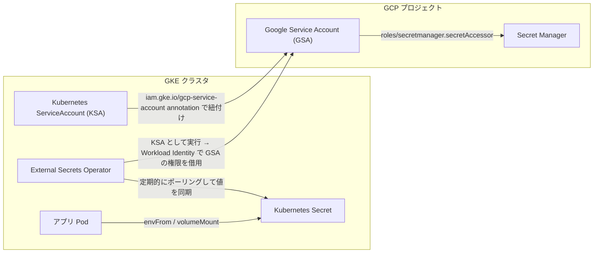
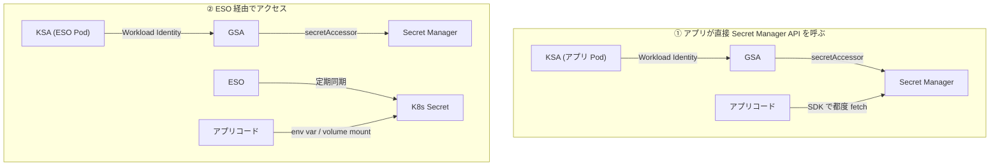

# GCP Secret Manager × External Secrets Operator × Workload Identity によるSecret管理

## 概要

GKE 上のアプリケーションが GCP Secret Manager に保存した機密情報(DB パスワード、API キーなど)を安全に取得する際の定番構成が、**Workload Identity** で GKE の Pod に GCP の IAM 権限を渡し、**External Secrets Operator (ESO)** が Secret Manager の値を Kubernetes Secret として同期する、という組み合わせです。



なお、Workload Identity だけでも技術的には Secret Manager の値を直接取得できます。ESO は必須の構成要素ではなく、「取得処理を誰が・どこで行うか」を変える追加のレイヤーという位置づけです(詳細は後述)。

## 何が嬉しいのか

Secret Manager・Workload Identity・ESO を組み合わせない場合、代表的なのは次のようなやり方ですが、それぞれ問題があります。

- **Secret を Git やマニフェストに直接書く** → リポジトリに機密情報が残る、ローテーションのたびに手動更新・再デプロイが必要
- **Node にサービスアカウントの JSON キーファイルを配置してアプリから読ませる** → 長期間有効な鍵ファイルの漏洩リスク、キーのローテーション・失効管理が煩雑
- **Secret Manager から自前のサイドカーやアプリコードで都度 API を叩く**(= Workload Identity のみを使い、アプリが直接 SDK で fetch する方式) → 各アプリで SDK 実装・権限周りのコードを書く必要があり、言語・フレームワークごとに実装が重複する

Workload Identity + ESO の構成にすると、次のような利点が得られます。

- **鍵ファイル不要**: Workload Identity により、GCP のダウンロード可能な JSON キーを一切使わずに Pod から GCP API を呼べる(漏洩経路そのものをなくせる)
- **アプリ側は Kubernetes Secret を見るだけでよい**: ESO が同期してくれるので、アプリコードは Secret Manager を意識せず、通常の env var や volume mount として読める
- **ローテーションが自動反映**: Secret Manager 側で値を更新すれば、ESO が定期的に(設定可能な `refreshInterval` ごとに)再同期してくれる
- **権限管理が IAM に一元化**: Secret Manager への読み取り権限を持つのは ESO の KSA のみになり、どの Namespace/ServiceAccount がどの Secret を読めるかを GCP IAM のポリシーで統制できる

具体的なユースケースとしては、「DB のパスワードを Secret Manager で一元管理しつつ、複数の GKE クラスタ・Namespace 上の Deployment から安全に参照したい」といったケースが典型です。

一方で、単一の小さなアプリで GCP への依存が強くてよく、実装の手間を惜しまないのであれば、Workload Identity のみでアプリが直接 Secret Manager にアクセスする構成もシンプルで妥当な選択肢です。どちらが適切かはトレードオフ次第であり、次の「詳細」で比較します。

## 詳細

### Workload Identity の基礎

Workload Identity は、GKE 上の Kubernetes ServiceAccount (KSA) を Google Cloud の Service Account (GSA) に紐付け、Pod 内から GCP API を呼ぶ際に GSA の IAM 権限を使えるようにする仕組みです。

- Pod は KSA としてトークンを取得し、それを GCP の Security Token Service (STS) に渡して GSA の一時的なアクセストークンと交換します(内部的には OIDC の federated identity)
- ノードに配置する長期間有効なサービスアカウントキー(JSON)が不要になるのが最大のメリットです
- 現行の推奨方式は **Workload Identity Federation for GKE**(旧来の GKE Metadata Server 経由の Workload Identity から移行が進んでいます)

設定の流れ(概要):

```bash
# 1. GSA を作成
gcloud iam service-accounts create eso-secret-reader \
  --project=YOUR_PROJECT_ID

# 2. GSA に Secret Manager の読み取り権限を付与
gcloud projects add-iam-policy-binding YOUR_PROJECT_ID \
  --member="serviceAccount:eso-secret-reader@YOUR_PROJECT_ID.iam.gserviceaccount.com" \
  --role="roles/secretmanager.secretAccessor"

# 3. KSA が GSA を「なりすまし(impersonate)」できるように IAM バインディングを追加
gcloud iam service-accounts add-iam-policy-binding \
  eso-secret-reader@YOUR_PROJECT_ID.iam.gserviceaccount.com \
  --role="roles/iam.workloadIdentityUser" \
  --member="serviceAccount:YOUR_PROJECT_ID.svc.id.goog[external-secrets/external-secrets]"
```

```yaml
# 4. KSA 側に annotation を付けて GSA と紐付け
apiVersion: v1
kind: ServiceAccount
metadata:
  name: external-secrets
  namespace: external-secrets
  annotations:
    iam.gke.io/gcp-service-account: eso-secret-reader@YOUR_PROJECT_ID.iam.gserviceaccount.com
```

これで、`external-secrets` Namespace の `external-secrets` KSA を使う Pod は、鍵ファイルなしで `eso-secret-reader` GSA の権限(= Secret Manager 読み取り)を持てるようになります。

### External Secrets Operator (ESO) の基礎

ESO は、外部の Secret ストア(GCP Secret Manager, AWS Secrets Manager, HashiCorp Vault など多数対応)から値を取得し、Kubernetes Secret として自動生成・同期する Kubernetes Operator です。主なカスタムリソースは次の2つです。

- **`SecretStore` / `ClusterSecretStore`**: どの外部ストアに、どの認証情報でアクセスするかを定義(Namespace スコープか、クラスタ全体で共有するか)
- **`ExternalSecret`**: 外部ストアのどのキーを、どの Kubernetes Secret として作るかをマッピングする定義

```yaml
apiVersion: external-secrets.io/v1beta1
kind: ClusterSecretStore
metadata:
  name: gcp-secret-store
spec:
  provider:
    gcpsm:
      projectID: YOUR_PROJECT_ID
      auth:
        workloadIdentity:
          clusterLocation: asia-northeast1
          clusterName: your-gke-cluster
          serviceAccountRef:
            name: external-secrets
            namespace: external-secrets
```

```yaml
apiVersion: external-secrets.io/v1beta1
kind: ExternalSecret
metadata:
  name: db-credentials
  namespace: my-app
spec:
  refreshInterval: 1h
  secretStoreRef:
    name: gcp-secret-store
    kind: ClusterSecretStore
  target:
    name: db-credentials       # 生成される Kubernetes Secret 名
    creationPolicy: Owner
  data:
    - secretKey: password
      remoteRef:
        key: db-password       # Secret Manager 側の secret 名
        version: latest
```

アプリの Pod からは、通常の Kubernetes Secret と同様に参照できます。

```yaml
envFrom:
  - secretRef:
      name: db-credentials
```

補足・注意点:

- `ClusterSecretStore` の `auth.workloadIdentity.serviceAccountRef` で指定した KSA が、Workload Identity で GSA に紐付いている必要があります(上記の設定と対応)
- ESO 自体(operator の Pod)がどの KSA で動いているかと、`ExternalSecret` が参照する `SecretStore` の `serviceAccountRef` は別物として扱えます。用途や Namespace ごとに権限を分けたい場合は、Namespace 単位で別の GSA・`SecretStore` を用意するのが安全です
- `refreshInterval` を短くしすぎると Secret Manager への API 呼び出し数(課金対象)が増える点に注意してください
- Secret Manager 側での値のローテーション自体は ESO の役割外です。ローテーション後に Pod を再起動して新しい値を読み込ませたい場合は、[Reloader](https://github.com/stakater/Reloader) のような別ツールと組み合わせる、または `version` を固定せず `latest` を使いつつアプリ側でリロード処理を実装する、といった追加の工夫が必要です

### GCP Secret Manager の基礎

Secret Manager は GCP のマネージドな Secret 保存サービスで、以下の特徴があります。

- Secret はバージョン管理され(`v1`, `v2`, ... または `latest`)、更新時は新バージョンを作成する形になります
- IAM でアクセス制御(`roles/secretmanager.secretAccessor` などのロール)を行い、監査ログも Cloud Audit Logs に記録されます
- 保存時は Google 管理の鍵、または CMEK(顧客管理の暗号鍵)で暗号化可能です

### ESO を使う場合と使わない場合(Workload Identity 直接利用)の比較

Workload Identity さえ設定していれば、KSA は GSA の権限を借用できるため、ESO を挟まずアプリが直接 Secret Manager API を呼んで値を取得することも技術的には可能です。ESO の有無で異なるのは、その取得処理を「アプリごとに実装するか」「Operator に任せるか」という点です。



| 観点 | ① 直接アクセス(Workload Identity のみ) | ② ESO 経由 |
|---|---|---|
| アプリコードへの実装 | 言語・フレームワークごとに GCP SDK での取得処理が必要 | 不要。通常の env var / volume mount を読むだけ |
| IAM の権限範囲 | アプリの Pod (KSA) 自体に `secretAccessor` を渡す必要がある(= 各アプリが直接 Secret Manager にアクセスできる) | 権限を持つのは ESO の KSA のみ。アプリ側は Secret Manager の存在すら意識しない(権限の集約・最小化) |
| API 呼び出しコスト | リクエストのたびに fetch する実装だと呼び出し回数が増えやすい(キャッシュ実装は自前で必要) | ESO が `refreshInterval` ごとにまとめて同期するので呼び出し回数を制御しやすい |
| 可用性への影響 | Secret Manager API が一時的に不調だと、実装によってはアプリの起動・処理自体が失敗しうる | K8s Secret として一度同期済みなら、Secret Manager が一時的に落ちてもアプリの再起動には影響しにくい(直近の同期値が残る) |
| Secret ストアの切り替え | GCP Secret Manager 専用の実装がアプリに埋め込まれる | `SecretStore` の定義を変えるだけで AWS Secrets Manager / Vault などに切り替え可能。マルチクラウドやローカル開発時の抽象化がしやすい |
| ローカル開発 | ローカルでも GCP 認証情報のセットアップが必要になりがち | K8s Secret としてクラスタ内に存在するので、アプリ自体は GCP 認証を意識しない構成にしやすい |

まとめると、単純に「値を取れるかどうか」だけで言えば ESO は不要で、Workload Identity のみで完結します。ただし、**IAM 権限をアプリ Pod にまで広げず ESO だけに集約したい**、**複数言語・複数アプリで実装を重複させたくない**、**Secret ストアの実装をアプリから切り離したい**といった要件がある場合に ESO が有効になります。逆に、単一の小さなアプリで GCP への依存が強くてよく、実装の手間を惜しまないのであれば、Workload Identity + SDK 直接呼び出しもシンプルで妥当な選択肢です。この場合、「言語・フレームワークごとに実装が重複する」「各アプリに Secret Manager への直接権限を持たせることになる」という点がトレードオフになります。

## 参考リンク

- [External Secrets Operator 公式ドキュメント - GCP Secrets Manager Provider](https://external-secrets.io/latest/provider/google-secrets-manager/)
- [Google Cloud - GKE の Workload Identity Federation について](https://cloud.google.com/kubernetes-engine/docs/concepts/workload-identity)
- [Google Cloud - Workload Identity Federation for GKE の設定方法](https://cloud.google.com/kubernetes-engine/docs/how-to/workload-identity)
- [Google Cloud - Secret Manager ドキュメント](https://cloud.google.com/secret-manager/docs)
- [External Secrets Operator 公式ドキュメント - ExternalSecret / SecretStore API](https://external-secrets.io/latest/api/externalsecret/)
