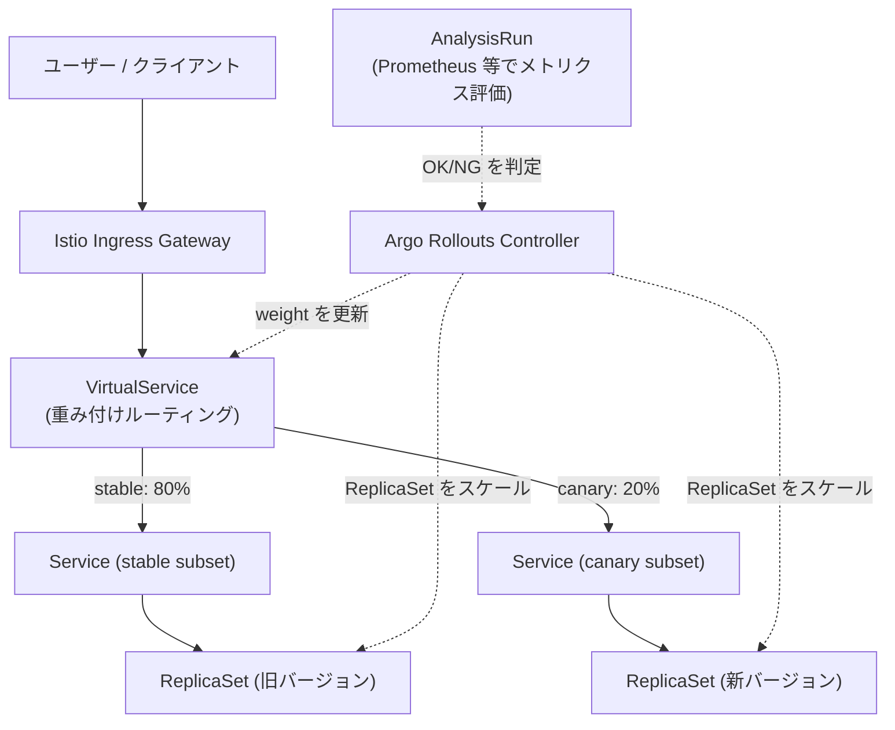

# Argo Rollouts と Istio ベースのカナリアデプロイの仕組み

## 概要

**Argo Rollouts** は Kubernetes 上で標準の `Deployment` を置き換える形で動作するコントローラーで、`Rollout` という CRD を通じて **Blue-Green** や **Canary** といった高度なデプロイ戦略を宣言的に実現する。カナリア戦略では、新バージョン(canary)へのトラフィック比率を段階的に増やしながら、途中でメトリクスに基づく自動判定(Analysis)を挟み、問題があれば自動でロールバックできる。

Istio と組み合わせた場合、Argo Rollouts コントローラーが Istio の `VirtualService` / `DestinationRule` を直接書き換えることで、**Pod のレプリカ数に依存しない、正確な重み付けトラフィック分割**を実現する。



## 何が嬉しいのか

標準の `Deployment` の RollingUpdate は「レプリカ数の比率」でしかトラフィック配分を制御できない(例: 新旧 1:4 なら約 20% がおおよそ新バージョンに流れる、という程度の粗い制御で、しかも L4/L7 のロードバランシングアルゴリズム次第でばらつく)。また異常が起きても「手動で `kubectl rollout undo`」するまで進行が止まらない。

Argo Rollouts + Istio の組み合わせでは、これらが次のように改善される。

- **正確なトラフィック比率制御**: Pod 数とは独立に `VirtualService` の `weight` を直接操作するので、「canary は 1 Pod だけ立てて 5% のトラフィックだけ流す」といった柔軟な配分が可能。
- **自動化されたカナリア分析**: Prometheus・Datadog・CloudWatch などのメトリクスをクエリする `AnalysisTemplate` を定義しておけば、エラー率やレイテンシが閾値を超えた時点で自動的にロールバックできる。人がダッシュボードを見て都度判断する必要がない。
- **段階的な自動昇格**: `steps` に `setWeight` と `pause` を並べるだけで、5% → 20% → 50% → 100% のように時間をかけて安全に切り替えられる。
- **ヘッダーベースルーティング**: Istio の `VirtualService` の `match` 機能と組み合わせ、「特定のテストユーザーだけ常に canary に流す」といった高度なルーティングも設定可能。

具体的なユースケースとしては、「決済 API の新バージョンをリリースする際、まず社内ユーザーのリクエストだけ canary に流し、エラー率が悪化しないことを確認してから段階的に一般ユーザーのトラフィックを増やす」といった運用が挙げられる。

## 詳細

### Rollout リソースの基本構造

`Deployment` の代わりに `Rollout` を定義する。Pod テンプレートや `selector` は `Deployment` とほぼ同じで、`strategy` に `canary` を指定する。

```yaml
apiVersion: argoproj.io/v1alpha1
kind: Rollout
metadata:
  name: my-app
spec:
  replicas: 5
  strategy:
    canary:
      canaryService: my-app-canary
      stableService: my-app-stable
      trafficRouting:
        istio:
          virtualService:
            name: my-app-vsvc
            routes:
              - primary
          destinationRule:
            name: my-app-destrule
            canarySubsetName: canary
            stableSubsetName: stable
      steps:
        - setWeight: 20
        - pause: { duration: 5m }
        - analysis:
            templates:
              - templateName: success-rate
        - setWeight: 50
        - pause: { duration: 10m }
        - setWeight: 100
```

対応する Istio 側のリソース(`VirtualService` / `DestinationRule`)もあらかじめ用意しておき、`stable` / `canary` の2つの subset を定義しておく必要がある。Argo Rollouts はこの `VirtualService` の `weight` フィールドと、`DestinationRule` の subset 割り当てを、デプロイの進行に応じて自動的に書き換える。

### 動作の流れ

1. 新しいバージョンの Pod スペックで `Rollout` を更新すると、コントローラーは新しい ReplicaSet(canary)を作成する。
2. `steps` に従って `setWeight: 20` を実行 → `VirtualService` の重みを stable:80 / canary:20 に更新し、canary ReplicaSet を必要数までスケールアップする。
3. `pause` で指定時間待機、または `analysis` ステップで `AnalysisTemplate` に定義したクエリ(例: Prometheus の 5xx エラー率)を評価する。
4. 問題なければ次のステップ(重みの引き上げ)へ進む。閾値を超えるなど異常を検知した場合は自動的に `Degraded` 状態にして、トラフィックを stable に戻す(自動ロールバック)。
5. 最終的に `setWeight: 100` まで到達すると、canary が新しい stable として扱われ、旧 ReplicaSet はスケールダウンされる。

### 注意点

- Istio 連携を使うには、対象 namespace に Istio の sidecar injection が有効になっている必要がある。
- `VirtualService` / `DestinationRule` は Argo Rollouts が管理するフィールド(`weight`、subset の `route`)を書き換えるため、他のツール(GitOps など)と同じフィールドを競合して管理しないよう注意が必要。
- `kubectl argo rollouts` プラグインを使うと、CLI や TUI でカナリアの進行状況・トラフィック比率をリアルタイムに確認できる。
- Istio 以外にも NGINX Ingress、AWS ALB、SMI などの `trafficRouting` バックエンドに対応しており、Istio はその一つという位置づけ。

## 参考リンク

- [Argo Rollouts 公式ドキュメント](https://argo-rollouts.readthedocs.io/en/stable/)
- [Argo Rollouts - Canary Deployment Strategy](https://argo-rollouts.readthedocs.io/en/stable/features/canary/)
- [Argo Rollouts - Istio integration](https://argo-rollouts.readthedocs.io/en/stable/features/traffic-management/istio/)
- [Istio - Traffic Management (VirtualService/DestinationRule)](https://istio.io/latest/docs/concepts/traffic-management/)
