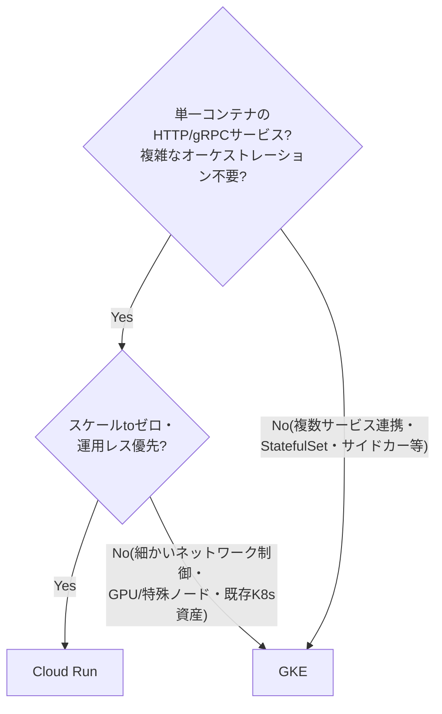
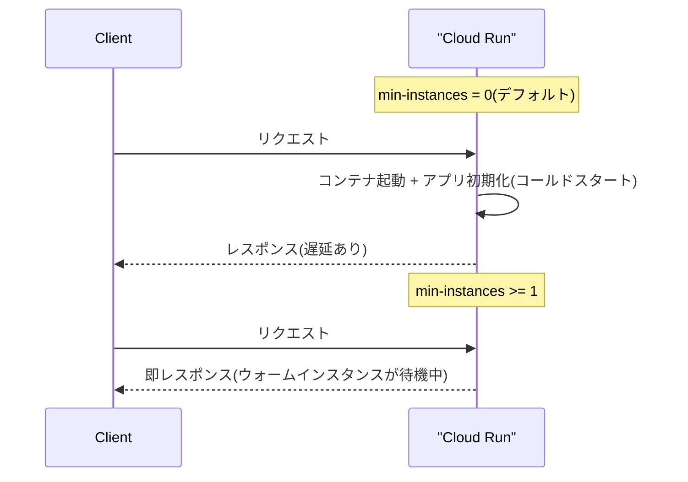

# GKE と Cloud Run の使い分け(スケーリングの仕組みの違い)

## 概要

GKE と Cloud Run はどちらも「リクエストに応じたスケーリング」が可能ですが、抽象化のレイヤーが異なります。Cloud Run はコンテナ 1 つを動かすことに特化したフルマネージドのサーバーレスプラットフォーム(内部的には Knative がベース)で、インフラ管理をほぼゼロにできます。GKE はマネージド Kubernetes で、Pod・Node・ネットワークなど Kubernetes のプリミティブをそのまま制御でき、その分自由度と運用の複雑さが増します。

## 何が嬉しいのか

同じ「スケーリング」でも仕組みが違うため、使い分けを誤ると運用コストや制約で困ります。

- **Cloud Run を使う嬉しさ**: クラスタ運用(ノードのプロビジョニング、アップグレード、パッチ適用)が不要。リクエストが 0 のときはインスタンス数も 0 まで縮小され、その間の課金が発生しない(スケールtoゼロ)。デプロイも `gcloud run deploy` 一発で完結する。
  - ユースケース: 社内向け API、Webhook 受信エンドポイント、突発的にしかアクセスが来ないバッチトリガー用サービスなど、常時起動している必要がないワークロード。
- **GKE を使う嬉しさ**: Kubernetes のフル機能(StatefulSet、DaemonSet、CronJob、カスタムスケジューリング、Istio などのサービスメッシュ、Pod 内マルチコンテナ/サイドカーなど)が使える。GPU/TPU など特殊なノードプールを組んだり、複数サービスが密に連携するマイクロサービス基盤を構築する場合に向く。
  - ユースケース: すでに Kubernetes の運用ノウハウ・ツール(Helm、ArgoCD 等)がある組織、mTLS やカナリアリリースなどのサービスメッシュ機能が必要な場合、常時大量のトラフィックを捌く定常ワークロードでノード単位でのコスト最適化(bin-packing)をしたい場合。

## 詳細

### スケーリングの仕組みの違い

- **Cloud Run**: リクエスト数(同時実行数 concurrency)に応じてコンテナインスタンス数がネイティブに増減します。`min-instances` / `max-instances` を設定するだけで、内部の Autoscaler がリクエストの発生をトリガーにインスタンスを起動・停止します。スケールtoゼロが標準でサポートされています。
- **GKE**: Pod レベルのスケーリングは HPA(Horizontal Pod Autoscaler)を別途設定する必要があります。CPU/メモリだけでなく、Cloud Monitoring のカスタムメトリクスや(Ingress/Gateway API 経由の)リクエスト数を使ったスケーリングも可能ですが、設定が Cloud Run に比べて煩雑です。さらに Pod を増やすための Node が足りない場合は Cluster Autoscaler がノードも増やす必要があり、Cloud Run のインスタンス起動に比べて反応が遅くなる傾向があります(特に新規ノード追加を伴う場合)。GKE Autopilot モードを使うとノード管理は GCP 側に委譲されますが、それでも Kubernetes API のフル機能(Deployment、Service、HPA 定義など)を自分で組む点は Standard モードと同様です。
- スケールtoゼロについて: GKE でも Pod を 0 まで減らすこと自体は HPA の `minReplicas: 0` や KEDA を使えば可能ですが、これは実質的に Cloud Run のベースである Knative の仕組みを自前で GKE 上に構築するのに近く、素の GKE の標準機能だけでは実現しにくい部分です。

### Cloud Run はコールドスタートしか選べないのか(min-instances によるウォームスタンバイ)

Cloud Run は「常にコールドスタート」ではなく、**最小インスタンス数(`min-instances`)を設定することでウォームスタンバイを維持できます**。

- `gcloud run deploy --min-instances=N` (またはコンソール/Terraform の該当設定)で、リクエストが 0 でも常時起動しておくインスタンス数を指定できます。
- `min-instances` 分のインスタンスは常に起動・初期化済みの状態で待機するため、その範囲内のトラフィックはコールドスタートを経由せず即座に処理されます。
- ただし **トレードオフとしてスケールtoゼロの恩恵(アイドル時無課金)がなくなります**。`min-instances` で確保したインスタンスは、リクエストが来ていない間も課金対象になります(CPU 割り当てを「リクエスト処理中のみ」に設定していても、待機インスタンス自体の存在によるベース課金は発生します)。
- 重要な注意点として、`min-instances` はあくまで「最低限維持する数」であり、瞬間的なトラフィックがその数を超えた場合は、超過分について新規インスタンスがやはりコールドスタートで起動します。「常時ウォーム = 常に無遅延」ではなく、想定される定常トラフィックに対する下限を保証する機能と捉えるのが正確です。

コールドスタート自体を短縮する仕組みもあります。`min-instances=0` のまま運用したい場合や、超過スケール時のコールドスタートを緩和したい場合向けです。

- **スタートアップ CPU ブースト(`--cpu-boost`)**: コンテナ起動時のみ一時的に多くの CPU を割り当て、アプリの初期化(JVM のクラスロードなど)を高速化します。リクエスト処理中の CPU 割り当てには影響しません。
- コンテナイメージを小さく保つ、依存関係の遅延ロードを避ける、軽量なランタイム(Go や軽量な Node.js など)を使うといったアプリ側の工夫でも初期化時間を縮められます。

まとめ:

| 設定 | コールドスタート | 課金 |
|---|---|---|
| `min-instances=0`(デフォルト) | リクエスト0の状態から復帰する際に発生 | アイドル時は無課金 |
| `min-instances>=1` | 維持数以内のトラフィックでは発生しない(超過分は発生) | 待機インスタンス分は常時課金 |

### 運用・制約面の違い

| 観点 | Cloud Run | GKE |
|---|---|---|
| インフラ管理 | 不要(フルマネージド) | ノードプール・アップグレード等の管理が必要(Autopilot でも一部は残る) |
| デプロイ単位 | コンテナイメージ1つ(Jobs で非HTTPワークロードにも対応) | Pod/Deployment/StatefulSet など Kubernetes リソース全般 |
| ネットワーク制御 | VPC コネクタ経由など制約あり | Istio 等のサービスメッシュ、NetworkPolicy など柔軟に構成可能 |
| 課金 | リクエスト処理時間・使用リソースに応じた従量課金(アイドル時は基本無課金) | ノードの起動時間に応じた課金(Pod が0でもノードが立っていればコストが発生しうる) |
| 適したワークロード | ステートレスな HTTP/gRPC サービス、イベント駆動処理 | ステートフルな処理、複数コンテナ/サイドカー構成、複雑なマイクロサービス群 |

不確かな点として、GKE のリクエストベース HPA(Gateway API 連携)の具体的な挙動やレイテンシは構成やバージョンに依存するため、実際に採用する際はご自身の環境で検証することをおすすめします。また、Cloud Run の待機インスタンスの正確な課金体系(CPU割り当てモードとの組み合わせ)は料金体系の更新が入りやすいため、実際の運用前に最新の料金ページで確認することをおすすめします。

## 参考リンク

- [Cloud Run の概要 - Google Cloud 公式ドキュメント](https://cloud.google.com/run/docs/overview/what-is-cloud-run)
- [GKE の概要 - Google Cloud 公式ドキュメント](https://cloud.google.com/kubernetes-engine/docs/concepts/kubernetes-engine-overview)
- [Cloud Run と GKE の比較 - Google Cloud 公式ドキュメント](https://cloud.google.com/blog/topics/developers-practitioners/when-should-i-use-cloud-run-vs-cloud-functions-vs-app-engine-vs-gke)
- [GKE Autopilot の概要 - Google Cloud 公式ドキュメント](https://cloud.google.com/kubernetes-engine/docs/concepts/autopilot-overview)
- [最小インスタンス数の設定 - Google Cloud 公式ドキュメント](https://cloud.google.com/run/docs/configuring/min-instances)
- [スタートアップ CPU ブースト - Google Cloud 公式ドキュメント](https://cloud.google.com/run/docs/configuring/services/cpu-allocation#startup-cpu-boost)
- [Cloud Run の料金 - Google Cloud 公式ドキュメント](https://cloud.google.com/run/pricing)
