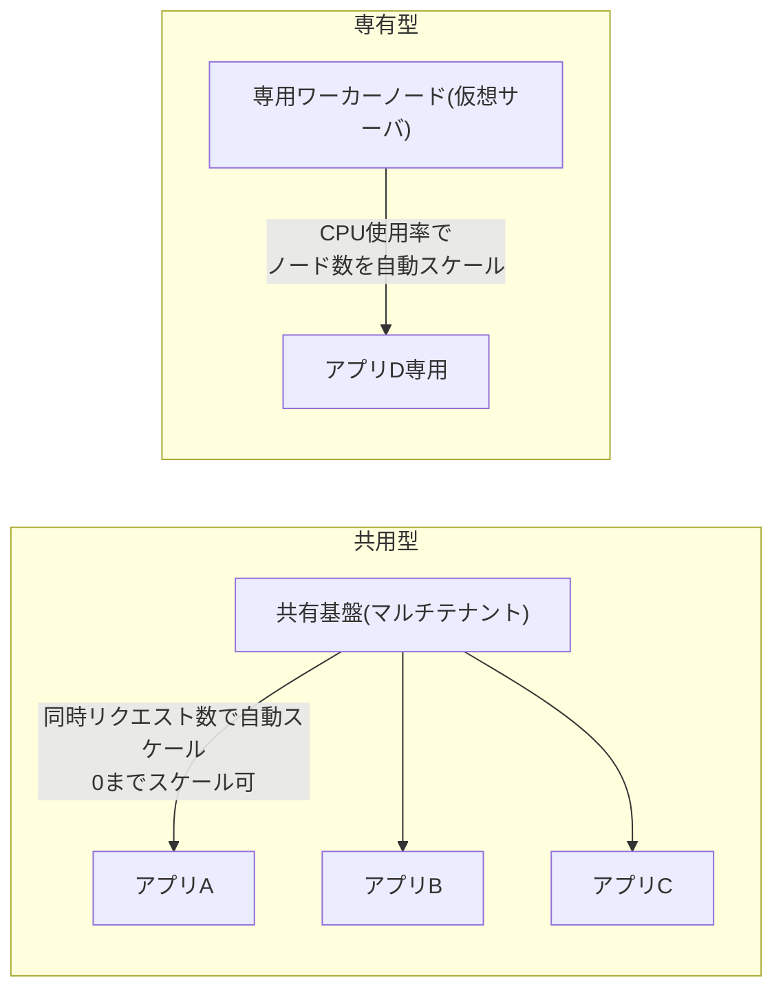

# さくらの AppRun における「共用型」CPU プランの考え方

## 概要

さくらインターネットの **AppRun** は、コンテナイメージをデプロイするだけで自動スケールするフルマネージドのコンテナアプリケーション実行基盤です(2025年12月に正式サービス開始)。「共用型」「専有型」は、CPU などのコンピューティングリソースを**どう提供するか**を分ける2つのプランで、リソースの分離度・スケール方式・課金体系がそれぞれ異なります。

- **共用型**: 複数ユーザーで基盤(ホスト)を共有し、「コンテナに割り当てたリソース × スケール数 × 時間」で課金。**同時リクエスト数ベース**でスケールし、アクセスがなければ**スケール数0**まで縮退できる。
- **専有型**: ユーザーごとに専用の仮想サーバ(ワーカーノード)が自動作成され、「ワーカーノードのスペック × 台数 × 時間」で課金。**CPU使用率ベース**でワーカーノード数を自動調整するが、**0スケールはできない**。仮想サーバレベルで他ユーザーから分離されるため安定性・セキュリティが高い。

## 何が嬉しいのか

コスト最適化と信頼性のどちらを優先するかで選べる点が嬉しいポイントです。使わずに単一プランしかない場合と比べ、ワークロードの性質に合わせて無駄なコストや性能のブレを避けられます。

- **共用型が向くケース**: 開発・検証環境や小規模サービスなど、アクセスが少ない時間帯にコストをゼロに近づけたい場合。スピードとコスト重視の用途に最適。
- **専有型が向くケース**: 企業システムや自治体業務など、他ユーザーの負荷変動に性能を左右されたくない、高い信頼性・セキュリティが求められる本番システム。

使い分けを誤ると、「共用型で本番の安定性を求めて性能ブレに悩む」「専有型で軽量ワークロードを動かし、0スケールできないため待機コストも含めて不要に高くなる」といった問題が起きやすい点が実務上の勘所です。

## 詳細

### 共用型 vs 専有型 の比較

| 観点 | 共用型 | 専有型 |
|---|---|---|
| リソース分離 | 複数ユーザーで基盤を共有 | ユーザーごとに専用の仮想サーバ(ワーカーノード) |
| スケール判断軸 | 同時リクエスト数ベース | CPU使用率ベース |
| ゼロスケール | 可能 | 不可 |
| 課金体系 | 割り当てリソース × スケール数 × 時間 | ワーカーノードのスペック × 台数 × 時間 |
| 最小構成の目安 | 0.5vCPU / 1GiB | 1vCPU / 2GB |
| 料金目安(最小構成) | 月額 約5円〜(スケールに応じて増加) | 約55円/時間・約11,000円/月〜 |
| 向くケース | 開発・検証、小規模サービス | 企業システム、自治体業務など高信頼性が必要な用途 |
| 対応アーキテクチャ | linux/amd64 のみ | (専有型の詳細仕様は公式の技術概要ページを参照) |

### AppRun 共用型と Cloud Run の関係

AppRun は「コンテナイメージをデプロイするだけで HTTP リクエストに応じて自動スケールする」という体験の面では、Google Cloud Run と同じカテゴリのサービスです。特に **共用型に限って言えば、Cloud Run とかなり近い設計思想**であることが公式情報から確認できています。

- **共用型**: マルチテナント基盤上で**同時リクエスト数ベース**にオートスケールし、**ゼロスケール**が可能。これは Cloud Run のデフォルト動作(リクエストが無ければ0インスタンスまで縮退し、同時実行数に応じてインスタンスを増減する)と非常に近い。
- **専有型**: ユーザー専用の仮想サーバ(ワーカーノード)を**CPU使用率ベース**でオートスケールし、ゼロスケール不可。こちらはむしろ GKE や Compute Engine のような、常時起動する専用 VM 群をオートスケールする発想に近い。

つまり「AppRun という1つのサービスの中に、Cloud Run 型(共用型)と GKE/専用VM型(専有型)の両方の選択肢がある」と捉えると分かりやすいです。

なお、Cloud Run 自体にも CPU の割り当て方式という設定がありますが、これは共用/専有ではなく「**いつ CPU が割り当てられるか**」(リクエスト処理中のみ割り当て vs 常に割り当て)という別軸の話であり、AppRun の共用型/専有型が表す「基盤をマルチテナントで共有するか、専用の仮想サーバを持つか」という軸とは区別して理解する必要があります。Cloud Run のスケーリングや CPU 割り当ての考え方については、[#50](https://github.com/hiramekun/tech-notes/issues/50)(GKE と Cloud Run の使い分け)でも触れられています。

## 参考リンク

- [AppRun | さくらのクラウド マニュアル](https://manual.sakura.ad.jp/cloud/manual-sakura-apprun.html)
- [AppRun共用型 | さくらのクラウド](https://cloud.sakura.ad.jp/products/apprun-shared/index.html)
- [AppRun専有型 | さくらのクラウド](https://cloud.sakura.ad.jp/products/apprun-dedicated/index.html)
- [さくらインターネット、アプリケーション実行基盤「AppRun」の正式サービス提供を開始(プレスリリース)](https://www.sakura.ad.jp/corporate/information/newsreleases/2025/12/09/1968222395/)
- [さくらのクラウド、「AppRun」正式提供開始。仮想マシンを専有する「専有型」が登場 - Publickey](https://www.publickey1.jp/blog/25/apprun_2.html)
- [さくらインターネット、アプリケーション実行基盤「AppRun」提供開始 “共有型”と“専有型”は何が違う？ - ITmedia](https://atmarkit.itmedia.co.jp/ait/articles/2512/22/news053.html)
