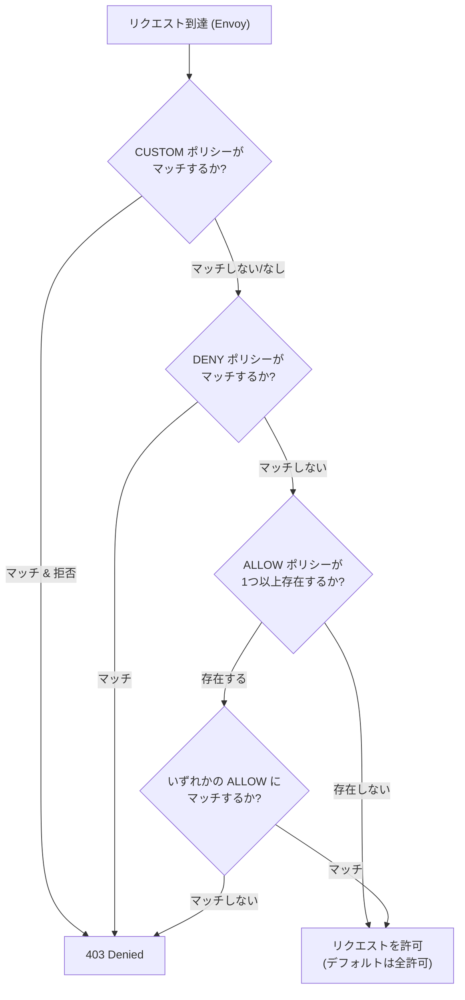

# Istio における AuthorizationPolicy を用いた認可制御

## 概要

`AuthorizationPolicy` は Istio が提供する、**認可(誰が・何に・どのような条件で・アクセスしてよいか)**を制御する CRD です。各 Envoy サイドカー(または Ingress/Egress Gateway)はリクエストを受けるたびに、対象ワークロードに適用される `AuthorizationPolicy` を評価し、`ALLOW` / `DENY` / `AUDIT` / `CUSTOM` のいずれかのアクションに基づいてリクエストを通す・拒否するかを判定します。mTLS(`PeerAuthentication`)や JWT 検証(`RequestAuthentication`)が「相手が誰であるか」を**認証**するのに対し、`AuthorizationPolicy` はその認証済みの身元(や送信元 IP、HTTP メソッド・パスなど)をもとに「その相手にこの操作を許可してよいか」を**認可**する、レイヤーの異なる仕組みです。



## 何が嬉しいのか

`AuthorizationPolicy` がない場合、「このエンドポイントはこのサービスアカウントからしか呼べない」「管理者用パスは admin ロールを持つ JWT だけが叩ける」といったアクセス制御を、各サービスのアプリケーションコード内で個別に実装する必要があります。言語やフレームワークが混在するマイクロサービス環境では実装がバラつきやすく、認可漏れ(実装忘れ)がそのままセキュリティホールになりがちです。Istio に認可を寄せることで、以下が実現できます。

- **アプリケーションコードからの認可ロジックの分離**: サービス側は認可を意識せず、届いたリクエストは「すでに許可されたもの」として扱える。認可ルールの変更もコードのデプロイなしに YAML の適用だけで反映できる
- **メッシュ全体で一貫したゼロトラストなアクセス制御**: mTLS の身元(SPIFFE ID)や JWT のクレームを使い、「サービスAからのみ」「role=admin のユーザーのみ」といった細かい粒度のルールを宣言的に管理できる
- **多層防御**: Ingress Gateway で「外部公開してよい範囲」を制御しつつ、内部の各サービスでも「呼び出し元サービスは正しいか」を再検証でき、いずれか一方が破られても被害を限定できる
- **監査(AUDIT)による段階導入**: 実際に拒否する前に `AUDIT` アクションでログだけ出し、意図しないリクエストが弾かれないか確認してから `DENY`/`ALLOW` に切り替える、といった安全な移行がしやすい

具体的なユースケースとしては、「決済サービスは特定のバックエンドサービスアカウントからのみ呼び出しを許可したい」「管理画面 API は JWT の `role` クレームが `admin` のリクエストのみ許可したい」「特定の namespace からの通信のみメッシュ内サービスへのアクセスを許可し、それ以外は拒否したい」などが挙げられます。

## 詳細

### 基本構造

```yaml
apiVersion: security.istio.io/v1
kind: AuthorizationPolicy
metadata:
  name: allow-read-from-frontend
  namespace: backend
spec:
  selector:
    matchLabels:
      app: my-api
  action: ALLOW
  rules:
    - from:
        - source:
            principals: ["cluster.local/ns/frontend/sa/frontend-sa"]
      to:
        - operation:
            methods: ["GET"]
            paths: ["/api/v1/*"]
      when:
        - key: request.auth.claims[role]
          values: ["admin", "editor"]
```

- `selector`: このポリシーを適用するワークロード(空にするとその namespace 内全体、`istio-system` namespace かつ selector なしだとメッシュ全体に適用)
- `action`: `ALLOW` / `DENY` / `AUDIT`(ログのみ)/ `CUSTOM`(外部認可サービス連携)
- `rules[].from.source`: 送信元の条件。`principals`(mTLS の SPIFFE ID)、`requestPrincipals`(`RequestAuthentication` を通過した JWT の `<issuer>/<subject>`)、`namespaces`、`ipBlocks` など
- `rules[].to.operation`: 宛先の条件。HTTP メソッド・パス・ポート・ホストなど(L7 属性のため HTTP/gRPC トラフィックが対象)
- `rules[].when`: 任意の条件式(`key`/`values`)。JWT のクレーム(`request.auth.claims[...]`)や送信元 IP など、`from`/`to` だけでは表現できない条件を追加できる
- 1 つの `rules` エントリ内では `from` かつ `to` かつ `when` の AND、`rules` の複数エントリ間・各リストの複数要素間は OR で評価される

### 評価順序(重要)

`AuthorizationPolicy` は同じワークロードに複数適用されうるため、評価順序を理解しておく必要があります。

1. **CUSTOM**: 外部認可サービス(ext_authz)へ問い合わせるポリシー。マッチして拒否されれば即座に 403
2. **DENY**: いずれかの `DENY` ポリシーにマッチしたら即座に拒否(他に `ALLOW` があっても上書きされない)
3. **ALLOW**: そのワークロードに 1 つ以上 `ALLOW` ポリシーが存在する場合、**いずれかにマッチしなければデフォルトで拒否**される。逆に `ALLOW` ポリシーが1つも存在しない場合はデフォルトで全許可

この「`ALLOW` ポリシーが存在すると暗黙的に deny-by-default になる」挙動は見落としやすく、意図せず一部のリクエストだけ通ってしまう(あるいは全部弾かれる)事故につながりがちです。「まずはメッシュ全体を deny-all にして、必要な通信だけ `ALLOW` で穴を開けていく」設計が推奨されます。

```yaml
# namespace 内をデフォルト deny-all にする例
apiVersion: security.istio.io/v1
kind: AuthorizationPolicy
metadata:
  name: deny-all
  namespace: backend
spec:
  {} # selector も rules も空 = すべてのリクエストを拒否
```

### 認証(Authentication)との組み合わせ

- `source.principals` を使うには、通信元・先双方に mTLS(`PeerAuthentication`)が有効になっている必要があります
- `source.requestPrincipals` や `when` の `request.auth.claims[...]` を使うには、事前に `RequestAuthentication` で JWT 検証が設定されている必要があります。`RequestAuthentication` 単体では拒否は行われず、`AuthorizationPolicy` と組み合わせて初めて「JWT がない/不正なら拒否」が実現される点に注意が必要です

### 注意点

- `to.operation` の条件(パス・メソッドなど)は L7(HTTP/gRPC)の情報を必要とするため、対象トラフィックがサイドカーで HTTP として認識されている必要があります(素の TCP のみの場合は `source`/`ipBlocks` など L3/L4 の条件しか使えません)
- ポリシーは適用対象ワークロードの Envoy に配布されて評価されるため、サイドカーが注入されていない Pod には効果がありません
- `DENY` と `ALLOW` を同じ条件で重ねて書いても、`DENY` が必ず優先される(`DENY` にマッチしたら `ALLOW` の内容に関わらず拒否)
- ワイルドカードや否定条件(`notPrincipals` 等)も使えるが、意図しない範囲まで許可/拒否してしまわないか `AUDIT` で試してからの適用が安全

## 参考リンク

- [Istio - Authorization Policy](https://istio.io/latest/docs/reference/config/security/authorization-policy/)
- [Istio - Authorization Concepts](https://istio.io/latest/docs/concepts/security/#authorization)
- [Istio - Authorization Policy Task](https://istio.io/latest/docs/tasks/security/authorization/authz-http/)
- [Istio - Deny and Allow policies](https://istio.io/latest/docs/tasks/security/authorization/authz-deny/)
