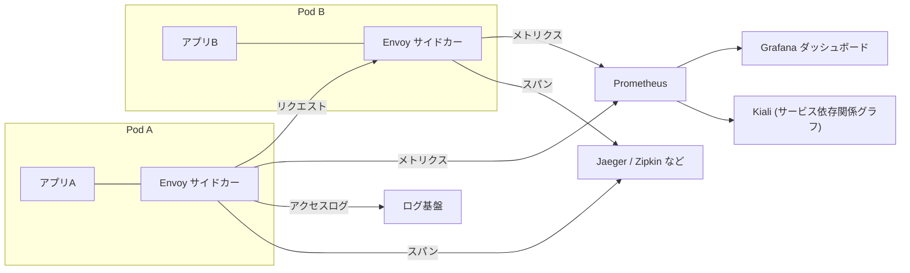
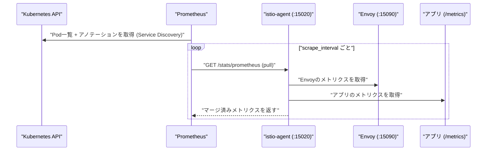
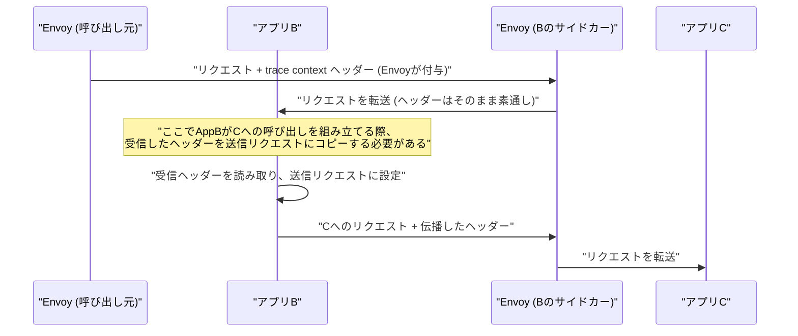

# Istio がもたらす observability 面でのメリット(メトリクス・トレーシング・Kiali)

## 概要

Istio は全サービス間通信を Envoy サイドカー経由で流すため、**アプリケーションコードを計装しなくても**通信に関するメトリクス・アクセスログ・分散トレースの土台を自動的に収集できます。得られるテレメトリは大きくメトリクス・アクセスログ・分散トレーシングの3種類で、これに加えて Kiali によるサービス依存関係の可視化が可能です。



## 何が嬉しいのか

Istio を使わない場合、レイテンシ・エラー率・スループットといった「ゴールデンシグナル」を取得するには、各サービスがそれぞれの言語・フレームワークで計装ライブラリ(Prometheus クライアント、OpenTelemetry SDK など)を組み込む必要があります。マイクロサービスが Go・Java・Python など多言語で書かれていると、この計装の粒度や実装レベルがサービスごとにバラバラになりがちです。

Istio ではこの計装をサイドカー(インフラ層)側で肩代わりするため、次のようなことがアプリ側の変更なしに実現できます。

- **サービス間の通信状況を横断的に一目で把握できる**: 「どのサービス間でエラー率・レイテンシが悪化しているか」をサービスごとの実装差を気にせず統一フォーマットで見られる
- **新しく追加したサービスも自動的に監視対象になる**: サイドカーが注入されればすぐにメトリクスが出るため、監視の計装漏れが起きにくい
- **サービス依存関係が視覚的にわかる**: Kiali でどのサービスがどのサービスを呼んでいるか、通信の健全性(エラー率で色分け)を含めてグラフ表示できる

具体的なユースケースとしては、「障害が起きたときにどのサービス間の通信が原因かをすぐ切り分けたい」「新しいマイクロサービスを追加するたびに監視コードを書きたくない」「多言語混在の環境で統一的な SLI(レイテンシ・エラー率など)を取りたい」といった場面が挙げられます。

## 詳細

Istio の observability は大きく3つの柱(いわゆる Three Pillars of Observability)と、それらを可視化する Kiali で構成されます。

### 1. メトリクス(Metrics)

各 Envoy サイドカーが、リクエスト数・レイテンシ・レスポンスコード・バイト数などの標準メトリクスを Prometheus フォーマットで自動的に公開します。代表的なものは以下のような Istio 標準メトリクスです。

- `istio_requests_total` — リクエスト数(source/destination/response_code などのラベル付き)
- `istio_request_duration_milliseconds` — レイテンシ分布
- `istio_tcp_connections_opened_total` — TCP コネクション数

これらを Prometheus で収集し、Grafana の Istio 公式ダッシュボード(Mesh / Service / Workload ダッシュボードなど)で可視化するのが典型的な構成です。

#### Prometheus との連携方式(pull 型)

Prometheus は **プル型(scrape)で Envoy サイドカーにアクセスして取得しに行きます**。push 型でサイドカーから Prometheus に送りつけるわけではなく、Prometheus 自体の設計思想(pull-based monitoring)がそのまま踏襲されています。

- Envoy 自身のメトリクスは `15090` 番ポートの `/stats/prometheus` で公開されます
- Istio では `istio-agent`(pilot-agent)が `15020` 番ポートで、Envoy のメトリクスとアプリ自身が `/metrics` などで出しているメトリクスを**マージ**した結果を `/stats/prometheus` として公開します(メトリクスマージ機能)。これにより Prometheus は Pod ごとに1エンドポイントを叩くだけで、アプリのメトリクスと Envoy のメトリクスを両方収集できます

Prometheus がこのエンドポイントを見つける仕組み(Service Discovery)は次の通りです。Istio のサイドカーインジェクションは、Pod に以下のような Prometheus 用アノテーションを自動的に付与します。

```yaml
annotations:
  prometheus.io/scrape: "true"
  prometheus.io/port: "15020"
  prometheus.io/path: "/stats/prometheus"
```

Prometheus 側の `prometheus.yml` に、Kubernetes の Pod を対象とした `kubernetes_sd_configs` と、これらのアノテーションを見て scrape 対象・ポート・パスを決める `relabel_configs` を設定しておくと、Prometheus は起動時・定期的に Kubernetes API から Pod 一覧を取得し、このアノテーションが付いた Pod を自動的に scrape 対象に加えます。Istio 公式の addon(`samples/addons/prometheus.yaml`)には、この設定が入った Prometheus の構成一式が含まれています。Prometheus Operator を使っている場合は、この Pod アノテーション方式の代わりに `PodMonitor` / `ServiceMonitor` リソースで scrape 対象を宣言的に指定する構成もよく使われます。



### 2. アクセスログ(Access Logs)

Envoy はリクエスト単位のアクセスログを出力できます(デフォルトでは無効なことが多く、`meshConfig.accessLogFile` などで有効化が必要)。どのサービスからどのサービスへ、どんなステータスコード・レイテンシでリクエストが飛んだかを行単位で追跡でき、障害調査時の一次情報として有用です。

### 3. 分散トレーシング(Distributed Tracing)

Envoy は各リクエストに対して、Zipkin/Jaeger 形式のトレーシングヘッダー(`x-request-id`, `x-b3-traceid` など、Envoy が生成する span)を付与・伝播し、Jaeger や Zipkin、OpenTelemetry Collector にスパン情報を送信できます。

**注意点**: Envoy はサービス間のホップごとに span を作りますが、**リクエストの trace context ヘッダーをアプリケーション側で受信リクエストから送信リクエストへ転送(伝播)しないと、トレースが途中で分断されます**。つまり Istio があっても「アプリを一切変更しなくてよい」わけではなく、最低限ヘッダー伝播だけはアプリ側の対応が必要という点はよく誤解されるポイントです。

#### なぜ自動で繋がらないのか

Envoy サイドカーが見えているのは「リクエストが自分を通過した」という事実だけで、**そのリクエストを受けてアプリがどんな処理をし、どのタイミングでどの下流サービスを呼んでいるか**という業務ロジック上の因果関係までは分かりません。この因果関係を知っているのはアプリケーションプロセス自身だけです。Envoy はヘッダーを**生成・中継(inject/propagate)**はしますが、Pod 内の「受信 → アプリ内処理 → 新たな送信」という区間はアプリのプロセス内で完結しており、Envoy はここに関与できません。この区間でアプリがヘッダーをバケツリレーしない限り、下流サービスから見ると「親のいない新しいトレース」が始まってしまい、A→B→C が1本のトレースとして繋がりません。



#### 具体的に伝播が必要なヘッダー

Istio(Envoy)がデフォルトで使うのは B3 形式のヘッダー群です(設定によっては W3C Trace Context も利用可能)。

- `x-request-id`
- `x-b3-traceid`
- `x-b3-spanid`
- `x-b3-parentspanid`
- `x-b3-sampled`
- `x-b3-flags`
- (B3 single header 形式なら `b3` の1本にまとめられる場合もある)
- W3C Trace Context を使う設定の場合: `traceparent`, `tracestate`

Istio 公式ドキュメントでも「アプリケーションは受信リクエストのこれらのヘッダーを読み取り、発信リクエストに手動でコピーする責務がある」と明記されています。

厳密には「アプリケーションコードを一切書き換えなくていい」わけではありませんが、実務では多くの場合 **OpenTelemetry の自動計装(auto-instrumentation)ライブラリや、各言語の HTTP クライアント/フレームワーク向けミドルウェア**を導入することで、この伝播処理自体は自動化できます。これらのライブラリが HTTP リクエストのフックに介入し、受信コンテキストを送信リクエストへ自動でコピーしてくれるためです。

- 完全に自前でヘッダーをバケツリレーするコードを書く(最も原始的)
- OpenTelemetry SDK / 各種トレーシングクライアントの自動計装を組み込む(実務では主流)

いずれにせよ、「Envoy が付けたヘッダーが何もしなくても次のサービス呼び出しまで自動的に繋がる」ということはなく、**アプリプロセス側に何らかの伝播の仕組み(手書きコード or ライブラリ)が必要**という点が誤解されやすいポイントです。

### 4. Kiali によるサービスメッシュの可視化

Kiali は Prometheus のメトリクスを元に、サービス間の呼び出し関係をグラフとして描画し、エラー率に応じて辺を色分けするなど、メッシュ全体の健全性を視覚的に把握できるダッシュボードです。トラフィック管理設定(VirtualService / DestinationRule)の妥当性チェック機能もあります。

### 留意点

- サイドカーがメトリクス・トレースを収集する分、CPU/メモリのオーバーヘッドが発生します
- 大規模なメッシュではメトリクスのカーディナリティ(ラベルの組み合わせ数)が爆発しやすく、Prometheus 側のリソース設計が必要になります
- トレーシングは全リクエストをサンプリングすると負荷が大きいため、通常はサンプリングレートを調整します(`meshConfig.defaultConfig.tracing.sampling` など)

## 参考リンク

- [Istio - Observability](https://istio.io/latest/docs/concepts/observability/)
- [Istio - Metrics](https://istio.io/latest/docs/reference/config/metrics/)
- [Istio - Distributed Tracing](https://istio.io/latest/docs/tasks/observability/distributed-tracing/)
- [Istio - Envoy Access Logs](https://istio.io/latest/docs/tasks/observability/logs/access-log/)
- [Kiali 公式サイト](https://kiali.io/)
- [Istio - Requesting Telemetry Data (Prometheus)](https://istio.io/latest/docs/tasks/observability/metrics/querying-metrics/)
- [Istio - Merging Application and Proxy Metrics](https://istio.io/latest/docs/ops/integrations/prometheus/#applications)
- [Prometheus - Kubernetes SD configurations](https://prometheus.io/docs/prometheus/latest/configuration/configuration/#kubernetes_sd_config)
- [Istio - Distributed Tracing: Trace Context Propagation](https://istio.io/latest/docs/tasks/observability/distributed-tracing/overview/#trace-context-propagation)
- [OpenTelemetry - Context Propagation](https://opentelemetry.io/docs/concepts/context-propagation/)
- [B3 Propagation (Zipkin)](https://github.com/openzipkin/b3-propagation)
