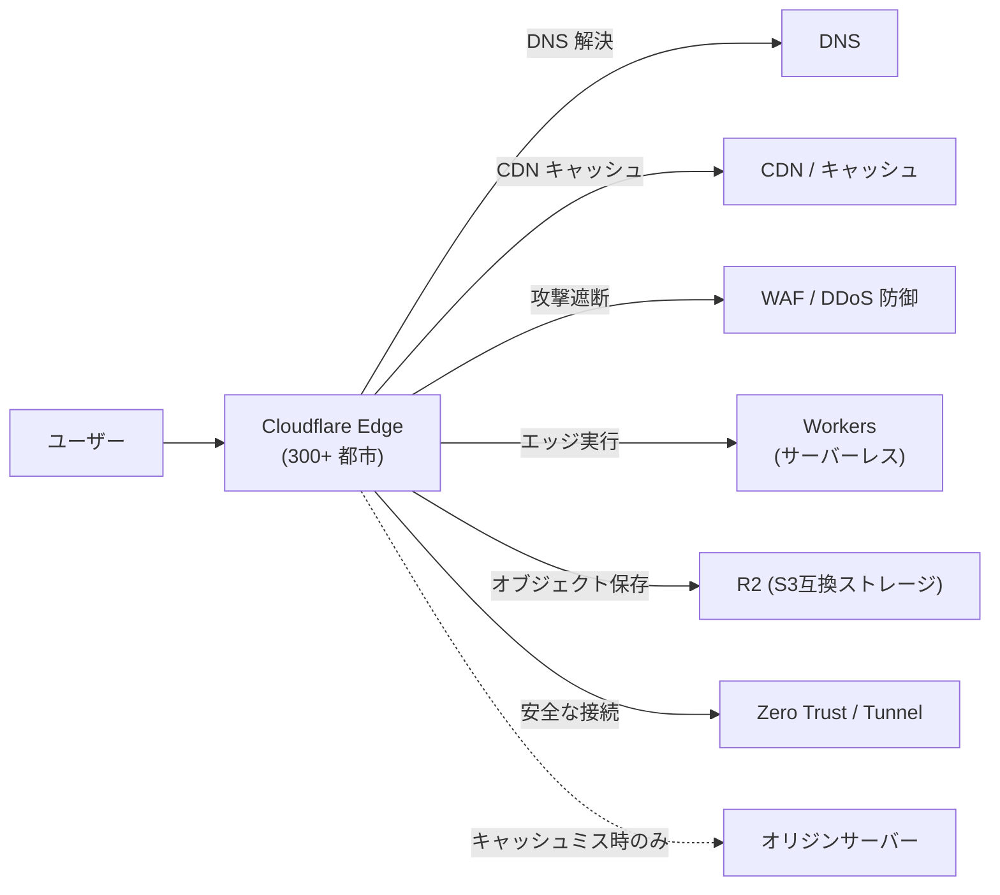

# Cloudflare でできること(CDN・WAF・Workers・Zero Trust などの概要)

## 概要

Cloudflare は、世界中に分散した edge network(CDN)を基盤に、DNS・CDN・セキュリティ(DDoS 防御・WAF)・エッジコンピューティング(Workers)・ストレージ(R2)・ゼロトラストネットワーク(Zero Trust / Tunnel)などを統合的に提供するプラットフォームです。ユーザーのリクエストは、まずオリジンサーバーではなく最寄りの Cloudflare エッジロケーションで受け止められ、そこでキャッシュ配信・脅威フィルタリング・コード実行までを完結させられるのが特徴です。



## 何が嬉しいのか

Cloudflare を使わない場合、以下をそれぞれ別々のサービスやミドルウェアで自前構築・運用する必要があります。

- **CDN/キャッシュ**: オリジンへの負荷を減らし、世界中どこからでも低レイテンシで配信 → 自前だと CDN ベンダー契約 or リバースプロキシの多拠点展開が必要
- **DDoS 防御・WAF**: L3/L4 から L7(SQLi, XSS 等)までの攻撃をエッジで遮断 → 自前だと専用アプライアンスやクラウドの WAF サービスを個別導入
- **DNS**: 高速・高可用な権威 DNS(多くの場合、他社より低レイテンシ) → 自前だと DNS プロバイダの別契約
- **Workers**: オリジンサーバーを介さず、ユーザーに最も近いエッジで JS/Wasm コードを実行(A/Bテスト、認証、画像最適化などをリクエスト時に処理) → 自前だとオリジン側で処理するためレイテンシが増え、負荷も集中
- **Zero Trust / Tunnel**: VPN を使わずに社内システムへ安全にアクセスさせたり、オリジンのグローバル IP を非公開のままサービス公開できる → 自前だと VPN 構築・グローバル IP 露出のリスク管理が必要

具体的なユースケースとしては、「個人ブログや SaaS のフロントを Cloudflare 経由にして無料で DDoS 対策と CDN を得る」「Workers + KV/R2 でオリジンサーバー無しの軽量 API を構築する」「Cloudflare Tunnel で自宅サーバーをグローバル IP 無しに安全公開する」などが代表的です。

## 詳細

主要なプロダクト群は以下のように整理できます。

| カテゴリ | サービス例 | できること |
|---|---|---|
| ネットワーク/配信 | CDN, Argo Smart Routing, Load Balancing | 静的/動的コンテンツのキャッシュ配信、最適経路でのオリジン中継、複数オリジン間の負荷分散 |
| セキュリティ | WAF, DDoS Protection, Bot Management, SSL/TLS(無料証明書) | L3〜L7 の攻撃防御、ボット判定、常時 HTTPS 化 |
| DNS | Cloudflare DNS, Registrar | 高速な権威 DNS、ドメイン管理 |
| エッジコンピューティング | Workers, Pages, Durable Objects | V8 Isolate ベースの軽量サーバーレス実行環境。コールドスタートがほぼ無い |
| ストレージ/DB | R2(オブジェクトストレージ, egress 無料), KV, D1(SQLite), Workers Queues | エッジに近いデータストア |
| ネットワークセキュリティ | Zero Trust(Access), Tunnel, WARP | VPN レスでの社内アクセス制御、オリジン非公開化 |

代表的な使い方として、DNS の A/CNAME レコードを Cloudflare のネームサーバーに向ける(いわゆる「オレンジクラウド」を有効化する)だけで、CDN・WAF・DDoS 防御が自動的に有効になります。

Workers を使う場合の簡単な例(リクエストをエッジで加工する):

```javascript
export default {
  async fetch(request) {
    const url = new URL(request.url);
    if (url.pathname === "/hello") {
      return new Response("Hello from the edge!");
    }
    return fetch(request); // それ以外はオリジンへフォワード
  },
};
```

注意点としては、

- 無料プランでも多くの機能(CDN, DNS, 基本的な DDoS 防御, SSL)が使えますが、高度な WAF ルールやレート制限、詳細なアナリティクスは有料プラン(Pro/Business/Enterprise)が必要です
- Workers はオリジンに比べて実行時間やメモリに制約があるため、重い処理には不向きです
- キャッシュの挙動(Cache-Control ヘッダーの扱いなど)を理解していないと、意図しない古いコンテンツ配信や、逆にキャッシュが効かず高負荷になるケースがあります
- 「オレンジクラウド」を有効にするとオリジンの実 IP が Cloudflare 経由になりますが、オリジン IP が別経路(過去の DNS 履歴やメールヘッダーなど)から漏洩すると防御を迂回されるリスクがあるため、オリジン側のファイアウォールで Cloudflare の IP レンジのみ許可するといった対策が推奨されます

## 参考リンク

- [Cloudflare 公式ドキュメント](https://developers.cloudflare.com/)
- [What is Cloudflare?](https://www.cloudflare.com/learning/what-is-cloudflare/)
- [Cloudflare Workers ドキュメント](https://developers.cloudflare.com/workers/)
- [Cloudflare Zero Trust ドキュメント](https://developers.cloudflare.com/cloudflare-one/)
