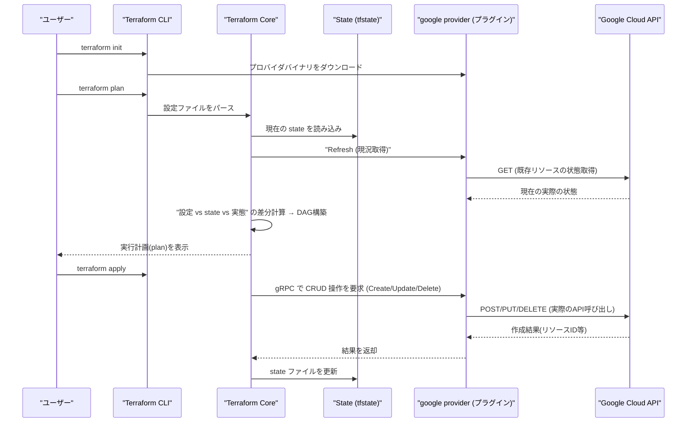
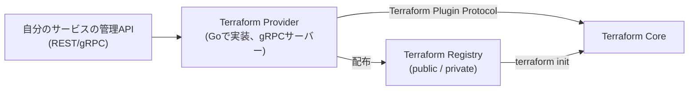

# Terraformで定義したインフラがGoogle Cloud上に作成されるまでの内部の流れ

## 概要

`terraform apply` を実行すると、Terraform 本体(Terraform Core)が設定ファイル(`.tf`)と状態ファイル(state)を読み込み、変更が必要なリソースの依存関係グラフ(DAG)を構築します。そのグラフに従って、Terraform Core は gRPC ベースの **Terraform Plugin Protocol** 経由で Google Cloud プロバイダ(プラグインバイナリ)を呼び出し、プロバイダが内部で Google Cloud の REST API(Cloud Resource Manager API・Compute Engine API など)を叩くことで、実際のリソースが作成されます。



この仕組みは Google Cloud に限った話ではなく、任意のサービスを Terraform に対応させたい場合にも同じ構造が使われます。自分の管理 API を Terraform Plugin Protocol に変換する「Terraform Provider」というアダプタ層を実装することで、独自サービスのリソースも `terraform apply` から作成できるようになります。



## 何が嬉しいのか

手作業で `gcloud` コマンドやコンソールからリソースを作る場合と比べて、以下が改善されます。

- **宣言的・冪等**: 「あるべき姿」を書くだけでよく、実行するたびに現状との差分だけが適用される。同じ `apply` を何度実行しても意図しない再作成が起きない
- **実行前に変更内容を確認できる (dry-run)**: `terraform plan` で「何が作成・変更・削除されるか」を事前に確認でき、本番環境への誤操作を防げる
- **依存関係の自動解決**: 例えば VPC → サブネット → インスタンスのような依存を DAG として自動解決し、並列実行できる部分は並列に、依存がある部分は順序を守って実行してくれる
- **ドリフト検知**: コンソールから手動変更が入った場合も `plan` 時にコード(あるべき姿)との差分として検出できる
- **複数クラウド・複数プロバイダを同じワークフローで扱える**: GCP に限らず AWS・Kubernetes・Datadog など様々なプロバイダを同じ HCL の記法・同じ CLI コマンドで統一的に管理できる

これらのメリットは Google Cloud のような公式プロバイダに限らず、自作の Provider を実装すれば自分のサービスのリソースにも適用できます。Terraform Core は「HCL の設定 ⇔ HTTP リクエストの形式」を知らず、あくまで「CRUD/Import の RPC を呼ぶ」という抽象化されたインターフェースしか持っていません。REST の JSON スキーマと Terraform の型システム(`cty`、`Attribute`/`Block` のスキーマ)は別物なので、API を単に公開するだけでは `terraform apply` から呼び出すことはできず、この変換を担う Provider が別途必要になります。

## 詳細

### 1. `terraform init` — プロバイダのダウンロード

`.tf` ファイル内の `required_providers` ブロック(例: `hashicorp/google`)を見て、Terraform Registry からプロバイダの実行バイナリを `.terraform/providers/` 配下にダウンロードします。プロバイダは Go で実装された独立した実行ファイルで、Terraform Core とは別プロセスとして動作します。

### 2. `terraform plan` — 差分計算と実行計画の作成

1. **State のロード**: 前回 apply 時の state(`terraform.tfstate`。リモートバックエンド、例えば GCS バケットに保存されることが多い)を読み込む
2. **Refresh**: state 上のリソースについて、プロバイダ経由で実際の GCP 上の現況を取得する(手動変更によるドリフトを検出するため)
3. **DAG の構築**: 設定ファイル中のリソース間の参照関係(例: `google_compute_instance` が `google_compute_network.self_link` を参照している、など)から有向非巡回グラフを構築し、実行順序を決定する
4. **差分計算**: 「設定(あるべき姿)」「state(前回の記録)」「実際の状態(refresh結果)」を突き合わせ、Create / Update(in-place または destroy&create) / Delete のいずれかのアクションを各リソースに割り当てる

### 3. `terraform apply` — 実際の作成

Terraform Core とプロバイダは Terraform Plugin Protocol(gRPC ベース、現行は protocol v6)で通信します。Core は DAG を辿りながら、各ノード(リソース)に対して `ApplyResourceChange` などの RPC をプロバイダに投げます。

例えば `google_compute_instance` リソースを作成する場合、google provider はその RPC を受け取ると、内部で Google Cloud の Compute Engine API(`compute.googleapis.com`)に対して `instances.insert` の REST/gRPC 呼び出しを行います。GCP 側は非同期の Operation を返すことが多く、プロバイダはそのオペレーションが完了する(`DONE` になる)までポーリングしてから Terraform Core に結果を返します。

```hcl
resource "google_compute_instance" "example" {
  name         = "my-instance"
  machine_type = "e2-small"
  zone         = "asia-northeast1-a"
  # ...
}
```

上記のようなリソース定義に対して、内部的にはおおよそ次のような処理が走ります。

- provider が Google Cloud の Go クライアントライブラリ(`google-api-go-client` や `google-cloud-go`)を使い、サービスアカウントの認証情報(ADC: Application Default Credentials)で認証
- `POST https://compute.googleapis.com/compute/v1/projects/{project}/zones/{zone}/instances` 相当の呼び出しを実行
- 返却された Operation を `GET .../operations/{operation}` でポーリングし完了を待つ
- 作成されたリソースの実 ID や属性を Terraform Core に返す

### 4. State の更新

apply が成功すると、作成されたリソースの実際の属性(インスタンスID・IPアドレスなど)を含めて state ファイルが更新されます。この state が「Terraform が管理しているリソースの唯一の正」となり、次回の plan/apply の差分計算の基準になります。チーム開発では state を GCS などのリモートバックエンドに置き、ロックを取りながら共有するのが一般的です。

### 5. 注意点

- プロバイダはあくまで GCP の REST API のラッパーであり、Terraform 自体が GCP と直接プロトコルで話しているわけではない(=プロバイダの実装次第でカバーできるリソース・属性が変わる)
- state とクラウド上の実態が乖離すると(手動変更・state 削除など)、意図しない差分や再作成が発生しうるため、State は正しく管理する必要がある
- 依存関係が誤って解決される(例: 暗黙の依存が `depends_on` なしでは検出できない)場合、リソースの作成順序が崩れることがある

### 6. 自作サービスを Terraform に対応させる場合に必要なこと

自分でインフラ系サービスを開発し、それを Terraform に対応させたい場合、「API を公開する → Provider を実装する → Registry で配布する」の3ステップが必要になります。API を公開するだけでは必要条件ではあっても十分条件ではありません。

#### 6.1 管理 API 側の要件

単に CRUD の API があれば良いわけではなく、Terraform のライフサイクルに耐えられる設計が必要です。

- **Create**: 作成した実体を一意に識別できる ID を返すこと(Terraform はこの ID を state に保存し、以降 Read/Update/Delete の際に使います)
- **Read(Get)**: 現在の実際の状態を取得できること。これが `terraform plan` の差分計算・ドリフト検知の基盤になる。作成直後だけでなく、いつでも最新状態を返せる必要がある
- **Update**: 部分更新(PATCH 相当)ができない属性がある場合、provider 側で「変更したら delete&create し直す」(`ForceNew`)という設計にする必要があるため、どの属性が in-place 更新可能かをドキュメント化しておくこと
- **Delete**: 冪等であること(既に存在しないリソースを delete しても成功扱いにする、など)
- **べき等性**: 同じ Create リクエストを再送しても二重作成されない、あるいは Terraform 側でリトライしても安全な設計が望ましい
- **非同期処理への対応**: 作成に時間がかかる場合、Operation ID を返して `GET /operations/{id}` でポーリングできるようにしておくと、provider 側の実装がしやすくなる(GCP の Compute Engine API などと同じパターン)

#### 6.2 Terraform Provider の実装

ここが一番のボリュームです。HashiCorp 公式の [terraform-plugin-framework](https://developer.hashicorp.com/terraform/plugin/framework)(現在推奨されている実装方法。旧来の `terraform-plugin-sdk/v2` は保守モード)を使って Go でバイナリを実装します。

- **Schema 定義**: リソースごとに、どの属性が `Required`/`Optional`/`Computed`(API が決める値)か、型は何か(string/number/list/map/nested block)を定義
- **CRUD メソッドの実装**: `Create`/`Read`/`Update`/`Delete` の各メソッド内で、自分の API クライアントを呼び出し、レスポンスを Terraform の state 型に詰め替える
- **Import のサポート**: `terraform import` で既存リソースを取り込めるようにする(`ImportState` メソッド)。手動で作られたリソースを Terraform 管理下に移行するために重要
- **State のバージョニング**: API のスキーマが将来変わったときに、古い state を新しいスキーマへ変換する `StateUpgrader` を用意しておくと、破壊的変更をしても既存ユーザーの state を壊さずに済む
- **認証**: provider block(`provider "yourservice" { ... }`)で API キーやトークンを受け取り、各 API 呼び出しに使う
- **エラーハンドリング/リトライ**: ネットワークエラーやレート制限に対するリトライを provider 内で実装しておくと利用者体験が良くなる

#### 6.3 配布

provider バイナリは `terraform-provider-<name>` という命名規則の実行ファイルとして、[Terraform Registry](https://developer.hashicorp.com/terraform/registry) に公開する(GitHub Releases + GPG 署名 + `terraform-registry-manifest.json` があれば自動連携できる)か、社内利用のみなら Private Registry やファイルシステムミラーで配布します。公開後は `terraform { required_providers { yourservice = { source = "your-org/yourservice" } } }` と書けば `terraform init` でダウンロードできるようになります。

#### 6.4 (近道)OpenAPI がある場合のコード生成

すでに OpenAPI(Swagger)仕様がある場合、HashiCorp 公式の [terraform-plugin-codegen-openapi](https://github.com/hashicorp/terraform-plugin-codegen-openapi) を使うと、OpenAPI スペック → Provider Code Specification(JSON) → `terraform-plugin-codegen-framework` で Go の scaffold コードを自動生成、という流れで CRUD の雛形をかなり省力化できます。ただし手作業でのカスタマイズ(非同期処理のポーリング、`ForceNew` の判定など)は結局必要になることが多いです。この生成パイプラインは 2023年に developer preview として発表されたもので、**現時点でどこまで GA・安定運用されているかは要確認**です(最新状況は公式ドキュメントで確認してください)。

もう一つの簡易な選択肢として、コミュニティ製の汎用 provider(例: `terraform-provider-restapi` 系)を使い、Go コードを書かずに REST API を Terraform から叩く方法もありますが、複雑な非同期処理やスキーマバリデーションには向かないため、本格的に配布するサービスであれば専用 provider を書く方が結局は堅牢です。

## 参考リンク

- [Terraform Core の内部アーキテクチャ(How Terraform Works)](https://developer.hashicorp.com/terraform/plugin/how-terraform-works)
- [Terraform Plugin Protocol](https://developer.hashicorp.com/terraform/plugin/how-terraform-works#terraform-plugin-protocol)
- [google provider (Terraform Registry)](https://registry.terraform.io/providers/hashicorp/google/latest/docs)
- [Terraform state の概要](https://developer.hashicorp.com/terraform/language/state)
- [Terraform Plugin Framework(公式)](https://developer.hashicorp.com/terraform/plugin/framework)
- [Custom Framework Providers チュートリアル](https://developer.hashicorp.com/terraform/tutorials/providers-plugin-framework)
- [Writing custom Terraform providers(HashiCorp Blog)](https://www.hashicorp.com/en/blog/writing-custom-terraform-providers)
- [OpenAPI provider spec generator(コード生成)](https://developer.hashicorp.com/terraform/plugin/code-generation/openapi-generator)
- [Terraform Registry へのプロバイダ公開手順](https://developer.hashicorp.com/terraform/registry/providers/publishing)
