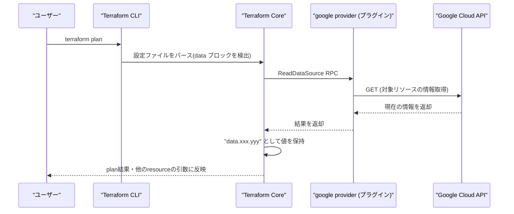

# Terraform の data ブロックとは何か(仕組みと使いどころ)

## 概要

`data` ブロックは、Terraform の管理外にある既存リソースの情報や、プロバイダ API から動的に取得した情報を**読み取り専用**で参照するための仕組みです。`resource` ブロックと異なり、リソースの作成・変更・削除は一切行わず、対象の情報を GET 相当の API 呼び出しで取得して Terraform 内で使えるようにするだけです。



## 何が嬉しいのか

`data` ブロックを使わない場合、外部の値を手作業で調べてハードコードするしかありませんが、`data` を使うと以下が改善されます。

- **Terraform 管理外のリソースを参照できる**: 別チームが管理する VPC や、手動作成済みの共有 IAM ロールなど、自分の Terraform では管理していないリソースの情報を参照して自分のリソースに組み込める
- **動的な最新情報を取得できる**: 例えば「最新の OS イメージ」「現在のプロジェクト番号」「利用可能なゾーン一覧」などをハードコードせずに毎回取得できる
- **state を分割していても情報を橋渡しできる**: `terraform_remote_state` データソースを使えば、別の state (別リポジトリ/別チーム管理) の output を参照できる
- **ハードコードによる環境依存・typo を防げる**: リソース ID などを手打ちせず、名前やタグなど分かりやすい条件で検索して取得できる

## 詳細

### 基本構文

```hcl
data "google_compute_network" "default" {
  name = "default"
}

resource "google_compute_instance" "example" {
  # data で取得した値を参照する
  network_interface {
    network = data.google_compute_network.default.self_link
  }
}
```

参照は `data.<type>.<name>.<属性>` の形式で行います。

### plan/apply 時の挙動

- `data` ブロックの引数がすべて事前に確定している場合、`terraform plan` の時点でプロバイダに対して読み取り(Read)の RPC が発行され、API から値を取得します
- `data` の引数が同じ設定内の他の `resource` の出力(apply するまで値が確定しない属性)に依存している場合、その `resource` が実際に apply されるまで `data` の読み込みが遅延されます(`known after apply` として plan に表示されます)
- 明示的に依存関係を示したい場合は `depends_on` を data ブロックにも指定できます
- 取得した値は resource の state とは別の扱いですが、Terraform の state ファイルにも記録されます。基本的には `plan`/`apply` のたびに毎回 API へ問い合わせて最新化されます(常に「今の実際の値」を見に行く点が `resource` の refresh と似ています)

### 注意点

- API 呼び出しが発生するため、`data` の数が多いと `terraform plan` に時間がかかったり、API のレート制限に引っかかる場合があります
- 対象のリソースが存在しない場合、通常は `null` を返さず**エラー**になります(存在確認には使いにくい)
- `count` / `for_each` を使って複数取得することも可能です
- プロバイダによっては、同じ `data` ブロックでも取得タイミングによって結果が変わりうる(例: 「最新イメージ」を取る `data` は日によって別の値になる)ため、意図せず差分が出ないか注意が必要です

### Google Cloud での具体的な活用シーン

**1. 最新の OS イメージを取得してインスタンスに使う**

「最新の Debian イメージ」のような可変の情報をハードコードせずに取得できます。

```hcl
data "google_compute_image" "debian" {
  family  = "debian-12"
  project = "debian-cloud"
}

resource "google_compute_instance" "vm" {
  boot_disk {
    initialize_params {
      image = data.google_compute_image.debian.self_link
    }
  }
  # ...
}
```

**2. 別チーム管理の共有 VPC / サブネットを参照する**

ネットワーク基盤は別のリポジトリ・別チームが Terraform で管理しているケースは多く、自分の state ではそれを作らず参照だけしたい場合に使います。

```hcl
data "google_compute_subnetwork" "shared" {
  name    = "shared-subnet-asia-northeast1"
  region  = "asia-northeast1"
  project = "network-host-project"
}

resource "google_compute_instance" "vm" {
  network_interface {
    subnetwork = data.google_compute_subnetwork.shared.self_link
  }
}
```

**3. 現在のプロジェクト情報・呼び出し元の認証情報を取得する**

モジュールを様々なプロジェクトで使い回す際、`project_id` や `project_number` をハードコードせずに参照できます(例えばサービスアカウントのメールアドレスの組み立てや、IAM 権限の付与先指定などに使います)。

```hcl
data "google_project" "current" {}

resource "google_project_iam_member" "pubsub_sa" {
  project = data.google_project.current.project_id
  role    = "roles/pubsub.publisher"
  # Cloud Storage のイベント通知が使う Google 管理のサービスエージェントなど
  member  = "serviceAccount:service-${data.google_project.current.number}@gs-project-accounts.iam.gserviceaccount.com"
}
```

**4. 既存のサービスアカウントに IAM ロールを付与する**

サービスアカウント自体は別の仕組み(手動、別モジュール)で作成済みで、そのメールアドレスをキーに参照し、権限だけを Terraform で管理したいケースです。

```hcl
data "google_service_account" "existing" {
  account_id = "ci-deployer"
}

resource "google_project_iam_member" "deployer_binding" {
  project = "my-project"
  role    = "roles/run.admin"
  member  = "serviceAccount:${data.google_service_account.existing.email}"
}
```

**5. Secret Manager に格納済みのシークレットを参照する**

DB パスワードや API キーなどを Terraform コード上に直書きせず、Secret Manager 側で管理し、値だけを参照して他リソースの設定(環境変数など)に渡します。

```hcl
data "google_secret_manager_secret_version" "db_password" {
  secret = "db-password"
}

resource "google_cloud_run_v2_service" "api" {
  template {
    containers {
      env {
        name  = "DB_PASSWORD"
        value = data.google_secret_manager_secret_version.db_password.secret_data
      }
    }
  }
}
```

> ⚠️ 取得した値は Terraform の state ファイルに平文で記録されるため、state の保管場所(GCS バケットの権限など)には注意が必要です。

**6. `terraform_remote_state` で別 state の output を参照する**

ネットワーク基盤の state と、アプリケーション用の state を分割管理している場合、GCS バックエンドの remote state を直接参照して橋渡しできます。

```hcl
data "terraform_remote_state" "network" {
  backend = "gcs"
  config = {
    bucket = "my-org-terraform-state"
    prefix = "network"
  }
}

resource "google_compute_instance" "vm" {
  network_interface {
    subnetwork = data.terraform_remote_state.network.outputs.subnet_self_link
  }
}
```

これらはいずれも「Terraform の外(別チーム・別リソース・API 側で動的に決まる値)にある情報を、安全かつハードコードせずに自分の設定に取り込む」という `data` ブロック本来の役割の具体例です。

## 参考リンク

- [Data Sources - Terraform Language Documentation](https://developer.hashicorp.com/terraform/language/data-sources)
- [terraform_remote_state Data Source](https://developer.hashicorp.com/terraform/language/state/remote-state-data)
- [How Terraform Works (プラグインプロトコル)](https://developer.hashicorp.com/terraform/plugin/how-terraform-works)
