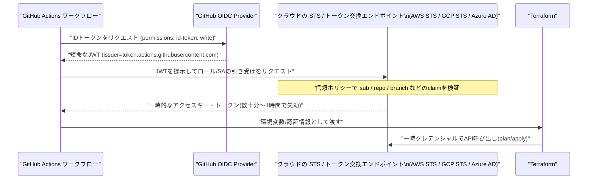
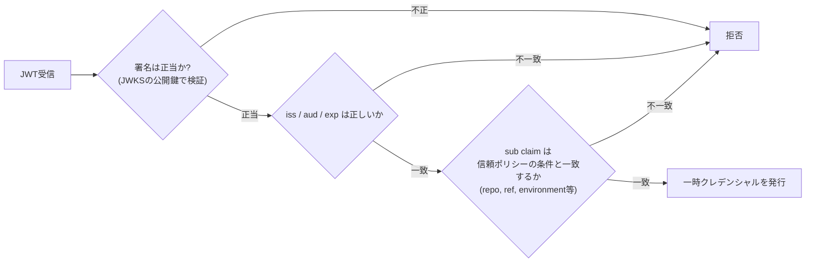

# GitHub Actions から Terraform 実行時に OIDC でクラウド認証する方法

## 概要

GitHub Actions から Terraform で AWS / GCP / Azure などを操作する際、従来はクラウドの「長期間有効なアクセスキー(AWS の Access Key、GCP のサービスアカウント JSON キーなど)」を GitHub Secrets に保存して使うのが一般的でした。**OIDC (OpenID Connect) 認証**を使うと、GitHub Actions のワークフロー実行ごとに発行される短命なトークンをクラウド側に検証させ、その場限りの一時クレデンシャルと交換する形で認証できます。長期キーを一切保存せずに Terraform を実行できるのがポイントです。



「キーを使わない」というのは正確には「長期の静的なキーを使わない」という意味で、実際の認証の裏では非対称鍵暗号による署名検証が行われています。詳細は後述します。

## 何が嬉しいのか

長期キーを GitHub Secrets に置く方式には、以下のような課題があります。

- **漏洩時の被害が大きい**: Secrets が誤って出力されたり、リポジトリのアクセス権を持つ人が悪用すると、失効するまで無期限に使われ続けるキーが流出する
- **ローテーションが手動**: セキュリティ的にはキーを定期的にローテーションすべきだが、実際には放置されがちで、いつ発行したキーかも追いにくい
- **管理コスト**: 複数リポジトリ・複数環境ごとにキーを発行・配布・管理する手間がかかる

OIDC 認証にすると、

- **静的なキーが不要**: クラウド側に長期キーを一切作らずに済む(漏洩する対象そのものがなくなる)
- **自動失効**: 発行されるクレデンシャルは数十分〜1時間程度で自動的に無効になる
- **アクセス範囲を細かく制御できる**: クラウド側の信頼ポリシーで「どのリポジトリの」「どのブランチ/Environment の」ワークフローだけを許可するか、JWT の claim(`sub`, `repo`, `ref`, `environment` など)で細かく絞り込める
- **監査がしやすい**: どのワークフロー実行がどの一時クレデンシャルを使ったか、claim ベースでトレースしやすい

典型的なユースケースは、「複数の GitHub リポジトリから、それぞれ対応する AWS アカウント/GCP プロジェクトの Terraform state を安全に更新したい。ただし長期キーは一切発行したくない」というケースです。

## 詳細

### 共通の前提: ワークフロー側の権限設定

共通して必要なのは、ワークフロー側で ID トークンをリクエストする権限です。

```yaml
permissions:
  id-token: write   # OIDCトークンをリクエストするために必須
  contents: read
```

これがないと `Error: Not authorized to perform sts:AssumeRoleWithWebIdentity`(AWS の場合)のようなエラーになります。

### AWS の場合

1. IAM で **OIDC ID プロバイダ**を作成(`https://token.actions.githubusercontent.com` を信頼するプロバイダを1回だけ登録)
2. Terraform 実行用の IAM ロールを作成し、信頼ポリシーで対象を絞る

```json
{
  "Version": "2012-10-17",
  "Statement": [
    {
      "Effect": "Allow",
      "Principal": {
        "Federated": "arn:aws:iam::123456789012:oidc-provider/token.actions.githubusercontent.com"
      },
      "Action": "sts:AssumeRoleWithWebIdentity",
      "Condition": {
        "StringEquals": {
          "token.actions.githubusercontent.com:aud": "sts.amazonaws.com"
        },
        "StringLike": {
          "token.actions.githubusercontent.com:sub": "repo:hiramekun/tech-notes:ref:refs/heads/main"
        }
      }
    }
  ]
}
```

3. ワークフローで [`aws-actions/configure-aws-credentials`](https://github.com/aws-actions/configure-aws-credentials) を使う

```yaml
- uses: aws-actions/configure-aws-credentials@v4
  with:
    role-to-assume: arn:aws:iam::123456789012:role/terraform-ci
    aws-region: ap-northeast-1
- run: terraform plan
```

このアクションが一時クレデンシャルを環境変数(`AWS_ACCESS_KEY_ID` など)に設定してくれるので、Terraform の AWS provider は特別な設定なしにそのまま認証されます。

### GCP の場合

**Workload Identity Federation** を使います(issue #47 で扱った GKE 版の Workload Identity と考え方は同じで、対象が「GKE の KSA」から「GitHub Actions の OIDC トークン」に変わったものです)。

1. Workload Identity Pool と Provider を作成し、GitHub の OIDC issuer を信頼させる
2. サービスアカウントに対して、そのプロバイダからの「なりすまし(impersonate)」を許可する属性条件を設定(例: `assertion.repository == 'hiramekun/tech-notes'`)
3. ワークフローで [`google-github-actions/auth`](https://github.com/google-github-actions/auth) を使う

```yaml
- uses: google-github-actions/auth@v2
  with:
    workload_identity_provider: projects/123456789/locations/global/workloadIdentityPools/github-pool/providers/github-provider
    service_account: terraform-ci@my-project.iam.gserviceaccount.com
- run: terraform plan
```

GCP のサービスアカウント JSON キーを一切発行せずに済む点は、#47 で説明した「Workload Identity で鍵ファイル不要にする」のと同じ効果です。

### Azure の場合

Azure AD (Entra ID) の**フェデレーション資格情報(Federated Credential)**をアプリ登録に追加し、issuer に `https://token.actions.githubusercontent.com`、subject に `repo:<org>/<repo>:ref:refs/heads/main` のような値を設定します。ワークフローでは [`azure/login`](https://github.com/Azure/login) を `client-id` / `tenant-id` / `subscription-id` を指定して呼び出すだけで、client secret 不要で認証できます。

### 何が検証されているのか(署名と claim の2段階検証)

「長期キーを使わない」のに認証できるのは、裏で JWT の署名検証が行われているためです。GitHub Actions が発行する OIDC トークンは **JWT (JSON Web Token)** で、次の3パートから構成されます。

- Header: 署名アルゴリズムなど
- Payload: `sub`(例: `repo:hiramekun/tech-notes:ref:refs/heads/main`)、`aud`、`iss`、`exp` などの claim
- Signature: GitHub 側が秘密鍵で署名した値

このトークンを GitHub が**秘密鍵で署名**し、クラウド側(AWS STS / GCP STS / Azure AD)がその署名を**公開鍵で検証**します。つまり「毎回のワークフロー実行ごとに使い捨てのキーペアで署名・検証している」のであって、鍵そのものがなくなったわけではありません。ポイントは、この鍵ペアを GitHub が管理・自動ローテーションしていて、利用者側(リポジトリ側)は一切キーを保存・管理しなくてよいという点です。

公開鍵は、各クラウドが OIDC プロバイダ登録時に issuer (`https://token.actions.githubusercontent.com`) の **JWKS (JSON Web Key Set) エンドポイント** (`https://token.actions.githubusercontent.com/.well-known/jwks`) を信頼するよう設定することで取得されます。トークン検証時、クラウド側はこのエンドポイントから最新の公開鍵を取得して署名を検証します。この「GitHub の公開鍵基盤を信頼する」という設定こそが、AWS でいう「IAM で OIDC ID プロバイダを作成する」手順の正体であり、1回だけ登録すればよい理由です。

署名が正当(=確かに GitHub が発行したトークン)だと確認できても、それだけでは「どのリポジトリ・どのブランチからの実行か」まではわかりません。そこで信頼ポリシー側で claim を照合します。



つまり検証は2段階です。

1. **暗号的な検証**: このトークンは本当に GitHub が発行したものか(署名検証)、有効期限内か
2. **認可の検証**: このトークンの持ち主(`sub` などの claim が示すリポジトリ/ブランチ)は、このロール/サービスアカウントを引き受けてよいか(信頼ポリシーとの照合)

長期キーとの決定的な違いは、「秘密の値を知っていること」を証明する方式(事前共有シークレット)から、「信頼された発行者が署名した、検証可能な事実の集合(claim)」を提示する方式に変わったことです。前者は漏洩すれば誰でもなりすませますが、後者は署名鍵を持つ GitHub 以外には偽造できず、しかもトークンは数分〜数十分で失効します。

### 共通の注意点

- **`sub` claim の絞り込みを忘れない**: 信頼ポリシーの条件を緩く(`repo:org/repo:*` のようにワイルドカードで全ブランチ・全 PR 許可)すると、フォークからの PR やどのブランチからでもロールを引き受けられてしまう可能性があります。本番用のロールは `ref:refs/heads/main` や特定の GitHub Environment(`environment:production`)に限定するのが安全です
- **Terraform state の権限とは別物**: OIDC はあくまで「クラウド API を叩く一時クレデンシャルの取得方法」なので、S3/GCS などの state バックエンドへの読み書き権限は別途 IAM ポリシー側で許可する必要があります
- **ローカル実行との使い分け**: OIDC はあくまで CI(GitHub Actions 実行環境)向けの仕組みで、開発者がローカルから同じロールを引き受けたい場合は別途 `aws sso` や `gcloud auth application-default login` などの手段が必要です

## 参考リンク

- [About security hardening with OpenID Connect - GitHub Docs](https://docs.github.com/en/actions/deployment/security-hardening-your-deployments/about-security-hardening-with-openid-connect)
- [Configuring OpenID Connect in Amazon Web Services - GitHub Docs](https://docs.github.com/en/actions/deployment/security-hardening-your-deployments/configuring-openid-connect-in-amazon-web-services)
- [aws-actions/configure-aws-credentials](https://github.com/aws-actions/configure-aws-credentials)
- [Configuring OpenID Connect in Google Cloud Platform - GitHub Docs](https://docs.github.com/en/actions/deployment/security-hardening-your-deployments/configuring-openid-connect-in-google-cloud-platform)
- [google-github-actions/auth](https://github.com/google-github-actions/auth)
- [Configuring OpenID Connect in Azure - GitHub Docs](https://docs.github.com/en/actions/deployment/security-hardening-your-deployments/configuring-openid-connect-in-azure)
- [Azure/login](https://github.com/Azure/login)
- [OpenID Connect Core 1.0](https://openid.net/specs/openid-connect-core-1_0.html)
