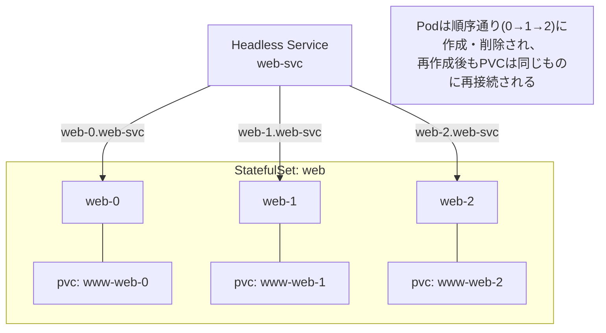
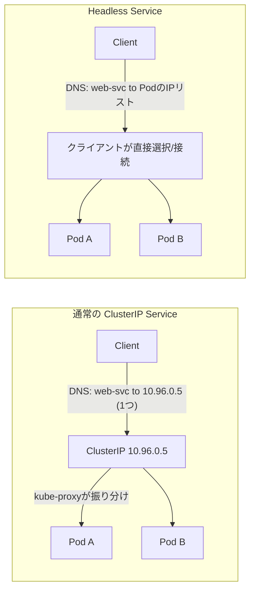

# Kubernetes StatefulSet の仕組みとユースケース

## 概要

`StatefulSet` は Kubernetes のワークロードリソースの一つで、Deployment と違い **Pod ごとに固定のアイデンティティ(名前・ネットワーク識別子・永続ストレージ)を保証**しながら管理する仕組みです。Pod は `<name>-0`, `<name>-1`, `<name>-2` のように連番の名前を持ち、再作成されても同じ名前・同じ PVC(永続ボリューム)が再アタッチされます。StatefulSet は多くの場合、Pod ごとに固定の DNS 名を割り当てる **Headless Service**(`clusterIP: None` の Service)とセットで使われます。



## 何が嬉しいのか

Deployment はすべての Pod を「交換可能な複製」として扱うため、Pod が再スケジュールされると名前も IP も PVC も変わり得ます。これはステートレスな Web アプリには適していますが、以下のようなケースでは問題になります。

- **分散データベース・ミドルウェア(MySQL, PostgreSQL, Cassandra, Kafka, Elasticsearch, ZooKeeper など)**: 各ノードが自分専用のデータディレクトリを持ち、クラスタ内で「どのノードが誰か」を識別する必要がある
- **クォーラム(合意形成)を必要とするシステム**: 各メンバーの固定アイデンティティが前提になる(例: `zk-0` がリーダー選出の起点になるなど)
- **順序立てたブートストラップ/スケール**: 例えば「まずプライマリ(`-0`)を起動してから、レプリカを順に起動したい」といった要件

StatefulSet を使わずにこれらを Deployment + PVC で実現しようとすると、Pod 再作成のたびに PVC の再バインドやノード識別のための独自ロジック(init container でホスト名を見て設定を切り替える等)を自前で作り込む必要があり、非常に壊れやすくなります。StatefulSet はこれを Kubernetes 標準機能として解決してくれます。

主なユースケース:
- データベースクラスタ(MySQL Group Replication, PostgreSQL レプリケーション, MongoDB ReplicaSet)
- 分散ストレージ・メッセージング(Kafka, Cassandra, Elasticsearch, RabbitMQ クラスタ)
- 合意アルゴリズムを使うミドルウェア(ZooKeeper, etcd)
- Pod ごとに個別の設定・役割を持たせたいアプリケーション全般

## 詳細

### StatefulSet の主な特徴

1. **安定したネットワーク識別子**
   Headless Service(`clusterIP: None`)と組み合わせて使うことで、各 Pod に `<pod-name>.<service-name>.<namespace>.svc.cluster.local` という固定の DNS 名が割り当てられます。Pod が再作成されても同じ DNS 名でアクセスできます。

2. **安定した永続ストレージ**
   `volumeClaimTemplates` を使うと、Pod ごとに専用の PVC が自動作成されます。Pod が削除・再作成されても、同じ名前の Pod には同じ PVC が再アタッチされます(PVC 自体は StatefulSet や Pod を削除しても自動では消えません)。

3. **順序保証のあるデプロイ・スケーリング**
   デフォルトでは Pod は `0, 1, 2, ...` の順に1つずつ作成され、前の Pod が Running & Ready になってから次が作られます。スケールダウン時は逆順(大きい番号から)で削除されます。この挙動は `podManagementPolicy: Parallel` にすることで無効化(並行作成)も可能です。

4. **順序保証のあるローリングアップデート**
   デフォルトでは番号が大きい Pod から順に更新されます。`updateStrategy` で `RollingUpdate`(部分的な `partition` 指定によるカナリア更新も可能)や `OnDelete`(手動更新)を選べます。

簡単な例:

```yaml
apiVersion: apps/v1
kind: StatefulSet
metadata:
  name: web
spec:
  serviceName: "web-svc"   # Headless Service と紐付け
  replicas: 3
  selector:
    matchLabels:
      app: web
  template:
    metadata:
      labels:
        app: web
    spec:
      containers:
      - name: nginx
        image: nginx
        volumeMounts:
        - name: www
          mountPath: /usr/share/nginx/html
  volumeClaimTemplates:
  - metadata:
      name: www
    spec:
      accessModes: [ "ReadWriteOnce" ]
      resources:
        requests:
          storage: 1Gi
---
apiVersion: v1
kind: Service
metadata:
  name: web-svc
spec:
  clusterIP: None   # Headless Service
  selector:
    app: web
  ports:
  - port: 80
```

注意点:
- PVC は StatefulSet 削除後も残るため、完全にリソースを削除したい場合は明示的に PVC も削除する必要があります(誤ってデータを失わないための安全策)。Kubernetes 1.27+ では `persistentVolumeClaimRetentionPolicy` で自動削除を設定することも可能です。
- 「アプリ自身がクラスタメンバーシップやリーダー選出のロジックを持っている」ことが前提になる場合が多く、StatefulSet を使うだけで自動的に分散システムとして正しく動くわけではありません(アプリ側の対応も必要)。
- ステートレスなアプリ(通常の Web/API サーバーなど)には Deployment の方がシンプルで適しています。

### Headless Service とは何か・なぜ必要か

Kubernetes では Pod は「使い捨て」が前提です。Pod が再起動・再スケジュールされると新しい Pod として作り直され、IP アドレス(CNI が払い出すもの)もそのたびに変わります。クライアント側のコードに Pod の IP を直接ハードコードすると、Pod が入れ替わるたびに壊れてしまいます。この問題を解決するのが `Service` で、「Pod の集合に対して、変わらない名前でアクセスできる窓口」を用意してくれます。この窓口の実装のされ方が、`spec.clusterIP` を持つかどうかで大きく変わります。

**ClusterIP が割り振られる場合(通常の Service)**

Service を作ると、Kubernetes は `10.96.x.x` のような **仮想 IP(ClusterIP)** を1つ割り当てます。「仮想」というのは、この IP はどのノードの NIC にも実体として存在しない、という意味です。実体は各ノード上で動いている `kube-proxy` が作る **iptables(または IPVS)のルール** です。

流れは次のとおりです。

1. クライアントが Service 名(例: `web-svc`)を DNS で引く → ClusterIP(1個の IP)が返る
2. クライアントはその ClusterIP 宛にパケットを送る
3. パケットがノードの netfilter を通過するとき、kube-proxy が仕込んだ iptables ルールが働き、宛先 IP を **その時点で選ばれた1つの Pod の実 IP に書き換える(DNAT)**
4. 以降そのコネクション(TCP なら同じ 5-tuple)は conntrack によって同じ Pod に紐付けられる

ポイントは、**ロードバランシングはコネクション単位で行われる**ことです。1本の TCP コネクションを張っている間はずっと同じ Pod と通信し続けます(HTTP/1.1 の keep-alive で1本のコネクションを使い回すと、実はずっと同じ Pod にしか当たっていない、というのはよくある誤解ポイントです)。クライアントから見ると「1つの安定した IP にアクセスしているだけ」で、背後に何個 Pod がいるか、どの Pod が今生きているかを一切気にする必要がありません。

**ClusterIP が割り振られない場合(Headless, `clusterIP: None`)**

この場合、上記の「仮想 IP + DNAT」の仕組みがまるごと存在しなくなります。

1. kube-proxy はこの Service に対して **iptables/IPVS ルールを一切作りません**(DNAT する対象の仮想 IP がそもそも無いため)
2. その代わり、DNS が Service 名を引かれたときに **背後の Pod の実 IP を(仮想 IP を介さず)そのまま複数の A レコードとして** 返します

```
$ dig web-svc.default.svc.cluster.local  # 通常の Service の場合
;; ANSWER SECTION:
web-svc.default.svc.cluster.local. 30 IN A 10.96.12.34   # ← ClusterIP 1個だけ

$ dig web-svc.default.svc.cluster.local  # Headless Service の場合
;; ANSWER SECTION:
web-svc.default.svc.cluster.local. 30 IN A 10.244.1.5    # ← web-0 の実 IP
web-svc.default.svc.cluster.local. 30 IN A 10.244.2.9    # ← web-1 の実 IP
web-svc.default.svc.cluster.local. 30 IN A 10.244.3.2    # ← web-2 の実 IP
```

「どの IP に接続するか」を選ぶ責任が完全にクライアント側に移ります。何も考えず先頭の1件だけ使えば実質ランダムな1台に固定接続することになりますし、全件に接続すればクライアント側で分散させることもできます。カーネルレベルでのロードバランシングは一切行われません。

さらに StatefulSet と組み合わせると、Pod ごとに個別の DNS 名(`web-0.web-svc.default.svc.cluster.local` など)も同時に解決できるようになります。これは Headless Service の場合にのみ Kubernetes の DNS が作ってくれる特別なレコードで、通常の(ClusterIP を持つ)Service ではこの Pod 個別の DNS 名は作られません。StatefulSet の `spec.serviceName` に Headless Service を指定するのがほぼ必須の使い方であるのはこのためです。

なお Headless Service でも `selector` を指定すれば通常どおり Endpoints/EndpointSlice は作られ Pod と紐付きます。ロードバランシング用の仮想 IP を経由しない、という点だけが通常の Service と異なります。



まとめると次のようになります。

| | ClusterIP あり(通常の Service) | ClusterIP なし(Headless Service) |
|---|---|---|
| DNS が返す値 | 仮想 IP 1個 | Pod の実 IP を複数(複数の A レコード) |
| kube-proxy のルール | 作られる(DNAT) | 作られない |
| ロードバランシングの主体 | カーネル(iptables/IPVS)、コネクション単位 | クライアント自身、または何もしない |
| Pod 個別の DNS 名 | 作られない | 作られる(`<pod>.<svc>...`) |
| StatefulSet との組み合わせ | 使わない | `serviceName` に指定することで Pod ごとの固定 DNS 名を実現するために必須 |
| 向いているケース | ステートレスで「誰でもいいから1台と話せればいい」場合 | 「特定の Pod と話したい」「クライアント側で LB したい」場合(StatefulSet 等) |

ロードバランシングを Kubernetes に任せたいか、クライアント側/アプリ側のロジックに任せたいか、という選択が ClusterIP の有無の本質的な違いです。

なお「Header 付きの Service」という公式な分類は Kubernetes に存在しません。もしその表現を使う場合は、多くは「Headless ではない通常の(ClusterIP を持つ)Service」を指していると考えられます(不確か: この用語の出典・意図までは特定できないため、あくまで推測です)。

### Headless Service を使う場合のクライアント側ロードバランシング

Headless Service では kube-proxy による L4 LB が存在しないため、「誰が・どうやって分散させるか」は完全にクライアント/アプリ側の実装次第になります。代表的なパターンは次のとおりです。

**パターン1: 素朴な DNS ラウンドロビンに頼る(あまり推奨されない)**

Headless Service の DNS は複数の A レコード(Pod IP)を返しますが、多くのプログラミング言語の標準ライブラリ(`getaddrinfo` など)は、名前解決結果の先頭の1件だけを使って接続する実装が多いです。つまり「複数 IP が返ってくる = 自動でロードバランシングされる」わけではなく、何もしなければ実質的に決め打ちの1台に固定接続することが多い点に注意が必要です。TCP コネクションを張りっぱなしにする(keep-alive)場合は特に顕著です。

**パターン2: アプリ自身が名前解決してリクエスト/コネクションごとに選ぶ**

アプリ側で明示的に「Service 名を resolve して複数 IP のリストを取得し、ラウンドロビンやランダムで選んで接続する」というロジックを書く方法です。

```python
import socket, random

def get_backend_ips(service_name):
    return socket.getaddrinfo(service_name, 80, proto=socket.IPPROTO_TCP)

def pick_backend(service_name):
    ips = get_backend_ips(service_name)
    return random.choice(ips)
```

ポイントは、Pod の入れ替わり(再スケジュール等)で IP リストが変わるため、都度あるいは定期的に再 resolve する必要があることです。DNS の TTL やクライアント側のキャッシュ設定によっては古い IP を掴み続けるリスクがあるので、TTL を短くする/明示的に再解決するといった工夫が要ります。

**パターン3: gRPC のクライアントサイドロードバランシング(実用上よく使われる)**

gRPC はこのユースケース向けに標準機能を持っています。接続先を `dns:///` スキームで指定し、gRPC の service config で load balancing policy を `round_robin` に設定すると、gRPC クライアントは次のように動作します。

1. 定期的に DNS を再解決して Pod IP のリストを取得
2. リスト内の全 Pod へ実際にコネクションを張り
3. リクエスト(正確には RPC 呼び出し)ごとにラウンドロビンで送信先を切り替える

Go であれば `grpc.Dial` に `dns:///web-svc.default.svc.cluster.local:50051` のようなターゲットを渡し、`grpc.WithDefaultServiceConfig` の DialOption で `round_robin` ポリシーを指定する service config 文字列(JSON 形式で `loadBalancingPolicy` キーに `round_robin` を指定したもの)を渡すことで実現できます。これは「Headless Service + gRPC クライアントサイド LB」の組み合わせとしてよく使われる典型パターンです(kube-proxy 経由の L4 LB だとコネクション単位でしか分散されず、HTTP/2 の多重化されたストリームが特定の1 Pod に偏ってしまう問題を避けられます)。

**パターン4: ミドルウェア固有の「スマートクライアント」**

Kafka・Cassandra・MongoDB(ReplicaSet)・Elasticsearch などの分散ミドルウェアのクライアントライブラリは、多くの場合 Kubernetes の DNS ラウンドロビンとは別の、アプリケーションプロトコルレベルでのクラスタ認識の仕組みを持っています。

- 最初にどれか1台(または Headless Service 経由の複数台)に接続してクラスタのメタデータ(全ノードのリスト、パーティション/シャードの担当ノードなど)を取得
- 以降はクライアントがそのメタデータを見て、「このパーティションはこのノード宛」「このキーはこのシャード宛」のように自分でルーティング先を決めて直接そのノードに接続

このため StatefulSet + Headless Service で各 Pod に固定 DNS 名を持たせておくことが、こうしたクライアントが「特定のノードを名指しで」接続し続けるための前提になっています。

**パターン5: サービスメッシュのサイドカーに任せる**

Istio や Linkerd などを使っている場合、Pod ごとに付いている Envoy/Linkerd-proxy のサイドカーがトラフィックを透過的にインターセプトし、L7(HTTP/gRPC 単位)でのロードバランシングを代行してくれます。この場合はアプリ自身がロードバランシングロジックを持たなくても、サイドカーが Kubernetes の Endpoints/EndpointSlice を見て分散してくれます。

**まとめ**

| パターン | 分散の主体 | 特徴 |
|---|---|---|
| DNS ラウンドロビン任せ | ほぼされない | 実装依存で先頭 IP 固定になりがち |
| アプリ自前で resolve + 選択 | アプリコード | シンプルだが再解決のタイミング管理が必要 |
| gRPC round_robin ポリシー | gRPC ライブラリ | Headless Service との組み合わせの定番 |
| ミドルウェア固有クライアント | ドライバ/クライアントライブラリ | プロトコルレベルでノードを認識 |
| サービスメッシュ sidecar | Envoy 等のプロキシ | アプリは何もしなくてよい |

どれを選ぶかは「使っているミドルウェア/フレームワークが何を提供しているか」でほぼ決まります。自前で1から実装する(パターン2)よりは、gRPC のようにロードバランサ機能を標準搭載しているクライアント(パターン3)や、ミドルウェア公式のスマートクライアント(パターン4)、あるいはサービスメッシュ(パターン5)に任せるほうが実運用では一般的です。

## 参考リンク

- [StatefulSets | Kubernetes 公式ドキュメント](https://kubernetes.io/docs/concepts/workloads/controllers/statefulset/)
- [Run a Replicated Stateful Application(公式チュートリアル)](https://kubernetes.io/docs/tasks/run-application/run-replicated-stateful-application/)
- [StatefulSet Basics(公式チュートリアル)](https://kubernetes.io/docs/tutorials/stateful-application/basic-stateful-set/)
- [Service | Kubernetes 公式ドキュメント - Headless Services](https://kubernetes.io/docs/concepts/services-networking/service/#headless-services)
- [DNS for Services and Pods | Kubernetes 公式ドキュメント](https://kubernetes.io/docs/concepts/services-networking/dns-pod-service/)
- [gRPC Load Balancing](https://grpc.io/blog/grpc-load-balancing/)
