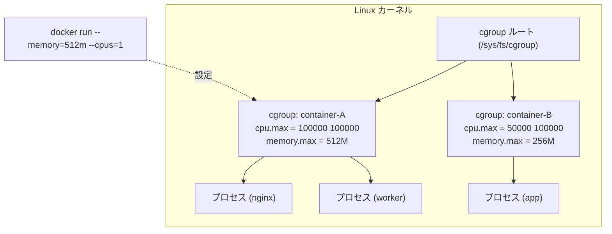
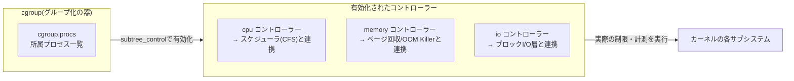
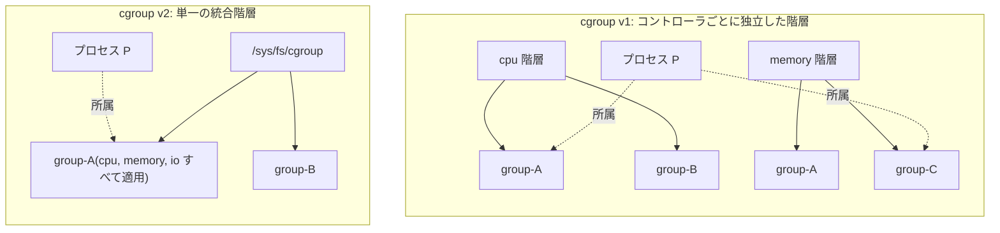

# cgroup とは何か(Linux のリソース制限の仕組み)

## 概要

cgroup(control groups)は、Linux カーネルが提供する **プロセスグループ単位で CPU・メモリ・I/O などのリソース使用量を制限・計測・隔離する機能** です。Docker や Kubernetes(containerd/runc)がコンテナに `--memory`・`--cpus` のようなリソース制限をかけられるのは、内部的にこの cgroup を利用しているためです。

似た名前の概念に「namespace」がありますが役割は異なります。

- **namespace**: プロセスから「何が見えるか」を分離する(PID・ネットワーク・マウントなど)
- **cgroup**: プロセスが「どれだけリソースを使えるか」を制限する

さらに cgroup 自体は「プロセスをグループ化する箱」を提供するだけで、実際にリソースを計測・制限するロジックは **コントローラー(controller)** と呼ばれる部品が担っています。cgroup v1 の文脈では「サブシステム(subsystem)」とも呼ばれ、`cpu` コントローラーはスケジューラ(CFS)と、`memory` コントローラーはページ回収や OOM Killer と連携するというように、コントローラーごとにカーネル内の対応するサブシステムにフックして動作します。





## 何が嬉しいのか

cgroup がないと、1 つのプロセス(コンテナ)が CPU やメモリを使い切ってしまい、同じホスト上の他のプロセス・コンテナに影響を与える「noisy neighbor(うるさい隣人)問題」が起きます。cgroup を使うことで次のようなメリットがあります。

- **リソースの公平な分配**: 1 コンテナが暴走してもホスト全体やほかのコンテナを巻き込まない
- **OOM(メモリ不足)からの保護**: メモリ上限を超えたプロセスだけを cgroup 単位で kill でき、ホスト全体がクラッシュするのを防げる
- **リソース使用量の可視化**: `cgroup` 配下の疑似ファイル(`memory.current`, `cpu.stat` など)を読むだけでプロセスグループ単位のメトリクスが取れる(cAdvisor や `kubectl top` はこれを利用)
- **マルチテナント環境での安全な共存**: Kubernetes の Pod ごとの `resources.requests`/`resources.limits` は、最終的に各 Pod 用の cgroup 設定に変換される

具体例として、Kubernetes で Pod に `resources.limits.memory: 512Mi` を設定すると、kubelet がその Pod のコンテナに対応する cgroup の `memory.max` を 512Mi に設定し、それを超えて確保しようとしたプロセスは OOM Killer に kill されます。

## 詳細

### 仕組み

cgroup は `/sys/fs/cgroup` にマウントされた **cgroupfs という疑似ファイルシステム** を通じて操作します。ディレクトリを作ると 1 つの cgroup(プロセスグループ)ができ、そこに `cgroup.procs` へプロセス ID を書き込むことでそのグループに所属させます。

ここで重要なのは、cgroup 自体は「誰がこのグループに属しているか」を管理するだけで、「何をどう制限するか」のロジックを持っていない点です。そのロジックを提供するのがコントローラーで、コントローラーは自動的にすべての cgroup に効くわけではなく、`cgroup.subtree_control` に明示的に書き込むことで初めて子ディレクトリにそのコントローラー用の制御ファイル(`memory.max` など)が現れます。

```sh
# root の cgroup.subtree_control に memory を追加すると…
echo "+memory" > /sys/fs/cgroup/cgroup.subtree_control

mkdir /sys/fs/cgroup/mygroup
ls /sys/fs/cgroup/mygroup
# memory.max などが「memory コントローラーが有効化されたことで」初めて出現する
```

コントローラーが有効なほどカーネルの各リソース管理パス(スケジューラやページ回収など)にフックが増え実行時オーバーヘッドが発生するため、必要なものだけを明示的に選んで有効化する設計になっています。利用可能なコントローラーの一覧は `cgroup.controllers` で確認できます。

```sh
cat /sys/fs/cgroup/cgroup.controllers
# cpuset cpu io memory pids
```

主なコントローラー:

| コントローラ | 役割 |
|---|---|
| `cpu` | CPU 使用時間の制限・重み付け |
| `cpuset` | 使用する CPU コア・NUMA ノードの固定 |
| `memory` | メモリ使用量の上限、OOM 制御 |
| `io`(v1 では `blkio`) | ディスク I/O 帯域の制限 |
| `pids` | 生成できるプロセス数(PID)の上限(fork 爆弾対策) |
| `devices` | アクセス可能なデバイスファイルの制御 |
| `freezer` | プロセスグループ全体の一時停止・再開 |

どのコントローラーが利用可能かはカーネルのビルド設定(`CONFIG_CGROUP_*` の有効化)に依存する。

### v1 と v2 の違い

v1 と v2 の本質的な違いは「コントローラごとに別々のツリーを持てるかどうか」です。



- **v1**: `cpu` 用のツリー、`memory` 用のツリーのように、コントローラごとに別のマウントポイント(階層)を作れる。1 つのプロセスが「CPU 制限は group-A、メモリ制限は group-C」のように、コントローラごとに違うグループに属することができ、柔軟だが全体像を追いにくい
- **v2**: すべてのコントローラが 1 本のツリーに統合される。プロセスはただ 1 つの cgroup にのみ所属し、その cgroup で有効化されている全コントローラの制限を受ける

v2 にはさらに **「no internal process ルール」** があり、あるコントローラを有効化した非ルート cgroup は「プロセスを直接持つ」か「子 cgroup を持つ」かのどちらか一方しかできません(リーフノードにのみプロセスを置ける)。これにより v1 でありがちだった「親と子の両方にプロセスがいて、どちらの制限が優先されるか分かりにくい」という問題を構造的に防いでいます。

コントローラ単位の主な違い:

| 項目 | v1 | v2 |
|---|---|---|
| CPU 制限 | `cpu.shares`(相対比、2〜262144) + `cpu.cfs_quota_us`/`cfs_period_us` | `cpu.weight`(1〜10000、デフォルト100) + `cpu.max`(quota と period を1ファイルに統合) |
| メモリ制限 | `memory.limit_in_bytes`、`memory.soft_limit_in_bytes` | `memory.max`(ハード上限)、`memory.high`(ソフトなスロットリング)、`memory.low`/`memory.min`(保護)の4段階で細かく制御可能 |
| I/O | `blkio` という別名のコントローラ | `io` に統合・整理 |
| freezer(一時停止) | 独立したコントローラとして有効化が必要 | 常に使えるコア機能(`cgroup.freeze` ファイル) |
| devices(デバイスアクセス制御) | `devices.allow`/`devices.deny` ファイル | eBPF プログラム(`BPF_CGROUP_DEVICE`)ベースに変更。ファイルベースの直接操作は廃止 |
| スロットル可視化 | 基本的に無し | PSI(Pressure Stall Information)が `cpu.pressure`/`memory.pressure`/`io.pressure` として見える |

PSI は v2 で追加された比較的新しい仕組みで、ディストリビューションによってはまだ有効化されていないこともあるため、実際に使う際はカーネル設定(`CONFIG_PSI`)の確認が必要です(不確か: 有効化状況はディストリ・バージョン依存)。

運用面では、v2 は「1 プロセス = 1 cgroup」かつ no internal process ルールがあるため、systemd がツリー全体を管理しつつその一部をユーザーやコンテナランタイムに安全に委譲しやすい設計になっています。v1 はコントローラごとにツリーが分かれているため委譲の整合性を保つのが難しいとされます。Docker(20.10+)、containerd、Kubernetes(1.25 で GA)は v2 に対応済みで、現在の主要ディストリ(Ubuntu 22.04+、Fedora、RHEL 9 系など)はデフォルトで v2 を採用しています。

コンテナランタイムは「cgroup driver」として `cgroupfs`(直接 cgroupfs を操作)か `systemd`(systemd 経由で cgroup を管理)のどちらかを選べます。Kubernetes では kubelet と CRI 実装(containerd など)で driver を揃えないと Pod 起動時に不整合が起きることがあるため、`systemd` ドライバへの統一が推奨されています。

### `/sys/fs/cgroup` 配下の見え方(v1 / v2 / hybrid)

v1 環境で `ls /sys/fs/cgroup` を実行すると、コントローラ名がそのままディレクトリ名として、それぞれ**独立したマウント**として見えます。

```sh
$ ls /sys/fs/cgroup
blkio  cpu  cpu,cpuacct  cpuacct  cpuset  devices  freezer
memory  net_cls  net_cls,net_prio  net_prio  perf_event  pids  systemd

$ mount | grep cgroup
cgroup on /sys/fs/cgroup/memory type cgroup (rw,...,memory)
cgroup on /sys/fs/cgroup/cpu,cpuacct type cgroup (rw,...,cpu,cpuacct)
```

Docker で `docker run --memory=512m --cpus=1 --name web nginx` を実行すると、コンテナ用の cgroup がコントローラごとに別々の場所に作られ、`/proc/<pid>/cgroup` もコントローラの数だけ行が並びます。

```sh
$ cat /sys/fs/cgroup/memory/docker/<container-id>/memory.limit_in_bytes
536870912

$ cat /proc/<pid>/cgroup
11:memory:/docker/<container-id>
7:cpu,cpuacct:/docker/<container-id>
5:pids:/docker/<container-id>
```

v2 環境(Ubuntu 22.04+ や最近の Docker/Kubernetes のデフォルト)では見え方が大きく変わります。

```sh
$ stat -fc %T /sys/fs/cgroup
cgroup2fs

$ ls /sys/fs/cgroup
cgroup.controllers      cpu.stat        memory.stat     init.scope
cgroup.subtree_control  io.stat         memory.pressure system.slice
cgroup.procs            cpu.pressure    memory.current  user.slice
```

root 直下に並ぶファイルは大きく 2 種類に分けられます。

1. **cgroup 自体を管理するメタファイル**(`cgroup.` プレフィックス): `cgroup.controllers`(利用可能なコントローラ一覧、read-only)、`cgroup.subtree_control`(子 cgroup にどのコントローラを伝播させるかを書き込む唯一の設定ファイル)、`cgroup.procs`(所属プロセスの PID 一覧)、`cgroup.stat` など
2. **各コントローラの観測用ファイル**: `cpu.stat`、`memory.stat`/`memory.current`、`io.stat`、`cpu.pressure`/`memory.pressure`/`io.pressure`(PSI)など、read-only で「今どれだけ使われているか」を示すもの

重要な点として、**root cgroup(`/sys/fs/cgroup` 自体)には `memory.max`・`cpu.max`・`pids.max` のような上限を設定する「制御」ファイルは基本的に存在しません**。root には親(それを制約する上位グループ)が存在しないため、上限を書き込む意味がないからです。これらの制御ファイルが実際に現れるのは、`cgroup.subtree_control` でコントローラを有効化した一段下の子ディレクトリ(`system.slice/`、`user.slice/`、自分で作った `mygroup/` など)からです。

```sh
$ cat /sys/fs/cgroup/cgroup.subtree_control
cpuset cpu io memory pids   # ここに列挙されたものだけ子に伝播する

$ ls /sys/fs/cgroup/system.slice/docker-<container-id>.scope/
cgroup.controllers  cpu.max      memory.max   memory.current
cgroup.procs        cpu.stat     memory.high  pids.max

$ cat /sys/fs/cgroup/system.slice/docker-<container-id>.scope/cpu.max
100000 100000

$ cat /proc/<pid>/cgroup
0::/system.slice/docker-<container-id>.scope
```

`cpu.max` は v1 の `cfs_quota_us`/`cfs_period_us` が「quota period」という 1 行 1 ファイルにまとめられている点、`/proc/<pid>/cgroup` が v2 では常に 1 行になる点が、「1 プロセス = 1 cgroup」という no internal process ルールの実際の見え方です。

systemd 自体が v2 の unified 階層(プロセス管理用)を使いつつ他のコントローラは v1 のまま、という **hybrid(混在)構成** を取る環境もあり、その場合 `/sys/fs/cgroup` 直下に `unified` ディレクトリが追加で見えることがあります。`mount | grep cgroup` の出力で `cgroup2` と `cgroup`(type)が両方見えれば hybrid、`cgroup2` だけなら fully v2、複数の `cgroup`(コントローラごと)だけなら v1、と判断できます。

### systemd と cgroup(`system.slice` / `user.slice` / 自作ディレクトリ)

`system.slice` と `user.slice` は **systemd が自動で管理している** cgroup で、自分で `mkdir` した `mygroup` のようなディレクトリは **systemd の管理外の cgroup** です。systemd は cgroup v2 のツリーを自身のユニット概念にそのまま対応させています。

| ユニット種別 | 役割 | cgroup 上での性質 |
|---|---|---|
| `slice` | プロセスをグループ化するための「入れ物」。直接プロセスは持たない | 常に非リーフ。子の slice/scope/service だけを持つ |
| `service` | systemd 自身が起動・管理するデーモン(`sshd.service` など) | リーフ。プロセスを直接持つ |
| `scope` | systemd が起動はしていないが管理下に置いた既存プロセス群(ログインセッション、コンテナなど) | リーフ。プロセスを直接持つ |

この設計により「no internal process ルール」は、**slice = 非リーフ専用、service/scope = リーフ専用** という形で自然に守られます。

- **`system.slice`**: systemd が起動するシステムサービス(`Slice=` を明示していないすべての `.service`)のデフォルトの親 slice。Docker を cgroup driver = `systemd` で使う場合、コンテナは多くの環境で `system.slice/docker-<id>.scope` のような transient scope として作られる(containerd/runc が dbus 経由で systemd に scope の作成を依頼する)
- **`user.slice`**: ログインユーザーのセッション用の親 slice。`systemd-logind` がログインを検知すると `user-<UID>.slice` を自動作成し、その配下に `session-<N>.scope`(SSH セッションなど)や `user@<UID>.service` がぶら下がる

両者は「このプロセスはどんな種類のものか」で自動分類するための systemd 独自の階層で、unit file の `CPUWeight=`/`MemoryMax=` などのディレクティブ(`systemd.resource-control(5)`)を使い、「ログインユーザー全員」や「特定サービス」への一括リソース制御を可能にします。

`mygroup` との違い:

| 観点 | `system.slice` / `user.slice` | `mygroup` |
|---|---|---|
| 作成・削除 | systemd が自動で作成/削除 | 自分で `mkdir`/`rmdir` |
| コントローラの有効化 | systemd がブート時に自動で設定 | 自分で親の `cgroup.subtree_control` に書き込んで有効化する必要がある |
| プロセスの追加 | systemd が unit 起動時に自動で `cgroup.procs` に書き込む | 自分で PID を `cgroup.procs` に書き込む |
| リソース制御の設定方法 | unit file の `CPUWeight=`/`MemoryMax=` など(systemd 経由) | ファイルに直接書き込む(`echo 512M > mygroup/memory.max` など) |
| ライフサイクル管理 | プロセスが無くなれば systemd が cgroup を削除 | 空になっても自動削除されない(`cgroup.events` の `populated` フラグで検知は可能) |

root cgroup 配下に直接 `mkdir` して自作 cgroup を作ること自体はカーネル的には可能ですが、推奨される方法ではありません。systemd 環境で独自にプロセスをグループ化したい場合は、直接触るのではなく `systemd-run --scope` や `systemd-run --unit=... -p MemoryMax=...` を使って transient unit として作るのが一般的です。直接操作すると、systemd の次回のトランザクション(サービス再起動など)で意図せず上書き・削除される可能性があります。

なお、コンテナランタイムが scope を `system.slice` 配下に作るか、別の top-level slice(Kubernetes の kubelet は `kubepods.slice` という独自の top-level slice を作ることが多い)配下に作るかは、ランタイムのバージョンや設定(`--cgroup-parent` オプションなど)に依存します。

### 注意点

- cgroup v1/v2 が混在した環境(hybrid mode)ではツールによって挙動が変わることがあるため、`mount | grep cgroup` で確認しておくと良い
- メモリ制限(`memory.max`)を超えると、プロセスは即座に OOM Killer に kill される。アプリ側でメモリ使用量を制御していないと突然落ちるので注意
- CPU の `cpu.max`(quota/period)は「スロットリング」であり、割り当てを使い切ると一時的に CPU を使えなくなる(クラッシュはしないが遅延の原因になる)

### 不確かな点

- v2 のスレッド単位の制御(threaded cgroup)は v1 の per-thread cgroup 割り当てとは仕組みが異なり、`cpu` コントローラなど一部のみが対応する。対応コントローラの詳細はカーネルバージョンによって変わり得る
- 各コントローラーがカーネル内部のどのサブシステムにどうフックしているかの詳細な実装はカーネルバージョンによって変わり得るため、正確な実装は Linux カーネルソース(`kernel/cgroup/`)や最新の公式ドキュメントで確認するのが望ましい
- 実際のディレクトリ構成・パス(`docker/` か `system.slice/docker-*.scope/` か、`kubepods.slice` の有無など)はディストリビューション・ランタイムのバージョン・cgroup driver 設定によって変わるため、実機で `ls /sys/fs/cgroup` や `systemd-cgls` を確認することが推奨される
- PSI(`cpu.pressure` など)がデフォルトで有効化されているかはカーネル設定(`CONFIG_PSI`)やディストリビューションに依存する

## 参考リンク

- [Control Group v2 — The Linux Kernel documentation](https://docs.kernel.org/admin-guide/cgroup-v2.html)
- [cgroups(7) — Linux manual page](https://man7.org/linux/man-pages/man7/cgroups.7.html)
- [Docker docs: Resource constraints](https://docs.docker.com/config/containers/resource_constraints/)
- [Kubernetes docs: Resource Management for Pods and Containers](https://kubernetes.io/docs/concepts/configuration/manage-resources-containers/)
- [systemd: The cgroup delegation](https://systemd.io/CGROUP_DELEGATION/)
- [systemd.special(7) — special systemd units](https://www.freedesktop.org/software/systemd/man/latest/systemd.special.html)
- [systemd.resource-control(5)](https://www.freedesktop.org/software/systemd/man/latest/systemd.resource-control.html)
