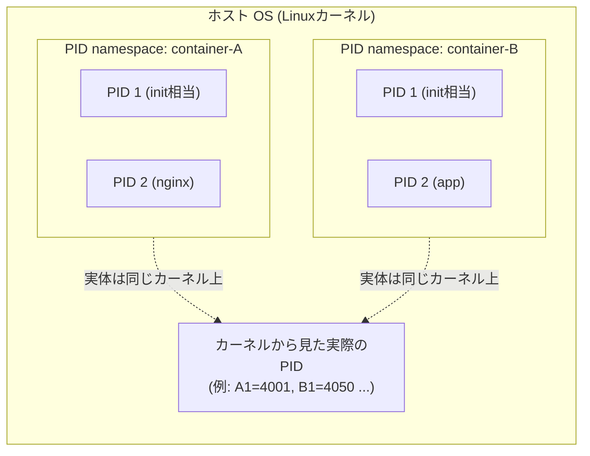

# Linux namespace とは何か(プロセス隔離の仕組み)

## 概要

Linux namespace(名前空間)は、**1 台のホスト上で動く複数のプロセスに対して、それぞれ別々の「見える世界」を与えるカーネル機能**です。PID(プロセス ID)・ネットワーク・マウントポイント・ホスト名などのシステムリソースを namespace ごとに分離することで、あるプロセスからは自分専用の OS が動いているかのように見せかけます。Docker や Kubernetes のコンテナ分離は、この namespace の仕組みを土台にしています。



コンテナ A・B はそれぞれ「自分が PID 1 から始まる唯一のプロセスツリー」だと信じていますが、実際にはホストカーネル上の一部のプロセスを namespace という「窓」越しに見ているだけです。

「namespace の種類」とは、この「見える世界を分離する」対象ごとにカーネル機能が分類されていることを指します。namespace という仕組み自体は 1 つですが、「何を隔離するか」によって PID・Network・Mount・UTS・IPC・User・Cgroup・Time という 8 つの種類(カテゴリ)に分かれています。1 つのプロセスは通常これら 8 種類すべてに同時に所属しており、`/proc/<PID>/ns/` 以下を見ると、そのプロセスがどの namespace に所属しているかを種類別に確認できます。

```
$ ls -l /proc/1234/ns/
lrwxrwxrwx 1 root root 0 ... cgroup -> 'cgroup:[4026531835]'
lrwxrwxrwx 1 root root 0 ... ipc -> 'ipc:[4026531839]'
lrwxrwxrwx 1 root root 0 ... mnt -> 'mnt:[4026531840]'
lrwxrwxrwx 1 root root 0 ... net -> 'net:[4026532000]'
lrwxrwxrwx 1 root root 0 ... pid -> 'pid:[4026531836]'
lrwxrwxrwx 1 root root 0 ... user -> 'user:[4026531837]'
lrwxrwxrwx 1 root root 0 ... uts -> 'uts:[4026531838]'
```

Docker がコンテナを作るときは、この 8 種類のうち必要なものだけ新規に作成し、それ以外はホストの namespace をそのまま使う、といった選択的な組み合わせも可能です。つまり「全部まとめて 1 つの隔離」ではなく、「種類ごとに独立して ON/OFF できる隔離の集合」というのが namespace の実態です。

## 何が嬉しいのか

namespace がない場合、同じホスト上のすべてのプロセスは同じ PID 空間・同じネットワークインターフェース・同じファイルシステムを共有します。これでは、あるプロセスが `ps` すれば他のプロセスが全部見えてしまいますし、同じポート番号を複数のアプリで使うこともできません。namespace を使うことで、以下のようなメリットが得られます。

- **プロセスの隔離による安全性向上**: コンテナ内のプロセスからは、ホストや他コンテナのプロセスが見えない・触れない
- **ネットワークの独立**: コンテナごとに別々の IP アドレス・ポート空間を持てるため、複数のコンテナで同じポート(例: 8080)を衝突なく使える
- **ファイルシステムの隔離**: コンテナ内で `/` を変更・削除しても、ホストや他コンテナのファイルシステムには影響しない
- **軽量な仮想化**: VM のようにハードウェアごとエミュレートする必要がなく、1 つのカーネルを共有しながらプロセス単位で隔離できるため起動が高速で低オーバーヘッド

具体例として、Docker で `docker run` すると、内部的に `clone()` や `unshare()` システムコールで新しい namespace 群が作られ、コンテナプロセスはそこに閉じ込められます。これにより「コンテナの中からは自分だけの Linux マシンに見える」体験が実現されています。

なお、cgroup は「リソースを"どれだけ"使えるかを制限する」機能であり、namespace は「"何が"見えるかを分離する」機能です。両者は役割が異なりますが、Docker などのコンテナ実装ではこの 2 つを組み合わせて「軽量な隔離環境」を作っています。

## 詳細

### namespace の種類

Linux には以下の種類の namespace があります(カーネルバージョンにより追加されています)。

| 種類 | フラグ | 分離対象 |
|---|---|---|
| PID | `CLONE_NEWPID` | プロセス ID 空間(自分が PID 1 に見える) |
| Network (net) | `CLONE_NEWNET` | ネットワークインターフェース・ルーティングテーブル・ポート |
| Mount (mnt) | `CLONE_NEWNS` | マウントポイント(ファイルシステムのビュー) |
| UTS | `CLONE_NEWUTS` | ホスト名・ドメイン名 |
| IPC | `CLONE_NEWIPC` | System V IPC・POSIX メッセージキュー |
| User | `CLONE_NEWUSER` | UID/GID のマッピング(namespace 内で root でもホストでは非特権ユーザ、という分離が可能) |
| Cgroup | `CLONE_NEWCGROUP` | プロセスから見える cgroup のルートディレクトリ |
| Time | `CLONE_NEWTIME` | システム起動時刻・単調クロックのオフセット(比較的新しい) |

### 3 つの主要システムコールと使い分け

namespace はカーネルの以下の 3 つの主要なシステムコールで操作します。

- `clone(2)`: 新しいプロセスを作成すると同時に、指定したフラグ(`CLONE_NEWPID` など)の namespace も新規作成してそのプロセスを所属させる
- `unshare(2)`: 既存のプロセスを、現在所属している namespace から切り離して新しい namespace に移す
- `setns(2)`: 既存の namespace に、あとから別プロセスを参加させる(`nsenter` コマンドの実装で使われる)

`clone(2)` は Linux における「プロセス/スレッド生成」の一番低レイヤなシステムコールで、実は `fork()` も `pthread_create()` も内部的には `clone()` の薄いラッパー(あるいは特殊なフラグの組み合わせ)にすぎません。`clone()` は生成する子プロセスが親と「何を共有し、何を新規に持つか」をフラグで細かく指定でき、`CLONE_NEW*` 系フラグを渡すと**新しい namespace を作成しつつ、生成される子プロセスを最初からその namespace に所属させる**ことができます。つまり `clone()` は「プロセス作成」と「namespace 作成 + 所属」を 1 回のシステムコールでアトミックに行えるのがポイントです。

| システムコール | いつ使うか |
|---|---|
| `clone()` | これから作る新しいプロセスを、新しい namespace の中に直接誕生させたいとき(例: コンテナのメインプロセスを起動する瞬間) |
| `unshare()` | 今動いている既存のプロセス(自分自身)を、新しい namespace 側に切り替えたいとき。ただし PID/cgroup namespace は後述の制約により「次に作る子プロセスから」しか効果が及ばない |
| `setns()` | 既存の(すでに他のプロセスが使っている)namespace に、別のプロセスを後から参加させたいとき(例: `docker exec` でコンテナに入る) |

Docker や runc のようなコンテナランタイムは、内部的には `clone()` を直接呼び出す実装になっています(`unshare` コマンドのように「一度 unshare してから fork する」という遠回りをしていません)。

### unshare の `--fork` オプションと namespace の種類による挙動差

`unshare` コマンドでは namespace の種類によって、呼び出し元プロセス自身への反映タイミングが異なります。

| namespace | `unshare()` 呼び出し元プロセス自身への効果 |
|---|---|
| UTS / Mount / Network / IPC / User | 呼び出した瞬間に、そのプロセス自身が新しい namespace に切り替わる |
| PID / Cgroup | 呼び出した瞬間には切り替わらず、その後 fork/clone される子プロセスから新しい namespace が適用される |

**PID namespace の場合**、あるプロセスの PID namespace への所属は「そのプロセスが生成された瞬間」に固定され、後から変更できません。`unshare(CLONE_NEWPID)` を実行すると新しい PID namespace 自体は作られますが、それが適用されるのは「これ以降に fork/clone される子プロセス」だけで、呼び出し元プロセス自身は元の PID namespace に残り続けます。

```bash
# 新しい PID / mount / UTS namespace 上で bash を起動する
sudo unshare --pid --mount --uts --fork bash

# namespace 内で hostname を変えてもホストには影響しない
hostname container-test
ps aux  # PID 1 から始まる自分だけのプロセスツリーが見える

# 実行中プロセスの namespace 一覧を確認する
ls -l /proc/<PID>/ns/

# 別プロセスの namespace に入る(例: PID 1234 のネットワーク namespace)
sudo nsenter --target 1234 --net bash
```

`unshare` コマンド(util-linux)の内部実装はざっくり以下のような流れです。

```
--fork なし:
  1. unshare(2) 呼び出し → 新PID namespace作成(ただし自分は入らない)
  2. execvp("bash") → 同じプロセスのままbashに置き換わる
     → bashは古いnamespaceのまま。新namespaceは誰も参照せず即破棄

--fork あり:
  1. unshare(2) 呼び出し → 新PID namespace作成
  2. fork() → 子プロセス誕生。この子は「生成された瞬間」が
     unshare後なので、新PID namespaceの所属になる(PID 1)
  3. 子プロセスがexecvp("bash") → execはnamespace所属を変えないので
     子はそのまま新namespaceのPID 1として動き続ける
  4. 親(unshareコマンド自身)はforkしてできた子の終了を待つだけ
```

`execve(2)` はプロセスのメモリイメージをプログラムで置き換えるだけで「新しいプロセスの誕生」ではないため、namespace 所属には影響しません。一方 `fork(2)`/`clone(2)` は文字通り新しいプロセスを誕生させるので、その瞬間の「有効な PID namespace」が新しく適用されます。実際に試すと違いが分かります。

```bash
# --fork なし
$ echo $$
12345
$ sudo unshare --pid bash
$ echo $$
12345          # 変わっていない!古いnamespaceのまま
$ ps aux | wc -l
150            # ホストの全プロセスが(mount namespaceも分離していなければ)そのまま見える

# --fork あり
$ sudo unshare --pid --fork --mount --mount-proc bash
$ echo $$
1              # 新しいPID namespaceのPID 1になっている
$ ps aux
PID   CMD
1     bash
23    ps
               # namespace内のプロセスしか見えない
```

(`--mount-proc` は `/proc` を新しい PID namespace 向けに再マウントして `ps` などが正しく動くようにするオプションで、新しい PID namespace の中で動く子プロセス側でマウントする必要があるため `--fork` とセットで使うのが一般的です)

**UTS namespace の場合**は挙動が異なり、`--fork` なしでも即座に反映されます。`unshare(CLONE_NEWUTS)` を呼ぶと、呼び出したプロセス自身がその場で新しい UTS namespace に切り替わります。

```bash
# --fork なしでも hostname の変更はホストに影響しない
$ hostname
myhost
$ sudo unshare --uts bash
$ hostname newname
$ hostname
newname          # namespace内では変わっている

# 別ターミナル(ホスト側)で確認
$ hostname
myhost           # ホストのhostnameは変わっていない
```

PID(および cgroup)だけが特別扱いされている理由は、これらの namespace が「プロセスツリーの構造」そのものに関わるためです。あるプロセスが古い PID namespace で既に存在している状態で、いきなり別の PID namespace の「PID 1」に成り代わることはできません(PID namespace は「1 つのプロセスは 1 つの namespace の中で 1 つの PID しか持てず、その番号は生成時に決まる」という前提で設計されています)。一方 UTS のようなただの「値の集合(hostname/domainname)」の分離であれば、プロセスの構造に矛盾を起こさずにその場で切り替えても問題ないため、即座反映が可能になっています。なお `--mount`(Mount namespace)も UTS と同じグループで、`unshare --mount bash` だけで(`--fork` なしで)呼び出し元プロセス自身のマウント状態を切り替えられます。

### `unshare --pid bash` で 2 回目のコマンドが "cannot fork" になる理由

`--fork` なしの `unshare --pid bash` を実行すると、bash 自身は新しい PID namespace には入らず古い(ホスト側の)namespace に残ったままですが、話には続きがあります。

- `unshare(CLONE_NEWPID)` で作られた新しい PID namespace は、呼び出したプロセス自身には適用されませんが、「この先そのプロセス(と exec 後も含む)が fork/clone する子プロセスの所属先」として予約された状態になります
- `execve()` はこの「子プロセスの所属先」情報を引き継ぐため、`unshare` が `bash` に exec で置き換わった後も、この bash が最初に fork する子プロセスは新しい PID namespace の**PID 1**として生成されます

つまり、1 回目に実行したコマンド(例: `whoami`)が新しい PID namespace の PID 1 になり、それが一瞬で終了(exit)してしまいます。`pid_namespaces(7)` によれば、PID namespace の "init" プロセス(PID 1)が終了すると、カーネルはその namespace 内の残り全プロセスを SIGKILL で終了させ、さらに init が一度終了した PID namespace の中には、その後二度と新しいプロセスを作成できず、作成しようとすると `ENOMEM` エラーで失敗します。

1 回目の `whoami` が PID 1 として終了した瞬間、その新しい PID namespace は「死んだ」状態になり二度と使えなくなりますが、bash 側は相変わらず「次に fork する子はこの(もう死んだ)namespace に入れる」という設定を持ったままです。そのため 2 回目に別のコマンドを実行しようとした際の `fork()` システムコールが `ENOMEM` で失敗し、bash が `cannot fork`(典型的には `bash: fork: Cannot allocate memory`)と表示します。bash 自身は新 namespace のメンバーではなかった(古い namespace に残っていた)ため SIGKILL の対象にはならず生き続けますが、以後どんな外部コマンドを実行しても同じ理由で永久に fork に失敗し続けます。

回避方法は `--fork` を付けることです。

```bash
sudo unshare --pid --fork --mount --mount-proc bash
```

`--fork` を付けると bash 自身が新しい PID namespace の PID 1 になります。bash は `whoami` のようにすぐ終了するプロセスではなくシェルとして生き続けるため、PID 1 が途中で消えることがなく、その後の外部コマンドは namespace 内の PID 2, 3, ... として問題なく fork され続けます。

### 注意点

- namespace はあくまで「見え方」の分離であり、カーネル自体は 1 つを共有しているため、**カーネル脆弱性を突かれると namespace を越えて影響が及ぶ可能性**があります(VM ほど強固な隔離ではない)
- User namespace を使わない設定では、コンテナ内の root(UID 0)はホストの root と同一 UID として扱われるため、コンテナ脱出(コンテナブレイクアウト)のリスクが相対的に高まります。rootless コンテナや user namespace の活用はこのリスクを下げる手段の一つです
- namespace はプロセス単位に紐付くため、あるプロセスが所属する namespace 内で最後のプロセスが終了すると、そのプロセス専用に作られた namespace 自体も(bind mount などで参照が残っていなければ)破棄されます

### 不確かな点

- 比較的新しいバージョンの `util-linux` の `unshare` コマンドでは、`--pid` を `--fork` なしで指定すると意味がない・問題を起こしやすい組み合わせとして警告やエラーを出すようになっている場合がありますが、正確な挙動やメッセージ文言はバージョンによって異なる可能性があり、確認は取れていません
- `unshare --pid bash` の 2 回目のコマンド実行が `cannot fork` になる件について、上記の説明は `pid_namespaces(7)` の仕様とこれまでの `unshare`/`clone` の挙動から論理的に導いたものであり、サンドボックス環境の権限制約により実機での再現確認はできていません。エラーメッセージの正確な文言(`Cannot allocate memory` か別の errno か)は環境によって異なる可能性があるため、`strace -f -e trace=clone,fork bash` などでの確認が確実です

## 参考リンク

- [namespaces(7) — Linux manual page](https://man7.org/linux/man-pages/man7/namespaces.7.html)
- [pid_namespaces(7) — Linux manual page](https://man7.org/linux/man-pages/man7/pid_namespaces.7.html)
- [uts_namespaces(7) — Linux manual page](https://man7.org/linux/man-pages/man7/uts_namespaces.7.html)
- [unshare(2) — Linux manual page](https://man7.org/linux/man-pages/man2/unshare.2.html)
- [unshare(1) — Linux manual page](https://man7.org/linux/man-pages/man1/unshare.1.html)
- [clone(2) — Linux manual page](https://man7.org/linux/man-pages/man2/clone.2.html)
- [setns(2) — Linux manual page](https://man7.org/linux/man-pages/man2/setns.2.html)
- [Docker docs: Namespaces](https://docs.docker.com/engine/security/userns-remap/)
