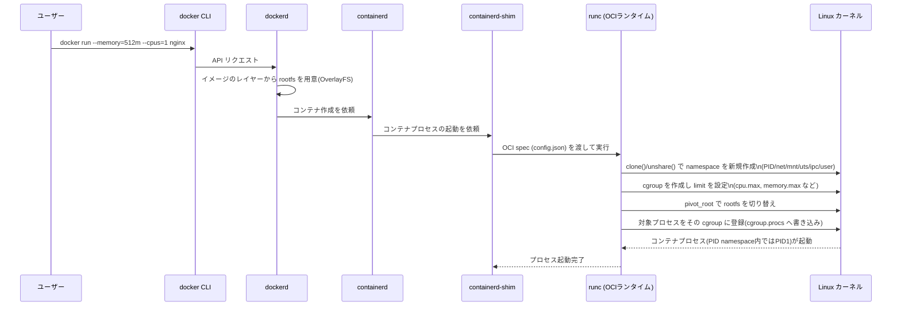
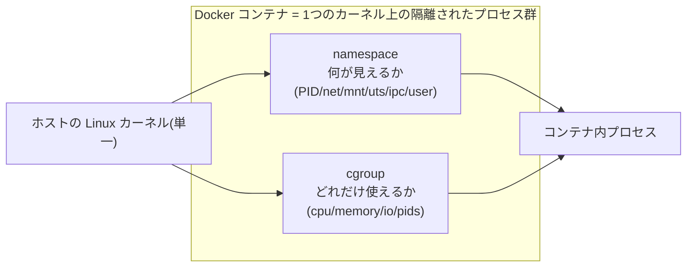

# cgroup と namespace はどのように Docker のコンテナ化技術を支えているか

## 概要

Docker のコンテナは「魔法の軽量 VM」ではなく、Linux カーネルが元々持っている 2 つの機能を組み合わせて実現されています。

- **namespace**：プロセスから「何が見えるか」を分離する(PID・ネットワーク・マウントなど)
- **cgroup**：プロセスが「どれだけリソースを使えるか」を制限する

Docker はこの 2 つに加えて、レイヤー化されたファイルシステム(union filesystem／OverlayFS)や capabilities・seccomp によるアクセス制御を組み合わせることで「隔離されたプロセス」をコンテナとして見せています。`docker run` を実行したときの内部フローは次のようになります。



このように、Docker 自身は低レベルの syscall を直接叩くのではなく、OCI(Open Container Initiative)仕様に沿った `runc` などのランタイムに処理を委譲し、`runc` が実際に namespace と cgroup をセットアップしています。

## 何が嬉しいのか

もし namespace と cgroup のどちらか片方しかなかったら、コンテナは実用に耐えません。

- **namespace だけの場合**：プロセスの見える世界は分離されるが、1 つのコンテナが CPU やメモリを使い切ると同じホスト上の他のコンテナやホスト自体を巻き込んでしまう(noisy neighbor 問題)
- **cgroup だけの場合**：リソースは制限できるが、コンテナ内から `ps` すればホストの全プロセスが見えてしまい、ポート番号も衝突するなど「隔離されたマシン」の体験が成立しない

この 2 つを組み合わせることで、次のようなメリットが得られます。

- **VM を使わない軽量な隔離**：ハードウェアやカーネルをエミュレートせず、1 つのカーネルを共有しながらプロセス単位で「専用マシンのように見える環境」を作れるため、起動が速く(ミリ秒〜秒)、オーバーヘッドも小さい
- **マルチテナントでの安全な共存**：`docker run --memory=512m --cpus=1` のような指定だけで、あるコンテナの暴走がホスト全体や他のコンテナに波及しない
- **可観測性**：`cgroup` の疑似ファイル(`memory.current`、`cpu.stat` など)から namespace ごとのリソース使用量を取得できるため、`docker stats` や Kubernetes の `kubectl top` はこれを利用してメトリクスを表示している
- **Kubernetes との整合**：Pod の `resources.requests`/`resources.limits` は最終的に各コンテナの cgroup 設定に変換され、Pod ごとの隔離は各コンテナに付与された namespace 群によって実現される

## 詳細

### namespace が担う「何を見せるか」

Docker コンテナ起動時、通常は以下の namespace が新規作成されます(user namespace はデフォルトでは無効なディストリビューションも多い)。

| 種類 | 分離対象 |
|---|---|
| PID | プロセス ID 空間(コンテナ内では自分が PID 1) |
| Network (net) | ネットワークインターフェース・ルーティングテーブル・ポート |
| Mount (mnt) | マウントポイント(コンテナ専用の `/` を見せる) |
| UTS | ホスト名・ドメイン名 |
| IPC | System V IPC・POSIX メッセージキュー |
| User(任意) | UID/GID マッピング(コンテナ内 root をホストでは非特権ユーザに) |
| Cgroup | プロセスから見える cgroup ルートの位置 |

コンテナ用の rootfs への切り替えは、mount namespace を作った上で `pivot_root(2)`(または `chroot(2)`)を使って行われます。これにより、イメージのレイヤーを OverlayFS で重ねた読み取り専用レイヤー + コンテナ専用の書き込みレイヤーが、コンテナからは唯一の `/` として見えます。

### cgroup が担う「どれだけ使えるか」

`docker run --memory=512m --cpus=1` のようなオプションは、コンテナ用の cgroup(cgroup v2 では `/sys/fs/cgroup/system.slice/docker-<id>.scope` 相当のパス)を作り、その配下の制御ファイルに値を書き込むことで実現されます。

```sh
# コンテナに割り当てられた cgroup のメモリ上限を確認する例
cat /sys/fs/cgroup/system.slice/docker-<container-id>.scope/memory.max

# コンテナプロセスが実際にどの cgroup に属しているか
cat /proc/<PID>/cgroup
```

メモリ上限(`memory.max`)を超えたコンテナプロセスは OOM Killer に kill され、`docker inspect` の `OOMKilled: true` として確認できます。CPU の `cpu.max`(quota/period)は割り当てを使い切るとスロットリングされ、クラッシュはしませんが処理が遅延します。

### 両者の役割の切り分け(まとめ)



### 注意点

- namespace・cgroup はいずれもカーネル 1 つを共有する仕組みなので、VM ほど強固な隔離ではありません。カーネルの脆弱性を突かれるとコンテナを越えて影響が及ぶ可能性があります(必要に応じて gVisor や Kata Containers のような追加のサンドボックス層が使われます)
- cgroup driver を `cgroupfs` と `systemd` のどちらにするかは Docker/containerd と kubelet で揃えておく必要があり、不揃いだと Pod/コンテナ起動時に不整合が起きることがあります
- user namespace(`--userns-remap`)を有効にしないと、コンテナ内の root はホストの root と同一 UID として扱われるため、コンテナ脱出時のリスクが相対的に高くなります

## 参考リンク

- [Docker docs: Namespaces](https://docs.docker.com/engine/security/userns-remap/)
- [Docker docs: Resource constraints](https://docs.docker.com/config/containers/resource_constraints/)
- [namespaces(7) — Linux manual page](https://man7.org/linux/man-pages/man7/namespaces.7.html)
- [Control Group v2 — The Linux Kernel documentation](https://docs.kernel.org/admin-guide/cgroup-v2.html)
- [Open Container Initiative Runtime Specification](https://github.com/opencontainers/runtime-spec)
- [runc (OCI リファレンス実装)](https://github.com/opencontainers/runc)
