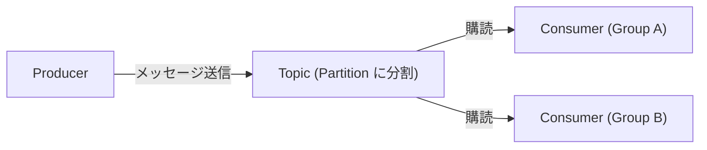
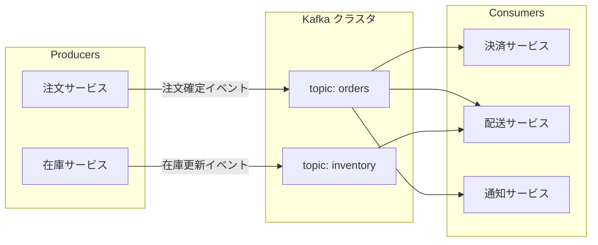
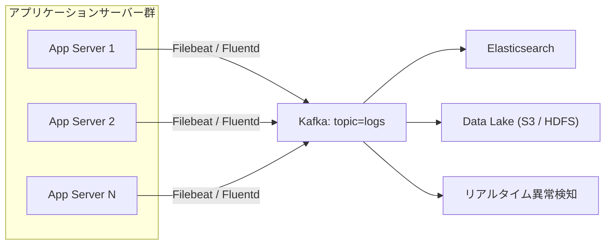
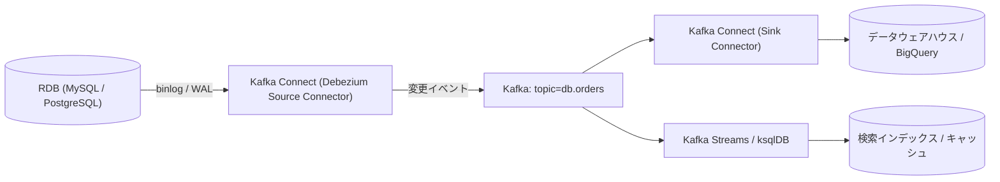
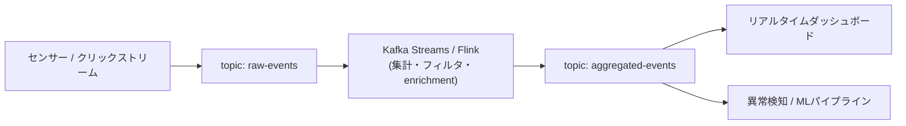

# Apache Kafka の基本概念と仕組み

## 概要

Apache Kafka は、大量のデータをリアルタイムかつ高スループットで扱うための分散イベントストリーミングプラットフォームです。もともと LinkedIn 社内で開発され、現在は Apache Software Foundation のトップレベルプロジェクトとして OSS 公開されています。「Publish-Subscribe 型のメッセージング」と「ログの永続化・リプレイ」を組み合わせた設計が最大の特徴で、マイクロサービス間の非同期連携やログ集約、リアルタイム分析基盤の中核として広く使われています。

基本的なデータの流れは次のようになります。



Producer(送信側)はメッセージを Topic に送るだけで、どの Consumer(受信側)が読むかを意識しません。Topic はログとしてディスクに保持されるため、Consumer は好きなタイミングで、複数の Consumer Group が独立して同じデータを読み取ることができます。

## 何が嬉しいのか

- **サービス間の疎結合化**: Producer と Consumer が直接通信しないため、片方の障害や遅延がもう片方に直接波及しません。Kafka を使わずに REST API 等で同期的に連携すると、呼び出し先の障害がそのまま呼び出し元の障害に伝播しやすくなります。
- **高スループット・水平スケール**: トピックをパーティションに分割し、複数の Broker・Consumer に処理を分散できるため、秒間数百万メッセージ規模の処理にも耐えられます。
- **メッセージの永続化とリプレイ**: 一般的なメッセージキュー(RabbitMQ など)は基本的に「消費されたら消える」設計ですが、Kafka はログとしてディスクに保持し、保持期間内であれば同じデータを何度でも読み直せます。障害復旧時の再処理や、新しい Consumer を後から追加してヒストリカルデータを取り込む、といった用途に強いです。
- **具体的なユースケース**: マイクロサービス間のイベント連携(注文確定イベントを複数サービスが購読する等)、アプリケーションログ・メトリクスの集約、CDC(Change Data Capture)によるデータベース変更のストリーミング、リアルタイム集計・異常検知パイプラインなど。

## 詳細

### 主要な構成要素

- **Broker**: Kafka のサーバープロセス。複数の Broker が集まって 1 つの Kafka クラスタを構成します。
- **Topic / Partition**: メッセージはカテゴリごとに「Topic」に分類され、Topic はさらに複数の「Partition」に分割されます。Partition は追記専用の順序付きログで、これが並列処理とスケーラビリティの単位になります。
- **Producer**: メッセージ(レコード)を Topic に送信するクライアント。キーを指定すると、同じキーのメッセージは常に同じ Partition に送られ、順序が保証されます。
- **Consumer / Consumer Group**: メッセージを購読するクライアント。同じ Consumer Group に属する Consumer 同士で Partition を分担するため、Group 単位で見ると各メッセージは 1 度だけ処理され、かつ並列にスケールできます。
- **Offset**: 各 Consumer Group がどこまで読んだかを示す読み取り位置。`__consumer_offsets` という内部 Topic で管理され、明示的に巻き戻すことでメッセージのリプレイが可能です。
- **レプリケーション**: 各 Partition は複数の Broker に複製(Leader + Follower)され、正常に追従しているレプリカ群を ISR(In-Sync Replicas)と呼びます。Leader 障害時は ISR 内から新しい Leader が選出され、可用性を担保します。
- **メタデータ管理**: 以前は Apache ZooKeeper でクラスタメタデータを管理していましたが、近年は KRaft(Kafka Raft)モードにより Kafka 自身が Raft プロトコルでメタデータを管理する構成が主流になっています。**この点は情報が古い可能性があるため、実際に採用する際は利用中の Kafka バージョンの公式ドキュメントで ZooKeeper 依存の有無を必ず確認してください。**
- **周辺エコシステム**: 外部システムとの連携をコード不要で行える Kafka Connect(Source/Sink コネクタ)や、ストリーム処理用の Kafka Streams / ksqlDB なども提供されています。

### シンプルな利用イメージ(CLI)

```bash
# トピック作成
kafka-topics.sh --create --topic orders --bootstrap-server localhost:9092 --partitions 3 --replication-factor 1

# Producer からメッセージ送信
kafka-console-producer.sh --topic orders --bootstrap-server localhost:9092

# Consumer でメッセージ受信
kafka-console-consumer.sh --topic orders --bootstrap-server localhost:9092 --from-beginning
```

### 注意点

- Partition 数は後から増やせますが、キーによる振り分け先が変わってしまうため運用中の変更には注意が必要です。
- デフォルトでは「少なくとも1回(at-least-once)」配信ですが、Idempotent Producer とトランザクション機能を組み合わせることで「厳密に1回(exactly-once)」に近いセマンティクスを実現できます。
- 小規模・低レイテンシが最優先の用途では、Kafka の運用コスト(クラスタ管理、パーティション設計など)が過剰になる場合もあるため、要件に応じて RabbitMQ やクラウドのマネージドキュー(SQS 等)との比較検討もおすすめです。

### Cloud Pub/Sub との比較

Kafka と Google Cloud の Cloud Pub/Sub は、機能的にはかなり似ています。どちらも「Publish-Subscribe 型の非同期メッセージング基盤」として、サービス間の疎結合化・高スループット・水平スケールを目的にしている点は共通です。ただし設計思想と運用モデルには明確な違いがあります。

**似ているところ**

- **Pub/Sub モデル**: Publisher(Producer)がメッセージを送り、Subscriber(Consumer)が非同期に受け取る、という基本構造は同じです。
- **非同期・疎結合**: 送信側と受信側が直接通信しないため、片方の障害・遅延が波及しにくいという利点も共通です。
- **水平スケール**: どちらも大量メッセージを分散処理する設計になっており、高スループットを実現できます。
- **デフォルトは at-least-once 配信**: 両者ともデフォルトでは「少なくとも1回」配信で、重複除去はアプリケーション側 or オプション機能(Idempotent Producer など)で対応します。
- **順序保証は限定的**: Kafka は同一パーティション内、Cloud Pub/Sub は ordering key を指定した場合のみ、という条件付きで順序が保証されます(デフォルトでは順序は保証されません)。

**違うところ**

| 観点 | Apache Kafka | Cloud Pub/Sub |
|---|---|---|
| 運用形態 | 自前でクラスタ構築・運用(または Confluent Cloud / Amazon MSK 等のマネージドサービスを利用)| GCP のフルマネージド・サーバーレス。インフラ管理不要 |
| 対応クラウド | オンプレ・マルチクラウドどこでも動く | GCP 専用 |
| パーティション | Topic を明示的に Partition に分割し、Producer/Consumer がその構造を意識する | パーティション相当の仕組みは内部にあるが、ユーザーからは隠蔽され自動でスケールする |
| データ保持・リプレイ | ログとしてディスクに保持し、offset を巻き戻して何度でも読み直せる(リプレイが得意) | Seek 機能でタイムスタンプ/スナップショットまで巻き戻し可能だが、「ログ全体を長期保持してリプレイし続ける」というより、確認(ack)されたメッセージは順次削除される設計に近い |
| 順序保証の指定方法 | パーティション単位でデフォルト保証 | ordering key を明示指定しないと保証されない |
| エコシステム | Kafka Streams / ksqlDB / Kafka Connect など、ストリーム処理・コネクタが充実 | Dataflow(Apache Beam)などGCPのマネージドサービスと組み合わせるのが一般的 |
| 課金 | インフラコスト(VM/ディスク等)+ 運用工数(マネージドの場合はサービス利用料) | メッセージ量・スループットに応じた従量課金 |

※ メッセージの保持期間の具体的なデフォルト値・上限(例: Cloud Pub/Sub の Seek 可能期間など)は変更される可能性があるため、正確な数値は公式ドキュメントで最新情報を確認してください。この点は情報が古い可能性があります。

**どちらを使うと良いか**

- **Kafka が向いているケース**
  - マルチクラウド・オンプレなど GCP に縛られない構成にしたい
  - CDC 基盤やイベントソーシングなど、「ログとして長期間・大量にリプレイする」ことが要件の中心
  - Kafka Streams / ksqlDB / Kafka Connect などのエコシステムを活用したい、または既に Kafka を運用するノウハウ・チームがある
  - 厳密なパーティション設計でスループット・順序をきめ細かく制御したい

- **Cloud Pub/Sub が向いているケース**
  - GCP 中心の構成で、インフラ運用の工数を極力減らしたい(サーバーレスで自動スケール)
  - トラフィックの増減が激しく、パーティション数などの容量設計を事前に考えたくない
  - Dataflow など GCP のマネージドサービスとシームレスに連携したストリーム処理を組みたい
  - 小〜中規模で、Kafka クラスタを構築・維持するコストに見合わないユースケース

なお、Kafka 自体にも Confluent Cloud や Amazon MSK Serverless のようなフルマネージド版があるため、「Kafka = 運用が大変」と単純に比較するのではなく、Kafka を選ぶ場合でもマネージドサービスを使うかどうかは別軸で検討する価値があります。

### よくあるシステム構成パターン

Kafka はハブ的な立ち位置で使われることが多く、代表的な構成パターンをいくつか紹介します。

**1. マイクロサービス間のイベント連携**

複数のサービスが Kafka を介して非同期にイベントをやり取りする、最も典型的な構成です。



「注文サービス」は決済・配送・通知サービスの存在を知らなくてよく、単に `orders` トピックにイベントを送るだけです。後から新しい Consumer(例: 分析サービス)を追加しても、Producer 側の変更は不要です。

**2. ログ・メトリクス集約基盤**

複数アプリケーションのログを Kafka に集約し、検索基盤や監視基盤に流し込む構成です。



Kafka がバッファ(緩衝材)として機能するため、下流の Elasticsearch 等が一時的に遅延・停止してもログをロストしにくくなります。

**3. CDC (Change Data Capture) パイプライン**

DB の変更をリアルタイムに他システムへ反映する構成で、Kafka Connect(例: Debezium)がよく使われます。



アプリケーションコードで二重書き込み(DB と Kafka の両方に書く)を実装せずに済むのが利点です。DB への書き込みだけに集中でき、変更の伝搬は CDC 層が保証します。

**4. リアルタイムストリーム処理・集計**

Kafka Streams や Flink 等でストリームを加工しながら、複数の Topic 間でデータを受け渡す構成です。



1 つの Topic から別の Topic へストリーム処理結果を書き戻す「Topic のパイプライン化」がよく行われます。

実際のシステムでは、これらのパターンが組み合わさって使われることが多いです(例: マイクロサービス間連携 + ログ集約を同じ Kafka クラスタで兼用するなど)。どの構成でも共通するのは「Producer と Consumer が Kafka を介して疎結合になる」という点で、これが Kafka を採用する最大のメリットです。構成図の具体的なコンポーネント名(Debezium、ksqlDB 等)はエコシステムの一例であり、要件に応じて別の実装を選ぶこともできます。

## 参考リンク

- [Apache Kafka 公式ドキュメント](https://kafka.apache.org/documentation/)
- [Apache Kafka Introduction](https://kafka.apache.org/intro)
- [Apache Kafka Use Cases](https://kafka.apache.org/uses)
- [Kafka Streams 公式ドキュメント](https://kafka.apache.org/documentation/streams/)
- [Cloud Pub/Sub 公式ドキュメント](https://cloud.google.com/pubsub/docs/overview)
- [Pub/Sub のメッセージ順序付け](https://cloud.google.com/pubsub/docs/ordering)
- [Debezium (CDC コネクタ)](https://debezium.io/)
