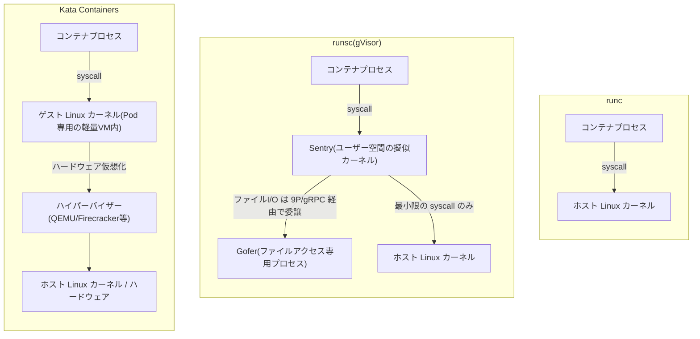

# gVisor(runsc)とは何か(runc との違いと使いどころ)

## 概要

`runc`・`runsc`(gVisor)・Kata Containers は、いずれも OCI ランタイムインターフェース(`create`/`start`/`kill` など)を実装したコンテナランタイムですが、コンテナプロセスをホストからどれだけ強く隔離するかというアプローチが根本的に異なります。

- **runc**: コンテナプロセスの syscall をそのままホストの Linux カーネルに渡す、最も一般的な OCI ランタイム
- **runsc(gVisor)**: Google が開発したサンドボックス。コンテナの syscall をホストカーネルに直接渡さず、ユーザー空間に実装された擬似カーネル「Sentry」がエミュレートすることで、ホストカーネルへの露出を大幅に減らす
- **Kata Containers**: コンテナ(Kubernetes では Pod 単位)ごとに軽量な VM を割り当て、専用のゲスト Linux カーネルとハードウェア仮想化の境界で隔離する OCI 互換ランタイム



## 何が嬉しいのか

`runc` は namespace・cgroup・seccomp・AppArmor/SELinux を組み合わせてコンテナを隔離しますが、これらはいずれも「ホストカーネルに syscall をそのまま渡す」ことが前提です。最終的な処理はすべてホストカーネル自身が行うため、ホストカーネルに未知の脆弱性(0-day)があれば突かれてコンテナエスケープされるリスクが残ります。Docker のデフォルト seccomp プロファイルで許可されている syscall だけでも、カーネルの巨大なコードパスを経由してしまいます。

**gVisor(runsc)** はこの問題に対し、「コンテナのプロセスに、ホストカーネルの薄いサブセットしか触らせない独自の擬似カーネル(Sentry)を Go で再実装して間に挟む」ことで、ホストカーネルの攻撃対象面(attack surface)そのものを大幅に減らします。Sentry は Linux の syscall を自前で解釈・エミュレートし、実際にホストカーネルへ渡す syscall はごく一部(`futex`、`epoll`、`mmap` など基盤的なもの)に絞られます。代表的なユースケースは以下の通りです。

- マルチテナントで信頼できないコードを動かす(SaaS 上でユーザーがアップロードしたコードを実行する、CI のジョブランナー、サーバーレス基盤)。Google Cloud の **Cloud Run** や **App Engine スタンダード環境**、GKE Sandbox はこの用途で gVisor を内部的に使っている
- 既存の seccomp/AppArmor に加え、多層防御の追加レイヤーとしてさらに強い隔離が欲しい場合
- 一方、信頼できるコードしか動かさない一般的な自社サービス間のコンテナ実行では、パフォーマンスオーバーヘッドに見合わないため `runc` で十分なことが多い

**Kata Containers** はさらに一歩進み、Pod ごとに本物のゲスト Linux カーネルを積んだ VM を丸ごと用意し、ハードウェア仮想化の境界で隔離する。gVisor が「ホストカーネルへの露出を減らす」アプローチなのに対し、Kata は「そもそも別のカーネルとハードウェア境界を使う」という、より重量級で伝統的な VM に近いアプローチであり、gVisor よりも強い隔離境界と高い Linux 互換性を必要とするワークロードに向いています。

## 詳細

### gVisor(runsc)のアーキテクチャ

gVisor は大きく2つのコンポーネントで構成されます。

- **Sentry**: Go で実装された擬似カーネル本体。プロセス管理・メモリ管理・シグナル処理・ネットワークスタック(独自のユーザー空間 TCP/IP 実装)など、Linux カーネルの主要機能をユーザー空間で再実装している
- **Gofer**: ファイルシステムへのアクセスを仲介する別プロセス。Sentry はホストのファイルシステムに直接触らず、9P(または gRPC ベースの独自プロトコル)経由で Gofer に処理を委譲する。これにより、万が一 Sentry が突破されてもファイルシステムへの直接アクセスは追加の壁でブロックされる

#### syscall インターセプトの方式(プラットフォーム)

Sentry がコンテナプロセスの syscall を捕捉する方法には複数の実装があります。

- **ptrace プラットフォーム**: `ptrace(2)` を使ってコンテナプロセスの syscall をすべてトラップする。特別な権限やハードウェア機能が不要で最も可搬性が高い反面、コンテキストスイッチのオーバーヘッドが大きく低速
- **KVM プラットフォーム**: ハードウェア仮想化支援(Intel VT-x など)を使い、コンテナプロセスを軽量な VM 内で動かして syscall をトラップする。ptrace より高速
- **systrap プラットフォーム**: 比較的新しいデフォルト実装。`SECCOMP_RET_TRAP`(seccomp の一機能)を使って syscall をシグナルとして捕捉する方式。KVM 不要でホストの互換性が高く、ptrace より高速

なお、seccomp の `SCMP_ACT_NOTIFY`(syscall の可否判断をユーザー空間の監視プロセスに委譲する仕組み)は、gVisor が採用する「ユーザー空間で syscall を扱う」という考え方と親和性が高い技術です。

### runc と runsc の違い

| | runc | runsc(gVisor) |
|---|---|---|
| syscall の処理 | ホストカーネルが直接処理 | Sentry(ユーザー空間)がエミュレート、必要最小限だけホストに委譲 |
| 隔離の強さ | namespace/cgroup/seccomp 等でホストカーネルへのアクセスを絞る | ホストカーネルに触れさせる範囲自体を激減させる |
| パフォーマンス | ネイティブに近い | 数〜数十%のオーバーヘッド(特に syscall 多発・ネットワーク I/O 集中型のワークロードで顕著) |
| Linux 互換性 | ホストカーネルそのもの、ほぼ100%互換 | 独自実装のため一部の syscall・/proc 機能・ドライバ依存機能などは未対応/挙動差異あり |
| 主な用途 | 一般的なコンテナ実行 | 信頼できないコードのサンドボックス実行 |

### runsc の使い方

```bash
# runsc をインストール後、Docker のランタイムとして登録(daemon.json)
{
  "runtimes": {
    "runsc": {
      "path": "/usr/local/bin/runsc"
    }
  }
}

# 特定のコンテナだけ runsc で起動
docker run --runtime=runsc hello-world

# Kubernetes(GKE Sandbox など)では RuntimeClass 経由で指定
```
```yaml
apiVersion: node.k8s.io/v1
kind: RuntimeClass
metadata:
  name: gvisor
handler: runsc
---
apiVersion: v1
kind: Pod
metadata:
  name: untrusted-pod
spec:
  runtimeClassName: gvisor
  containers:
  - name: app
    image: my-untrusted-image
```

### gVisor 利用時の注意点

- ネットワークスタックを独自実装しているため、ホストのネットワーク設定に強く依存するツール(一部の VPN・特殊な netfilter 拡張など)は動かないことがある
- `/proc` や `/sys` の一部エントリが完全再現されておらず、それらに依存するツール(一部の監視エージェントなど)が誤動作するケースがある
- I/O やシステムコール多発型ワークロードではオーバーヘッドが無視できないことがあるため、導入前にベンチマークを取ることが推奨される

### Kata Containers とは

Kata Containers は、コンテナ(正確には Kubernetes の Pod 単位)ごとに軽量な VM を割り当てて実行する OCI 互換ランタイムです。2017 年に Intel の Clear Containers と Hyper.sh の runV が統合されて生まれたプロジェクトで、ハイパーバイザーには QEMU・Cloud Hypervisor・Firecracker などを選択できます。

`runc`/`runsc` と同じ OCI ランタイムインターフェースを実装しているため、Docker の `--runtime=kata-runtime`(または `io.containerd.kata.v2`)や Kubernetes の `RuntimeClass` で差し替え可能です。Kubernetes と組み合わせる場合は containerd の shim v2(`containerd-shim-kata-v2`)経由で、Pod ごとに 1 つの軽量 VM(kata sandbox)が起動し、その Pod 内の各コンテナは同じ VM 内のネームスペースとして動作します。

### runc / runsc / Kata の比較

| | runc | runsc(gVisor) | Kata Containers |
|---|---|---|---|
| 隔離の仕組み | namespace/cgroup/seccomp でホストカーネルへのアクセスを制限 | ユーザー空間の擬似カーネル(Sentry)が syscall をエミュレート | Pod ごとに専用のゲストカーネル + ハードウェア仮想化 |
| 隔離の強さ | 弱い(ホストカーネルを直接共有) | 中(ホストカーネルへの露出を大幅削減、ただし最終的にはホストカーネルに依存) | 強い(ハードウェア仮想化境界、ゲストカーネルも別) |
| Linux 互換性 | ほぼ100% | 独自実装のため一部 syscall・/proc・ドライバ依存機能は非対応/挙動差異あり | 本物の Linux カーネルなのでほぼ100% |
| パフォーマンス/起動速度 | ネイティブに近く最速 | 数〜数十%オーバーヘッド、起動は比較的軽い | VM 起動を伴うため runc/runsc より重く、メモリフットプリントも大きい(具体的な数値はハイパーバイザーや環境に強く依存するため要ベンチマーク) |
| 必要な前提 | 特になし | 特別なハードウェア機能不要(ptrace/systrap)、KVM プラットフォームを使う場合は要仮想化支援 | ハードウェア仮想化支援(Intel VT-x/AMD-V、クラウドではネスト仮想化)が必須 |
| 主な用途 | 信頼できる自社コードの一般的なコンテナ実行 | 信頼できないコードを高密度・低オーバーヘッドでサンドボックス実行(FaaS、CI ジョブ、Cloud Run 等) | より強い隔離やカーネル互換性が必要なマルチテナント環境・ホスティング事業者的なワークロード |

### 使い分けの指針

- **信頼できる自社コードのみを動かす一般的なマイクロサービス** → `runc` で十分。オーバーヘッドがなく最もパフォーマンスが良い
- **信頼できない/マルチテナントのコードを大量かつ高密度・低レイテンシで動かしたい**(FaaS、CI ジョブランナー、Cloud Run のようにコールドスタートの速さと省メモリが重要な場面) → `runsc`(gVisor)。VM ほど重くないユーザー空間カーネルで、擬似カーネルレベルの隔離が得られる
- **より強い(ハードウェア仮想化レベルの)隔離境界が必要**、または gVisor では非対応の syscall・カーネル機能(独自カーネルモジュール、特殊なネットワーク機能、完全な Linux 互換性)に依存するワークロードがある、あるいは規制業界向けなど強いセキュリティ境界の説明責任が求められる → Kata Containers。ただし VM 起動オーバーヘッドとメモリフットプリント増加を許容できることが前提
- Kata Containers は各 Pod が独立したゲスト Linux カーネルを持つため、gVisor で起こりがちな `/proc`・`/sys` の再現不足や一部 syscall 未対応といった互換性問題が起きにくいのも利点

### Kata Containers 利用時の注意点

- ハードウェア仮想化支援が前提のため、ネスト仮想化に対応していないクラウドインスタンスでは動作しない、または別途対応が必要な場合がある。GKE Sandbox は gVisor ベースであり Kata Containers ではない点に注意
- 起動レイテンシやメモリオーバーヘッドの具体的な数値は、選択するハイパーバイザー(QEMU/Cloud Hypervisor/Firecracker)や環境に大きく依存するため断定はできない(不確かな情報)。導入前に自環境でのベンチマークを取ることを推奨する
- Pod あたり 1 VM のオーバーヘッドがあるため、高密度にコンテナを詰め込みたいワークロードには不向き

## 参考リンク

- [gVisor 公式ドキュメント](https://gvisor.dev/docs/)
- [gVisor: Architecture Guide](https://gvisor.dev/docs/architecture_guide/)
- [gVisor GitHub リポジトリ](https://github.com/google/gvisor)
- [gVisor: Platforms](https://gvisor.dev/docs/architecture_guide/platforms/)
- [Google Cloud Blog: Open-sourcing gVisor, a sandboxed container runtime](https://cloud.google.com/blog/products/gcp/open-sourcing-gvisor-a-sandboxed-container-runtime)
- [Kata Containers 公式サイト](https://katacontainers.io/)
- [Kata Containers GitHub リポジトリ / ドキュメント](https://github.com/kata-containers/kata-containers)
- [Kata Containers: Architecture Overview](https://github.com/kata-containers/kata-containers/blob/main/docs/design/architecture/README.md)
