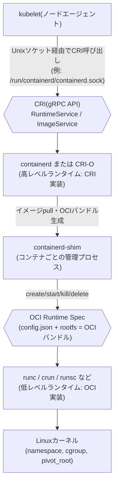

# kubelet・CRI・OCI・runc(低レベルランタイム)の関係性

## 概要

Kubernetes のノードで「コンテナを実際に動かす」処理は、役割の異なる複数の層に分かれています。

- **kubelet**: 各ノードで動く Kubernetes のエージェント。PodSpec を見て「どんなコンテナを動かすべきか」を判断する司令塔であり、実際のコンテナ操作そのものは行わない
- **CRI (Container Runtime Interface)**: kubelet と「コンテナランタイム」の間の標準 API(gRPC)。kubelet はこのインターフェース越しにしかコンテナ操作を要求しない
- **高レベルランタイム(containerd, CRI-O など)**: CRI を実装するデーモン。イメージの pull・ストレージ管理・コンテナのライフサイクル管理を担当し、実際のプロセス起動は低レベルランタイムに委譲する
- **OCI (Open Container Initiative)**: コンテナの「イメージ形式」と「ランタイムの振る舞い」を定めた業界標準仕様(Runtime Spec / Image Spec など)
- **低レベルランタイム(runc, crun, runsc, kata-runtime など)**: OCI Runtime Spec を実装する実行エンジン。namespace・cgroup の作成や `pivot_root` など、実際に Linux カーネルの機能を呼び出してコンテナプロセスを立ち上げる

## 何が嬉しいのか

この階層構造は、いずれも「実装を差し替え可能にするための標準化」という同じ目的を持っています。

- **CRI がなかった頃**は、kubelet のコード内に Docker 専用の処理(dockershim)が直接埋め込まれていました。新しいランタイムを Kubernetes に対応させるには kubelet 本体に手を入れる必要があり、Kubernetes 側も Docker の内部変更に振り回されるという密結合の問題がありました。CRI という標準 API を挟んだことで、containerd・CRI-O・(現在は使われていませんが)dockershim のような実装を kubelet 側の変更なしに差し替えられるようになりました(dockershim は Kubernetes 1.24 で削除され、現在は containerd や CRI-O を直接使うのが標準です)
- **OCI がなかった頃**は、コンテナイメージの形式やランタイムの起動方法がツールごとにバラバラで、「Docker で作ったイメージが他のツールで動かない」といった相互運用性の問題がありました。OCI が Runtime Spec / Image Spec を標準化したことで、containerd や CRI-O は runc・crun・runsc・Kata Containers など好きな低レベルランタイムを選べるようになりました
- 実用上のメリットとして、`RuntimeClass` を使えば Pod ごとに低レベルランタイムを選択できます。例えば信頼できないコードは gVisor(`runsc`)や Kata Containers(VM ベースでさらに強い隔離)で動かし、通常のワークロードは高速な `runc` で動かす、という使い分けが kubelet や CRI の実装を一切変更せずに実現できます

## 詳細

### 各層の責務

| 層 | 役割 | 主な実装例 |
|---|---|---|
| kubelet | Pod のスケジュール結果を見て「あるべき状態」を維持する。CRI クライアントとして動作 | (Kubernetes 本体の一部) |
| CRI | kubelet ⇔ ランタイム間の API 仕様(Protocol Buffers で定義された gRPC) | 仕様そのもの(kubernetes/cri-api) |
| 高レベルランタイム | CRI を実装。イメージ管理・スナップショット・コンテナのライフサイクル管理・ネットワーク設定の呼び出しなど | containerd, CRI-O |
| OCI | コンテナの実行方法・イメージ形式の標準仕様 | 仕様そのもの(opencontainers/runtime-spec, image-spec) |
| 低レベルランタイム | OCI Runtime Spec を実装。実際に namespace/cgroup を作りプロセスを起動 | runc, crun, runsc, kata-runtime |

### 実際の呼び出しの流れ

1. kubelet が PodSpec の差分を検知し、CRI の `RuntimeService.RunPodSandbox` / `CreateContainer` / `StartContainer` を gRPC で呼び出す(Unix ソケット経由)
2. containerd(または CRI-O)がイメージを pull し(OCI Image Spec に準拠したイメージ)、コンテナごとに `containerd-shim` プロセスを起動する
3. shim が OCI バンドル(rootfs ディレクトリ + `config.json`)を用意し、低レベルランタイム(`runc` など)をサブプロセスとして起動して `create` / `start` を実行させる
4. `runc` が `clone()`/`unshare()` で namespace を作り、cgroup を設定し、`pivot_root` で rootfs を切り替えてコンテナプロセスを実行し、起動が終わると終了する(runc 自体はコンテナ起動中ずっと生き続けるわけではなく、shim がプロセスの監視を引き継ぐ)

### 用語整理でよく混乱するポイント

- 「コンテナランタイム」という言葉は文脈によって containerd(高レベル)を指すことも runc(低レベル)を指すこともあるため、CRI と OCI どちらのレイヤーの話かを意識すると混乱しにくい
- Docker は内部的に containerd → runc という同じスタックを使っているが、kubelet と直接 CRI で会話できないため、過去は dockershim という変換アダプタが必要だった
- デバッグ時は `kubectl`/`docker` ではなく、CRI を直接叩く `crictl`(例: `crictl ps`, `crictl inspect`)を使うと、kubelet が見ている実際のコンテナ状態を確認できる

### 注意点

- OCI Runtime Spec は「ランタイムがどう振る舞うべきか」の仕様であり、`runc` はそのリファレンス実装の一つに過ぎない。仕様と実装を混同しないよう注意
- CRI はバージョン間で API が変わることがあり(例: v1alpha2 → v1)、containerd/CRI-O 側の対応バージョンと Kubernetes のバージョンの組み合わせに注意が必要

## 参考リンク

- [Kubernetes 公式: Container Runtime Interface (CRI)](https://kubernetes.io/docs/concepts/architecture/cri/)
- [kubernetes/cri-api (CRI の Protocol Buffers 定義)](https://github.com/kubernetes/cri-api)
- [Open Container Initiative: runtime-spec](https://github.com/opencontainers/runtime-spec)
- [Open Container Initiative: image-spec](https://github.com/opencontainers/image-spec)
- [containerd 公式ドキュメント](https://containerd.io/docs/)
- [CRI-O 公式サイト](https://cri-o.io/)
- [runc (OCI リファレンス実装)](https://github.com/opencontainers/runc)
- [Kubernetes Blog: Dockershim の削除について](https://kubernetes.io/blog/2022/02/17/dockershim-faq/)
