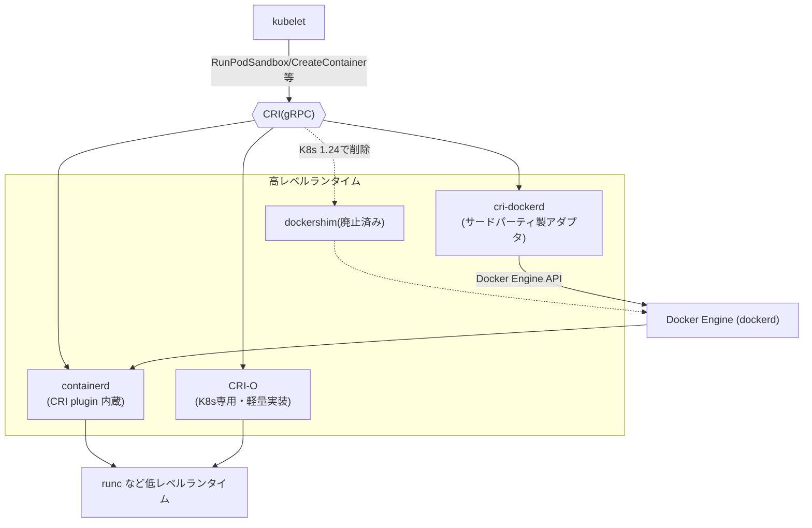
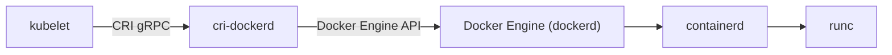

# kubelet から見た高レベルランタイム(Docker/containerd/CRI-O)の使い分け

## 概要

kubelet はコンテナを直接操作するのではなく、**CRI (Container Runtime Interface)** という gRPC の標準インターフェース越しに「高レベルランタイム」へ指示を出します。Docker・containerd・CRI-O はいずれもこの高レベルランタイムの役割を担える(あるいは担っていた)実装ですが、成り立ちと設計思想が異なります。また、サードパーティ製のアダプタ `cri-dockerd` を挟むことで、現在でも Docker Engine を高レベルランタイムとして使い続けることが可能です。

- **containerd**: 元々 Docker Engine の内部コンポーネントだった部分を CNCF に寄贈し独立させたランタイム。CRI plugin を内蔵しており、kubelet と直接 gRPC で会話できる
- **CRI-O**: Kubernetes 専用に、Red Hat 主導で一から設計されたランタイム。CRI 仕様を満たす最小限の機能だけを持つ
- **Docker**: Docker 自身は CRI を実装していない。かつては **dockershim** という変換アダプタを kubelet 側に同梱することで対応していたが、Kubernetes 1.20 で非推奨化、1.24 で削除された。現在は Kubernetes 本体の標準機能として、ノード上の高レベルランタイムに Docker を直接使うことはできない
- **cri-dockerd**: dockershim 削除後も Docker を使い続けたい場合の選択肢として、Mirantis が中心となってメンテナンスしているサードパーティ製の CRI shim。kubelet からの CRI リクエストを Docker Engine API 呼び出しに変換する

低レベルランタイム(`runc` など)や OCI・CRI の仕組み自体は #74 で詳しく解説しています。

## 何が嬉しいのか

CRI という標準 API がある目的は、**kubelet 本体を変更せずにランタイム実装を差し替え可能にすること**です。この文脈で各選択肢がどう使い分けられるかを整理すると:

- **containerd を選ぶ理由**: 最も広く採用されているデファクトスタンダード。GKE・EKS・AKS などマネージド Kubernetes のデフォルトランタイムであり、ロードマップも活発。特別な理由がなければまずこれを選べば間違いない
- **CRI-O を選ぶ理由**: Kubernetes だけに特化して不要な機能を持たないため、攻撃対象領域(attack surface)が小さく、Kubernetes バージョンとの対応関係が明確。OpenShift のデフォルトランタイムとして採用されており、Kubernetes 専用クラスタでの堅牢性・シンプルさを重視する場合に選ばれる
- **Docker Engine そのものをノード上のランタイムとして使わない理由**: Docker Engine は「イメージビルド」「Docker CLI」「ネットワーキング」などコンテナ実行以外の機能を多く抱えた重量級のツールで、Kubernetes が実際に必要とするのはその中の「コンテナ実行」部分だけ。dockershim という変換層は保守コストが高く、Kubernetes 側で Docker 内部の変更に振り回される密結合の問題があった。containerd を切り出したのはこの問題を解消するためでもある
- **それでも Docker を使いたい場合**: `cri-dockerd` を追加インストールすれば、既存の Docker 依存ツール(イメージビルドパイプラインや `docker.sock` を前提とした運用など)を変更せずに Kubernetes ノード上で Docker を使い続けられる。ただし dockershim が問題視されていた「保守コストの高さ・呼び出し経路の冗長さ」自体は cri-dockerd でも解消されないため、特別な理由がない限りは containerd や CRI-O が推奨される

つまり、Docker はローカル開発環境(Docker Desktop など)やイメージビルドの文脈では依然として広く使われており、**Kubernetes 本体が標準サポートする形としては使われなくなった**が、サードパーティのアダプタを追加すれば選択肢として残っている、という整理になります。

## 詳細

| | Docker (Engine) | containerd | CRI-O |
|---|---|---|---|
| CRI 対応 | 非対応(dockershim または cri-dockerd 経由での利用は可能) | 標準で対応(CRI plugin 内蔵) | 標準で対応(CRI 専用に設計) |
| 出自 | dotCloud/Docker社が開発 | Docker から分離・CNCF 卒業プロジェクト | Kubernetes 向けに新規開発(Red Hat 主導、CNCF 卒業) |
| スコープ | イメージビルド・CLI・ネットワーク・ボリューム等を含む総合ツール | コンテナ実行に特化したランタイムデーモン | Kubernetes 用途に絞った最小構成のランタイム |
| 低レベルランタイム | containerd → runc | runc(差し替え可) | runc(差し替え可) |
| 主な用途 | ローカル開発、CI でのイメージビルド | Kubernetes ノードのデフォルト(GKE/EKS/AKS 等) | OpenShift 等、Kubernetes 専用クラスタ |
| Kubernetes 本体での標準サポート | 非対応(dockershim は 1.24 で削除) | 事実上のデフォルト | セキュリティ重視の代替選択肢 |

### なぜ Docker は CRI を実装しなかったのか

Docker はコンテナ管理の総合的なツールとして、ユーザー向け CLI・イメージビルド・compose 機能など Kubernetes が必要としない機能を多く含んでいます。Kubernetes コミュニティは Docker に CRI 実装を求めましたが対応されず、kubelet 側に「CRI リクエストを Docker API 呼び出しに変換する」dockershim を実装して橋渡ししていました。しかし:

- dockershim は Kubernetes 側のメンテナンスコストになっていた
- Docker の内部が containerd + runc という構成になったことで、「kubelet → dockershim → Docker Engine → containerd → runc」という不要に長い呼び出し経路になっていた
- containerd が CRI plugin を内蔵したことで、この経路を「kubelet → containerd → runc」に短縮できるようになった

という経緯から、Kubernetes 1.20 で dockershim 非推奨化がアナウンスされ、1.24 で削除されました。ノード上で Docker イメージ(OCI 準拠)自体は問題なく動作します。影響を受けるのは「`docker` コマンドでノード上のコンテナを直接操作していたツール(一部の監視・ログツールなど)」であり、通常の Pod 実行には影響ありません。

### 移行時の注意点

- `docker.sock` に依存するツール(例: 一部の DaemonSet 型のログ収集エージェント)は、containerd の場合は `containerd.sock`、CRI-O の場合は `crio.sock` に向き先を変える必要がある
- デバッグ時は `docker ps` の代わりに `crictl ps`(CRI 共通の CLI)を使うと、ランタイムに依存せずノード上のコンテナ状態を確認できる
- CRI-O はマイナーバージョンを Kubernetes のマイナーバージョンに合わせてリリースしており、`v1.28.x` は Kubernetes `1.28` 用、というようにバージョン対応が明確

### cri-dockerd: dockershim 削除後も Docker を使う方法

`cri-dockerd` は、削除された dockershim のコードを Kubernetes 本体の外に切り出し、Mirantis が中心となって(Docker 社とも協業しつつ)独立したプロジェクトとしてメンテナンスしている CRI shim です。

- 役割としては dockershim とほぼ同じで、「CRI リクエスト → Docker Engine API 呼び出し」への変換を担う
- 呼び出し経路は `kubelet → cri-dockerd → dockerd → containerd → runc` となり、以前の dockershim 経由の構成と同様に階層が一段増える
- リポジトリ: https://github.com/Mirantis/cri-dockerd 。2026年時点でもリリースが継続されており(直近では v0.4.x 系)、CRI 準拠性テストも通している、と Mirantis 側は説明している
- Docker Desktop や Mirantis Container Runtime (MCR, 旧 Docker Enterprise Edition) でも同梱・利用されている
- 導入方法としては、`cri-dockerd` をノードにインストールし、kubelet の `--container-runtime-endpoint` を `cri-dockerd` のソケット(`unix:///var/run/cri-dockerd.sock` など)に向けることで、Docker Engine を CRI 経由で使い続けられる

まとめると、「kubelet 本体・Kubernetes コミュニティが標準サポートするか」という観点では **いいえ**(dockershim は Kubernetes 本体から削除されており、Kubernetes プロジェクトとしては containerd / CRI-O を推奨)ですが、「サードパーティのアダプタを追加すれば Docker を使い続けられるか」という観点では **はい** というのが正確な回答になります。

**不確かな情報として**、cri-dockerd のメンテナンス活発度については情報源によって評価が分かれています。公式ブログは「安定してメンテナンスされている」としていますが、GitHub 上には「十分にメンテナンスされていないのでは」という懸念コメントも見られます。本番導入前には最新の Issue やリリース状況を確認することが望ましいです。

## 参考リンク

- [Kubernetes 公式: Container Runtimes](https://kubernetes.io/docs/setup/production-environment/container-runtimes/)
- [Kubernetes Blog: Dockershim の削除について(FAQ)](https://kubernetes.io/blog/2022/02/17/dockershim-faq/)
- [containerd 公式サイト](https://containerd.io/)
- [CRI-O 公式サイト](https://cri-o.io/)
- [Kubernetes 公式: Container Runtime Interface (CRI)](https://kubernetes.io/docs/concepts/architecture/cri/)
- [Mirantis/cri-dockerd (GitHub)](https://github.com/Mirantis/cri-dockerd)
- [cri-dockerd 公式サイト](https://mirantis.github.io/cri-dockerd/)
- [Mirantis Blog: The Future of Dockershim is cri-dockerd](https://www.mirantis.com/blog/the-future-of-dockershim-is-cri-dockerd/)
