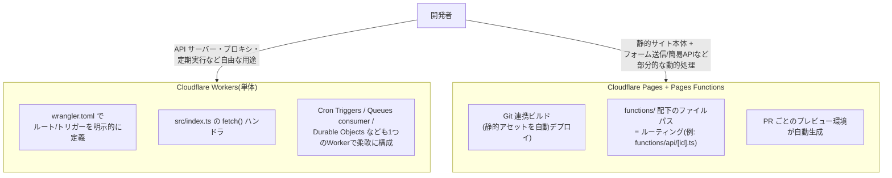

# Cloudflare Workers と Pages Functions の使い分け

## 概要

Cloudflare Workers は、V8 Isolate ベースのサーバーレス実行環境そのものを単体で使う機能で、ルーティングやトリガーを `wrangler.toml`(または `wrangler.jsonc`)で明示的に定義し、API・プロキシ・バッチ処理など自由な用途に使える。一方 Cloudflare Pages Functions は、静的サイトホスティングサービスである Cloudflare Pages に組み込まれた機能で、Git 連携ビルドで配信する静的アセットに対し、`functions/` ディレクトリ配下のファイル構成に応じたファイルベースルーティングで動的処理を追加するものである。内部的にはどちらも同じ Workers ランタイム上で動作する。



## 何が嬉しいのか

どちらも同じ V8 Isolate 実行環境を使うため「コールドスタートがほぼ無い」「エッジで低レイテンシに実行できる」というメリットは共通だが、解決する課題が異なる。

- **Workers を使う嬉しさ**: ルーティング・環境・トリガーを自分で完全にコントロールできるため、REST API サーバーやオリジンの前段プロキシ、Cron による定期バッチ処理、Queues のコンシューマーなど「アプリケーションの中心がサーバーサイド処理そのもの」であるユースケースに向いている。単一の Worker に複数のトリガー(HTTP fetch・Cron・Queue)を自由に組み合わせられるのも特徴。
- **Pages Functions を使う嬉しさ**: 「静的サイトを Git push だけでデプロイし、ブランチ/PR ごとにプレビュー URL が自動発行される」という Pages の DX(Netlify や Vercel に近い体験)を享受しつつ、ファイルベースルーティングで最小限のコード量で動的処理(お問い合わせフォームの受信、認証チェック、軽量な API エンドポイントなど)を足せる点が嬉しい。静的サイト構築の delivery パイプラインを自前で組む必要がない。

具体例で言うと、「ブログや LP のような静的サイトに、お問い合わせフォームの送信処理だけ足したい」なら Pages Functions、「フロントとは独立した本格的な API バックエンドや、他サービスへのリバースプロキシを作りたい」なら Workers、という使い分けが基本になる。

## 詳細

### ルーティングの仕組み

Workers はコード内(または `wrangler.toml` の `routes` 設定)で自分でルーティングを書く。

```javascript
// Workers: src/index.js
export default {
  async fetch(request) {
    const url = new URL(request.url);
    if (url.pathname === "/api/hello") {
      return new Response("Hello from Workers!");
    }
    return new Response("Not found", { status: 404 });
  },
};
```

Pages Functions はファイルパスがそのままルートになる(Next.js の API Routes に近い規約)。

```javascript
// Pages Functions: functions/api/hello.js → GET/POST /api/hello にマッピングされる
export async function onRequest(context) {
  return new Response("Hello from Pages Functions!");
}
```

```javascript
// functions/api/[id].js → /api/123 のような動的セグメントに対応
export async function onRequestGet({ params }) {
  return new Response(`id = ${params.id}`);
}
```

### 主な違い

| 観点 | Workers(単体) | Pages Functions |
|---|---|---|
| デプロイ方法 | `wrangler deploy` で Worker 単体をデプロイ | Git 連携(または `wrangler pages deploy`)で静的アセットと共にデプロイ |
| ルーティング | コード/`wrangler.toml` で明示的に定義 | `functions/` 配下のファイルパスによる規約ベース |
| 静的アセット配信 | 従来は別建てが必要だったが、現在は Workers 単体でも静的アセット配信(Static Assets)に対応 | ビルド成果物(静的アセット)の配信が主目的で、それに動的処理を付加する位置づけ |
| プレビュー環境 | 環境ごとに `wrangler.toml` で明示的に定義 | PR/ブランチごとに自動でプレビュー URL が発行される |
| Cron Triggers | 対応 | 非対応(Pages Functions 単体では Cron を使えない) |
| Durable Objects / Queues | 対応 | 対応(ただし歴史的に Workers 側が先行して機能追加されてきた) |

### 注意点

- Cloudflare は 2024 年以降、単体 Workers でも静的アセットを配信できる機能(Workers との統合)を拡充しており、新規プロジェクトでは「フルスタックなら Workers、静的サイト中心なら Pages」という指針がより明確になりつつある。今後 Pages と Workers の機能差がさらに縮まっていく可能性があるため、実際にプロジェクトを始める際は公式ドキュメントの最新情報を確認することをおすすめする(この点は将来変わりうる情報のため、参考程度にとどめること)。
- Pages Functions は Pages プロジェクトに紐づくため、Cron Triggers のような「HTTP リクエスト以外のトリガー」が必要になった場合は、別途 Workers を用意して連携する構成が必要になる。
- どちらも実行時間・メモリ・CPU 時間に制約があるため、重い処理(長時間のバッチ処理など)には不向きである。

## 参考リンク

- [Cloudflare Workers 公式ドキュメント](https://developers.cloudflare.com/workers/)
- [Cloudflare Pages Functions 公式ドキュメント](https://developers.cloudflare.com/pages/functions/)
- [Migrate a Pages project to Workers](https://developers.cloudflare.com/workers/static-assets/migrate-from-pages/)
