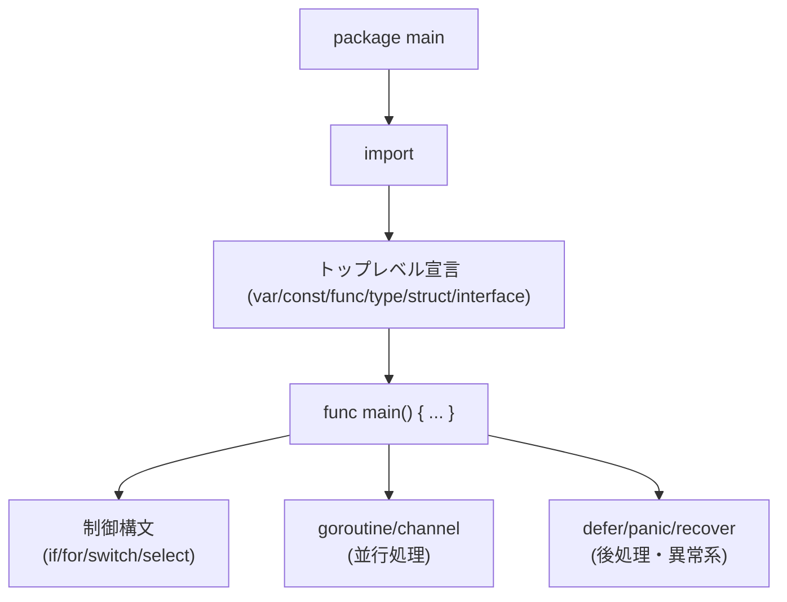
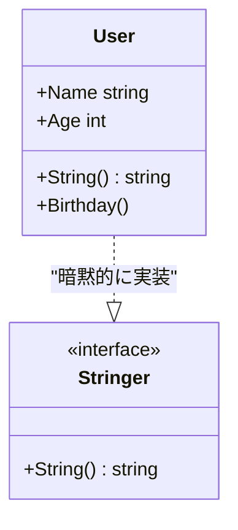
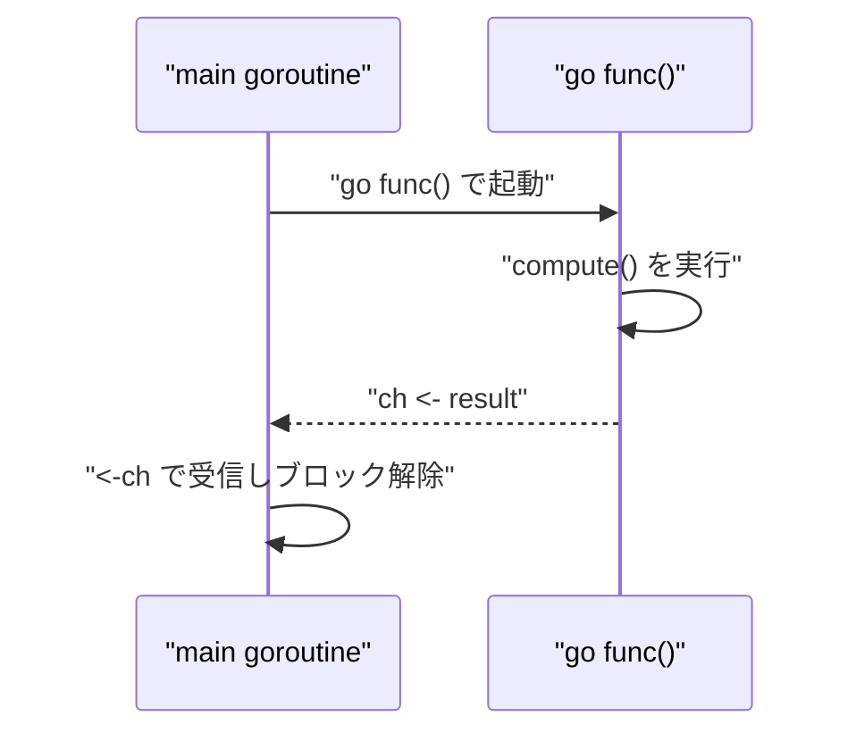

# Go言語の文法早わかりチートシート

## 概要

Go は Google が開発した、シンプルさと並行処理を重視した静的型付け言語です。文法要素は少なく、暗黙の型変換や継承がないぶん学習コストが低い一方、`goroutine`/`channel` による並行処理や `interface` による柔軟な抽象化など独自の特徴を持ちます。

Go のプログラムは以下のような構造になります。



## 何が嬉しいのか

- **文法がシンプルで読みやすい**: 例外機構やジェネリクスの複雑な構文、演算子オーバーロードなどがなく、他言語の経験があれば短期間でコードが読み書きできる
- **並行処理が言語レベルで扱いやすい**: スレッドより軽量な `goroutine` と `channel` により、明示的なロック管理をせずに安全な並行プログラムを書きやすい(例: 大量の API リクエストを並列に投げて結果を集約する処理)
- **単一バイナリへのビルドが容易**: 依存関係を含めて静的リンクされたバイナリを生成できるため、Docker イメージを軽量化したり、デプロイ先に Go ランタイムをインストールする必要がない
- **明示的なエラーハンドリング**: 例外を使わず戻り値で `error` を返すため、エラーが発生しうる箇所がコード上で追いやすい

## 詳細

### 基本構造

```go
package main

import (
    "fmt"
    "os"
)

func main() {
    fmt.Println("Hello, Go")
    os.Exit(0)
}
```

- 実行可能プログラムは必ず `package main` と `func main()` を持つ
- 使われていない import や変数はコンパイルエラーになる(未使用変数は `_` に代入するか削除する)

### 変数・定数

```go
var x int = 10       // 明示的な型指定
var y = 20           // 型推論
z := 30              // 関数内でのみ使える短縮宣言
const Pi = 3.14159   // 定数
const (
    A = iota // 0
    B        // 1
    C        // 2
)
```

- `:=` はパッケージトップレベルでは使えず、関数内限定
- `iota` は `const` ブロック内で連番を作るための識別子で、列挙型的な用途に使われる

### 基本型

| 分類 | 型 |
|---|---|
| 整数 | `int`, `int8/16/32/64`, `uint`系 |
| 浮動小数点 | `float32`, `float64` |
| 文字列 | `string` (UTF-8 のバイト列、イミュータブル) |
| 真偽値 | `bool` |
| その他 | `byte`(=uint8), `rune`(=int32, Unicode コードポイント) |

### 制御構文

```go
// if(条件に括弧不要、宣言も書ける)
if v := compute(); v > 0 {
    fmt.Println(v)
} else {
    fmt.Println("non-positive")
}

// for は Go 唯一のループ構文(while / do-while 相当も for で書く)
for i := 0; i < 10; i++ { ... }
for cond { ... }        // while 相当
for { ... }              // 無限ループ

// switch は break 不要(自動で break される)。fallthrough で次の case に継続可能
switch day {
case "Mon", "Tue":
    fmt.Println("平日前半")
case "Sat", "Sun":
    fmt.Println("週末")
default:
    fmt.Println("その他")
}
```

### 関数

```go
func add(a, b int) int {
    return a + b
}

// 複数戻り値(慣習的に最後を error にする)
func divide(a, b int) (int, error) {
    if b == 0 {
        return 0, fmt.Errorf("division by zero")
    }
    return a / b, nil
}

// 可変長引数
func sum(nums ...int) int {
    total := 0
    for _, n := range nums {
        total += n
    }
    return total
}
```

- エラーハンドリングは `if err != nil { return err }` の反復が定番パターン
- クロージャや無名関数もサポートされ、第一級オブジェクトとして扱える

### 配列・スライス・マップ

```go
arr := [3]int{1, 2, 3}       // 固定長配列
sl := []int{1, 2, 3}         // スライス(可変長、内部的には配列への参照)
sl = append(sl, 4)

m := map[string]int{"a": 1}
v, ok := m["a"]              // ok で存在確認(カンマ ok イディオム)
delete(m, "a")

for i, v := range sl { ... } // range によるイテレーション
```

- スライスは `[]T` で、`len`(長さ)と `cap`(容量)を持つ。`append` は容量が足りないと新しい配列を再確保する点に注意

### struct・interface・メソッド

```go
type User struct {
    Name string
    Age  int
}

// メソッド(レシーバ)。値レシーバはコピー、ポインタレシーバは元の値を変更できる
func (u *User) Birthday() {
    u.Age++
}

// interface は「メソッド集合」を定義し、暗黙的に満たされる(implements 宣言不要)
type Stringer interface {
    String() string
}

func (u User) String() string {
    return fmt.Sprintf("%s(%d)", u.Name, u.Age)
}
```



- Go に継承はなく、構造体の埋め込み(embedding)によってコンポジションでコードを再利用する
- interface を満たすかはコンパイラが構造的に判定する(ダックタイピング的)

### ポインタ

```go
x := 10
p := &x   // アドレス取得
*p = 20   // デリファレンスして値変更
fmt.Println(x) // 20
```

- ポインタ演算(加減算)はできない。あくまで参照渡しのための機能

### goroutine・channel(並行処理)

```go
ch := make(chan int)

go func() {
    ch <- compute() // 送信
}()

result := <-ch // 受信(準備できるまでブロック)

// select で複数チャネルを待ち受け
select {
case v := <-ch1:
    fmt.Println(v)
case v := <-ch2:
    fmt.Println(v)
case <-time.After(time.Second):
    fmt.Println("timeout")
}
```



- `sync.WaitGroup` や `sync.Mutex` も標準ライブラリで提供される
- unbuffered channel は送受信が揃うまでブロックする同期プリミティブとしても使える

### defer・panic・recover

```go
func readFile() (err error) {
    f, err := os.Open("file.txt")
    if err != nil {
        return err
    }
    defer f.Close() // 関数終了時に必ず実行される(LIFO順)

    defer func() {
        if r := recover(); r != nil {
            err = fmt.Errorf("recovered: %v", r)
        }
    }()
    // ...
    return nil
}
```

- `defer` はリソース解放の定番イディオム
- `panic`/`recover` は例外に似ているが、通常のエラーハンドリングには `error` を使い、`panic` はプログラム続行不能な異常系に限定するのが慣習

### ジェネリクス(Go 1.18〜)

```go
func Map[T, U any](s []T, f func(T) U) []U {
    result := make([]U, len(s))
    for i, v := range s {
        result[i] = f(v)
    }
    return result
}

type Number interface {
    ~int | ~float64
}

func Sum[T Number](nums []T) T {
    var total T
    for _, n := range nums {
        total += n
    }
    return total
}
```

- 型パラメータは `[T any]` のように宣言し、制約(constraint)には `~int | ~float64` のような union や `any` を使う

## 参考リンク

- [A Tour of Go](https://go.dev/tour/) — 公式のインタラクティブなチュートリアル
- [Effective Go](https://go.dev/doc/effective_go) — 公式のイディオム集
- [Go Language Specification](https://go.dev/ref/spec) — 言語仕様
- [Go by Example](https://gobyexample.com/) — サンプルコードベースの解説(非公式だが実用的)
